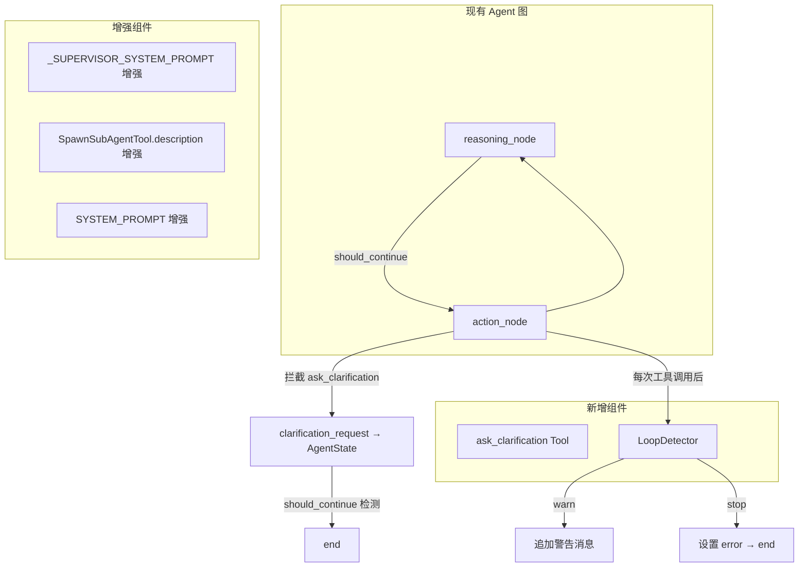
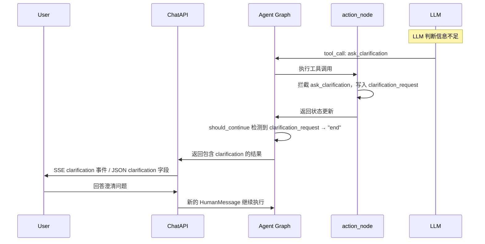

# 设计文档：吸收 DeerFlow 四大优势能力

## 概述

本设计文档描述如何将 DeerFlow 开源项目的四大优势能力集成到 SmartClaw 中：

1. **增强 Supervisor 提示词** — 在 `_SUPERVISOR_SYSTEM_PROMPT` 中加入决策树、批量规划、示例/反例和失败处理策略
2. **增强 SpawnSubAgentTool 描述** — 提供详细的使用/不使用指南和任务描述编写指南
3. **澄清中断机制** — 新增 `ask_clarification` 工具，支持 Agent 主动向用户提问
4. **基于哈希滑动窗口的循环检测** — 新增 `LoopDetector` 类，在早期识别重复行为模式
5. **增强系统提示词** — 在 `SYSTEM_PROMPT` 中加入结构化思考指导、澄清优先级和工具决策树

所有改动均采用增量方式，保持向后兼容。

## 架构

### 整体架构变更



### 数据流



## 组件与接口

### 1. 增强 Supervisor 提示词（需求 1）

**修改文件**: `smartclaw/smartclaw/agent/multi_agent.py`

修改 `_SUPERVISOR_SYSTEM_PROMPT` 字符串常量，在现有内容基础上追加以下结构化块：

- **决策树块**: 以缩进列表形式列出四种场景的决策路径（单 Agent 直接分配、多步骤顺序分解、并行批量规划、结果综合）
- **批量规划指导**: 说明何时并行分配、JSON 响应格式示例
- **示例/反例块**: 2 个正面示例 + 2 个反面示例，每个包含用户请求、JSON 响应、简要解释
- **失败处理策略块**: Agent 返回错误时重新分配、不完整结果时追加补充、全部失败时综合部分结果

**约束**: 保持 `{"agent": "<name>"}` 和 `{"agent": "done", "answer": "..."}` 格式不变，总长度 ≤ 3000 Token。

### 2. 增强 SpawnSubAgentTool 描述（需求 2）

**修改文件**: `smartclaw/smartclaw/agent/sub_agent.py`

修改 `SpawnSubAgentTool.description` 字段，包含：

- **何时使用**: 需要独立上下文的复杂子任务、需要不同工具集的专业任务、可并行执行的独立子任务
- **何时不使用**: 简单单步工具调用、需要当前对话上下文的任务、需要紧密交互的任务
- **任务描述编写指南**: task 参数应包含明确目标、必要背景、期望输出格式

**约束**: 总长度 ≤ 500 字符。

### 3. 澄清中断机制（需求 3）

#### 3.1 ask_clarification 工具

**新增文件**: `smartclaw/smartclaw/tools/clarification.py`

```python
class AskClarificationInput(BaseModel):
    question: str = Field(description="向用户提出的澄清问题")
    options: list[str] | None = Field(default=None, description="可选的预定义选项列表")

class AskClarificationTool(BaseTool):
    name: str = "ask_clarification"
    description: str = "当信息不足以完成任务时，向用户提出澄清问题。..."
    args_schema: type[BaseModel] = AskClarificationInput

    async def _arun(self, question: str, options: list[str] | None = None) -> str:
        # 实际逻辑由 action_node 拦截，此处仅返回占位
        return f"Clarification requested: {question}"
```

#### 3.2 AgentState 扩展

**修改文件**: `smartclaw/smartclaw/agent/state.py`

```python
class ClarificationRequest(TypedDict):
    question: str
    options: list[str] | None

class AgentState(TypedDict):
    # ... 现有字段 ...
    clarification_request: ClarificationRequest | None  # 新增
```

#### 3.3 action_node 拦截逻辑

**修改文件**: `smartclaw/smartclaw/agent/nodes.py`

在 `action_node` 中，遍历 `tool_calls` 时检查 `tool_name == "ask_clarification"`：
- 若匹配，从 `tool_args` 提取 `question` 和 `options`，写入返回字典的 `clarification_request` 字段
- 生成一条 `ToolMessage` 内容为 `"Clarification requested: {question}"`
- 跳过后续工具调用（同一批次中 ask_clarification 之后的工具不执行）

#### 3.4 should_continue 路由扩展

**修改文件**: `smartclaw/smartclaw/agent/nodes.py`

在 `should_continue` 函数中，在现有 error/final_answer 检查之后、tool_calls 检查之前，新增：
```python
if state.get("clarification_request"):
    return "end"
```

#### 3.5 API 层扩展

**修改文件**: `smartclaw/smartclaw/gateway/models.py`

```python
class ClarificationData(BaseModel):
    question: str
    options: list[str] | None = None

class ChatResponse(BaseModel):
    # ... 现有字段 ...
    clarification: ClarificationData | None = None  # 新增
```

**修改文件**: `smartclaw/smartclaw/gateway/routers/chat.py`

- 同步端点 `chat`: 从 `result` 中提取 `clarification_request`，映射到 `ChatResponse.clarification`
- SSE 端点 `chat_stream`: 在 `done` 事件之前，检查 `clarification_request`，若存在则发送 `clarification` 事件类型

#### 3.6 工具注册

**修改文件**: `smartclaw/smartclaw/tools/registry.py`

在 `create_system_tools` 中注册 `AskClarificationTool`。

### 4. 基于哈希滑动窗口的循环检测（需求 4）

**新增文件**: `smartclaw/smartclaw/agent/loop_detector.py`

```python
class LoopStatus(str, Enum):
    OK = "ok"
    WARN = "warn"
    STOP = "stop"

class LoopDetector:
    def __init__(
        self,
        window_size: int = 20,
        warn_threshold: int = 3,
        stop_threshold: int = 5,
    ) -> None:
        self._window: deque[str] = deque(maxlen=window_size)
        self._window_size = window_size
        self._warn_threshold = warn_threshold
        self._stop_threshold = stop_threshold

    @staticmethod
    def compute_hash(tool_name: str, tool_args: dict) -> str:
        """确定性 JSON 序列化 + SHA-256 前 16 位十六进制"""
        payload = json.dumps({"name": tool_name, "args": tool_args}, sort_keys=True)
        return hashlib.sha256(payload.encode()).hexdigest()[:16]

    def record(self, tool_name: str, tool_args: dict) -> LoopStatus:
        """记录一次工具调用，返回检测状态"""
        h = self.compute_hash(tool_name, tool_args)
        self._window.append(h)
        count = self._window.count(h)
        if count >= self._stop_threshold:
            return LoopStatus.STOP
        if count >= self._warn_threshold:
            return LoopStatus.WARN
        return LoopStatus.OK
```

#### 4.1 集成到 action_node

**修改文件**: `smartclaw/smartclaw/agent/nodes.py`

`action_node` 新增可选参数 `loop_detector: LoopDetector | None = None`：
- 每次工具调用执行后，调用 `loop_detector.record(tool_name, tool_args)`
- `WARN`: 在 `tool_messages` 后追加一条 `AIMessage` 内容为警告文本（提示 LLM 检测到重复行为）
- `STOP`: 设置返回字典的 `error` 字段为循环检测错误信息，`should_continue` 自动路由到 "end"

#### 4.2 集成到 build_graph

**修改文件**: `smartclaw/smartclaw/agent/graph.py`

`build_graph` 新增可选参数 `loop_detector: LoopDetector | None = None`，传递给 `_action` 闭包。

### 5. 增强系统提示词（需求 5）

**修改文件**: `smartclaw/smartclaw/agent/runtime.py`

在 `SYSTEM_PROMPT` 现有内容之后追加独立指导块：

- **结构化思考指导**: 理解意图 → 评估澄清需求 → 制定计划 → 选择工具 → 执行验证
- **澄清工作流优先级**: 歧义请求、缺少关键参数、破坏性操作时优先 `ask_clarification`
- **工具使用决策树**: 缩进列表形式列出每个工具的适用场景和优先级
- **错误恢复指导**: 分析错误 → 尝试替代 → 多次失败则说明情况

**约束**: 总长度（不含 `skills_section`）≤ 2000 字符，以独立块追加，不修改现有工具说明。

## 数据模型

### AgentState 扩展

```python
class ClarificationRequest(TypedDict):
    """澄清请求数据结构"""
    question: str           # 向用户提出的问题
    options: list[str] | None  # 可选的预定义选项

class AgentState(TypedDict):
    messages: Annotated[list[BaseMessage], add_messages]
    iteration: int
    max_iterations: int
    final_answer: str | None
    error: str | None
    session_key: str | None
    summary: str | None
    sub_agent_depth: int | None
    token_stats: TokenStats | None
    clarification_request: ClarificationRequest | None  # 新增
```

### LoopDetector 内部状态

```python
# LoopDetector 不持久化，每次 build_graph 创建新实例
# 内部状态：
_window: deque[str]  # maxlen=window_size，存储 ToolCallHash
_window_size: int     # 滑动窗口大小，默认 20
_warn_threshold: int  # 警告阈值，默认 3
_stop_threshold: int  # 停止阈值，默认 5
```

### LoopStatus 枚举

```python
class LoopStatus(str, Enum):
    OK = "ok"      # 正常
    WARN = "warn"  # 检测到重复，追加警告
    STOP = "stop"  # 严重重复，强制停止
```

### API 模型扩展

```python
class ClarificationData(BaseModel):
    """API 层澄清数据"""
    question: str
    options: list[str] | None = None

class ChatResponse(BaseModel):
    session_key: str
    response: str
    iterations: int
    error: str | None = None
    token_stats: dict[str, int] | None = None
    clarification: ClarificationData | None = None  # 新增
```

### SSE 事件类型扩展

新增 `clarification` 事件类型：
```json
{
    "event": "clarification",
    "data": {
        "question": "您希望删除哪个文件？",
        "options": ["file_a.txt", "file_b.txt", "全部删除"]
    }
}
```


## 正确性属性（Correctness Properties）

*属性（Property）是一种在系统所有合法执行路径上都应成立的特征或行为——本质上是对系统应做什么的形式化陈述。属性是人类可读规格说明与机器可验证正确性保证之间的桥梁。*

以下属性基于需求验收标准的可测试性分析得出。需求 1、2、5 的验收标准主要涉及字符串内容和长度的静态检查，适合用示例测试（example test）验证；需求 3 和 4 包含多个可用属性测试（property-based test）验证的通用行为规则。

### Property 1: ask_clarification 拦截不变性

*For any* AIMessage 包含 `ask_clarification` 工具调用（任意 question 字符串和任意 options 列表），当 action_node 处理该工具调用时，返回的状态字典中 `clarification_request` 字段应包含与工具参数一致的 `question` 和 `options`，且不应实际执行该工具的 `_arun` 方法。

**Validates: Requirements 3.2**

### Property 2: clarification_request 路由终止

*For any* AgentState，当 `clarification_request` 字段为非 None 值时，`should_continue` 函数应返回 `"end"`，无论 messages 列表中最后一条消息是否包含 tool_calls。

**Validates: Requirements 3.4**

### Property 3: ToolCallHash 确定性

*For any* 工具名称字符串和工具参数字典，`LoopDetector.compute_hash(tool_name, tool_args)` 的返回值应满足：(a) 相同输入始终产生相同输出（确定性），(b) 返回值为长度 16 的十六进制字符串，(c) 等价于 `hashlib.sha256(json.dumps({"name": tool_name, "args": tool_args}, sort_keys=True).encode()).hexdigest()[:16]`。

**Validates: Requirements 4.2**

### Property 4: 滑动窗口有界性

*For any* LoopDetector 实例（任意 window_size 配置）和任意长度的工具调用序列，在每次 `record()` 调用后，内部窗口的元素数量应始终 ≤ window_size。

**Validates: Requirements 4.3**

### Property 5: 循环检测阈值正确性

*For any* LoopDetector 实例（任意 warn_threshold 和 stop_threshold 配置，其中 warn_threshold < stop_threshold）和任意工具调用序列，`record()` 的返回值应满足：当同一哈希在窗口中的出现次数 < warn_threshold 时返回 `"ok"`，当出现次数 ≥ warn_threshold 且 < stop_threshold 时返回 `"warn"`，当出现次数 ≥ stop_threshold 时返回 `"stop"`。

**Validates: Requirements 4.4, 4.5**

### Property 6: action_node 循环检测集成

*For any* 包含工具调用的 AIMessage 和已配置的 LoopDetector 实例，当 action_node 处理完所有工具调用后，LoopDetector 的内部窗口应包含与已执行工具调用对应的哈希值，且当 LoopDetector 返回 `"stop"` 状态时，action_node 的返回字典中应包含非 None 的 `error` 字段。

**Validates: Requirements 4.7**

## 错误处理

### 澄清机制错误处理

| 场景 | 处理方式 |
|------|---------|
| `ask_clarification` 参数缺失 question | action_node 生成包含错误信息的 ToolMessage，不设置 clarification_request |
| `ask_clarification` 与其他工具在同一批次 | 优先处理 ask_clarification，跳过后续工具调用 |
| 用户未回答澄清问题直接发送新消息 | 正常处理为新的 HumanMessage，Agent 基于上下文继续 |

### 循环检测错误处理

| 场景 | 处理方式 |
|------|---------|
| LoopDetector 返回 "warn" | 追加警告消息到 tool_messages，不中断执行 |
| LoopDetector 返回 "stop" | 设置 error 字段，should_continue 路由到 "end"，返回循环检测错误信息 |
| LoopDetector 未提供（None） | 跳过循环检测，保持现有行为（向后兼容） |
| compute_hash 序列化异常 | 捕获异常，记录日志，返回 "ok"（降级为不检测） |

### 提示词增强错误处理

| 场景 | 处理方式 |
|------|---------|
| _SUPERVISOR_SYSTEM_PROMPT 格式化失败 | 保持现有 format() 调用的异常传播行为 |
| SYSTEM_PROMPT skills_section 注入失败 | 保持现有 format() 调用的异常传播行为 |

## 测试策略

### 双重测试方法

本功能采用单元测试 + 属性测试的双重测试策略：

- **单元测试（Unit Tests）**: 验证具体示例、边界情况和错误条件
- **属性测试（Property-Based Tests）**: 验证跨所有输入的通用属性

两者互补：单元测试捕获具体 bug，属性测试验证通用正确性。

### 属性测试配置

- **测试库**: [Hypothesis](https://hypothesis.readthedocs.io/)（Python 属性测试标准库）
- **最小迭代次数**: 每个属性测试至少 100 次迭代
- **标签格式**: `# Feature: deerflow-advantages-absorption, Property {number}: {property_text}`
- **每个正确性属性由一个属性测试实现**

### 单元测试覆盖

| 测试目标 | 测试内容 |
|---------|---------|
| _SUPERVISOR_SYSTEM_PROMPT | 包含决策树、批量规划、示例/反例、失败处理关键词；保持 JSON 格式约定；Token 长度 ≤ 3000 |
| SpawnSubAgentTool.description | 包含"何时使用"/"何时不使用"/任务描述指南关键词；长度 ≤ 500 字符 |
| AskClarificationTool | 工具存在性、参数 schema 验证、在 create_system_tools 中注册 |
| AgentState | clarification_request 字段存在性 |
| ChatResponse | clarification 字段存在性和序列化 |
| SYSTEM_PROMPT | 包含思考指导、澄清优先级、工具决策树、错误恢复关键词；长度 ≤ 2000 字符；现有内容保留 |
| LoopDetector 构造 | 默认参数、自定义参数、window_size/warn_threshold/stop_threshold 配置 |
| SSE clarification 事件 | _format_sse 正确处理 clarification hook_point |

### 属性测试覆盖

| Property | 测试文件 | 生成策略 |
|----------|---------|---------|
| Property 1: ask_clarification 拦截 | `tests/agent/test_clarification_props.py` | 生成随机 question 字符串和 options 列表，构造包含 ask_clarification tool_call 的 AIMessage |
| Property 2: clarification_request 路由 | `tests/agent/test_clarification_props.py` | 生成随机 ClarificationRequest，构造包含该字段的 AgentState |
| Property 3: ToolCallHash 确定性 | `tests/agent/test_loop_detector_props.py` | 生成随机 tool_name（text）和 tool_args（dictionaries of JSON-serializable values） |
| Property 4: 滑动窗口有界性 | `tests/agent/test_loop_detector_props.py` | 生成随机 window_size（1-100）和随机长度的工具调用序列 |
| Property 5: 循环检测阈值 | `tests/agent/test_loop_detector_props.py` | 生成随机 warn/stop threshold 配置和工具调用序列，验证返回状态与窗口内计数的对应关系 |
| Property 6: action_node 循环检测集成 | `tests/agent/test_loop_detector_props.py` | 生成包含重复工具调用的 AIMessage，配置低阈值的 LoopDetector，验证 error 字段设置 |
