# 设计文档：LLM 决策可观测性（Decision Trace）

## 概述

本设计为 SmartClaw 引入 **Decision Trace** 系统，在现有可观测性基础设施（Hooks、Diagnostic Bus、OTEL Tracing、Debug UI）之上，增加对 LLM 决策过程的捕获、存储、推送和可视化能力。

核心思路：
1. 定义 `DecisionRecord` 数据结构（frozen dataclass），统一表示每一步决策信息
2. 在 `reasoning_node` 和 `_supervisor_node` 中同步捕获决策数据，写入 `DecisionTraceCollector`
3. 通过 `Diagnostic Bus` 发布 `decision.captured` 事件，驱动 SSE 推送和 OTEL 集成
4. 新增 SSE 端点 `/api/debug/decision-events` 和 REST 端点 `GET /api/sessions/{session_key}/decisions`
5. Debug UI 新增"🧠 Decisions"标签页，以时间线卡片形式展示决策过程

设计原则：
- **最小侵入**：决策捕获逻辑在现有节点函数中以 try/except 包裹，异常不中断主流程
- **复用现有模式**：SSE 端点复用 `hook-events` 的广播队列模式；数据结构复用 `HookEvent` 的 `to_dict()/from_dict()` 序列化模式
- **内存受控**：每个 session 最多 200 条记录，SSE 队列最大 100，字段长度有上限

## 架构

```mermaid
graph TD
    subgraph Agent Runtime
        RN[reasoning_node] -->|成功调用后| DTC[DecisionTraceCollector]
        SN[_supervisor_node] -->|路由决策后| DTC
    end

    DTC -->|存储| MEM[(内存存储<br/>dict session_key → list)]
    DTC -->|发布 decision.captured| DBUS[Diagnostic Bus]

    DBUS -->|订阅| SSE[Decision SSE Endpoint<br/>/api/debug/decision-events]
    DBUS -->|订阅| OTEL[OTEL Tracing Service]

    SSE -->|推送| UI[Debug UI<br/>🧠 Decisions Tab]

    REST[REST API<br/>GET /sessions/key/decisions] -->|查询| DTC

    style DTC fill:#2d4a2d,stroke:#86efac
    style DBUS fill:#2d2d4a,stroke:#93c5fd
    style UI fill:#4a2d4a,stroke:#c084fc
```



数据流：
1. `reasoning_node` / `_supervisor_node` 完成 LLM 调用 → 同步创建 `DecisionRecord` → 存入 `DecisionTraceCollector`
2. `DecisionTraceCollector.add()` 内部调用 `diagnostic_bus.emit("decision.captured", record.to_dict())`
3. SSE 端点的订阅回调将事件推入各客户端队列 → EventSourceResponse 推送到浏览器
4. Debug UI 的 `🧠 Decisions` 标签页通过 EventSource 接收并渲染决策卡片

## 组件与接口

### 1. DecisionRecord（新增模块：`smartclaw/smartclaw/observability/decision_record.py`）

```python
from __future__ import annotations
import enum
from dataclasses import dataclass, field, asdict
from datetime import datetime, timezone
from typing import Any

class DecisionType(str, enum.Enum):
    TOOL_CALL = "tool_call"
    FINAL_ANSWER = "final_answer"
    SUPERVISOR_ROUTE = "supervisor_route"

def _utc_now_iso() -> str:
    return datetime.now(timezone.utc).isoformat()

@dataclass(frozen=True)
class DecisionRecord:
    # 必填字段
    timestamp: str
    iteration: int
    decision_type: DecisionType
    input_summary: str          # 最大 512 字符
    reasoning: str              # 最大 2048 字符
    # 可选字段
    tool_calls: list[dict[str, Any]] = field(default_factory=list)
    target_agent: str | None = None
    session_key: str | None = None

    def to_dict(self) -> dict[str, Any]:
        d = asdict(self)
        d["decision_type"] = self.decision_type.value
        return d

    @classmethod
    def from_dict(cls, data: dict[str, Any]) -> DecisionRecord:
        required = {"timestamp", "iteration", "decision_type", "input_summary", "reasoning"}
        missing = required - set(data.keys())
        if missing:
            raise ValueError(f"Missing required fields: {', '.join(sorted(missing))}")
        data = dict(data)
        data["decision_type"] = DecisionType(data["decision_type"])
        valid_fields = {f.name for f in cls.__dataclass_fields__.values()}
        filtered = {k: v for k, v in data.items() if k in valid_fields}
        return cls(**filtered)
```

### 2. DecisionTraceCollector（新增模块：`smartclaw/smartclaw/observability/decision_collector.py`）

模块级单例，与 `diagnostic_bus.py` 风格一致。

```python
from __future__ import annotations
import collections
from typing import Any
from smartclaw.observability.decision_record import DecisionRecord
from smartclaw.observability.logging import get_logger

logger = get_logger("observability.decision_collector")

_DEFAULT_KEY = "__default__"
_MAX_RECORDS_PER_SESSION = 200

# 模块级存储
_store: dict[str, list[DecisionRecord]] = {}

async def add(record: DecisionRecord) -> None:
    """存储决策记录并通过 Diagnostic Bus 发布事件。"""
    key = record.session_key or _DEFAULT_KEY
    if key not in _store:
        _store[key] = []
    _store[key].append(record)
    # 超出上限时丢弃最早的记录
    if len(_store[key]) > _MAX_RECORDS_PER_SESSION:
        _store[key] = _store[key][-_MAX_RECORDS_PER_SESSION:]
    # 发布到 Diagnostic Bus
    try:
        from smartclaw.observability import diagnostic_bus
        await diagnostic_bus.emit("decision.captured", record.to_dict())
    except Exception as exc:
        logger.error("decision_bus_publish_failed", error=str(exc))

def get_decisions(session_key: str) -> list[DecisionRecord]:
    """返回指定会话的所有决策记录，按时间戳升序。"""
    return list(_store.get(session_key, []))

def clear(session_key: str | None = None) -> None:
    """清除指定会话或全部决策记录。"""
    if session_key is None:
        _store.clear()
    else:
        _store.pop(session_key, None)
```

### 3. reasoning_node 决策捕获（修改：`smartclaw/smartclaw/agent/nodes.py`）

在 `reasoning_node` 函数中，LLM 调用成功后、返回结果前，插入决策捕获逻辑：

```python
# 在 response = await llm_call(messages, tools=tools) 成功后
try:
    from smartclaw.observability.decision_record import DecisionRecord, DecisionType
    from smartclaw.observability import decision_collector

    # 提取 input_summary：最近一条用户消息或工具结果
    _input_summary = ""
    for _m in reversed(messages):
        if hasattr(_m, "content") and isinstance(_m.content, str):
            _input_summary = _m.content[:512]
            break

    # 提取 reasoning
    _reasoning = ""
    if isinstance(response.content, str):
        _reasoning = response.content[:2048]

    # 确定 decision_type
    if response.tool_calls:
        _dt = DecisionType.TOOL_CALL
        _tc = [{"tool_name": tc["name"], "tool_args": tc.get("args", {})} for tc in response.tool_calls]
    else:
        _dt = DecisionType.FINAL_ANSWER
        _tc = []

    _record = DecisionRecord(
        timestamp=_utc_now_iso(),
        iteration=iteration,
        decision_type=_dt,
        input_summary=_input_summary,
        reasoning=_reasoning,
        tool_calls=_tc,
        session_key=session_key or state.get("session_key"),
    )
    await decision_collector.add(_record)
except Exception:
    pass  # 不影响主流程
```

### 4. _supervisor_node 决策捕获（修改：`smartclaw/smartclaw/agent/multi_agent.py`）

在 `_supervisor_node` 方法中，解析 supervisor 决策后插入捕获逻辑：

```python
# 在 decision = self._parse_supervisor_decision(content) 之后
try:
    from smartclaw.observability.decision_record import DecisionRecord, DecisionType
    from smartclaw.observability import decision_collector

    if current_agent == "done":
        _dt = DecisionType.FINAL_ANSWER
        _target = None
    else:
        _dt = DecisionType.SUPERVISOR_ROUTE
        _target = current_agent

    _record = DecisionRecord(
        timestamp=datetime.now(timezone.utc).isoformat(),
        iteration=total_iters,
        decision_type=_dt,
        input_summary=str(messages[-1].content)[:512] if messages else "",
        reasoning=content[:2048],
        target_agent=_target,
        session_key=None,  # multi-agent 暂无 session_key
    )
    await decision_collector.add(_record)
except Exception:
    pass
```

### 5. Decision SSE 端点（修改：`smartclaw/smartclaw/gateway/app.py`）

复用现有 `hook-events` 的广播队列模式，新增 `/api/debug/decision-events`：

```python
# 模块级广播队列
_decision_event_queues: list[asyncio.Queue] = []

def _broadcast_decision_event(data: dict) -> None:
    payload = json.dumps(data, ensure_ascii=False, default=str)
    dead = []
    for q in _decision_event_queues:
        try:
            q.put_nowait(payload)
        except asyncio.QueueFull:
            dead.append(q)
    for q in dead:
        try:
            _decision_event_queues.remove(q)
        except ValueError:
            pass

# 在 lifespan 中注册 Diagnostic Bus 订阅
async def _decision_bus_handler(event_type: str, payload: dict) -> None:
    _broadcast_decision_event(payload)

diagnostic_bus.on("decision.captured", _decision_bus_handler)

# SSE 端点
@app.get("/api/debug/decision-events")
async def debug_decision_events(request: Request):
    q: asyncio.Queue = asyncio.Queue(maxsize=100)
    _decision_event_queues.append(q)

    async def generator():
        try:
            while True:
                if await request.is_disconnected():
                    break
                try:
                    payload = await asyncio.wait_for(q.get(), timeout=15.0)
                    yield {"data": payload}
                except asyncio.TimeoutError:
                    yield {"data": json.dumps({"ping": True})}
        finally:
            try:
                _decision_event_queues.remove(q)
            except ValueError:
                pass

    return EventSourceResponse(generator())
```

### 6. REST API 端点（修改：`smartclaw/smartclaw/gateway/routers/sessions.py`）

```python
@router.get("/{session_key}/decisions")
async def get_session_decisions(session_key: str):
    from smartclaw.observability import decision_collector
    records = decision_collector.get_decisions(session_key)
    return [r.to_dict() for r in records]
```

### 7. Debug UI 决策时间线标签页（修改：`smartclaw/smartclaw/gateway/static/index.html`）

在 Debug 面板标签栏中，"🪝 Hooks" 之后新增 "🧠 Decisions" 标签页。

关键 UI 逻辑：
- 通过 `EventSource('/api/debug/decision-events')` 接收实时事件
- 按 `decision_type` 使用不同边框色渲染卡片：
  - `tool_call` → 绿色系 `#2d4a2d`
  - `final_answer` → 蓝色系 `#2d2d4a`
  - `supervisor_route` → 紫色系 `#4a2d4a`
- 卡片内容：时间戳、迭代轮次、类型标签、Input Summary、Reasoning（可折叠，默认 3 行）
- 按时间倒序排列，最多 100 条
- 无事件时显示"等待决策事件..."

## 数据模型

### DecisionRecord 字段定义

| 字段 | 类型 | 必填 | 约束 | 说明 |
|------|------|------|------|------|
| `timestamp` | `str` | ✅ | ISO 8601 UTC | 决策时间戳 |
| `iteration` | `int` | ✅ | ≥ 0 | 当前迭代轮次 |
| `decision_type` | `DecisionType` | ✅ | 枚举值 | 决策类型 |
| `input_summary` | `str` | ✅ | 最大 512 字符 | 输入上下文摘要 |
| `reasoning` | `str` | ✅ | 最大 2048 字符 | 推理内容 |
| `tool_calls` | `list[dict]` | ❌ | 默认 `[]` | 工具调用列表 |
| `target_agent` | `str \| None` | ❌ | 默认 `None` | Supervisor 路由目标 |
| `session_key` | `str \| None` | ❌ | 默认 `None` | 会话标识符 |

### DecisionType 枚举

| 值 | 说明 |
|----|------|
| `tool_call` | LLM 决定调用工具 |
| `final_answer` | LLM 生成最终回答 |
| `supervisor_route` | Supervisor 路由到特定 Agent |

### 内存存储结构

```python
# DecisionTraceCollector 内部
_store: dict[str, list[DecisionRecord]] = {
    "session-uuid-1": [DecisionRecord(...), ...],  # 最多 200 条
    "__default__": [DecisionRecord(...), ...],
}
```

### SSE 事件格式

```json
{
    "timestamp": "2024-01-15T10:30:00.123456+00:00",
    "iteration": 2,
    "decision_type": "tool_call",
    "input_summary": "用户问：今天天气如何？",
    "reasoning": "用户询问天气信息，我需要使用 web_search 工具...",
    "tool_calls": [{"tool_name": "web_search", "tool_args": {"query": "今天天气"}}],
    "target_agent": null,
    "session_key": "abc-123"
}
```

### REST API 响应格式

`GET /api/sessions/{session_key}/decisions` → `200 OK`

```json
[
    {
        "timestamp": "2024-01-15T10:30:00.123456+00:00",
        "iteration": 0,
        "decision_type": "tool_call",
        "input_summary": "...",
        "reasoning": "...",
        "tool_calls": [...],
        "target_agent": null,
        "session_key": "abc-123"
    }
]
```

## 正确性属性（Correctness Properties）

*属性（Property）是指在系统所有合法执行中都应成立的特征或行为——本质上是对系统应做什么的形式化陈述。属性是人类可读规格说明与机器可验证正确性保证之间的桥梁。*

### Property 1: DecisionRecord 序列化往返一致性

*For any* 合法的 `DecisionRecord` 实例 `r`，执行 `DecisionRecord.from_dict(r.to_dict())` 应产生与 `r` 等价的对象（即 `from_dict(r.to_dict()).to_dict() == r.to_dict()`）。

**Validates: Requirements 1.5, 9.3**

### Property 2: JSON 序列化往返一致性

*For any* 合法的 `DecisionRecord` 实例 `r`，`r.to_dict()` 的输出应为合法的 JSON 可序列化字典，且 `json.loads(json.dumps(r.to_dict())) == r.to_dict()`。

**Validates: Requirements 9.1, 9.2**

### Property 3: from_dict 缺少必填字段时抛出 ValueError

*For any* 字典 `d`，如果 `d` 缺少 `timestamp`、`iteration`、`decision_type`、`input_summary`、`reasoning` 中的任意一个必填字段，则 `DecisionRecord.from_dict(d)` 应抛出 `ValueError`。

**Validates: Requirements 9.4**

### Property 4: LLM 调用决策捕获正确性

*For any* 成功的 LLM 调用响应（AIMessage），如果响应包含 `tool_calls`，则生成的 `DecisionRecord` 的 `decision_type` 应为 `tool_call`，且 `tool_calls` 字段应包含所有工具调用信息；如果响应不包含 `tool_calls`，则 `decision_type` 应为 `final_answer`。同时，`reasoning` 应来自 `AIMessage.content`，`input_summary` 应来自消息列表中最近一条消息的内容。

**Validates: Requirements 2.1, 2.2, 2.3, 2.4, 2.5**

### Property 5: Supervisor 路由决策捕获正确性

*For any* Supervisor 决策结果，如果路由目标为具体 Agent 名称，则生成的 `DecisionRecord` 的 `decision_type` 应为 `supervisor_route`，`target_agent` 应为该 Agent 名称；如果路由目标为 `"done"`，则 `decision_type` 应为 `final_answer`。`reasoning` 字段应包含 Supervisor LLM 的原始响应内容。

**Validates: Requirements 3.1, 3.2, 3.3, 3.4**

### Property 6: 决策记录存储往返

*For any* `DecisionRecord` 和 `session_key`，将记录通过 `DecisionTraceCollector.add()` 存储后，调用 `get_decisions(session_key)` 应返回包含该记录的列表。

**Validates: Requirements 4.1, 11.2**

### Property 7: 决策记录时间戳升序不变量

*For any* `session_key`，`get_decisions(session_key)` 返回的 `DecisionRecord` 列表中，每条记录的 `timestamp` 应不早于前一条记录的 `timestamp`（单调非递减）。

**Validates: Requirements 4.3, 11.4**

### Property 8: 每个 session 最多 200 条记录不变量

*For any* `session_key`，无论向 `DecisionTraceCollector` 添加多少条记录，`get_decisions(session_key)` 返回的列表长度不超过 200。

**Validates: Requirements 4.5**

### Property 9: 字段长度截断不变量

*For any* `DecisionRecord` 实例，`input_summary` 的长度不超过 512 字符，`reasoning` 的长度不超过 2048 字符。

**Validates: Requirements 10.3**

### Property 10: 决策事件通过 Diagnostic Bus 发布

*For any* 通过 `DecisionTraceCollector.add()` 添加的 `DecisionRecord`，Diagnostic Bus 上注册的 `decision.captured` 订阅者应收到一个 payload 等于 `record.to_dict()` 的事件。

**Validates: Requirements 5.1**

## 错误处理

| 场景 | 处理方式 | 影响范围 |
|------|----------|----------|
| 决策捕获逻辑异常 | try/except 包裹，记录 logger.error，继续主流程 | 不影响 Agent 运行 |
| Diagnostic Bus 发布失败 | 捕获异常，记录 logger.error，add() 正常返回 | 不影响存储和主流程 |
| SSE 客户端队列满 | 丢弃新事件（put_nowait + QueueFull 捕获） | 客户端丢失部分事件 |
| SSE 客户端断开 | finally 块中移除队列引用 | 自动清理资源 |
| from_dict 缺少必填字段 | 抛出 ValueError，包含缺失字段名称 | 调用方需处理 |
| REST API 查询不存在的 session | 返回空数组 `[]`，HTTP 200 | 正常响应 |
| 内存存储超出 200 条上限 | 丢弃最早的记录（保留最新 200 条） | 旧记录不可恢复 |

## 测试策略

### 属性测试（Property-Based Testing）

使用 **Hypothesis** 库（Python 生态中最成熟的 PBT 库，项目中已在使用）。

每个属性测试：
- 最少运行 **100 次迭代**
- 使用注释标注对应的设计属性：`# Feature: llm-decision-observability, Property {N}: {title}`
- 每个正确性属性对应 **一个** 属性测试函数

属性测试覆盖范围：
- Property 1-3：DecisionRecord 的序列化/反序列化正确性
- Property 4-5：决策捕获逻辑的正确性（需要 mock LLM 响应）
- Property 6-8：DecisionTraceCollector 的存储行为
- Property 9：字段长度约束
- Property 10：Diagnostic Bus 事件发布

生成器策略：
- 使用 Hypothesis 的 `@st.composite` 构建 `DecisionRecord` 生成器
- `decision_type` 从 `DecisionType` 枚举中随机选择
- `input_summary` 生成最大 512 字符的随机字符串
- `reasoning` 生成最大 2048 字符的随机字符串
- `tool_calls` 生成随机长度的工具调用列表
- `timestamp` 生成合法的 ISO 8601 UTC 时间戳

### 单元测试

单元测试聚焦于：
- 具体示例验证（如特定 decision_type 的卡片渲染）
- 边界条件（如 session_key 为 None 时使用 `__default__`、LLM 调用失败不创建记录）
- 集成点验证（如 SSE 端点返回正确的 Content-Type、REST API 返回正确的 HTTP 状态码）
- 错误条件（如 from_dict 传入空字典、Diagnostic Bus 订阅者抛异常）

### 测试文件组织

```
smartclaw/tests/observability/
├── test_decision_record_props.py      # Property 1-3: 序列化属性测试
├── test_decision_collector_props.py   # Property 6-8, 10: 存储和事件属性测试
├── test_decision_capture_props.py     # Property 4-5, 9: 捕获逻辑属性测试
├── test_decision_record.py            # 单元测试：DecisionRecord
├── test_decision_collector.py         # 单元测试：DecisionTraceCollector
└── test_decision_api.py               # 单元测试：SSE + REST 端点
```
