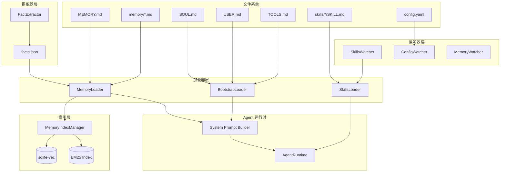
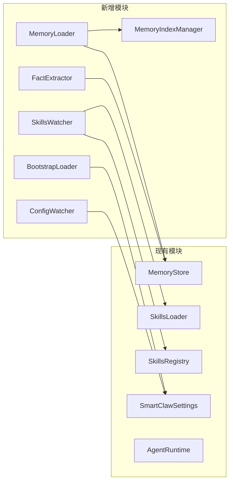

# 设计文档：记忆系统与 Skills 热加载增强

## 概述

本设计文档描述 SmartClaw 记忆系统与 Skills 热加载增强功能的技术实现方案。该功能从 OpenClaw 和 Deer-Flow 中吸收最佳实践，为 SmartClaw 实现：

1. **MEMORY.md 长期记忆支持** — 从工作空间加载用户手写的长期知识
2. **Bootstrap Files 机制** — 支持 SOUL.md、USER.md、TOOLS.md 定义 Agent 身份和行为
3. **Skills 热加载** — 基于 watchdog 的文件监听，修改 SKILL.md 后自动重载
4. **配置文件热加载** — 监听 config.yaml 变化并自动应用新配置
5. **memory/ 目录自动索引** — 扫描 memory/ 目录下的 MD 文件并建立索引
6. **sqlite-vec 向量检索** — 支持 Hybrid Search（BM25 + 向量语义搜索）
7. **LLM 自动事实提取** — 可选功能，从对话中自动提取结构化事实

### 设计目标

- 与现有 `MemoryStore`、`SkillsLoader`、`SkillsRegistry` 无缝集成
- 最小化对现有代码的侵入性修改
- 支持渐进式启用（通过配置项控制各功能开关）
- 保持高性能（防抖、缓存、增量更新）

### 参考实现

- OpenClaw: `src/memory/internal.ts`, `src/memory/manager.ts`, `src/agents/workspace.ts`, `src/agents/skills/refresh.ts`
- Deer-Flow: `agents/memory/updater.py`

---

## 架构

### 整体架构图



### 模块依赖关系



---

## 组件与接口

### 1. MemoryLoader（记忆加载器）

负责从 MEMORY.md 和 memory/ 目录加载 Markdown 文件。

```python
# smartclaw/smartclaw/memory/loader.py

from pathlib import Path
from dataclasses import dataclass
import hashlib
import structlog

logger = structlog.get_logger(component="memory.loader")

MAX_MEMORY_FILE_SIZE = 2 * 1024 * 1024  # 2MB
MAX_MEMORY_DIR_SIZE = 50 * 1024 * 1024  # 50MB


@dataclass
class MemoryChunk:
    """记忆分块数据结构"""
    file_path: str          # 源文件路径
    start_line: int         # 起始行号
    end_line: int           # 结束行号
    text: str               # 分块文本内容
    hash: str               # 内容哈希（SHA-256 前 16 位）
    embedding_input: str    # 用于向量化的输入文本


@dataclass
class MemoryFile:
    """记忆文件元数据"""
    path: str
    mtime: float            # 修改时间
    size: int               # 文件大小
    content: str            # 文件内容
    chunks: list[MemoryChunk]


class MemoryLoader:
    """记忆加载器 — 从 MEMORY.md 和 memory/ 目录加载 Markdown 文件"""

    def __init__(
        self,
        workspace_dir: str,
        chunk_tokens: int = 512,
        chunk_overlap: int = 64,
        enabled: bool = True,
    ) -> None:
        self._workspace_dir = Path(workspace_dir).expanduser().resolve()
        self._chunk_tokens = chunk_tokens
        self._chunk_overlap = chunk_overlap
        self._enabled = enabled
        self._cache: dict[str, MemoryFile] = {}

    def load_memory_md(self) -> str | None:
        """加载 MEMORY.md 文件内容
        
        Returns:
            文件内容字符串，如果文件不存在则返回 None
        """
        ...

    def load_memory_dir(self) -> list[MemoryFile]:
        """扫描 memory/ 目录下的所有 .md 文件
        
        Returns:
            MemoryFile 列表
        """
        ...

    def chunk_markdown(self, content: str, file_path: str) -> list[MemoryChunk]:
        """将 Markdown 内容分块
        
        Args:
            content: Markdown 文本内容
            file_path: 源文件路径
            
        Returns:
            MemoryChunk 列表
        """
        ...

    def compute_hash(self, text: str) -> str:
        """计算内容哈希（SHA-256 前 16 位）"""
        return hashlib.sha256(text.encode()).hexdigest()[:16]

    def build_memory_context(self) -> str:
        """构建记忆上下文字符串，用于注入系统提示词
        
        Returns:
            格式化的记忆上下文字符串
        """
        ...
```

### 2. BootstrapLoader（引导文件加载器）

负责加载 SOUL.md、USER.md、TOOLS.md 等 Bootstrap 文件。

```python
# smartclaw/smartclaw/bootstrap/loader.py

from pathlib import Path
from dataclasses import dataclass
from enum import Enum
import structlog

logger = structlog.get_logger(component="bootstrap.loader")

MAX_BOOTSTRAP_FILE_SIZE = 512 * 1024  # 512KB


class BootstrapFileType(Enum):
    """Bootstrap 文件类型"""
    SOUL = "SOUL.md"
    USER = "USER.md"
    TOOLS = "TOOLS.md"


@dataclass
class BootstrapFile:
    """Bootstrap 文件数据结构"""
    file_type: BootstrapFileType
    path: str
    source: str             # "workspace" | "global"
    content: str
    mtime: float


class BootstrapLoader:
    """Bootstrap 文件加载器"""

    def __init__(
        self,
        workspace_dir: str | None = None,
        global_dir: str = "~/.smartclaw",
        enabled: bool = True,
    ) -> None:
        self._workspace_dir = (
            Path(workspace_dir).expanduser().resolve() if workspace_dir else None
        )
        self._global_dir = Path(global_dir).expanduser().resolve()
        self._enabled = enabled
        self._cache: dict[BootstrapFileType, BootstrapFile] = {}

    def load_all(self) -> dict[BootstrapFileType, BootstrapFile]:
        """加载所有 Bootstrap 文件
        
        优先级：workspace > global
        
        Returns:
            文件类型到 BootstrapFile 的映射
        """
        ...

    def load_file(self, file_type: BootstrapFileType) -> BootstrapFile | None:
        """加载指定类型的 Bootstrap 文件
        
        Args:
            file_type: 文件类型
            
        Returns:
            BootstrapFile 或 None（如果文件不存在）
        """
        ...

    def get_soul_content(self) -> str:
        """获取 SOUL.md 内容，用于系统提示词开头"""
        ...

    def get_user_content(self) -> str:
        """获取 USER.md 内容，用于用户上下文部分"""
        ...

    def get_tools_content(self) -> str:
        """获取 TOOLS.md 内容，用于工具描述部分"""
        ...

    def invalidate_cache(self, file_type: BootstrapFileType | None = None) -> None:
        """使缓存失效
        
        Args:
            file_type: 指定文件类型，None 表示清除所有缓存
        """
        ...
```

### 3. SkillsWatcher（技能文件监听器）

基于 watchdog 监听 SKILL.md 文件变化，实现热加载。

```python
# smartclaw/smartclaw/skills/watcher.py

from pathlib import Path
from typing import Callable
import threading
import time
import structlog

from watchdog.observers import Observer
from watchdog.events import FileSystemEventHandler, FileSystemEvent

logger = structlog.get_logger(component="skills.watcher")

DEFAULT_DEBOUNCE_MS = 250
IGNORED_DIRS = {".git", "__pycache__", "venv", ".venv", "node_modules", ".idea", ".vscode"}


class SkillsWatcher:
    """Skills 文件监听器 — 基于 watchdog 实现热加载"""

    def __init__(
        self,
        workspace_dir: str | None = None,
        global_dir: str = "~/.smartclaw/skills",
        debounce_ms: int = DEFAULT_DEBOUNCE_MS,
        on_reload: Callable[[], None] | None = None,
        enabled: bool = True,
    ) -> None:
        self._workspace_dir = (
            Path(workspace_dir).expanduser().resolve() / "skills" if workspace_dir else None
        )
        self._global_dir = Path(global_dir).expanduser().resolve()
        self._debounce_ms = debounce_ms
        self._on_reload = on_reload
        self._enabled = enabled
        
        self._observer: Observer | None = None
        self._version: int = 0
        self._timer: threading.Timer | None = None
        self._lock = threading.Lock()

    def start(self) -> None:
        """启动文件监听"""
        ...

    def stop(self) -> None:
        """停止文件监听"""
        ...

    def get_version(self) -> int:
        """获取当前 Skills 版本号"""
        return self._version

    def _schedule_reload(self, changed_path: str) -> None:
        """调度重载（带防抖）"""
        ...

    def _do_reload(self, changed_path: str) -> None:
        """执行重载"""
        ...

    def _bump_version(self) -> int:
        """更新版本号（基于时间戳，保证单调递增）"""
        now = int(time.time() * 1000)
        with self._lock:
            self._version = max(now, self._version + 1)
            return self._version


class _SkillsEventHandler(FileSystemEventHandler):
    """watchdog 事件处理器"""

    def __init__(self, watcher: SkillsWatcher) -> None:
        self._watcher = watcher

    def on_created(self, event: FileSystemEvent) -> None:
        self._handle(event)

    def on_modified(self, event: FileSystemEvent) -> None:
        self._handle(event)

    def on_deleted(self, event: FileSystemEvent) -> None:
        self._handle(event)

    def _handle(self, event: FileSystemEvent) -> None:
        if event.is_directory:
            return
        path = Path(event.src_path)
        # 检查是否为 SKILL.md 或 skill.yaml
        if path.name.lower() not in ("skill.md", "skill.yaml"):
            return
        # 检查是否在忽略目录中
        for part in path.parts:
            if part in IGNORED_DIRS:
                return
        self._watcher._schedule_reload(str(path))
```

### 4. ConfigWatcher（配置文件监听器）

监听 config.yaml 变化并触发配置重载。

```python
# smartclaw/smartclaw/config/watcher.py

from pathlib import Path
from typing import Callable, Any
import threading
import structlog

from watchdog.observers import Observer
from watchdog.events import FileSystemEventHandler, FileSystemEvent

logger = structlog.get_logger(component="config.watcher")

DEFAULT_DEBOUNCE_MS = 500

# 支持热更新的配置项
HOT_RELOAD_KEYS = {
    "providers",
    "memory",
    "skills",
    "logging.level",
}

# 不支持热更新的配置项（需要重启）
RESTART_REQUIRED_KEYS = {
    "gateway.host",
    "gateway.port",
}


class ConfigWatcher:
    """配置文件监听器"""

    def __init__(
        self,
        config_path: str = "config.yaml",
        debounce_ms: int = DEFAULT_DEBOUNCE_MS,
        on_reload: Callable[[dict[str, Any]], None] | None = None,
        enabled: bool = True,
    ) -> None:
        self._config_path = Path(config_path).expanduser().resolve()
        self._debounce_ms = debounce_ms
        self._on_reload = on_reload
        self._enabled = enabled
        
        self._observer: Observer | None = None
        self._timer: threading.Timer | None = None
        self._lock = threading.Lock()

    def start(self) -> None:
        """启动配置文件监听"""
        ...

    def stop(self) -> None:
        """停止配置文件监听"""
        ...

    def _schedule_reload(self) -> None:
        """调度配置重载（带防抖）"""
        ...

    def _do_reload(self) -> None:
        """执行配置重载"""
        ...

    def _validate_config(self, config: dict[str, Any]) -> list[str]:
        """验证配置有效性
        
        Returns:
            错误列表，空列表表示验证通过
        """
        ...

    def _diff_config(
        self, old: dict[str, Any], new: dict[str, Any]
    ) -> tuple[set[str], set[str]]:
        """比较配置差异
        
        Returns:
            (changed_keys, restart_required_keys)
        """
        ...
```

### 5. MemoryIndexManager（记忆索引管理器）

负责 Markdown 分块的向量化和检索。

```python
# smartclaw/smartclaw/memory/index_manager.py

from dataclasses import dataclass
from typing import Any
import aiosqlite
import structlog

logger = structlog.get_logger(component="memory.index_manager")


@dataclass
class SearchResult:
    """检索结果"""
    chunk_hash: str
    file_path: str
    text: str
    score: float            # 综合得分
    vector_score: float     # 向量相似度得分
    bm25_score: float       # BM25 得分


class EmbeddingProvider:
    """向量嵌入提供商基类"""

    async def embed(self, texts: list[str]) -> list[list[float]]:
        """将文本转换为向量"""
        raise NotImplementedError

    @property
    def dimension(self) -> int:
        """向量维度"""
        raise NotImplementedError


class OpenAIEmbeddingProvider(EmbeddingProvider):
    """OpenAI Embedding Provider"""
    
    def __init__(self, model: str = "text-embedding-3-small") -> None:
        self._model = model

    async def embed(self, texts: list[str]) -> list[list[float]]:
        ...

    @property
    def dimension(self) -> int:
        return 1536


class OllamaEmbeddingProvider(EmbeddingProvider):
    """Ollama 本地 Embedding Provider"""
    
    def __init__(self, model: str = "nomic-embed-text") -> None:
        self._model = model

    async def embed(self, texts: list[str]) -> list[list[float]]:
        ...

    @property
    def dimension(self) -> int:
        return 768


class MemoryIndexManager:
    """记忆索引管理器 — 向量化和 Hybrid Search"""

    def __init__(
        self,
        db_path: str = "~/.smartclaw/memory.db",
        embedding_provider: str = "auto",
        vector_weight: float = 0.7,
        text_weight: float = 0.3,
        top_k: int = 5,
    ) -> None:
        self._db_path = db_path
        self._embedding_provider_name = embedding_provider
        self._vector_weight = vector_weight
        self._text_weight = text_weight
        self._top_k = top_k
        
        self._db: aiosqlite.Connection | None = None
        self._provider: EmbeddingProvider | None = None

    async def initialize(self) -> None:
        """初始化数据库和向量扩展"""
        ...

    async def close(self) -> None:
        """关闭数据库连接"""
        ...

    async def index_chunks(self, chunks: list["MemoryChunk"]) -> None:
        """索引记忆分块
        
        Args:
            chunks: MemoryChunk 列表
        """
        ...

    async def search(self, query: str) -> list[SearchResult]:
        """Hybrid Search — 结合 BM25 和向量搜索
        
        Args:
            query: 查询文本
            
        Returns:
            SearchResult 列表，按综合得分降序排列
        """
        ...

    async def _vector_search(self, query: str) -> list[tuple[str, float]]:
        """向量搜索"""
        ...

    async def _bm25_search(self, query: str) -> list[tuple[str, float]]:
        """BM25 关键词搜索"""
        ...

    def _merge_results(
        self,
        vector_results: list[tuple[str, float]],
        bm25_results: list[tuple[str, float]],
    ) -> list[SearchResult]:
        """合并向量和 BM25 搜索结果"""
        ...

    async def delete_by_file(self, file_path: str) -> None:
        """删除指定文件的所有索引"""
        ...

    async def get_indexed_hashes(self) -> set[str]:
        """获取已索引的所有分块哈希"""
        ...
```

### 6. FactExtractor（事实提取器）

使用 LLM 从对话中自动提取结构化事实。

```python
# smartclaw/smartclaw/memory/fact_extractor.py

from dataclasses import dataclass, field
from datetime import datetime
from typing import Any
import json
import structlog

logger = structlog.get_logger(component="memory.fact_extractor")

FACT_CATEGORIES = ["preference", "project", "context", "personal", "technical"]


@dataclass
class Fact:
    """结构化事实"""
    id: str                     # fact_{uuid}
    content: str                # 事实内容
    category: str               # 分类
    confidence: float           # 置信度 0.0-1.0
    created_at: datetime
    source: str                 # 来源会话 ID


@dataclass
class FactStore:
    """事实存储结构"""
    version: str = "1.0"
    last_updated: datetime = field(default_factory=datetime.utcnow)
    facts: list[Fact] = field(default_factory=list)


class FactExtractor:
    """事实提取器 — 使用 LLM 从对话中提取结构化事实"""

    def __init__(
        self,
        workspace_dir: str,
        model: str = "gpt-4o-mini",
        confidence_threshold: float = 0.7,
        max_facts: int = 100,
        enabled: bool = False,
    ) -> None:
        self._workspace_dir = workspace_dir
        self._model = model
        self._confidence_threshold = confidence_threshold
        self._max_facts = max_facts
        self._enabled = enabled
        
        self._facts_path = f"{workspace_dir}/.smartclaw/facts.json"

    async def extract_facts(
        self, messages: list[dict[str, Any]], session_id: str
    ) -> list[Fact]:
        """从对话消息中提取事实
        
        Args:
            messages: 对话消息列表
            session_id: 会话 ID
            
        Returns:
            提取的 Fact 列表
        """
        ...

    async def save_facts(self, facts: list[Fact]) -> None:
        """保存事实到 facts.json"""
        ...

    async def load_facts(self) -> FactStore:
        """加载已保存的事实"""
        ...

    def _deduplicate_facts(self, facts: list[Fact]) -> list[Fact]:
        """事实去重"""
        ...

    def _prune_facts(self, facts: list[Fact]) -> list[Fact]:
        """按置信度裁剪事实，保留 max_facts 个"""
        ...

    def _build_extraction_prompt(self, messages: list[dict[str, Any]]) -> str:
        """构建事实提取 Prompt"""
        ...
```

---

## 数据模型

### 配置扩展（SmartClawSettings）

```python
# 扩展 smartclaw/smartclaw/config/settings.py

class MemorySettings(BaseSettings):
    """Memory 模块配置（扩展）"""
    
    # 现有字段...
    enabled: bool = True
    db_path: str = "~/.smartclaw/memory.db"
    
    # 新增字段
    memory_file_enabled: bool = True          # 是否启用 MEMORY.md 加载
    memory_dir_enabled: bool = True           # 是否启用 memory/ 目录索引
    chunk_tokens: int = 512                   # 分块大小（tokens）
    chunk_overlap: int = 64                   # 分块重叠（tokens）
    max_file_size: int = 2 * 1024 * 1024      # 单文件最大大小（2MB）
    max_dir_size: int = 50 * 1024 * 1024      # 目录最大总大小（50MB）
    
    # 向量检索配置
    embedding_provider: str = "auto"          # "auto" | "openai" | "ollama" | "none"
    vector_weight: float = 0.7                # 向量搜索权重
    text_weight: float = 0.3                  # BM25 搜索权重
    top_k: int = 5                            # 返回结果数量
    
    # 事实提取配置
    auto_extract: bool = False                # 是否启用自动事实提取
    max_facts: int = 100                      # 最大事实数量
    fact_confidence_threshold: float = 0.7   # 事实置信度阈值


class BootstrapSettings(BaseSettings):
    """Bootstrap 模块配置（新增）"""
    
    enabled: bool = True                      # 是否启用 Bootstrap 加载
    max_file_size: int = 512 * 1024           # 单文件最大大小（512KB）


class SkillsSettings(BaseSettings):
    """Skills 模块配置（扩展）"""
    
    # 现有字段...
    enabled: bool = True
    workspace_dir: str = "{workspace}/skills"
    global_dir: str = "~/.smartclaw/skills"
    
    # 新增字段
    hot_reload: bool = True                   # 是否启用热加载
    debounce_ms: int = 250                    # 防抖时间（毫秒）


class ConfigSettings(BaseSettings):
    """Config 模块配置（新增）"""
    
    hot_reload: bool = True                   # 是否启用配置热加载
    debounce_ms: int = 500                    # 防抖时间（毫秒）
```

### 数据库 Schema 扩展

```sql
-- 记忆分块表（新增）
CREATE TABLE IF NOT EXISTS memory_chunks (
    hash TEXT PRIMARY KEY,              -- SHA-256 前 16 位
    file_path TEXT NOT NULL,            -- 源文件路径
    start_line INTEGER NOT NULL,        -- 起始行号
    end_line INTEGER NOT NULL,          -- 结束行号
    text TEXT NOT NULL,                 -- 分块文本
    embedding_input TEXT NOT NULL,      -- 向量化输入
    created_at TIMESTAMP DEFAULT CURRENT_TIMESTAMP,
    updated_at TIMESTAMP DEFAULT CURRENT_TIMESTAMP
);

CREATE INDEX IF NOT EXISTS idx_memory_chunks_file 
    ON memory_chunks(file_path);

-- 向量嵌入表（新增，使用 sqlite-vec）
CREATE VIRTUAL TABLE IF NOT EXISTS memory_embeddings USING vec0(
    hash TEXT PRIMARY KEY,
    embedding FLOAT[1536]               -- OpenAI text-embedding-3-small 维度
);

-- BM25 全文索引表（新增）
CREATE VIRTUAL TABLE IF NOT EXISTS memory_fts USING fts5(
    hash,
    text,
    content='memory_chunks',
    content_rowid='rowid'
);

-- 事实表（新增）
CREATE TABLE IF NOT EXISTS facts (
    id TEXT PRIMARY KEY,                -- fact_{uuid}
    content TEXT NOT NULL,              -- 事实内容
    category TEXT NOT NULL,             -- 分类
    confidence REAL NOT NULL,           -- 置信度
    created_at TIMESTAMP NOT NULL,
    source TEXT NOT NULL                -- 来源会话 ID
);

CREATE INDEX IF NOT EXISTS idx_facts_confidence 
    ON facts(confidence DESC);
```

### 文件格式规范

#### MEMORY.md 格式

```markdown
# 长期记忆

## 项目信息
- 项目名称：SmartClaw
- 技术栈：Python, LangChain, FastAPI

## 用户偏好
- 编程语言：Python, TypeScript
- 编辑器：VS Code
- 终端：iTerm2

## 工作上下文
- 当前任务：实现记忆系统增强
- 目标：提升 Agent 的上下文理解能力
```

#### SOUL.md 格式

```markdown
# Agent 人格定义

## 核心价值观
- 准确性优先
- 简洁明了
- 尊重用户时间

## 沟通风格
- 技术性但不晦涩
- 直接但友好
- 适度幽默

## 行为边界
- 不讨论敏感话题
- 不执行危险操作
- 遇到不确定时主动询问
```

#### USER.md 格式

```markdown
# 用户信息

## 基本信息
- 名称：[用户名]
- 时区：Asia/Shanghai
- 语言偏好：中文

## 技术背景
- 主要语言：Python, Go
- 经验水平：高级

## 工作习惯
- 偏好简洁的代码
- 喜欢详细的注释
```

#### facts.json 格式

```json
{
  "version": "1.0",
  "lastUpdated": "2024-01-15T10:30:00Z",
  "facts": [
    {
      "id": "fact_abc123",
      "content": "用户偏好使用 Python 进行后端开发",
      "category": "preference",
      "confidence": 0.85,
      "createdAt": "2024-01-15T10:30:00Z",
      "source": "session_xyz789"
    }
  ]
}
```


---

## 正确性属性

*正确性属性是指在系统所有有效执行中都应保持为真的特征或行为——本质上是关于系统应该做什么的形式化陈述。属性是人类可读规范与机器可验证正确性保证之间的桥梁。*

### Property 1: MEMORY.md 文件发现优先级

*For any* 工作空间目录，当同时存在 `MEMORY.md` 和 `memory.md` 文件时，MemoryLoader 应始终优先加载大写版本 `MEMORY.md`。

**Validates: Requirements 1.1**

### Property 2: 记忆文件大小限制

*For any* MEMORY.md 文件，当文件大小超过 2MB 时，MemoryLoader 应截断内容至 2MB 并记录警告日志，截断后的内容应保持有效的 Markdown 格式。

**Validates: Requirements 1.3**

### Property 3: 记忆内容注入位置

*For any* 加载的记忆内容，在生成的系统提示词中，记忆内容应出现在 skills_section 之前的位置。

**Validates: Requirements 1.4**

### Property 4: 记忆加载配置开关

*For any* MemoryLoader 实例，当 `memory.enabled=false` 时，不应加载任何记忆文件；当 `memory.enabled=true` 时，应正常加载记忆文件。

**Validates: Requirements 1.5**

### Property 5: Bootstrap 文件优先级覆盖

*For any* Bootstrap 文件类型（SOUL.md、USER.md、TOOLS.md），当工作空间级和全局级都存在该文件时，BootstrapLoader 应使用工作空间级文件内容覆盖全局级。

**Validates: Requirements 2.1, 2.3**

### Property 6: Bootstrap 文件大小限制

*For any* Bootstrap 文件，当文件大小超过 512KB 时，BootstrapLoader 应拒绝加载并记录警告日志。

**Validates: Requirements 2.4**

### Property 7: Bootstrap 文件缓存一致性

*For any* Bootstrap 文件，当文件 mtime 未变化时，BootstrapLoader 应返回缓存内容；当 mtime 变化时，应重新加载文件内容。

**Validates: Requirements 2.5**

### Property 8: SOUL.md 提示词位置

*For any* 加载的 SOUL.md 内容，在生成的系统提示词中，SOUL.md 内容应作为第一部分出现，优先级高于默认 SYSTEM_PROMPT。

**Validates: Requirements 2.7**

### Property 9: 文件监听器防抖行为

*For any* SkillsWatcher 或 ConfigWatcher，在防抖时间窗口内的多次文件变化事件应合并为一次重载操作。

**Validates: Requirements 3.3, 4.2**

### Property 10: Skills 版本号单调递增

*For any* SkillsWatcher 实例，每次重载后的版本号应严格大于重载前的版本号，且版本号基于时间戳。

**Validates: Requirements 3.4**

### Property 11: 忽略目录过滤

*For any* 在 `.git`、`__pycache__`、`venv`、`.venv`、`node_modules`、`.idea`、`.vscode` 目录下的文件变化，SkillsWatcher 不应触发重载。

**Validates: Requirements 3.5**

### Property 12: 监听器错误回退

*For any* SkillsWatcher 或 ConfigWatcher，当重载过程中发生错误时，应保持使用上一个有效版本的配置/技能，不应导致系统崩溃。

**Validates: Requirements 3.10, 4.5**

### Property 13: 配置热更新范围

*For any* config.yaml 变更，`providers`、`memory`、`skills`、`logging.level` 配置项应支持热更新；`gateway.host`、`gateway.port` 配置项变更应被标记为需要重启。

**Validates: Requirements 4.6, 4.7**

### Property 14: memory/ 目录递归扫描

*For any* memory/ 目录结构，MemoryLoader 应递归扫描所有子目录中的 `.md` 文件，不遗漏任何层级。

**Validates: Requirements 5.1**

### Property 15: Markdown 分块一致性

*For any* Markdown 文件内容，使用相同的 chunk_tokens 和 chunk_overlap 配置进行分块，应产生相同的分块结果（确定性）。

**Validates: Requirements 5.2**

### Property 16: 分块哈希唯一性

*For any* 两个不同内容的分块，其 SHA-256 哈希（前 16 位）应不同；相同内容的分块应产生相同的哈希。

**Validates: Requirements 5.3**

### Property 17: memory/ 目录大小限制

*For any* memory/ 目录，当总大小超过 50MB 时，MemoryLoader 应停止索引新文件并记录警告日志。

**Validates: Requirements 5.7**

### Property 18: Embedding Provider 降级

*For any* MemoryIndexManager 实例，当配置的 Embedding Provider 不可用时，应自动降级到下一个可用 Provider，最终降级到纯 BM25 搜索。

**Validates: Requirements 6.2, 6.6**

### Property 19: Hybrid Search 权重计算

*For any* 搜索查询，Hybrid Search 结果的综合得分应等于 `vector_score * vector_weight + bm25_score * text_weight`，且权重之和为 1.0。

**Validates: Requirements 6.3**

### Property 20: 事实置信度过滤

*For any* FactExtractor 提取的事实，只有置信度 >= 0.7 的事实应被保存，低于阈值的事实应被丢弃。

**Validates: Requirements 7.3**

### Property 21: 事实数量裁剪

*For any* FactStore，当事实数量超过 max_facts 限制时，应按置信度降序排序并删除置信度最低的事实，保留 max_facts 个。

**Validates: Requirements 7.8**

---

## 错误处理

### 文件系统错误

| 错误场景 | 处理策略 | 日志级别 |
|---------|---------|---------|
| MEMORY.md 不存在 | 静默跳过，不影响启动 | DEBUG |
| MEMORY.md 读取失败（权限） | 记录错误，跳过加载 | WARNING |
| MEMORY.md 超过大小限制 | 截断内容，记录警告 | WARNING |
| Bootstrap 文件包含二进制数据 | 跳过该文件，记录警告 | WARNING |
| memory/ 目录不存在 | 静默跳过 | DEBUG |
| memory/ 目录超过大小限制 | 停止索引新文件，记录警告 | WARNING |

### 监听器错误

| 错误场景 | 处理策略 | 日志级别 |
|---------|---------|---------|
| watchdog 初始化失败 | 禁用热加载，记录错误 | ERROR |
| 文件变化事件处理失败 | 忽略该事件，记录警告 | WARNING |
| Skills 重载失败 | 保持上一版本，记录错误 | ERROR |
| Config 解析失败 | 保持当前配置，记录错误 | ERROR |
| Config 验证失败 | 保持当前配置，记录错误 | ERROR |

### 向量检索错误

| 错误场景 | 处理策略 | 日志级别 |
|---------|---------|---------|
| sqlite-vec 扩展加载失败 | 降级为纯 BM25 搜索 | WARNING |
| Embedding Provider 不可用 | 尝试下一个 Provider | WARNING |
| 所有 Provider 不可用 | 降级为纯 BM25 搜索 | WARNING |
| 向量化请求超时 | 重试一次，失败则跳过 | WARNING |
| 向量维度不匹配 | 重建索引 | ERROR |

### 事实提取错误

| 错误场景 | 处理策略 | 日志级别 |
|---------|---------|---------|
| LLM 调用失败 | 跳过本次提取，记录错误 | ERROR |
| LLM 返回格式错误 | 跳过本次提取，记录警告 | WARNING |
| facts.json 写入失败 | 保持内存中的事实，记录错误 | ERROR |
| facts.json 读取失败 | 使用空事实列表，记录警告 | WARNING |

---

## 测试策略

### 测试框架选择

- **单元测试**: pytest
- **属性测试**: hypothesis（Python 属性测试库）
- **异步测试**: pytest-asyncio
- **Mock**: unittest.mock, pytest-mock

### 属性测试配置

```python
from hypothesis import settings, given, strategies as st

# 全局配置：每个属性测试至少运行 100 次
settings.register_profile("ci", max_examples=100)
settings.load_profile("ci")
```

### 测试分类

#### 1. 单元测试（具体示例和边界条件）

```python
# tests/memory/test_loader.py

class TestMemoryLoader:
    """MemoryLoader 单元测试"""

    def test_load_memory_md_not_exists(self, tmp_path):
        """MEMORY.md 不存在时应返回 None"""
        loader = MemoryLoader(workspace_dir=str(tmp_path))
        assert loader.load_memory_md() is None

    def test_load_memory_md_case_insensitive(self, tmp_path):
        """应支持大小写不敏感的文件名"""
        (tmp_path / "memory.md").write_text("# Test")
        loader = MemoryLoader(workspace_dir=str(tmp_path))
        assert loader.load_memory_md() is not None

    def test_bootstrap_invalid_binary_content(self, tmp_path):
        """Bootstrap 文件包含二进制数据时应跳过"""
        (tmp_path / "SOUL.md").write_bytes(b"\x00\x01\x02\x03")
        loader = BootstrapLoader(workspace_dir=str(tmp_path))
        assert loader.load_file(BootstrapFileType.SOUL) is None
```

#### 2. 属性测试（通用属性验证）

```python
# tests/memory/test_loader_props.py

from hypothesis import given, strategies as st

class TestMemoryLoaderProperties:
    """MemoryLoader 属性测试"""

    @given(st.text(min_size=1, max_size=1000))
    def test_chunk_hash_deterministic(self, content: str):
        """
        Feature: memory-skills-enhancement
        Property 16: 分块哈希唯一性
        
        For any Markdown content, chunking with same config should produce
        same hash for same content.
        """
        loader = MemoryLoader(workspace_dir="/tmp", chunk_tokens=512)
        hash1 = loader.compute_hash(content)
        hash2 = loader.compute_hash(content)
        assert hash1 == hash2
        assert len(hash1) == 16

    @given(st.integers(min_value=1, max_value=10000))
    def test_version_monotonic_increasing(self, n: int):
        """
        Feature: memory-skills-enhancement
        Property 10: Skills 版本号单调递增
        
        For any sequence of version bumps, each version should be strictly
        greater than the previous.
        """
        watcher = SkillsWatcher(enabled=False)
        versions = []
        for _ in range(min(n, 100)):
            versions.append(watcher._bump_version())
        
        for i in range(1, len(versions)):
            assert versions[i] > versions[i-1]

    @given(
        st.floats(min_value=0.0, max_value=1.0),
        st.floats(min_value=0.0, max_value=1.0),
    )
    def test_hybrid_search_weight_sum(self, vector_weight: float, text_weight: float):
        """
        Feature: memory-skills-enhancement
        Property 19: Hybrid Search 权重计算
        
        For any weight configuration, the weights should be normalized to sum to 1.0.
        """
        # Normalize weights
        total = vector_weight + text_weight
        if total > 0:
            norm_vector = vector_weight / total
            norm_text = text_weight / total
            assert abs(norm_vector + norm_text - 1.0) < 1e-9

    @given(st.lists(st.floats(min_value=0.0, max_value=1.0), min_size=0, max_size=200))
    def test_fact_pruning_by_confidence(self, confidences: list[float]):
        """
        Feature: memory-skills-enhancement
        Property 21: 事实数量裁剪
        
        For any list of facts, pruning should keep only the top max_facts
        by confidence score.
        """
        max_facts = 100
        facts = [Fact(id=f"fact_{i}", content=f"fact {i}", 
                      category="test", confidence=c,
                      created_at=datetime.utcnow(), source="test")
                 for i, c in enumerate(confidences)]
        
        extractor = FactExtractor(workspace_dir="/tmp", max_facts=max_facts)
        pruned = extractor._prune_facts(facts)
        
        assert len(pruned) <= max_facts
        if len(facts) > max_facts:
            # Verify we kept the highest confidence facts
            kept_confidences = [f.confidence for f in pruned]
            removed_confidences = [f.confidence for f in facts if f not in pruned]
            if removed_confidences and kept_confidences:
                assert min(kept_confidences) >= max(removed_confidences)
```

#### 3. 集成测试

```python
# tests/memory/test_integration.py

class TestMemoryIntegration:
    """记忆系统集成测试"""

    @pytest.mark.asyncio
    async def test_memory_to_prompt_injection(self, tmp_path):
        """验证记忆内容正确注入到系统提示词"""
        # Setup
        (tmp_path / "MEMORY.md").write_text("# My Memory\n- Fact 1\n- Fact 2")
        
        loader = MemoryLoader(workspace_dir=str(tmp_path))
        content = loader.load_memory_md()
        
        # Build prompt
        prompt_builder = SystemPromptBuilder()
        prompt = prompt_builder.build(memory_content=content)
        
        # Verify
        assert "My Memory" in prompt
        assert prompt.index("My Memory") < prompt.index("skills")

    @pytest.mark.asyncio
    async def test_skills_hot_reload_e2e(self, tmp_path):
        """端到端测试 Skills 热加载"""
        skills_dir = tmp_path / "skills" / "test-skill"
        skills_dir.mkdir(parents=True)
        
        # Initial skill
        (skills_dir / "SKILL.md").write_text("# Test Skill v1")
        
        watcher = SkillsWatcher(workspace_dir=str(tmp_path))
        reload_count = 0
        
        def on_reload():
            nonlocal reload_count
            reload_count += 1
        
        watcher._on_reload = on_reload
        watcher.start()
        
        try:
            # Modify skill
            await asyncio.sleep(0.1)
            (skills_dir / "SKILL.md").write_text("# Test Skill v2")
            await asyncio.sleep(0.5)  # Wait for debounce
            
            assert reload_count >= 1
        finally:
            watcher.stop()
```

### 测试覆盖目标

| 模块 | 单元测试覆盖 | 属性测试覆盖 |
|------|------------|------------|
| MemoryLoader | 90% | Property 1-4, 14-17 |
| BootstrapLoader | 90% | Property 5-8 |
| SkillsWatcher | 85% | Property 9-12 |
| ConfigWatcher | 85% | Property 9, 12, 13 |
| MemoryIndexManager | 80% | Property 18-19 |
| FactExtractor | 80% | Property 20-21 |

### 测试命令

```bash
# 运行所有测试
pytest tests/memory tests/skills tests/config -v

# 运行属性测试
pytest tests/memory/test_loader_props.py -v --hypothesis-show-statistics

# 运行集成测试
pytest tests/memory/test_integration.py -v

# 生成覆盖率报告
pytest tests/memory tests/skills tests/config --cov=smartclaw --cov-report=html
```
