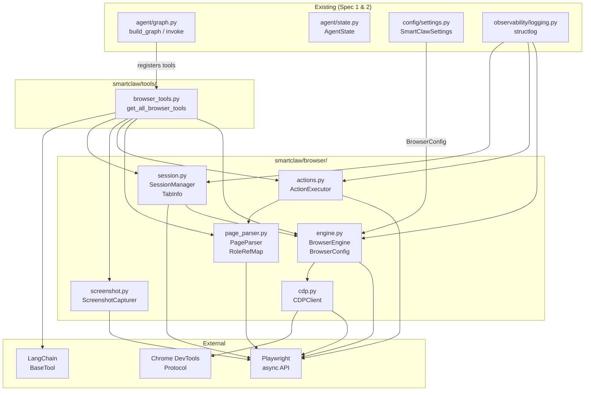
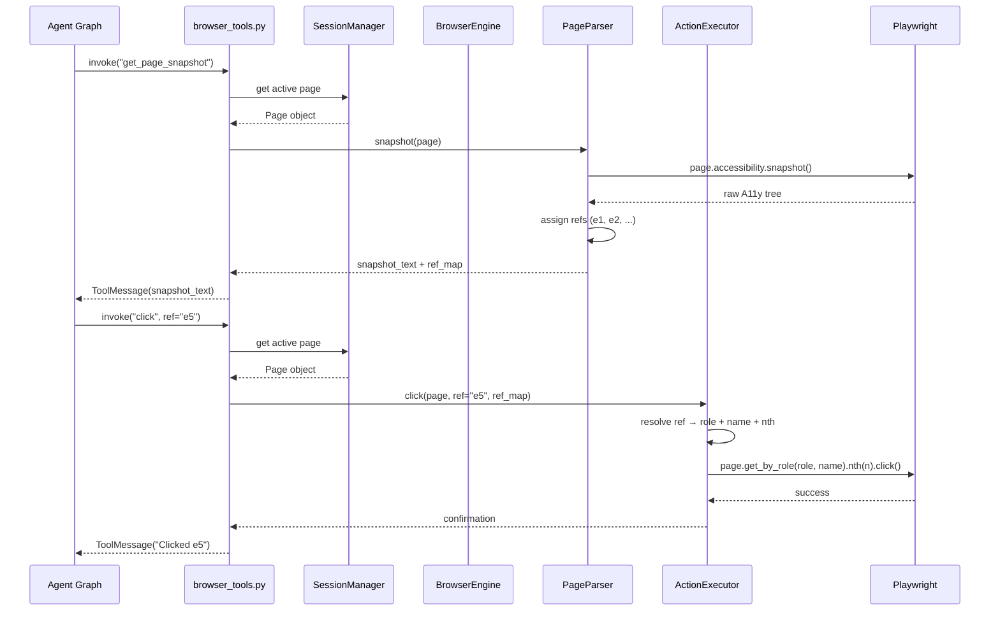
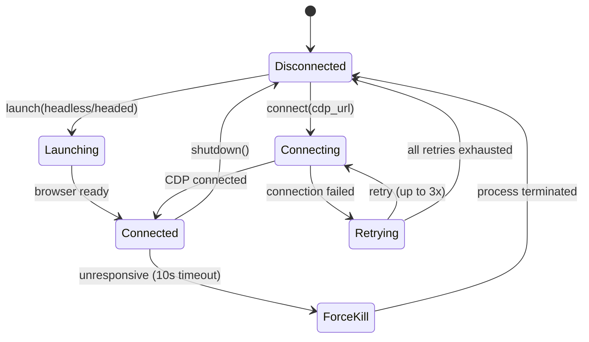

# Design Document: SmartClaw Browser Engine

## Overview

本设计文档定义 SmartClaw 的浏览器自动化引擎（Spec 3, P0 核心模块）。模块分为六个子系统：

1. **Browser Engine** (`browser/engine.py`) — Playwright 浏览器生命周期管理（启动、连接、关闭）
2. **CDP Client** (`browser/cdp.py`) — Playwright CDPSession 封装，低级 CDP 操作
3. **Page Parser** (`browser/page_parser.py`) — Accessibility Tree 提取与 Element Reference 映射
4. **Action Executor** (`browser/actions.py`) — 浏览器交互动作（click/type/scroll/navigate 等）
5. **Screenshot Capturer** (`browser/screenshot.py`) — 截图捕获与尺寸优化
6. **Session Manager** (`browser/session.py`) — 多 Tab 管理、会话清理、事件追踪

外部集成层：
7. **Browser Tools** (`tools/browser_tools.py`) — LangChain Tool 封装，供 Agent Graph ReAct 循环调用

设计参考 OpenClaw `src/browser/` 模块（pw-role-snapshot.ts、pw-session.ts、pw-tools-core.interactions.ts、cdp.ts、screenshot.ts），使用 Python Playwright + async/await 实现。

### 关键设计决策

| 决策 | 选择 | 理由 |
|------|------|------|
| 浏览器驱动 | Playwright (async API) | 原生 A11y Tree 支持、CDPSession 内置、Python 生态最成熟 |
| 页面理解 | A11y Tree 为主 + 截图为辅 | 比纯截图快 10-100x，Token 消耗少 10-100x（OpenClaw 验证） |
| Element 引用 | `eN` 格式 ref（e1, e2, ...） | 与 OpenClaw 一致，短小适合 LLM 上下文 |
| ref 解析 | role + name + nth → Playwright getByRole | OpenClaw `refLocator` 模式，语义定位比 CSS 选择器更稳定 |
| 角色分类 | INTERACTIVE / CONTENT / STRUCTURAL 三类 | OpenClaw `snapshot-roles.ts` 验证的分类方案 |
| 超时控制 | 所有超时 clamp 到 [500ms, 60000ms] | 防止无限等待或过短超时，OpenClaw `normalizeTimeoutMs` 模式 |
| 截图优化 | 渐进降质（分辨率 + JPEG quality） | OpenClaw `normalizeBrowserScreenshot` 模式 |
| 资源管理 | async context manager (`__aenter__`/`__aexit__`) | Python 惯用模式，确保异常时也能清理 |
| 工具错误 | 返回错误消息而非抛异常 | LangChain Tool 约定，让 LLM 自行决定恢复策略 |
| 日志 | structlog 结构化日志 | 与 Spec 1/2 一致 |


## Architecture



### 请求流程（Agent 调用浏览器工具）



### 浏览器生命周期




## Components and Interfaces

### 1. Browser Engine (`smartclaw/browser/engine.py`)

```python
class BrowserConfig(BaseModel):
    """浏览器启动配置。"""
    headless: bool = True
    viewport_width: int = 1280
    viewport_height: int = 720
    proxy: str | None = None
    user_agent: str | None = None
    launch_args: list[str] = []
    max_pages: int = 10

class BrowserEngine:
    """Playwright 浏览器生命周期管理器。

    支持 async context manager 协议。
    """

    def __init__(self, config: BrowserConfig | None = None) -> None: ...

    @property
    def is_connected(self) -> bool:
        """当前浏览器连接状态。"""
        ...

    async def launch(self) -> None:
        """启动 Chromium 浏览器实例（headless/headed 由 config 决定）。
        超时 30 秒。
        """
        ...

    async def connect(self, cdp_url: str) -> None:
        """通过 CDP URL 连接到已有浏览器实例。
        超时 10 秒，失败重试 3 次（增量退避）。
        """
        ...

    async def shutdown(self) -> None:
        """关闭所有 context/page/browser，释放资源。
        浏览器无响应时 10 秒后强制终止进程。
        """
        ...

    async def __aenter__(self) -> "BrowserEngine": ...
    async def __aexit__(self, *exc: object) -> None: ...
```

### 2. CDP Client (`smartclaw/browser/cdp.py`)

```python
class CDPClient:
    """Playwright CDPSession 封装。"""

    def __init__(self, page: Page) -> None: ...

    async def create_session(self) -> None:
        """创建 CDPSession: page.context().new_cdp_session(page)。"""
        ...

    async def execute(
        self,
        method: str,
        params: dict[str, Any] | None = None,
        *,
        timeout: float = 10.0,
    ) -> dict[str, Any]:
        """执行 CDP 命令，可配置超时。"""
        ...

    async def evaluate_js(self, expression: str) -> Any:
        """通过 Runtime.evaluate 执行 JS 表达式。"""
        ...

    async def capture_screenshot(self) -> str:
        """通过 Page.captureScreenshot 获取 base64 截图。"""
        ...

    async def detach(self) -> None:
        """分离 CDPSession 释放资源。"""
        ...
```

### 3. Page Parser (`smartclaw/browser/page_parser.py`)

```python
# 角色分类（参考 OpenClaw snapshot-roles.ts）
INTERACTIVE_ROLES: frozenset[str]  # button, checkbox, combobox, link, textbox, ...
CONTENT_ROLES: frozenset[str]     # heading, article, cell, navigation, ...
STRUCTURAL_ROLES: frozenset[str]  # generic, group, list, table, ...

@dataclass(frozen=True)
class RoleRef:
    """单个 Element Reference 的角色信息。"""
    role: str
    name: str | None = None
    nth: int | None = None

# ref string → RoleRef
RoleRefMap = dict[str, RoleRef]

@dataclass
class SnapshotResult:
    """页面快照结果。"""
    snapshot: str       # 格式化的 A11y Tree 文本
    refs: RoleRefMap    # element ref 映射

class PageParser:
    """Accessibility Tree 解析器。

    从 Playwright page.accessibility.snapshot() 提取结构化快照，
    为交互元素和命名内容元素分配 eN 引用。
    """

    def snapshot(
        self,
        page: Page,
        *,
        compact: bool = False,
        interactive_only: bool = False,
    ) -> SnapshotResult:
        """提取 A11y Tree 快照。

        Args:
            page: Playwright Page 对象。
            compact: 移除未命名结构元素和空分支。
            interactive_only: 仅包含交互元素。

        Returns:
            SnapshotResult 包含格式化文本和 ref 映射。
        """
        ...

    @staticmethod
    def resolve_ref(ref: str) -> str | None:
        """解析 ref 字符串（支持 'e1', '@e1', 'ref=e1' 格式）。"""
        ...
```

**A11y Tree 快照输出格式示例：**

```
- navigation "Main Menu"
  - link "Home" [ref=e1]
  - link "Products" [ref=e2]
  - link "About" [ref=e3]
- main
  - heading "Welcome" [ref=e4]
  - textbox "Search" [ref=e5]
  - button "Search" [ref=e6] [nth=0]
  - button "Search" [ref=e7] [nth=1]
  - list
    - listitem "Item 1" [ref=e8]
    - listitem "Item 2" [ref=e9]
```

### 4. Action Executor (`smartclaw/browser/actions.py`)

```python
def _clamp_timeout(timeout_ms: int | None, default: int = 8000) -> int:
    """将超时值 clamp 到 [500, 60000] 范围。"""
    ...

class ActionExecutor:
    """浏览器交互动作执行器。

    所有动作通过 ref_map 解析 Element Reference 到 Playwright locator。
    """

    def __init__(self, ref_map: RoleRefMap | None = None) -> None: ...

    def set_ref_map(self, ref_map: RoleRefMap) -> None:
        """更新当前 ref 映射（每次 snapshot 后调用）。"""
        ...

    def _resolve_locator(self, page: Page, ref: str) -> Locator:
        """将 eN ref 解析为 Playwright Locator（getByRole + nth）。"""
        ...

    async def navigate(self, page: Page, url: str, *, timeout_ms: int = 30000) -> None: ...
    async def click(self, page: Page, ref: str, *, timeout_ms: int = 8000) -> None: ...
    async def type_text(
        self, page: Page, ref: str, text: str, *, submit: bool = False, timeout_ms: int = 8000
    ) -> None: ...
    async def scroll(self, page: Page, ref: str, *, timeout_ms: int = 8000) -> None: ...
    async def select(self, page: Page, ref: str, values: list[str], *, timeout_ms: int = 8000) -> None: ...
    async def go_back(self, page: Page) -> None: ...
    async def go_forward(self, page: Page) -> None: ...
    async def press_key(self, page: Page, key: str) -> None: ...
    async def hover(self, page: Page, ref: str, *, timeout_ms: int = 8000) -> None: ...
    async def wait(
        self,
        page: Page,
        *,
        time_ms: int | None = None,
        text: str | None = None,
        text_gone: str | None = None,
        selector: str | None = None,
        url: str | None = None,
        load_state: str | None = None,
        timeout_ms: int = 20000,
    ) -> None: ...
```

### 5. Screenshot Capturer (`smartclaw/browser/screenshot.py`)

```python
@dataclass
class ScreenshotResult:
    """截图结果。"""
    data: str           # base64 编码的图片数据
    mime_type: str       # "image/png" 或 "image/jpeg"
    width: int
    height: int

class ScreenshotCapturer:
    """截图捕获与优化。

    支持 viewport / full-page / element 三种模式。
    超过 max_bytes 时渐进降质。
    """

    def __init__(self, max_bytes: int = 5 * 1024 * 1024) -> None: ...

    async def capture_viewport(
        self, page: Page, *, format: str = "png", jpeg_quality: int = 85
    ) -> ScreenshotResult: ...

    async def capture_full_page(
        self, page: Page, *, format: str = "png", jpeg_quality: int = 85
    ) -> ScreenshotResult: ...

    async def capture_element(
        self, page: Page, ref: str, ref_map: RoleRefMap, *, format: str = "png", jpeg_quality: int = 85
    ) -> ScreenshotResult: ...
```

### 6. Session Manager (`smartclaw/browser/session.py`)

```python
@dataclass
class TabInfo:
    """Tab 元数据。"""
    tab_id: str
    title: str
    url: str

class TabNotFoundError(Exception):
    """指定 tab_id 不存在。"""
    def __init__(self, tab_id: str) -> None: ...

class SessionManager:
    """浏览器会话和 Tab 管理。

    支持 async context manager 协议。
    """

    def __init__(self, engine: BrowserEngine) -> None: ...

    @property
    def active_tab_id(self) -> str | None: ...

    @property
    def active_page(self) -> Page | None: ...

    async def new_tab(self, url: str = "about:blank") -> TabInfo: ...
    async def list_tabs(self) -> list[TabInfo]: ...
    async def switch_tab(self, tab_id: str) -> TabInfo: ...
    async def close_tab(self, tab_id: str) -> None: ...
    async def cleanup(self) -> None: ...

    async def __aenter__(self) -> "SessionManager": ...
    async def __aexit__(self, *exc: object) -> None: ...
```

**事件追踪（per-tab buffers）：**

```python
@dataclass
class TabState:
    """Per-tab 事件缓冲区。"""
    console_messages: deque[ConsoleEntry] = field(
        default_factory=lambda: deque(maxlen=500)
    )
    page_errors: deque[ErrorEntry] = field(
        default_factory=lambda: deque(maxlen=200)
    )
    network_requests: deque[NetworkEntry] = field(
        default_factory=lambda: deque(maxlen=500)
    )
    ref_map: RoleRefMap = field(default_factory=dict)
```

### 7. Browser Tools (`smartclaw/tools/browser_tools.py`)

```python
def get_all_browser_tools(
    session: SessionManager,
    parser: PageParser,
    actions: ActionExecutor,
    capturer: ScreenshotCapturer,
) -> list[BaseTool]:
    """返回所有浏览器 LangChain Tool 实例。

    工具列表:
    - navigate: 导航到 URL
    - click: 点击元素
    - type_text: 输入文本
    - scroll: 滚动到元素
    - screenshot: 截图
    - get_page_snapshot: 获取 A11y Tree 快照
    - go_back / go_forward: 历史导航
    - wait: 等待条件
    - select_option: 下拉选择
    - press_key: 按键
    - switch_tab: 切换 Tab
    - list_tabs: 列出所有 Tab
    - new_tab: 新建 Tab
    - close_tab: 关闭 Tab

    所有工具内部捕获异常，返回人类可读错误消息。
    """
    ...
```


## Data Models

### BrowserConfig (Pydantic Model)

```python
class BrowserConfig(BaseModel):
    """浏览器启动配置。

    YAML 示例:
        browser:
          headless: true
          viewport_width: 1280
          viewport_height: 720
          proxy: "http://proxy:8080"
          user_agent: null
          launch_args: ["--disable-gpu"]
          max_pages: 10

    环境变量覆盖:
        SMARTCLAW_BROWSER__HEADLESS=false
        SMARTCLAW_BROWSER__MAX_PAGES=20
    """
    headless: bool = Field(default=True, description="是否无头模式")
    viewport_width: int = Field(default=1280, gt=0, description="视口宽度")
    viewport_height: int = Field(default=720, gt=0, description="视口高度")
    proxy: str | None = Field(default=None, description="代理服务器 URL")
    user_agent: str | None = Field(default=None, description="User-Agent 覆盖")
    launch_args: list[str] = Field(default_factory=list, description="额外启动参数")
    max_pages: int = Field(default=10, gt=0, description="最大并发页面数")
```

### RoleRef & RoleRefMap

```python
@dataclass(frozen=True)
class RoleRef:
    """Element Reference 的角色信息。

    对应 OpenClaw 的 RoleRef 类型。
    """
    role: str                    # ARIA 角色名（小写）
    name: str | None = None      # accessible name
    nth: int | None = None       # 重复 role+name 时的索引

RoleRefMap = dict[str, RoleRef]  # "e1" → RoleRef(role="button", name="Submit")
```

### SnapshotResult

```python
@dataclass
class SnapshotResult:
    """页面快照结果。"""
    snapshot: str       # 格式化的缩进树文本
    refs: RoleRefMap    # element ref → RoleRef 映射
```

### ScreenshotResult

```python
@dataclass
class ScreenshotResult:
    """截图结果。"""
    data: str           # base64 编码的图片数据
    mime_type: str       # "image/png" 或 "image/jpeg"
    width: int           # 图片宽度（像素）
    height: int          # 图片高度（像素）
```

### TabInfo & TabState

```python
@dataclass
class TabInfo:
    """Tab 元数据（对外暴露）。"""
    tab_id: str          # 唯一标识符（"tab_1", "tab_2", ...）
    title: str           # 页面标题
    url: str             # 当前 URL

@dataclass
class ConsoleEntry:
    """控制台消息。"""
    type: str            # "log", "warning", "error", ...
    text: str
    timestamp: str       # ISO 8601

@dataclass
class ErrorEntry:
    """页面错误。"""
    message: str
    name: str | None = None
    stack: str | None = None
    timestamp: str = ""

@dataclass
class NetworkEntry:
    """网络请求记录。"""
    request_id: str
    timestamp: str
    method: str
    url: str
    resource_type: str | None = None
    status: int | None = None
    ok: bool | None = None
    failure_text: str | None = None

@dataclass
class TabState:
    """Per-tab 内部状态（事件缓冲区 + ref 映射）。"""
    page: Page
    console_messages: deque[ConsoleEntry] = field(
        default_factory=lambda: deque(maxlen=500)
    )
    page_errors: deque[ErrorEntry] = field(
        default_factory=lambda: deque(maxlen=200)
    )
    network_requests: deque[NetworkEntry] = field(
        default_factory=lambda: deque(maxlen=500)
    )
    ref_map: RoleRefMap = field(default_factory=dict)
```

### 角色分类常量

```python
# 参考 OpenClaw snapshot-roles.ts
INTERACTIVE_ROLES = frozenset({
    "button", "checkbox", "combobox", "link", "listbox",
    "menuitem", "menuitemcheckbox", "menuitemradio", "option",
    "radio", "searchbox", "slider", "spinbutton", "switch",
    "tab", "textbox", "treeitem",
})

CONTENT_ROLES = frozenset({
    "article", "cell", "columnheader", "gridcell", "heading",
    "listitem", "main", "navigation", "region", "rowheader",
})

STRUCTURAL_ROLES = frozenset({
    "application", "directory", "document", "generic", "grid",
    "group", "ignored", "list", "menu", "menubar", "none",
    "presentation", "row", "rowgroup", "table", "tablist",
    "toolbar", "tree", "treegrid",
})
```

### SmartClawSettings 扩展

```python
class SmartClawSettings(BaseSettings):
    # ... existing fields from Spec 1 & 2 ...
    browser: BrowserConfig = Field(default_factory=BrowserConfig)
```


## Correctness Properties

*A property is a characteristic or behavior that should hold true across all valid executions of a system — essentially, a formal statement about what the system should do. Properties serve as the bridge between human-readable specifications and machine-verifiable correctness guarantees.*

### Property 1: BrowserConfig accepts all valid configurations

*For any* valid combination of headless (bool), viewport_width (int > 0), viewport_height (int > 0), proxy (str | None), user_agent (str | None), launch_args (list[str]), and max_pages (int > 0), constructing a BrowserConfig should succeed without error and all field values should be preserved on the resulting instance.

**Validates: Requirements 1.7**

### Property 2: Browser connection state round-trip

*For any* BrowserEngine instance, after a successful launch() call `is_connected` should be True, and after a subsequent shutdown() call `is_connected` should be False.

**Validates: Requirements 1.8**

### Property 3: Snapshot refs consistency

*For any* A11y tree (list of nodes with role, name, and children), the PageParser should produce a SnapshotResult where: (a) every `[ref=eN]` annotation in the snapshot text has a corresponding entry in the refs map, (b) every entry in the refs map has a corresponding `[ref=eN]` annotation in the snapshot text, (c) all interactive-role elements have refs assigned, and (d) all content-role elements with non-empty names have refs assigned.

**Validates: Requirements 3.2, 3.3, 3.7, 3.8**

### Property 4: Duplicate role+name disambiguation

*For any* A11y tree containing two or more elements with the same role and name, the PageParser should assign distinct `[nth=N]` indices to each duplicate, and the nth values should start from 0 and be sequential.

**Validates: Requirements 3.4**

### Property 5: Compact mode excludes unnamed structural elements

*For any* A11y tree, when compact mode is enabled, the snapshot output should not contain any line representing a structural-role element without a name, unless that element has descendants with refs.

**Validates: Requirements 3.5**

### Property 6: Interactive-only mode filters non-interactive elements

*For any* A11y tree, when interactive_only mode is enabled, every element in the snapshot output should have a role that belongs to the INTERACTIVE_ROLES set.

**Validates: Requirements 3.6**

### Property 7: Element Reference mapping round-trip

*For any* valid A11y tree, parsing the tree to produce a SnapshotResult, then re-parsing the snapshot text to extract ref annotations, should produce a RoleRefMap equivalent to the original (same ref keys mapping to same role, name, and nth values).

**Validates: Requirements 3.9**

### Property 8: Action error messages include element reference

*For any* Element_Reference string used in a failed action (element not found), the raised error message should contain the original Element_Reference string.

**Validates: Requirements 4.11**

### Property 9: Timeout clamping bounds

*For any* integer timeout value (including negative, zero, and very large values), the `_clamp_timeout` function should return a value in the range [500, 60000]. Specifically: values below 500 should be clamped to 500, values above 60000 should be clamped to 60000, and values within range should be preserved.

**Validates: Requirements 4.12**

### Property 10: Screenshot result completeness

*For any* successful screenshot capture (viewport, full-page, or element), the ScreenshotResult should contain: (a) non-empty base64 data string, (b) mime_type that is either "image/png" or "image/jpeg", and (c) width and height that are both positive integers. When JPEG format is requested with a quality value, the quality should be clamped to [0, 100].

**Validates: Requirements 5.4, 5.6**

### Property 11: Tab registry consistency

*For any* sequence of new_tab and close_tab operations on a SessionManager, list_tabs() should return exactly the set of tabs that have been created but not yet closed. After new_tab, the new tab should appear in list_tabs. After close_tab, the closed tab should not appear in list_tabs. The active_page should always correspond to a tab in the current list (or be None if no tabs are open).

**Validates: Requirements 6.2, 6.4, 6.7**

### Property 12: Tab switching sets active tab

*For any* valid tab_id that exists in the SessionManager's tab registry, after calling switch_tab(tab_id), the active_tab_id property should equal that tab_id.

**Validates: Requirements 6.3**

### Property 13: Invalid tab identifier raises TabNotFoundError

*For any* string that is not a valid tab_id in the SessionManager's current registry, calling switch_tab or close_tab with that string should raise a TabNotFoundError whose message contains the requested identifier.

**Validates: Requirements 6.5**

### Property 14: Event buffer respects size limits

*For any* number of console messages N exceeding the configured buffer limit (default 500), the TabState's console_messages deque should contain at most 500 entries, retaining the most recent ones. The same applies to page_errors (limit 200) and network_requests (limit 500).

**Validates: Requirements 6.8**

### Property 15: Browser tools catch exceptions and return error strings

*For any* browser tool invocation that would cause the underlying operation to raise an exception, the tool should catch the exception and return a string result containing a human-readable error description, rather than propagating the exception.

**Validates: Requirements 7.15**

### Property 16: Max concurrent pages enforcement

*For any* BrowserConfig with max_pages = N (N >= 1), after creating exactly N tabs, attempting to create tab N+1 should be rejected with an error indicating the page limit has been reached.

**Validates: Requirements 8.6**


## Error Handling

### Browser Engine 错误

| 场景 | 错误类型 | 处理方式 |
|------|---------|---------|
| 启动超时（30s） | `BrowserLaunchError` | 包含 headless 模式和超时时间，structlog 记录 |
| CDP 连接失败（3 次重试后） | `BrowserConnectionError` | 包含 CDP URL 和所有重试的错误信息 |
| 浏览器无响应关闭 | `TimeoutError` | 10 秒后强制终止进程，structlog 记录 warning |
| Playwright 未安装 | `ImportError` | 提示用户运行 `playwright install chromium` |

### CDP Client 错误

| 场景 | 错误类型 | 处理方式 |
|------|---------|---------|
| CDP 命令超时 | `CDPTimeoutError` | 包含命令名和已用时间 |
| CDPSession 创建失败 | `CDPSessionError` | 包含 page URL 和原始错误 |
| JS 执行异常 | `CDPEvaluateError` | 包含表达式片段和异常详情 |

### Page Parser 错误

| 场景 | 错误类型 | 处理方式 |
|------|---------|---------|
| A11y snapshot 返回 None | 返回空快照 | snapshot="(empty)", refs={} |
| 未知 ref 格式 | `ValueError` | 包含原始 ref 字符串 |

### Action Executor 错误

| 场景 | 错误类型 | 处理方式 |
|------|---------|---------|
| Element ref 未找到 | `ElementNotFoundError` | 包含 ref 字符串，提示重新获取 snapshot |
| 元素操作超时 | `ActionTimeoutError` | 包含 ref/selector 和超时时间 |
| 导航失败 | `NavigationError` | 包含 URL 和原始错误 |

### Screenshot 错误

| 场景 | 错误类型 | 处理方式 |
|------|---------|---------|
| 截图超过最大尺寸（降质后仍超） | `ScreenshotTooLargeError` | 包含实际大小和限制大小 |
| 元素不可见 | `ElementNotVisibleError` | 包含 ref 字符串 |

### Session Manager 错误

| 场景 | 错误类型 | 处理方式 |
|------|---------|---------|
| Tab ID 不存在 | `TabNotFoundError` | 包含请求的 tab_id |
| 超过最大页面数 | `MaxPagesExceededError` | 包含当前数量和限制 |
| 清理时异常 | 捕获并 structlog 记录 | 不中断清理流程，继续关闭其他资源 |

### Browser Tools 错误策略

所有 LangChain Tool 封装遵循统一错误处理模式：

```python
async def _safe_tool_call(func, *args, **kwargs) -> str:
    """统一工具错误处理：捕获异常，返回人类可读错误消息。"""
    try:
        return await func(*args, **kwargs)
    except TabNotFoundError as e:
        return f"Error: Tab not found - {e}"
    except ElementNotFoundError as e:
        return f"Error: Element not found - {e}. Try running get_page_snapshot first."
    except ActionTimeoutError as e:
        return f"Error: Action timed out - {e}"
    except Exception as e:
        logger.error("browser_tool_error", error=str(e))
        return f"Error: {e}"
```

## Testing Strategy

### 测试框架

- **单元测试**: pytest + pytest-asyncio
- **属性测试**: hypothesis（已在 pyproject.toml dev 依赖中）
- **集成测试**: pytest-playwright（需要真实浏览器）
- **Mock**: unittest.mock.AsyncMock（模拟 Playwright API）

### 属性测试配置

- 每个属性测试最少运行 **100 次迭代**（`@settings(max_examples=100)`）
- 每个属性测试必须用注释标注对应的设计属性
- 标注格式: `# Feature: smartclaw-browser-engine, Property {N}: {title}`

### 双轨测试策略

#### 属性测试（Property-Based Tests）

每个 Correctness Property 对应一个 hypothesis 属性测试：

| Property | 测试文件 | 生成器策略 |
|----------|---------|-----------|
| P1: BrowserConfig 接受有效配置 | `tests/browser/test_engine_props.py` | `st.booleans()`, `st.integers(1, 4096)`, `st.text()`, `st.none() \| st.text()`, `st.lists(st.text())` |
| P2: 连接状态往返 | `tests/browser/test_engine_props.py` | Mock Playwright，`st.booleans()` for headless |
| P3: Snapshot refs 一致性 | `tests/browser/test_parser_props.py` | 自定义 A11y tree 生成器（随机角色、名称、嵌套深度） |
| P4: 重复 role+name 消歧 | `tests/browser/test_parser_props.py` | 生成包含重复 role+name 的树 |
| P5: Compact 模式过滤 | `tests/browser/test_parser_props.py` | 同 P3 生成器 + compact=True |
| P6: Interactive-only 模式 | `tests/browser/test_parser_props.py` | 同 P3 生成器 + interactive_only=True |
| P7: Ref 映射往返 | `tests/browser/test_parser_props.py` | 同 P3 生成器，验证 parse→format→re-parse 等价 |
| P8: 错误消息包含 ref | `tests/browser/test_actions_props.py` | `st.from_regex(r'e\d+', fullmatch=True)` for refs |
| P9: 超时 clamp | `tests/browser/test_actions_props.py` | `st.integers(-100000, 200000)` |
| P10: 截图结果完整性 | `tests/browser/test_screenshot_props.py` | `st.sampled_from(["png", "jpeg"])`, `st.integers(0, 100)` for quality |
| P11: Tab 注册表一致性 | `tests/browser/test_session_props.py` | `st.lists(st.sampled_from(["new", "close"]))` for operation sequences |
| P12: Tab 切换设置 active | `tests/browser/test_session_props.py` | 随机 tab 创建 + 随机选择切换 |
| P13: 无效 tab_id 抛错 | `tests/browser/test_session_props.py` | `st.text().filter(lambda s: not s.startswith("tab_"))` |
| P14: 事件缓冲区限制 | `tests/browser/test_session_props.py` | `st.integers(1, 2000)` for message count |
| P15: 工具捕获异常 | `tests/browser/test_tools_props.py` | `st.sampled_from(EXCEPTION_TYPES)`, `st.text()` for error messages |
| P16: 最大页面数限制 | `tests/browser/test_session_props.py` | `st.integers(1, 20)` for max_pages |

#### 单元测试（Unit Tests）

| 测试文件 | 覆盖内容 |
|---------|---------|
| `tests/browser/test_engine.py` | headless/headed 启动（1.1, 1.2）、CDP 连接（1.3）、重试逻辑（1.4）、shutdown 清理（1.5）、强制终止（1.6）、context manager（8.1）、生命周期日志（8.5）、异常清理（8.2） |
| `tests/browser/test_cdp.py` | CDPSession 创建（2.1）、命令执行（2.2）、超时错误（2.3）、JS 执行（2.4）、CDP 截图（2.5）、session detach（2.6）、execute API（2.7） |
| `tests/browser/test_parser.py` | 空页面快照（3.1）、具体页面快照示例、角色分类验证 |
| `tests/browser/test_actions.py` | navigate（4.1）、click（4.2）、type（4.3）、scroll（4.4）、select（4.5）、go_back/forward（4.6, 4.7）、wait 各条件（4.8）、press_key（4.9）、hover（4.10）、页面无响应（8.4） |
| `tests/browser/test_screenshot.py` | viewport 截图（5.1）、full-page 截图（5.2）、element 截图（5.3）、渐进降质（5.5） |
| `tests/browser/test_session.py` | 新建 tab（6.1）、session cleanup（6.6）、context manager（8.3） |
| `tests/browser/test_tools.py` | 所有 14 个工具存在性和返回格式（7.1-7.14）、get_all_browser_tools 返回 14 个工具（7.16） |

### 测试目录结构

```
smartclaw/tests/
├── browser/
│   ├── __init__.py
│   ├── test_engine.py              # 单元测试
│   ├── test_engine_props.py        # 属性测试 (P1, P2)
│   ├── test_cdp.py                 # 单元测试
│   ├── test_parser.py              # 单元测试
│   ├── test_parser_props.py        # 属性测试 (P3, P4, P5, P6, P7)
│   ├── test_actions.py             # 单元测试
│   ├── test_actions_props.py       # 属性测试 (P8, P9)
│   ├── test_screenshot.py          # 单元测试
│   ├── test_screenshot_props.py    # 属性测试 (P10)
│   ├── test_session.py             # 单元测试
│   ├── test_session_props.py       # 属性测试 (P11, P12, P13, P14, P16)
│   ├── test_tools.py               # 单元测试
│   └── test_tools_props.py         # 属性测试 (P15)
```

### Mock 策略

- **Playwright Browser/Page**: 使用 `AsyncMock` 模拟 `playwright.async_api.Browser`、`Page`、`BrowserContext`
- **A11y Snapshot**: 构造 dict 结构模拟 `page.accessibility.snapshot()` 返回值
- **CDPSession**: 使用 `AsyncMock` 模拟 `CDPSession.send()` 和 `CDPSession.detach()`
- **截图**: 返回预制的小 PNG base64 字符串
- **Page Parser 生成器**: 自定义 hypothesis 策略生成随机 A11y 树结构：

```python
@st.composite
def a11y_tree(draw):
    """生成随机 A11y 树节点列表。"""
    all_roles = list(INTERACTIVE_ROLES | CONTENT_ROLES | STRUCTURAL_ROLES)
    num_nodes = draw(st.integers(min_value=0, max_value=30))
    nodes = []
    for _ in range(num_nodes):
        role = draw(st.sampled_from(all_roles))
        name = draw(st.one_of(st.none(), st.text(min_size=1, max_size=20)))
        depth = draw(st.integers(min_value=0, max_value=5))
        nodes.append({"role": role, "name": name, "depth": depth})
    return nodes
```

### 集成测试（需要真实浏览器）

集成测试标记为 `@pytest.mark.integration`，CI 中可选运行：

```python
@pytest.mark.integration
async def test_real_browser_navigate():
    """真实浏览器导航测试。"""
    async with BrowserEngine(BrowserConfig(headless=True)) as engine:
        session = SessionManager(engine)
        tab = await session.new_tab("https://example.com")
        assert "Example Domain" in tab.title
```

