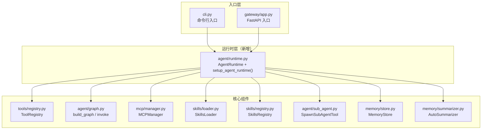
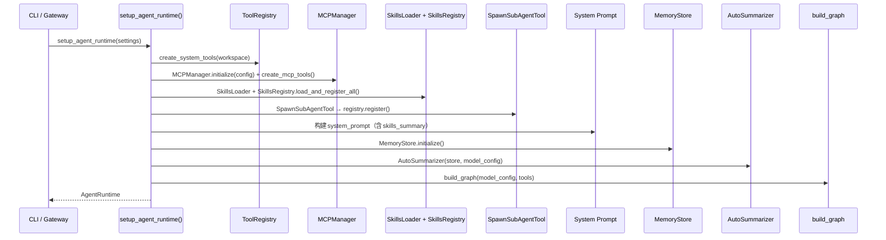
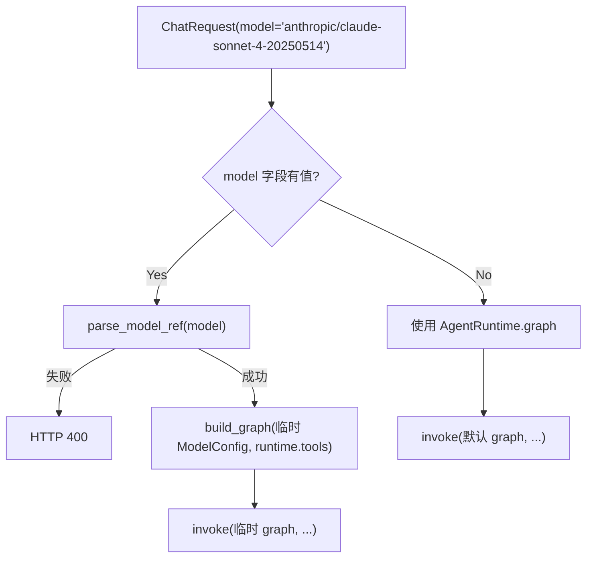

# 设计文档：统一 Agent 运行时 + Gateway 功能对齐

## 概述

本设计通过引入 `AgentRuntime` dataclass 和 `setup_agent_runtime()` 异步工厂函数，将 CLI 和 Gateway 的 Agent 初始化逻辑统一到 `smartclaw/agent/runtime.py` 模块中。

当前问题：
- CLI (`cli.py`) 内联初始化了完整的 P1 功能集（Skills、Sub-Agent、Memory、Summarizer、System Prompt）
- Gateway (`gateway/app.py`) 的 `lifespan()` 仅初始化了系统工具和 MemoryStore，缺少 Skills、Sub-Agent、MCP、Summarizer、System Prompt
- Chat 路由 (`gateway/routers/chat.py`) 调用 `invoke()` 时未传入 `system_prompt` 和 `summarizer`

设计目标：
1. 抽取共享 `setup_agent_runtime(settings)` → `AgentRuntime`，CLI 和 Gateway 统一调用
2. Gateway 获得与 CLI 完全一致的 Agent 能力
3. 支持请求级模型切换（ChatRequest 新增 `model` 可选字段）
4. AgentRuntime 提供 `close()` 方法管理资源生命周期

## 架构

### 整体架构



### 初始化顺序



### 请求级模型切换流程



## 组件与接口

### 1. `smartclaw/agent/runtime.py`（新增文件）

#### AgentRuntime dataclass

```python
@dataclass
class AgentRuntime:
    graph: CompiledStateGraph          # 预编译的 LangGraph
    registry: ToolRegistry             # 工具注册中心
    memory_store: MemoryStore | None   # 内存存储（可选）
    summarizer: AutoSummarizer | None  # 自动摘要器（可选）
    system_prompt: str                 # 系统提示词
    mcp_manager: MCPManager | None     # MCP 管理器（可选）
    model_config: ModelConfig          # 模型配置（用于请求级切换时复用 tools）

    @property
    def tools(self) -> list[BaseTool]:
        """返回 registry 中所有工具。"""
        return self.registry.get_all()

    @property
    def tool_names(self) -> list[str]:
        """返回已排序的工具名称列表。"""
        return self.registry.list_tools()

    async def close(self) -> None:
        """释放所有资源，不抛出异常。"""
        ...
```

#### setup_agent_runtime() 异步函数

```python
async def setup_agent_runtime(
    settings: SmartClawSettings,
    *,
    stream_callback: Callable[[str], None] | None = None,
) -> AgentRuntime:
```

初始化顺序：
1. `create_system_tools(workspace)` → `ToolRegistry`
2. `MCPManager().initialize(settings.mcp)` → `create_mcp_tools(manager)` → 合并到 registry
3. `SkillsLoader` + `SkillsRegistry.load_and_register_all()` → 合并到 registry，获取 `skills_summary`
4. `SpawnSubAgentTool` → `registry.register()`
5. 构建 `system_prompt`（含 skills_summary 注入）
6. `MemoryStore(db_path).initialize()`
7. `AutoSummarizer(store, model_config, ...)`
8. `build_graph(model_config, registry.get_all(), stream_callback)`
9. 返回 `AgentRuntime`

每个步骤的异常处理：记录警告日志，跳过该组件，继续初始化。

### 2. `smartclaw/gateway/app.py`（修改）

`lifespan()` 重构：
- 调用 `setup_agent_runtime(settings)` 获取 `AgentRuntime`
- 将 `runtime` 存储到 `app.state.runtime`
- 保留 `app.state.graph`、`app.state.registry`、`app.state.memory_store` 的兼容性赋值
- shutdown 阶段调用 `runtime.close()`

### 3. `smartclaw/gateway/routers/chat.py`（修改）

- `chat()` 和 `chat_stream()` 从 `app.state.runtime` 获取 `system_prompt` 和 `summarizer`
- 传入 `invoke()` 的 `system_prompt` 和 `summarizer` 参数
- 新增模型切换逻辑：当 `request_body.model` 有值时，`parse_model_ref()` 验证 → `build_graph()` 构建临时 graph

### 4. `smartclaw/gateway/models.py`（修改）

`ChatRequest` 新增字段：
```python
model: str | None = Field(default=None, description="可选模型引用，格式 'provider/model'")
```

### 5. `smartclaw/cli.py`（修改）

`_run_agent_loop()` 重构：
- 根据 `--no-memory`/`--no-skills`/`--no-sub-agent` 参数临时修改 `settings` 的对应 `enabled` 字段
- 调用 `setup_agent_runtime(settings)` 获取 `AgentRuntime`
- 从 `runtime` 读取 graph、memory_store、summarizer、system_prompt
- 交互循环结束后调用 `runtime.close()`

## 数据模型

### AgentRuntime

| 字段 | 类型 | 说明 |
|------|------|------|
| `graph` | `CompiledStateGraph` | 预编译的 LangGraph 状态图 |
| `registry` | `ToolRegistry` | 包含所有工具的注册中心 |
| `memory_store` | `MemoryStore \| None` | SQLite 对话历史存储 |
| `summarizer` | `AutoSummarizer \| None` | LLM 自动摘要器 |
| `system_prompt` | `str` | 完整的系统提示词 |
| `mcp_manager` | `MCPManager \| None` | MCP 服务器连接管理器 |
| `model_config` | `ModelConfig` | 模型配置（primary + fallbacks） |

### ChatRequest（修改后）

| 字段 | 类型 | 默认值 | 说明 |
|------|------|--------|------|
| `message` | `str` | 必填 | 用户消息 |
| `session_key` | `str \| None` | `None` | 会话标识 |
| `max_iterations` | `int \| None` | `None` | 最大迭代次数 |
| `model` | `str \| None` | `None` | 可选模型引用（`provider/model` 格式） |


## 正确性属性

*属性（Property）是指在系统所有合法执行中都应成立的特征或行为——本质上是对系统应做什么的形式化陈述。属性是人类可读规格说明与机器可验证正确性保证之间的桥梁。*

### Property 1: AgentRuntime 结构完整性

*For any* 合法的 SmartClawSettings 配置，调用 `setup_agent_runtime(settings)` 返回的 `AgentRuntime` 对象应始终包含非 None 的 `graph`、`registry`、`system_prompt` 和 `model_config` 字段，且 `registry` 中至少包含 8 个基础系统工具。

**Validates: Requirements 1.1**

### Property 2: 功能开关一致性

*For any* SmartClawSettings 配置：
- 当 `skills.enabled=True` 且存在可加载的 skills 时，返回的 `system_prompt` 应包含 skills 描述信息
- 当 `sub_agent.enabled=True` 时，返回的 `registry` 应包含名为 `spawn_sub_agent` 的工具
- 当 `memory.enabled=True` 时，返回的 `memory_store` 和 `summarizer` 应均为非 None
- 当上述任一功能的 `enabled=False` 时，对应组件应不存在或为 None

**Validates: Requirements 1.3, 1.4, 1.5**

### Property 3: CLI 命令行参数覆盖

*For any* `--no-memory`、`--no-skills`、`--no-sub-agent` 参数的组合，CLI 在调用 `setup_agent_runtime` 前应将 settings 中对应的 `enabled` 字段设为 `False`，使得返回的 AgentRuntime 中对应组件被禁用。

**Validates: Requirements 3.2**

### Property 4: 无模型覆盖时使用默认 graph

*For any* ChatRequest，当 `model` 字段为 `None` 或空字符串时，chat 端点应使用 `AgentRuntime` 中预编译的默认 `graph` 处理请求，不创建临时 graph。

**Validates: Requirements 4.2**

### Property 5: 有效模型覆盖使用相同工具集

*For any* 有效的模型引用字符串（匹配 `provider/model` 格式），chat 端点应使用该模型临时构建 graph，且临时 graph 使用的工具集与 `AgentRuntime.registry` 中的工具集完全一致。

**Validates: Requirements 4.3, 4.6**

### Property 6: 无效模型引用返回错误

*For any* 不符合 `provider/model` 格式的字符串（如空 provider、缺少 `/`、空 model），chat 端点应返回 HTTP 400 状态码。

**Validates: Requirements 4.5**

### Property 7: close() 释放资源

*For any* 已初始化的 AgentRuntime，调用 `close()` 后，其 `memory_store`（如已初始化）的数据库连接应已关闭，`mcp_manager`（如已初始化）的所有服务器连接应已关闭。

**Validates: Requirements 5.2**

### Property 8: close() 异常容错

*For any* AgentRuntime，即使其中某个资源的 `close()` 方法抛出异常，`AgentRuntime.close()` 也不应向调用方传播异常，且应继续清理其余资源。

**Validates: Requirements 5.5**

### Property 9: 初始化确定性

*For any* SmartClawSettings 配置，连续两次调用 `setup_agent_runtime(settings)` 返回的 AgentRuntime 应具有相同的 `tool_names` 列表和相同的 `system_prompt` 内容。

**Validates: Requirements 6.1, 6.2**

### Property 10: Health 端点工具数量一致性

*For any* 已启动的 Gateway 实例，health 端点返回的 `tools_count` 应等于 `AgentRuntime.registry.count`。

**Validates: Requirements 2.5**

## 错误处理

### 初始化阶段错误处理

`setup_agent_runtime()` 采用"尽力初始化"策略，每个组件的初始化失败不影响其他组件：

| 失败组件 | 处理方式 | 影响 |
|----------|----------|------|
| MCPManager | 记录警告，`mcp_manager=None` | MCP 工具不可用，其他工具正常 |
| SkillsLoader/SkillsRegistry | 记录警告，`skills_summary=""` | Skills 工具不可用，system_prompt 无 skills 描述 |
| SpawnSubAgentTool | 记录警告，不注册 | Sub-Agent 功能不可用 |
| MemoryStore | 记录警告，`memory_store=None`，`summarizer=None` | 无对话持久化和摘要 |
| AutoSummarizer | 记录警告，`summarizer=None` | 无自动摘要，memory_store 仍可用 |

### 请求阶段错误处理

| 场景 | 处理方式 |
|------|----------|
| `model` 字段格式无效 | `parse_model_ref()` 抛出 `ValueError`，返回 HTTP 400 |
| 临时 `build_graph()` 失败 | 捕获异常，返回 HTTP 500 |
| `invoke()` 执行异常 | 现有错误处理逻辑不变，返回 HTTP 500 |

### 资源清理错误处理

`AgentRuntime.close()` 使用 try/except 包裹每个资源的关闭操作：

```python
async def close(self) -> None:
    if self.memory_store is not None:
        try:
            await self.memory_store.close()
        except Exception:
            logger.error("memory_store_close_failed", exc_info=True)
    if self.mcp_manager is not None:
        try:
            await self.mcp_manager.close()
        except Exception:
            logger.error("mcp_manager_close_failed", exc_info=True)
```

## 测试策略

### 测试框架

- 单元测试：`pytest` + `pytest-asyncio`
- 属性测试：`hypothesis`（Python 属性测试库）
- Mock：`unittest.mock` / `pytest-mock`

### 属性测试配置

- 每个属性测试最少运行 100 次迭代
- 每个测试用注释标注对应的设计属性
- 标注格式：`# Feature: smartclaw-gateway-full-agent, Property {number}: {property_text}`

### 单元测试

单元测试覆盖以下场景：

1. **AgentRuntime 结构测试**：验证 `setup_agent_runtime()` 返回正确结构
2. **初始化顺序测试**：通过 mock 验证组件初始化的调用顺序
3. **Gateway lifespan 集成测试**：验证 `app.state.runtime` 正确设置
4. **Chat 端点 system_prompt/summarizer 传递测试**：验证 invoke 调用参数
5. **ChatRequest model 字段测试**：验证默认值和序列化
6. **close() 方法测试**：验证资源释放和异常容错
7. **模型切换边界测试**：空字符串、None、有效引用、无效引用

### 属性测试

| 属性 | 测试策略 | 生成器 |
|------|----------|--------|
| Property 1 | 生成随机 SmartClawSettings，验证返回结构 | `st.booleans()` 控制各 enabled 字段 |
| Property 2 | 生成随机 enabled 组合，验证组件存在性 | `st.booleans()` × 4 个功能开关 |
| Property 3 | 生成随机 --no-* 参数组合，验证 settings 修改 | `st.booleans()` × 3 个 CLI 参数 |
| Property 4 | 生成随机 ChatRequest（model=None/""），验证使用默认 graph | `st.one_of(st.none(), st.just(""))` |
| Property 5 | 生成随机有效 model 引用，验证工具集一致 | `st.from_regex(r'[a-z]+/[a-z0-9-]+')` |
| Property 6 | 生成随机无效 model 引用，验证 400 响应 | `st.text()` 过滤掉含 `/` 的有效格式 |
| Property 7 | 生成带/不带 memory_store 和 mcp_manager 的 runtime，验证 close 行为 | `st.booleans()` 控制组件存在性 |
| Property 8 | 生成 close() 会抛异常的 mock 资源，验证不传播 | `st.sampled_from([Exception, RuntimeError, OSError])` |
| Property 9 | 生成随机 settings，两次调用比较结果 | 复用 Property 1 的生成器 |
| Property 10 | 生成不同工具数量的 runtime，验证 health 返回值 | `st.integers(min_value=0, max_value=50)` |

### 测试文件组织

```
tests/
  test_agent_runtime.py          # AgentRuntime 单元测试 + 属性测试
  test_gateway_integration.py    # Gateway lifespan/chat 集成测试
  test_model_override.py         # 模型切换单元测试 + 属性测试
  test_runtime_lifecycle.py      # close() 生命周期测试 + 属性测试
```
