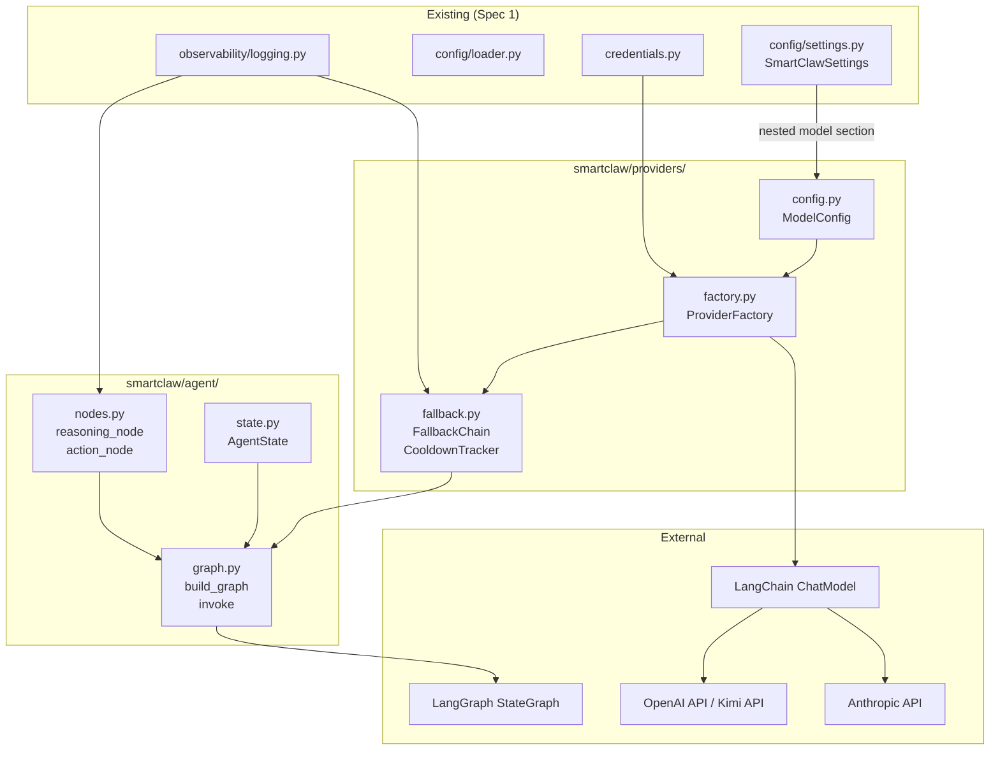
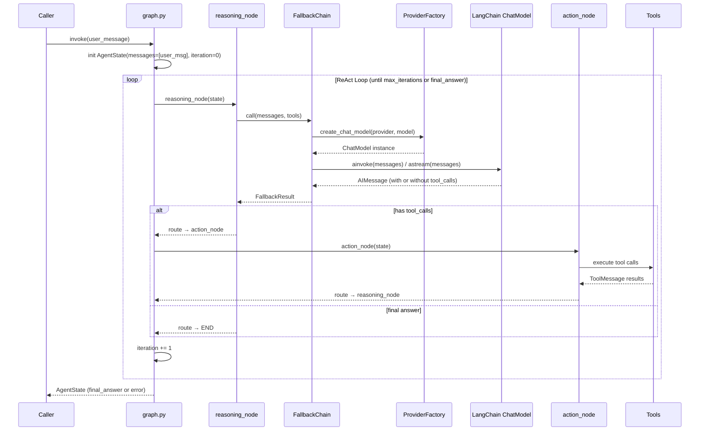

# Design Document: SmartClaw LLM + Agent Core

## Overview

本设计文档定义 SmartClaw 的 LLM 接入层和 Agent 编排核心。模块分为两个子系统：

1. **Providers 子系统** (`smartclaw/providers/`) — LLM 提供商工厂、模型配置、Fallback 容错链、Cooldown 追踪器
2. **Agent 子系统** (`smartclaw/agent/`) — LangGraph ReAct StateGraph、Agent 状态定义、推理/行动/观察节点

设计参考 PicoClaw `pkg/providers/` 的 Provider 工厂 + Fallback 模式，以及 `pkg/agent/loop.go` 的 ReAct 主循环，使用 Python 生态的 LangChain ChatModel + LangGraph StateGraph 实现。

### 关键设计决策

| 决策 | 选择 | 理由 |
|------|------|------|
| LLM 抽象层 | LangChain ChatModel | 统一接口，支持 OpenAI/Anthropic/OpenAI-compatible（Kimi），避免自研 |
| Agent 编排 | LangGraph StateGraph | 官方推荐替代 AgentExecutor，支持有向图、条件路由、状态管理 |
| Fallback 模式 | 自研 FallbackChain（参考 PicoClaw） | LangChain 内置 fallback 不支持 cooldown 和详细 attempt 记录 |
| Cooldown 策略 | 指数退避（参考 PicoClaw） | 标准 1min→5min→25min→1h，billing 5h→10h→20h→24h |
| 流式响应 | LangChain streaming + callback | 累积文本回调（非 delta），简化下游消费 |
| 多模态 | LangChain HumanMessage content list | 原生支持 text + image_url 混合内容块 |
| 状态定义 | TypedDict | LangGraph 原生支持，类型安全 |

## Architecture



### 请求流程



## Components and Interfaces

### 1. Provider Factory (`smartclaw/providers/factory.py`)

```python
class ProviderFactory:
    """LLM 提供商工厂，根据 provider 名称创建 LangChain ChatModel 实例。"""

    @staticmethod
    def create(
        provider: str,
        model: str,
        *,
        api_key: str | None = None,
        api_base: str | None = None,
        temperature: float = 0.0,
        max_tokens: int = 32768,
        streaming: bool = False,
    ) -> BaseChatModel:
        """创建 ChatModel 实例。

        支持的 provider:
        - "openai" → ChatOpenAI
        - "anthropic" → ChatAnthropic
        - "kimi" → ChatOpenAI (with Kimi base_url)

        Raises:
            ValueError: 未知 provider 名称
        """
        ...
```

### 2. Model Configuration (`smartclaw/providers/config.py`)

```python
class ModelConfig(BaseSettings):
    """模型配置，嵌套在 SmartClawSettings.model 下。"""

    primary: str = "kimi/moonshot-v1-auto"
    fallbacks: list[str] = ["openai/gpt-4o", "anthropic/claude-sonnet-4-20250514"]
    temperature: float = 0.0
    max_tokens: int = 32768

def parse_model_ref(raw: str) -> tuple[str, str]:
    """解析 'provider/model' 格式字符串，返回 (provider, model)。"""
    ...
```

### 3. Fallback Chain (`smartclaw/providers/fallback.py`)

```python
class FailoverReason(str, Enum):
    AUTH = "auth"
    RATE_LIMIT = "rate_limit"
    TIMEOUT = "timeout"
    FORMAT = "format"
    OVERLOADED = "overloaded"
    UNKNOWN = "unknown"

class FallbackCandidate(NamedTuple):
    provider: str
    model: str

class FallbackAttempt:
    provider: str
    model: str
    error: Exception | None
    reason: FailoverReason | None
    duration: timedelta
    skipped: bool

class FallbackResult:
    response: AIMessage
    provider: str
    model: str
    attempts: list[FallbackAttempt]

class FallbackExhaustedError(Exception):
    attempts: list[FallbackAttempt]

class CooldownTracker:
    """线程安全的 per-provider 冷却追踪器。指数退避。"""

    def mark_failure(self, provider: str, reason: FailoverReason) -> None: ...
    def mark_success(self, provider: str) -> None: ...
    def is_available(self, provider: str) -> bool: ...
    def cooldown_remaining(self, provider: str) -> timedelta: ...

class FallbackChain:
    """模型容错链，按优先级尝试候选模型。"""

    async def execute(
        self,
        candidates: list[FallbackCandidate],
        run: Callable[[str, str], Awaitable[AIMessage]],
    ) -> FallbackResult:
        """执行 fallback 链。

        - cooldown 中的 provider 跳过
        - 非 retriable 错误（format）立即中止
        - retriable 错误尝试下一个候选
        - 成功重置 cooldown
        - 全部失败抛出 FallbackExhaustedError
        """
        ...
```

### 4. Agent State (`smartclaw/agent/state.py`)

```python
class AgentState(TypedDict):
    """LangGraph StateGraph 状态 schema。"""

    messages: Annotated[list[BaseMessage], add_messages]
    iteration: int
    max_iterations: int
    final_answer: str | None
    error: str | None
```

### 5. Agent Nodes (`smartclaw/agent/nodes.py`)

```python
async def reasoning_node(state: AgentState, config: RunnableConfig) -> dict:
    """推理节点：调用 LLM（经 FallbackChain），返回 AIMessage。"""
    ...

async def action_node(state: AgentState, config: RunnableConfig) -> dict:
    """行动节点：执行 tool calls，返回 ToolMessage 列表。"""
    ...

def should_continue(state: AgentState) -> str:
    """条件路由：有 tool_calls → 'action'，否则 → 'end'。"""
    ...
```

### 6. Agent Graph (`smartclaw/agent/graph.py`)

```python
def build_graph(
    model_config: ModelConfig,
    tools: list[BaseTool],
    stream_callback: Callable[[str], None] | None = None,
) -> CompiledGraph:
    """构建编译后的 LangGraph StateGraph。

    内部使用 ProviderFactory + FallbackChain。
    """
    ...

async def invoke(
    graph: CompiledGraph,
    user_message: str,
    *,
    max_iterations: int | None = None,
) -> AgentState:
    """运行 agent graph，返回最终 AgentState。"""
    ...

def create_vision_message(
    text: str,
    image_base64: str,
    media_type: str = "image/png",
) -> HumanMessage:
    """构造多模态消息（text + base64 image）。"""
    ...
```

## Data Models

### ModelConfig Pydantic Schema

```python
class ModelConfig(BaseSettings):
    """嵌套在 SmartClawSettings 中的模型配置。

    YAML 示例:
        model:
          primary: "kimi/moonshot-v1-auto"
          fallbacks:
            - "openai/gpt-4o"
            - "anthropic/claude-sonnet-4-20250514"
          temperature: 0.0
          max_tokens: 32768

    环境变量覆盖:
        SMARTCLAW_MODEL__PRIMARY=openai/gpt-4o
        SMARTCLAW_MODEL__TEMPERATURE=0.5
    """

    primary: str = Field(
        default="kimi/moonshot-v1-auto",
        description="默认模型，格式 'provider/model'"
    )
    fallbacks: list[str] = Field(
        default=["openai/gpt-4o", "anthropic/claude-sonnet-4-20250514"],
        description="备选模型列表，按优先级排序"
    )
    temperature: float = Field(default=0.0, ge=0.0, le=2.0)
    max_tokens: int = Field(default=32768, gt=0)
```

### SmartClawSettings 扩展

```python
class SmartClawSettings(BaseSettings):
    # ... existing fields from Spec 1 ...
    model: ModelConfig = Field(default_factory=ModelConfig)
```

### AgentState TypedDict

```python
class AgentState(TypedDict):
    messages: Annotated[list[BaseMessage], add_messages]  # LangGraph reducer
    iteration: int          # 当前循环计数
    max_iterations: int     # 上限（默认从 settings.agent_defaults.max_tool_iterations）
    final_answer: str | None  # 最终文本响应
    error: str | None         # 异常终止时的错误信息
```

### FailoverError / FallbackAttempt

```python
@dataclass
class FailoverError(Exception):
    reason: FailoverReason
    provider: str
    model: str
    status: int | None = None
    wrapped: Exception | None = None

    def is_retriable(self) -> bool:
        return self.reason != FailoverReason.FORMAT

@dataclass
class FallbackAttempt:
    provider: str
    model: str
    error: Exception | None = None
    reason: FailoverReason | None = None
    duration: timedelta = field(default_factory=lambda: timedelta(0))
    skipped: bool = False
```

### CooldownEntry (Internal)

```python
@dataclass
class _CooldownEntry:
    error_count: int = 0
    failure_counts: dict[FailoverReason, int] = field(default_factory=dict)
    cooldown_end: float = 0.0      # monotonic timestamp
    last_failure: float = 0.0      # monotonic timestamp
```

### Cooldown 指数退避公式（参考 PicoClaw）

- 标准冷却: `min(1h, 1min × 5^min(n-1, 3))`
  - 1 error → 1 min, 2 → 5 min, 3 → 25 min, 4+ → 1 hour
- Billing 冷却: `min(24h, 5h × 2^min(n-1, 10))`


## Correctness Properties

*A property is a characteristic or behavior that should hold true across all valid executions of a system — essentially, a formal statement about what the system should do. Properties serve as the bridge between human-readable specifications and machine-verifiable correctness guarantees.*

### Property 1: Factory creates correctly configured ChatModel instances

*For any* valid provider name in {"openai", "anthropic", "kimi"}, and *for any* valid temperature in [0.0, 2.0], max_tokens > 0, and streaming boolean, the ProviderFactory.create() method should return a ChatModel instance of the correct subclass (ChatOpenAI for openai/kimi, ChatAnthropic for anthropic) with the specified temperature, max_tokens, and streaming parameters reflected on the instance.

**Validates: Requirements 1.1, 1.4, 4.1**

### Property 2: Factory rejects unknown provider names

*For any* string that is not in the set {"openai", "anthropic", "kimi"}, calling ProviderFactory.create() should raise a ValueError whose message contains the unknown provider name.

**Validates: Requirements 1.2**

### Property 3: Model reference round-trip parsing

*For any* non-empty provider string (containing no "/") and non-empty model string (containing no "/"), calling `parse_model_ref(f"{provider}/{model}")` should return the tuple `(provider, model)` exactly.

**Validates: Requirements 2.1**

### Property 4: Environment variable overrides model configuration

*For any* ModelConfig field name in {"primary", "temperature", "max_tokens"} and a valid value for that field, setting the environment variable `SMARTCLAW_MODEL__{FIELD_NAME}` (uppercase) before constructing SmartClawSettings should produce a settings instance where `settings.model.{field}` equals the overridden value.

**Validates: Requirements 2.4**

### Property 5: Fallback chain execution order and attempt recording

*For any* non-empty list of FallbackCandidates and *for any* failure pattern where the first K candidates fail with retriable errors and candidate K+1 succeeds (or all fail), the FallbackChain should: (a) try candidates in list order, (b) skip candidates in cooldown, (c) record exactly one FallbackAttempt per candidate tried or skipped, and (d) raise FallbackExhaustedError with all attempts if all candidates fail.

**Validates: Requirements 3.1, 3.3, 3.6, 3.8**

### Property 6: Non-retriable errors abort fallback immediately

*For any* list of FallbackCandidates where candidate at index I fails with a FailoverReason.FORMAT error, the FallbackChain should abort immediately without trying candidates at index > I, and the raised FailoverError should have reason == FORMAT.

**Validates: Requirements 3.2**

### Property 7: Error classification maps to correct FailoverReason

*For any* HTTP status code and error message pair, the classify_error function should return a FailoverReason where: 401/403 → AUTH, 429 → RATE_LIMIT, timeout exceptions → TIMEOUT, 400 with format indicators → FORMAT, 503/529 → OVERLOADED, and all others → UNKNOWN.

**Validates: Requirements 3.4**

### Property 8: Cooldown tracker round-trip (failure then success resets)

*For any* provider name string, after calling mark_failure() N times (N >= 1), is_available() should return False (provider in cooldown). After subsequently calling mark_success(), is_available() should return True and cooldown_remaining() should return timedelta(0).

**Validates: Requirements 3.5, 3.7**

### Property 9: Streaming callback receives accumulated text

*For any* sequence of token chunks [c1, c2, ..., cN], the Stream_Callback should be invoked with accumulated strings where each invocation's text is a prefix of or equal to the final complete response text, and the sequence of accumulated lengths is monotonically non-decreasing.

**Validates: Requirements 4.3**

### Property 10: Agent routing determined by tool_calls presence

*For any* AIMessage returned by the LLM, the should_continue routing function should return "action" if the message contains one or more tool_calls, and "end" if the message contains zero tool_calls.

**Validates: Requirements 6.3, 6.4**

### Property 11: Action node produces matching ToolMessages

*For any* AgentState containing an AIMessage with N tool_calls (N >= 1), the action_node should append exactly N ToolMessage objects to the state's messages list, one per tool_call_id.

**Validates: Requirements 6.5**

### Property 12: Max iterations bounds the agent loop

*For any* max_iterations value M (M >= 1), the agent graph should execute at most M reasoning iterations before terminating, regardless of whether the LLM continues to produce tool_calls.

**Validates: Requirements 6.7**

### Property 13: Invoke initializes state correctly

*For any* non-empty user message string, calling invoke() should produce an initial AgentState where messages[0] is a HumanMessage containing the user message text, and iteration == 0.

**Validates: Requirements 7.3**

### Property 14: Vision message construction

*For any* non-empty text string, non-empty base64 image string, and valid media_type string, create_vision_message() should return a HumanMessage whose content list contains exactly 2 blocks: one text block with the input text, and one image_url block containing a data URI with the specified media_type and base64 data.

**Validates: Requirements 8.2, 8.7**

## Error Handling

### Provider Factory 错误

| 场景 | 错误类型 | 处理方式 |
|------|---------|---------|
| 未知 provider 名称 | `ValueError` | 包含 provider 名称的错误消息，调用方决定是否 fallback |
| API key 未找到 | `CredentialNotFoundError` | 由 credentials.py 抛出，Factory 不捕获，透传给调用方 |
| LangChain 初始化失败 | `Exception` (各种) | 包装为 `ProviderInitError`，记录日志 |

### Fallback Chain 错误

| 场景 | 错误类型 | 处理方式 |
|------|---------|---------|
| 所有候选失败 | `FallbackExhaustedError` | 包含所有 attempt 详情，调用方可检查每个 attempt 的 reason |
| 非 retriable 错误 | `FailoverError(reason=FORMAT)` | 立即中止，不尝试后续候选 |
| 空候选列表 | `ValueError` | 立即抛出 |
| 请求被取消 | `asyncio.CancelledError` | 立即中止，不 fallback |

### Agent Graph 错误

| 场景 | 错误类型 | 处理方式 |
|------|---------|---------|
| LLM 调用失败（所有 fallback 耗尽） | `FallbackExhaustedError` | 存入 `AgentState.error`，路由到 END |
| 工具执行异常 | `ToolExecutionError` | 将错误信息作为 ToolMessage 返回给 LLM，让 LLM 决定下一步 |
| 达到 max_iterations | 正常终止 | 将最后一次 LLM 响应作为 final_answer |
| 节点未处理异常 | `Exception` | 捕获，存入 `AgentState.error`，路由到 END |
| 流式连接中断 | `StreamInterruptedError` | 视为失败 attempt，触发 fallback |

### 错误分类映射（classify_error）

```python
def classify_error(error: Exception, provider: str, model: str) -> FailoverError:
    """将 LLM 调用异常分类为 FailoverReason。

    映射规则:
    - HTTP 401/403 → AUTH
    - HTTP 429 → RATE_LIMIT
    - Timeout / ConnectTimeout → TIMEOUT
    - HTTP 400 + format indicators → FORMAT
    - HTTP 503/529 → OVERLOADED
    - 其他 → UNKNOWN
    """
```

## Testing Strategy

### 测试框架

- **单元测试**: pytest + pytest-asyncio
- **属性测试**: hypothesis（已在 pyproject.toml dev 依赖中）
- **Mock**: unittest.mock（标准库）+ pytest-mock

### 属性测试配置

- 每个属性测试最少运行 **100 次迭代**（`@settings(max_examples=100)`）
- 每个属性测试必须用注释标注对应的设计属性
- 标注格式: `# Feature: smartclaw-llm-agent-core, Property {N}: {title}`

### 双轨测试策略

#### 属性测试（Property-Based Tests）

每个 Correctness Property 对应一个 hypothesis 属性测试：

| Property | 测试文件 | 生成器策略 |
|----------|---------|-----------|
| P1: Factory 创建实例 | `tests/providers/test_factory_props.py` | `st.sampled_from(["openai","anthropic","kimi"])`, `st.floats(0.0, 2.0)`, `st.integers(1, 131072)`, `st.booleans()` |
| P2: Factory 拒绝未知 | `tests/providers/test_factory_props.py` | `st.text().filter(lambda s: s not in VALID_PROVIDERS)` |
| P3: Model ref 解析 | `tests/providers/test_config_props.py` | `st.text(min_size=1).filter(lambda s: "/" not in s)` for provider and model |
| P4: 环境变量覆盖 | `tests/providers/test_config_props.py` | `st.sampled_from(OVERRIDABLE_FIELDS)`, field-specific value strategies |
| P5: Fallback 执行顺序 | `tests/providers/test_fallback_props.py` | `st.lists(st.tuples(st.text(), st.text()), min_size=1, max_size=5)`, `st.integers()` for success index |
| P6: 非 retriable 中止 | `tests/providers/test_fallback_props.py` | candidate lists + random format error position |
| P7: 错误分类 | `tests/providers/test_fallback_props.py` | `st.sampled_from(STATUS_CODES)`, `st.text()` for error messages |
| P8: Cooldown 往返 | `tests/providers/test_cooldown_props.py` | `st.text(min_size=1)` for provider, `st.integers(1, 10)` for failure count |
| P9: 流式累积文本 | `tests/agent/test_graph_props.py` | `st.lists(st.text(min_size=1), min_size=1)` for token chunks |
| P10: 路由决策 | `tests/agent/test_nodes_props.py` | `st.booleans()` for has_tool_calls, `st.lists()` for tool_calls |
| P11: Action 产出 ToolMessages | `tests/agent/test_nodes_props.py` | `st.lists(st.text(), min_size=1, max_size=5)` for tool call IDs |
| P12: 迭代上限 | `tests/agent/test_graph_props.py` | `st.integers(1, 20)` for max_iterations |
| P13: Invoke 初始化 | `tests/agent/test_graph_props.py` | `st.text(min_size=1)` for user messages |
| P14: Vision 消息构造 | `tests/agent/test_graph_props.py` | `st.text(min_size=1)`, `st.binary().map(base64.b64encode)`, `st.sampled_from(MEDIA_TYPES)` |

#### 单元测试（Unit Tests）

单元测试覆盖具体示例、边界条件和集成点：

| 测试文件 | 覆盖内容 |
|---------|---------|
| `tests/providers/test_factory.py` | 各 provider 具体实例类型验证（1.5, 1.6, 1.7）、API key 读取（1.3）、Kimi base_url 验证 |
| `tests/providers/test_config.py` | ModelConfig 默认值（2.5, 2.6）、嵌套在 Settings 中（2.3）、fallbacks 列表（2.2） |
| `tests/providers/test_fallback.py` | 空候选列表（3.9）、单候选成功、上下文取消 |
| `tests/providers/test_cooldown.py` | 初始可用、并发安全、多 provider 隔离 |
| `tests/agent/test_state.py` | AgentState 字段存在性（5.1-5.6）、TypedDict 兼容性 |
| `tests/agent/test_nodes.py` | 推理节点 mock LLM 调用（6.2）、action 后路由回 reasoning（6.6）、异常处理（6.9） |
| `tests/agent/test_graph.py` | build_graph API（7.1, 7.5）、invoke API（7.2）、日志集成（7.4）、非流式返回（4.4）、流式回调（4.2）、流式中断（4.5） |
| `tests/agent/test_vision.py` | 各 provider Vision 支持（8.1, 8.4, 8.5, 8.6）、混合内容状态（8.3） |

### 测试目录结构

```
smartclaw/tests/
├── providers/
│   ├── test_factory.py          # 单元测试
│   ├── test_factory_props.py    # 属性测试 (P1, P2)
│   ├── test_config.py           # 单元测试
│   ├── test_config_props.py     # 属性测试 (P3, P4)
│   ├── test_fallback.py         # 单元测试
│   ├── test_fallback_props.py   # 属性测试 (P5, P6, P7)
│   ├── test_cooldown.py         # 单元测试
│   └── test_cooldown_props.py   # 属性测试 (P8)
├── agent/
│   ├── test_state.py            # 单元测试
│   ├── test_nodes.py            # 单元测试
│   ├── test_nodes_props.py      # 属性测试 (P10, P11)
│   ├── test_graph.py            # 单元测试
│   ├── test_graph_props.py      # 属性测试 (P9, P12, P13, P14)
│   └── test_vision.py           # 单元测试
```

### Mock 策略

- **LLM 调用**: 使用 `unittest.mock.AsyncMock` 模拟 `ChatModel.ainvoke()` / `ChatModel.astream()`
- **工具执行**: 使用 `@tool` 装饰的简单函数作为测试工具
- **凭证**: 通过环境变量注入测试 API key，不依赖真实 keyring
- **时间**: CooldownTracker 接受可注入的 `now_func`（参考 PicoClaw 的 `nowFunc`），属性测试中使用固定时间
