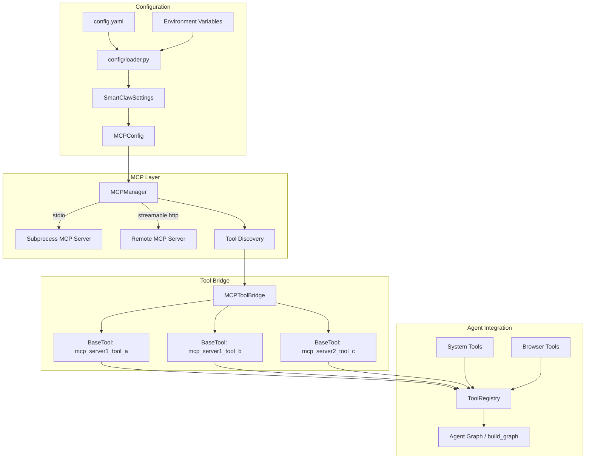

# Design Document: SmartClaw MCP Protocol Integration

## Overview

This design describes how SmartClaw integrates with the Model Context Protocol (MCP) ecosystem. The implementation adds two new modules — `smartclaw/mcp/manager.py` (MCP Manager) and `smartclaw/tools/mcp_tool.py` (MCP Tool Bridge) — that together enable SmartClaw to connect to external MCP servers, discover their tools, and expose them as LangChain `BaseTool` instances within the existing Agent Graph.

The design follows the proven architecture from picoclaw's Go implementation (`picoclaw/pkg/mcp/manager.go`, `picoclaw/pkg/tools/mcp_tool.go`) while adapting it to Python idioms, the `mcp` Python SDK (>=2.1), Pydantic Settings, and LangChain's tool abstraction.

### Key Design Decisions

1. **Use the official `mcp` Python SDK** — The SDK provides `StdioServerParameters`, `streamablehttp_client()`, and `ClientSession` out of the box. We do not reimplement protocol-level logic.
2. **Async-first** — All MCP operations (connect, list_tools, call_tool, close) are async, matching SmartClaw's existing async Agent Graph.
3. **Graceful degradation** — Partial server failures during startup do not block the agent. Only when *all* enabled servers fail does initialization raise an error.
4. **Atomic closed flag + in-flight tracking** — Mirrors picoclaw's `atomic.Bool` + `sync.WaitGroup` pattern using `asyncio.Event` and a semaphore counter to ensure clean shutdown.
5. **Pydantic config models** — `MCPConfig` and `MCPServerConfig` are Pydantic `BaseModel` subclasses integrated into the existing `SmartClawSettings`, supporting YAML + env var overrides.

## Architecture



## Components and Interfaces

### 1. `MCPServerConfig` (Pydantic Model)

Location: `smartclaw/mcp/config.py`

Represents the configuration for a single MCP server entry.

```python
class MCPServerConfig(BaseModel):
    enabled: bool = True
    type: str | None = None          # "stdio", "http", "sse", or None (auto-detect)
    command: str | None = None       # Executable for stdio transport
    args: list[str] = []             # CLI args for stdio transport
    env: dict[str, str] = {}         # Extra env vars for stdio subprocess
    env_file: str | None = None      # Path to .env file for stdio subprocess
    url: str | None = None           # URL for Streamable HTTP transport
    headers: dict[str, str] = {}     # HTTP headers for Streamable HTTP transport
```

### 2. `MCPConfig` (Pydantic Model)

Location: `smartclaw/mcp/config.py`

Top-level MCP configuration section.

```python
class MCPConfig(BaseModel):
    enabled: bool = False
    servers: dict[str, MCPServerConfig] = {}
```

### 3. `MCPManager`

Location: `smartclaw/mcp/manager.py`

Central component managing MCP server connections, tool discovery, and tool invocation.

```python
class MCPManager:
    async def initialize(self, config: MCPConfig) -> None: ...
    async def close(self) -> None: ...
    async def call_tool(self, server_name: str, tool_name: str, arguments: dict[str, Any]) -> str: ...
    def get_all_tools(self) -> dict[str, list[mcp.types.Tool]]: ...
    def get_connected_servers(self) -> list[str]: ...
```

**Internal state:**
- `_servers: dict[str, ServerConnection]` — maps server name to connection info (client session + discovered tools)
- `_closed: bool` — atomic-like flag preventing new calls after close
- `_in_flight: int` — counter of in-flight `call_tool` calls (protected by asyncio.Lock)
- `_in_flight_zero: asyncio.Event` — signaled when in-flight count reaches zero

**Lifecycle:**
1. `initialize()` — iterates enabled servers, detects transport, connects concurrently via `asyncio.gather`, discovers tools per server.
2. `call_tool()` — checks closed flag, increments in-flight counter, delegates to the correct `ClientSession.call_tool()`, decrements counter.
3. `close()` — sets closed flag, waits for in-flight calls to drain, closes all sessions.

### 4. `ServerConnection` (Internal dataclass)

```python
@dataclass
class ServerConnection:
    name: str
    session: ClientSession
    tools: list[mcp.types.Tool]
    # Context managers for cleanup
    _client_cm: AbstractAsyncContextManager
    _session_cm: AbstractAsyncContextManager
```

### 5. Transport Detection

Location: within `MCPManager._connect_server()`

```
detect_transport(config: MCPServerConfig) -> Literal["stdio", "http"]
```

Logic (mirrors picoclaw):
1. If `type` is explicitly set → use it (map "sse" to "http" internally since the SDK uses `streamablehttp_client` for both).
2. If `url` is present and no `type` → auto-detect as "http".
3. If `command` is present, no `url`, no `type` → auto-detect as "stdio".
4. If neither `url` nor `command` → raise `ValueError`.

### 6. `MCPToolBridge`

Location: `smartclaw/tools/mcp_tool.py`

Wraps a single MCP tool as a LangChain `BaseTool`.

```python
class MCPToolBridge(BaseTool):
    name: str                    # "mcp_{server}_{tool}", sanitized, max 64 chars
    description: str             # "[MCP:{server}] {tool_description}"
    args_schema: type[BaseModel] # Dynamically generated from MCP input schema

    async def _arun(self, **kwargs: Any) -> str: ...
    def _run(self, **kwargs: Any) -> str: ...  # raises NotImplementedError
```

**Name sanitization** (matches picoclaw `sanitizeIdentifierComponent`):
- Lowercase
- Replace disallowed chars (not `[a-z0-9_-]`) with `_`
- Collapse consecutive `_`
- Trim leading/trailing `_`
- If sanitization is lossy or total length > 64, truncate and append `_` + 8-char FNV-1a hash of original names

**Schema conversion:**
- The MCP tool's `inputSchema` (JSON Schema dict) is converted to a dynamic Pydantic `BaseModel` using `pydantic.create_model()` with field types inferred from the JSON Schema `type` field.
- For complex schemas, falls back to a model with a single `arguments: dict[str, Any]` field.

### 7. `create_mcp_tools()` (Factory function)

Location: `smartclaw/tools/mcp_tool.py`

```python
def create_mcp_tools(manager: MCPManager) -> list[BaseTool]:
    """Create BaseTool instances for all discovered MCP tools."""
```

Iterates `manager.get_all_tools()`, creates one `MCPToolBridge` per tool, returns the flat list.

### 8. Integration with `create_all_tools()`

The existing `smartclaw/agent/graph.py::create_all_tools()` is extended to accept an optional `MCPManager`, call `create_mcp_tools()`, and merge the results into the `ToolRegistry`.

```python
def create_all_tools(
    browser_tools: list[BaseTool],
    workspace: str,
    *,
    path_policy: PathPolicy | None = None,
    mcp_manager: MCPManager | None = None,
) -> list[BaseTool]:
```

### 9. Integration with `SmartClawSettings`

The existing `SmartClawSettings` gains an `mcp` field:

```python
class SmartClawSettings(BaseSettings):
    ...
    mcp: MCPConfig = Field(default_factory=MCPConfig)
```

This supports env var overrides like `SMARTCLAW_MCP__ENABLED=true` and `SMARTCLAW_MCP__SERVERS__myserver__COMMAND=npx`.

## Data Models

### MCPServerConfig

| Field     | Type                    | Default | Description                                      |
|-----------|-------------------------|---------|--------------------------------------------------|
| enabled   | `bool`                  | `True`  | Whether this server is active                    |
| type      | `str \| None`           | `None`  | Transport type: "stdio", "http", "sse", or auto  |
| command   | `str \| None`           | `None`  | Executable path for stdio transport              |
| args      | `list[str]`             | `[]`    | CLI arguments for stdio subprocess               |
| env       | `dict[str, str]`        | `{}`    | Extra environment variables for subprocess       |
| env_file  | `str \| None`           | `None`  | Path to .env file for subprocess env vars        |
| url       | `str \| None`           | `None`  | URL for Streamable HTTP transport                |
| headers   | `dict[str, str]`        | `{}`    | HTTP headers for Streamable HTTP requests        |

### MCPConfig

| Field   | Type                              | Default | Description                          |
|---------|-----------------------------------|---------|--------------------------------------|
| enabled | `bool`                            | `False` | Global MCP integration toggle        |
| servers | `dict[str, MCPServerConfig]`      | `{}`    | Named server configurations          |

### ServerConnection (internal)

| Field       | Type                              | Description                              |
|-------------|-----------------------------------|------------------------------------------|
| name        | `str`                             | Server name from config key              |
| session     | `ClientSession`                   | Active MCP client session                |
| tools       | `list[mcp.types.Tool]`            | Discovered tools from this server        |
| _client_cm  | `AbstractAsyncContextManager`     | Context manager for client cleanup       |
| _session_cm | `AbstractAsyncContextManager`     | Context manager for session cleanup      |


## Correctness Properties

*A property is a characteristic or behavior that should hold true across all valid executions of a system — essentially, a formal statement about what the system should do. Properties serve as the bridge between human-readable specifications and machine-verifiable correctness guarantees.*

### Property 1: Transport detection correctness

*For any* `MCPServerConfig`, `detect_transport()` shall return the correct transport type following this priority: if `type` is explicitly set, use it (mapping "sse" to "http"); otherwise if `url` is present, return "http"; otherwise if `command` is present, return "stdio"; otherwise raise `ValueError`.

**Validates: Requirements 2.1, 3.1, 3.2, 4.1, 4.2, 4.3**

### Property 2: Initialization connects exactly the enabled and successful servers

*For any* `MCPConfig` containing a mix of enabled and disabled servers where some enabled servers succeed and some fail, after `initialize()`, `get_connected_servers()` shall return exactly the set of server names that were both enabled and successfully connected.

**Validates: Requirements 1.1, 1.2, 1.4, 1.7**

### Property 3: Close releases all sessions

*For any* `MCPManager` with one or more connected servers, calling `close()` shall close every active session, leaving zero open sessions.

**Validates: Requirements 1.5**

### Property 4: Close prevents new tool calls

*For any* `MCPManager` that has been closed, every subsequent `call_tool()` invocation shall return an error string (not raise an unhandled exception), regardless of the server name or arguments provided.

**Validates: Requirements 9.4**

### Property 5: Tool name sanitization invariants

*For any* server name and tool name strings, the sanitized tool name produced by `MCPToolBridge` shall: (a) match the pattern `^[a-z0-9_-]+$`, (b) be at most 64 characters long, (c) start with `mcp_`, and (d) two distinct (server_name, tool_name) pairs shall produce distinct sanitized names.

**Validates: Requirements 6.2, 6.3**

### Property 6: Tool description format

*For any* MCP tool with a non-empty description, the `MCPToolBridge` description shall equal `"[MCP:{server_name}] {tool_description}"`. For any MCP tool with an empty or missing description, the description shall equal `"[MCP:{server_name}] MCP tool from {server_name} server"`.

**Validates: Requirements 6.4, 6.5**

### Property 7: Tool bridge creation count

*For any* `MCPManager` with discovered tools, `create_mcp_tools()` shall return exactly one `BaseTool` instance per discovered MCP tool across all connected servers.

**Validates: Requirements 6.1**

### Property 8: Tool call delegation correctness

*For any* `MCPToolBridge` instance, when `_arun()` is called with arguments, it shall invoke `MCPManager.call_tool()` with the original (unsanitized) server name, original tool name, and the exact arguments passed in.

**Validates: Requirements 6.7**

### Property 9: Text content extraction

*For any* list of MCP text content parts, the `MCPToolBridge` shall return a string equal to the text values joined by newline characters.

**Validates: Requirements 6.9**

### Property 10: Environment variable merge precedence

*For any* combination of parent process environment, env_file contents, and `env` mapping, the resulting subprocess environment shall reflect the precedence order: parent env < env_file < env mapping (i.e., `env` mapping values override env_file values, which override parent env values).

**Validates: Requirements 2.4, 2.5**

### Property 11: Tool discovery grouping

*For any* set of connected MCP servers, `get_all_tools()` shall return a mapping where each key is a connected server name and each value is the complete list of tools advertised by that server (empty list if the server advertises no tools).

**Validates: Requirements 5.1, 5.2, 5.3, 5.4**

### Property 12: Pydantic validation rejects invalid types

*For any* input dict containing a field with an invalid type for `MCPConfig` or `MCPServerConfig` (e.g., `enabled` as a non-bool-coercible string, `args` as a non-list), Pydantic model construction shall raise a `ValidationError`.

**Validates: Requirements 7.5**

### Property 13: Registry merge includes all tool sources

*For any* combination of browser tools, system tools, and MCP tools passed to `create_all_tools()`, the resulting `ToolRegistry` shall contain every tool from all three sources (with last-registered-wins for name collisions).

**Validates: Requirements 8.1, 8.2**

### Property 14: Schema conversion produces BaseModel

*For any* MCP tool input schema (valid JSON Schema dict), the `MCPToolBridge` shall produce an `args_schema` that is a subclass of Pydantic `BaseModel`.

**Validates: Requirements 6.6**

## Error Handling

### Manager-Level Errors

| Scenario | Behavior |
|---|---|
| All enabled servers fail to connect | `initialize()` raises `MCPInitializationError` with aggregated failure reasons |
| Some servers fail to connect | Log warnings per failed server, continue with successful ones |
| `call_tool()` after `close()` | Return error string: `"Error: MCP manager is closed"` |
| `call_tool()` to unknown server | Return error string: `"Error: MCP server '{name}' not found"` |
| `call_tool()` to disconnected server | Return error string: `"Error: MCP server '{name}' is disconnected"` |
| Server subprocess crashes post-connect | Log error, mark server as disconnected in `_servers` dict |
| `env_file` path does not exist | Raise `FileNotFoundError` with the missing path during `_connect_server()` |

### Tool Bridge-Level Errors

| Scenario | Behavior |
|---|---|
| MCP server returns `is_error=True` | Return the error content text as a string to the Agent |
| MCP tool call raises exception | Catch, log via structlog, return `"Error: {exception_message}"` |
| Schema conversion fails | Fall back to `dict[str, Any]` args_schema |

### Exception Hierarchy

```python
class MCPError(Exception):
    """Base exception for MCP integration errors."""

class MCPInitializationError(MCPError):
    """Raised when all enabled MCP servers fail to connect."""

class MCPTransportError(MCPError):
    """Raised when transport detection or connection fails for a single server."""
```

All errors returned to the Agent Graph are plain strings (not exceptions), following the existing `SmartClawTool._safe_run()` pattern. Exceptions are only raised during initialization when the system cannot proceed.

## Testing Strategy

### Property-Based Testing

Library: **Hypothesis** (already in `dev` dependencies: `hypothesis>=6.98.0`)

Each correctness property maps to a single Hypothesis `@given` test with a minimum of 100 examples. Tests are tagged with comments referencing the design property.

Key generators needed:
- `st_mcp_server_config()` — generates random `MCPServerConfig` instances with valid field combinations
- `st_mcp_config()` — generates random `MCPConfig` with a mix of enabled/disabled servers
- `st_server_name()` — generates random server name strings (ASCII, unicode, empty, long)
- `st_tool_name()` — generates random tool name strings
- `st_json_schema()` — generates simple JSON Schema dicts for input schemas
- `st_env_mapping()` — generates random `dict[str, str]` for environment variables
- `st_text_content_parts()` — generates lists of MCP text content objects

Property test files:
- `tests/mcp/test_transport_detection_props.py` — Property 1
- `tests/mcp/test_manager_props.py` — Properties 2, 3, 4, 11
- `tests/mcp/test_tool_bridge_props.py` — Properties 5, 6, 7, 8, 9, 14
- `tests/mcp/test_env_merge_props.py` — Property 10
- `tests/mcp/test_config_props.py` — Property 12
- `tests/mcp/test_integration_props.py` — Property 13

Each test tagged as:
```python
# Feature: smartclaw-mcp-protocol, Property 1: Transport detection correctness
```

Configuration: `@settings(max_examples=100)`

### Unit Tests

Unit tests cover specific examples, edge cases, and integration points:

- `tests/mcp/test_manager.py` — Manager lifecycle examples: connect/close happy path, all-fail error, in-flight wait on close (Req 1.3, 1.6), subprocess crash handling (Req 9.1)
- `tests/mcp/test_tool_bridge.py` — Bridge examples: error result handling (Req 6.8), exception catching (Req 6.10), no-description fallback (Req 6.5), disconnected server call (Req 9.2), unknown server call (Req 9.3)
- `tests/mcp/test_config.py` — Config examples: default values (Req 7.1–7.4), env var overrides (Req 7.6), validation error on neither url nor command (Req 4.4)
- `tests/mcp/test_env_file.py` — Env file examples: missing file error (Req 9.5), stdio args/env passthrough (Req 2.2, 2.3), HTTP headers passthrough (Req 3.3)
- `tests/mcp/test_integration.py` — Integration examples: MCP disabled skips registration (Req 8.3), duplicate tool name replacement (Req 8.4)

### Test Approach Summary

- Property tests verify universal invariants across randomized inputs (14 properties)
- Unit tests verify specific examples, edge cases, and error conditions
- Both use `pytest-asyncio` for async test support
- Mocking: `MCPManager` internals use mock `ClientSession` objects to avoid real subprocess/HTTP connections in tests
