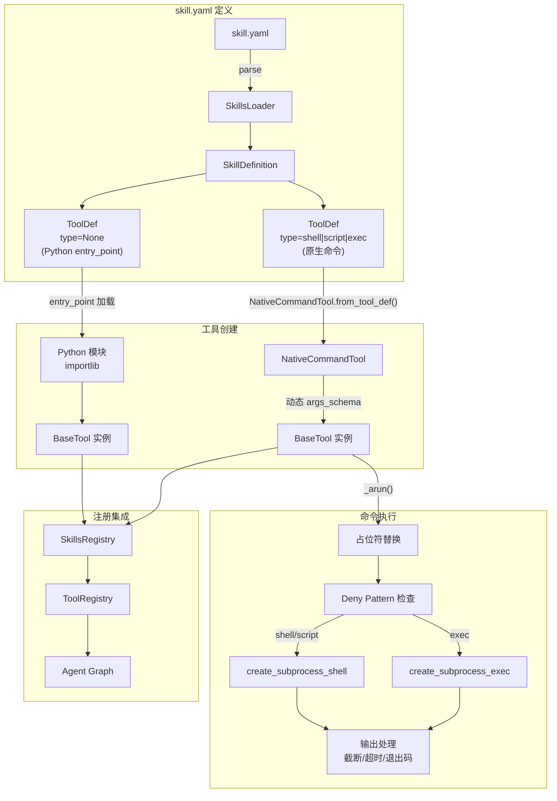
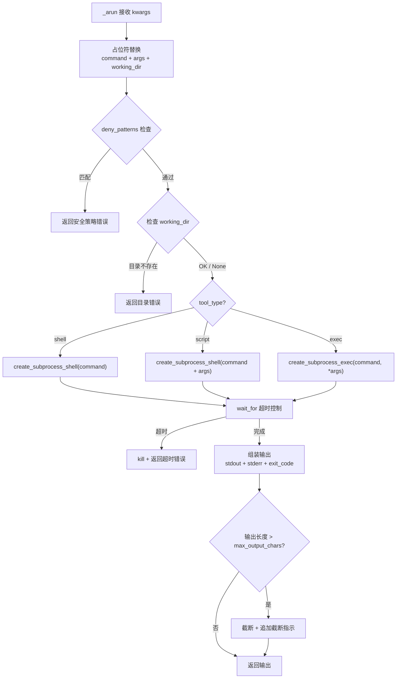

# 设计文档 — SmartClaw 原生命令技能（Native Command Skills）

## 概述

本设计文档描述 SmartClaw Skills 系统的原生命令工具扩展方案。该扩展在现有 Python `entry_point` 技能机制基础上，新增三种原生命令工具类型（`shell`、`script`、`exec`），使技能开发者可以直接在 `skill.yaml` 中声明外部命令执行，无需编写 Python 包装代码。

### 核心设计决策

1. **复用 ShellTool 模式** — 子进程执行、超时控制、输出截断、deny pattern 安全策略均复用 `smartclaw/tools/shell.py` 的成熟模式，避免重复实现。
2. **动态 Pydantic Schema** — 从 YAML `parameters` 定义动态生成 `args_schema`，使 LLM 能正确传递参数。使用 `pydantic.create_model()` 实现。
3. **占位符替换** — `{param_name}` 格式的占位符在命令执行前替换为实际参数值，支持 command、args、working_dir 三个位置。
4. **向后兼容** — 未指定 `type` 字段的 ToolDef 回退到现有 Python entry_point 行为，现有 skill.yaml 无需任何修改。
5. **工厂模式** — `NativeCommandTool.from_tool_def()` 工厂方法从 ToolDef 创建 BaseTool 实例，SkillsRegistry 根据 `type` 字段自动选择创建方式。

技术栈：Python 3.12+、asyncio subprocess、PyYAML、LangChain BaseTool、Pydantic、structlog、pytest + hypothesis。

## 架构



## 组件与接口

### 1. `ParameterDef` (数据类)

位置：`smartclaw/smartclaw/skills/models.py`

工具参数定义，描述单个参数的类型、描述和默认值。

```python
@dataclass
class ParameterDef:
    """Tool parameter definition for native command tools."""
    type: str = "string"          # "string", "integer", "boolean"
    description: str = ""
    default: Any = None           # None 表示必填参数
```

### 2. `ToolDef` (扩展数据类)

位置：`smartclaw/smartclaw/skills/models.py`

在现有 `ToolDef(name, description, function)` 基础上新增原生命令字段。

```python
@dataclass
class ToolDef:
    """Embedded tool definition within a skill."""
    name: str
    description: str
    function: str = ""                              # Python entry_point（传统类型）

    # --- 原生命令扩展字段 ---
    type: str | None = None                         # "shell", "script", "exec", or None
    command: str = ""                               # 命令字符串或可执行文件路径
    args: list[str] = field(default_factory=list)   # exec 类型的命令行参数列表
    working_dir: str | None = None                  # 工作目录，支持 {workspace} 占位符
    timeout: int = 60                               # 超时秒数
    max_output_chars: int = 10_000                  # 输出截断阈值
    deny_patterns: list[str] = field(default_factory=list)  # 安全拒绝正则列表
    parameters: dict[str, ParameterDef] = field(default_factory=dict)  # 参数定义

    def validate(self) -> list[str]:
        """Return validation errors. Empty list means valid."""
        errors: list[str] = []
        valid_types = {"shell", "script", "exec", None}
        if self.type not in valid_types:
            errors.append(f"unrecognized tool type: {self.type!r}")
            return errors
        if self.type in ("shell", "script", "exec") and not self.command:
            errors.append(f"command is required for type={self.type!r}")
        if self.type is None and not self.function:
            errors.append("function is required for Python entry_point tools")
        return errors
```

### 3. `SkillDefinition.validate()` 扩展

位置：`smartclaw/smartclaw/skills/models.py`

修改验证逻辑：当无 `entry_point` 但存在至少一个原生命令工具时，视为合法。

```python
def validate(self) -> list[str]:
    errors: list[str] = []
    # ... name/description 检查不变 ...

    has_native_tools = any(t.type in ("shell", "script", "exec") for t in self.tools)
    if not self.entry_point and not has_native_tools:
        errors.append("entry_point or at least one native command tool is required")

    return errors
```

### 4. 占位符替换模块

位置：`smartclaw/smartclaw/skills/native_command.py`

```python
def substitute_placeholders(
    template: str,
    params: dict[str, Any],
    param_defs: dict[str, ParameterDef],
) -> str:
    """Replace {param_name} placeholders in template string.

    For each {name} in template:
    1. If name is in params → use params[name]
    2. Elif name has default in param_defs → use default
    3. Else → raise ValueError(missing required parameter)

    Non-string values are converted via str() before substitution.
    """
```

```python
def substitute_args(
    args: list[str],
    params: dict[str, Any],
    param_defs: dict[str, ParameterDef],
) -> list[str]:
    """Apply substitute_placeholders to each element in args list."""
```

### 5. `NativeCommandTool` (SmartClawTool 子类)

位置：`smartclaw/smartclaw/skills/native_command.py`

```python
class NativeCommandTool(SmartClawTool):
    """Execute native commands (shell/script/exec) as LangChain BaseTool."""

    name: str
    description: str
    args_schema: type[BaseModel]

    # 内部配置（不暴露给 LLM）
    tool_type: str                    # "shell", "script", "exec"
    command: str
    command_args: list[str]
    working_dir: str | None
    timeout: int
    max_output_chars: int
    deny_patterns: list[str]
    param_defs: dict[str, ParameterDef]

    async def _arun(self, **kwargs: Any) -> str:
        """Execute the command with placeholder substitution."""

    @classmethod
    def from_tool_def(cls, tool_def: ToolDef) -> "NativeCommandTool":
        """Factory: create NativeCommandTool from a ToolDef."""
```

### 6. `_arun()` 执行流程



### 7. 动态 `args_schema` 生成

```python
def _build_args_schema(
    tool_name: str,
    param_defs: dict[str, ParameterDef],
) -> type[BaseModel]:
    """Dynamically create a Pydantic BaseModel from ParameterDef dict.

    Type mapping:
      "string"  → str
      "integer" → int
      "boolean" → bool
      other     → str (fallback)

    Parameters with default=None are required (no default in Pydantic field).
    Parameters with a default value use Field(default=...).
    """
```

使用 `pydantic.create_model()` 实现，模型名称为 `{ToolName}Input`。

### 8. `SkillsLoader` 解析扩展

位置：`smartclaw/smartclaw/skills/loader.py`

`parse_skill_yaml()` 扩展：解析 tool entry 中的 `type`、`command`、`args`、`working_dir`、`timeout`、`max_output_chars`、`deny_patterns`、`parameters` 字段。

`serialize_skill_yaml()` 扩展：序列化时包含原生命令字段。

### 9. `SkillsRegistry` 集成

位置：`smartclaw/smartclaw/skills/registry.py`

`load_and_register_all()` 扩展逻辑：

```python
for info in skill_infos:
    try:
        yaml_path = ...  # 找到 skill.yaml
        definition = loader.parse_skill_yaml(yaml_path.read_text())

        # 注册原生命令工具
        for tool_def in definition.tools:
            if tool_def.type in ("shell", "script", "exec"):
                bt = NativeCommandTool.from_tool_def(tool_def)
                tool_registry.register(bt)

        # 注册 Python entry_point 工具（如果有）
        if definition.entry_point:
            entry_fn, _ = loader.load_skill(info.name)
            result = entry_fn()
            self.register(info.name, result)
    except Exception as exc:
        logger.error("skill_load_failed", name=info.name, error=str(exc))
```

## 数据模型

## SKILL.md 提示词型技能

### 10. SKILL.md 解析器

位置：`smartclaw/smartclaw/skills/markdown_skill.py`

参考 PicoClaw `pkg/skills/loader.go` 的 `splitFrontmatter` 和 `extractMarkdownMetadata` 实现。

```python
def split_frontmatter(content: str) -> tuple[str, str]:
    """Split YAML frontmatter from Markdown body.

    Returns (frontmatter_yaml, body_markdown).
    If no frontmatter (no leading ---), returns ("", content).
    """

def parse_skill_md(content: str, dir_name: str) -> tuple[str, str, str]:
    """Parse a SKILL.md file.

    Returns (name, description, body).
    - name: from frontmatter 'name' field, or dir_name fallback
    - description: from frontmatter 'description' field, or first paragraph fallback
    - body: Markdown content with frontmatter stripped
    """
```

### 11. SkillsLoader 发现逻辑扩展

`list_skills()` 扩展：扫描时同时检查 `skill.yaml` 和 `SKILL.md`。

```python
def _scan_skill_dir(self, child: Path, source: str) -> SkillInfo | None:
    """Scan a single skill directory for skill.yaml and/or SKILL.md.

    Priority:
    - skill.yaml exists → parse YAML for metadata
    - SKILL.md exists → parse frontmatter for metadata
    - Both exist → hybrid skill (YAML provides tools, MD provides prompt)
    - Neither → not a valid skill directory
    """
```

`load_skill` 扩展：当技能有 SKILL.md 时，返回 body 内容。

`build_skills_summary` 和 `load_skills_for_context` 已有的方法自然支持 SKILL.md 技能（通过 SkillInfo 统一接口）。

### SKILL.md 示例

```markdown
---
name: code-reviewer
description: Expert code review assistant
---

# Code Reviewer

You are an expert code reviewer. When asked to review code:

1. Check for bugs and logic errors
2. Evaluate code style and readability
3. Suggest performance improvements
4. Verify error handling completeness

Always provide specific line references and concrete suggestions.
```

### 技能目录结构示例

```
skills/
├── devops-tools/           # 纯 YAML 工具型
│   └── skill.yaml
├── code-reviewer/          # 纯 Markdown 提示词型
│   └── SKILL.md
├── go-analyzer/            # 混合型（工具 + 提示词）
│   ├── skill.yaml          # 提供 golangci-lint 等工具
│   └── SKILL.md            # 提供 Go 代码审查指导
└── web-scraper/            # Python entry_point 型
    └── skill.yaml          # entry_point: pkg.scraper:create_tools
```

## 数据模型

### ParameterDef

| 字段 | 类型 | 默认值 | 描述 |
|------|------|--------|------|
| type | `str` | `"string"` | 参数类型：`"string"`, `"integer"`, `"boolean"` |
| description | `str` | `""` | 参数描述，供 LLM 理解参数用途 |
| default | `Any` | `None` | 默认值，`None` 表示必填参数 |

### ToolDef（扩展后）

| 字段 | 类型 | 默认值 | 描述 |
|------|------|--------|------|
| name | `str` | (必填) | 工具名称 |
| description | `str` | (必填) | 工具描述 |
| function | `str` | `""` | Python entry_point 路径（传统类型） |
| type | `str \| None` | `None` | 工具类型：`"shell"`, `"script"`, `"exec"`, `None` |
| command | `str` | `""` | 命令字符串或可执行文件路径 |
| args | `list[str]` | `[]` | 命令行参数列表（exec 类型） |
| working_dir | `str \| None` | `None` | 工作目录，支持 `{workspace}` 占位符 |
| timeout | `int` | `60` | 超时秒数 |
| max_output_chars | `int` | `10000` | 输出截断阈值 |
| deny_patterns | `list[str]` | `[]` | 安全拒绝正则列表 |
| parameters | `dict[str, ParameterDef]` | `{}` | 参数定义映射 |

### skill.yaml 示例

```yaml
name: devops-tools
description: DevOps 常用命令工具集
version: "1.0.0"
tools:
  # shell 类型：内联 shell 命令
  - name: disk-usage
    description: 查看指定目录的磁盘使用情况
    type: shell
    command: "du -sh {path}"
    timeout: 30
    parameters:
      path:
        type: string
        description: 要检查的目录路径

  # script 类型：执行脚本文件
  - name: deploy-check
    description: 运行部署前检查脚本
    type: script
    command: "./scripts/deploy-check.sh"
    working_dir: "{workspace}"
    timeout: 120
    deny_patterns:
      - "\\brm\\s+-rf\\b"
    parameters:
      env:
        type: string
        description: 部署环境 (staging/production)
        default: staging

  # exec 类型：执行编译程序
  - name: lint-go
    description: 使用 golangci-lint 检查 Go 代码
    type: exec
    command: golangci-lint
    args: ["run", "--config", "{config_path}", "{target}"]
    working_dir: "{workspace}"
    timeout: 180
    max_output_chars: 20000
    parameters:
      config_path:
        type: string
        description: lint 配置文件路径
        default: ".golangci.yaml"
      target:
        type: string
        description: 要检查的目标路径
        default: "./..."
```

### 占位符替换算法


占位符替换采用正则匹配 `\{(\w+)\}` 模式，对 command、args 列表每个元素、working_dir 三个位置执行替换。

**算法步骤：**

1. 使用 `re.findall(r'\{(\w+)\}', template)` 提取所有占位符名称
2. 对每个占位符名称 `name`：
   - 若 `name` 在调用参数 `params` 中 → 使用 `str(params[name])`
   - 若 `name` 在 `param_defs` 中且有默认值 → 使用 `str(param_defs[name].default)`
   - 否则 → 抛出 `ValueError(f"Missing required parameter: {name}")`
3. 使用 `re.sub(r'\{(\w+)\}', replacer, template)` 执行替换
4. `{workspace}` 是特殊占位符，在 working_dir 中由系统自动替换为实际工作区路径

**安全考虑：**
- 占位符替换发生在 deny pattern 检查之前，确保替换后的完整命令也受安全策略保护
- 参数值中的 shell 特殊字符不做转义（shell 类型本身就是 shell 执行），exec 类型通过 args 列表传递天然安全

## 正确性属性

*正确性属性（Correctness Property）是在系统所有合法执行中都应成立的特征或行为——本质上是对系统应做什么的形式化陈述。属性是人类可读规格说明与机器可验证正确性保证之间的桥梁。*

### Property 1: ToolDef 验证 — 原生命令类型必须有 command

*For any* ToolDef with `type` set to `"shell"`, `"script"`, or `"exec"`, if the `command` field is empty, then `validate()` shall return a non-empty error list.

**Validates: Requirements 1.11**

### Property 2: ToolDef 验证 — Python 类型必须有 function

*For any* ToolDef with `type` set to `None`, if the `function` field is empty, then `validate()` shall return a non-empty error list.

**Validates: Requirements 1.12**

### Property 3: ToolDef 验证 — 无法识别的 type 被拒绝

*For any* ToolDef with `type` set to a value not in `{"shell", "script", "exec", None}`, `validate()` shall return a non-empty error list.

**Validates: Requirements 1.13**

### Property 4: SkillDefinition YAML 往返一致性（含原生命令工具）

*For any* valid SkillDefinition containing native command tools, serializing to YAML then parsing back shall produce an equivalent SkillDefinition with all fields preserved (name, description, type, command, args, working_dir, timeout, max_output_chars, deny_patterns, parameters).

**Validates: Requirements 2.7**

### Property 5: 占位符替换完整性

*For any* template string containing N distinct `{param_name}` placeholders, and a params dict providing values for all N parameters, `substitute_placeholders()` shall return a string containing no `{param_name}` patterns for those N names, and each placeholder shall be replaced by the string representation of the corresponding parameter value.

**Validates: Requirements 3.1, 3.2, 3.6**

### Property 6: 缺失必填参数报错

*For any* template string containing a `{param_name}` placeholder where `param_name` is not in the params dict and has no default in param_defs, `substitute_placeholders()` shall raise a `ValueError`.

**Validates: Requirements 3.5**

### Property 7: 默认值回退

*For any* template string containing a `{param_name}` placeholder where `param_name` is not in the params dict but has a default value in param_defs, `substitute_placeholders()` shall use the default value for substitution.

**Validates: Requirements 3.4**

### Property 8: Deny pattern 阻止匹配命令

*For any* command string and deny_patterns list, if the command matches any deny pattern regex, the NativeCommandTool shall return an error string indicating the command was blocked by security policy.

**Validates: Requirements 4.7, 5.7, 6.7**

### Property 9: 输出截断保持长度限制

*For any* subprocess output exceeding `max_output_chars`, the returned string shall have length ≤ `max_output_chars` + truncation indicator length, and shall end with a truncation indicator containing the number of omitted characters.

**Validates: Requirements 4.6, 5.6, 6.6**

### Property 10: 工厂创建的 BaseTool 属性正确

*For any* valid ToolDef with `type` in `{"shell", "script", "exec"}`, `NativeCommandTool.from_tool_def()` shall return a BaseTool instance whose `name` equals `tool_def.name`, `description` equals `tool_def.description`, and `args_schema` is a Pydantic BaseModel subclass with fields matching the ToolDef `parameters`.

**Validates: Requirements 7.1, 7.2, 7.3, 7.4**

### Property 11: 动态 args_schema 类型映射

*For any* ParameterDef dict, the dynamically generated args_schema shall map `"string"` to `str`, `"integer"` to `int`, `"boolean"` to `bool`, and parameters with `default=None` shall be required fields (no default in the Pydantic model).

**Validates: Requirements 7.4, 1.10**

### Property 12: SkillDefinition 验证 — 无 entry_point 但有原生命令工具为合法

*For any* SkillDefinition with no `entry_point` but containing at least one tool with `type` in `{"shell", "script", "exec"}`, `validate()` shall return an empty error list (assuming name and description are valid).

**Validates: Requirements 9.1**

### Property 13: SkillDefinition 验证 — 无 entry_point 且无原生命令工具为非法

*For any* SkillDefinition with no `entry_point` and no native command tools, `validate()` shall return a non-empty error list.

**Validates: Requirements 9.2**

### Property 14: 向后兼容 — 无 type 字段的 ToolDef 解析不变

*For any* skill.yaml 内容不包含 `type` 字段的工具定义，`parse_skill_yaml()` 的解析结果中 ToolDef 的 `type` 字段为 `None`，且 `function` 字段正确填充。

**Validates: Requirements 2.2, 10.2, 10.3**

### Property 15: SKILL.md frontmatter 解析 — name 和 description 提取

*For any* SKILL.md 文件包含有效 YAML frontmatter（`---` 分隔），`parse_skill_md()` 应正确提取 `name` 和 `description` 字段，body 内容不包含 frontmatter。

**Validates: Requirements 11.2, 11.4**

### Property 16: SKILL.md 无 frontmatter 回退

*For any* SKILL.md 文件不包含 YAML frontmatter（无 `---` 开头），`parse_skill_md()` 应使用目录名作为 name，第一段落作为 description，body 为完整内容。

**Validates: Requirements 11.3**

### Property 17: 技能目录发现 — skill.yaml 或 SKILL.md 均为有效技能

*For any* 技能目录包含 `skill.yaml` 或 `SKILL.md`（或两者），`list_skills()` 应将其识别为有效技能。不包含任何一个的目录应被忽略。

**Validates: Requirements 12.1, 12.2**

## 错误处理

### 命令执行错误

| 场景 | 行为 |
|------|------|
| 命令超时 | kill 进程，返回 `"Error: Command timed out after {timeout}s"` |
| 非零退出码 | 输出中追加 `"Exit code: {code}"` |
| deny pattern 匹配 | 返回 `"Error: Command blocked by security policy"` |
| working_dir 不存在 | 返回 `"Error: Working directory not found — {path}"` |
| 脚本文件不存在（script 类型） | 返回 `"Error: Script not found — {path}"` |
| 程序不在 PATH 中（exec 类型） | 返回 `"Error: Program not found — {command}"` |

### 占位符替换错误

| 场景 | 行为 |
|------|------|
| 必填参数缺失 | 抛出 `ValueError("Missing required parameter: {name}")` |
| 参数值为 None | 转换为字符串 `"None"` |

### 工厂/注册错误

| 场景 | 行为 |
|------|------|
| 不支持的 tool type 传入工厂 | 抛出 `ValueError("Unsupported tool type: {type}")` |
| 单个原生命令工具注册失败 | structlog 记录错误，继续注册其余工具 |
| ToolDef 验证失败 | structlog 记录错误，跳过该工具 |

### 错误传递模式

所有命令执行错误返回纯字符串（非异常），遵循 `SmartClawTool._safe_run()` 模式。异常仅在工厂创建阶段（系统初始化时）抛出。

## 测试策略

### 属性测试（Property-Based Testing）

库：**Hypothesis**（已在 `dev` 依赖中：`hypothesis>=6.98.0`）

每个正确性属性对应一个 Hypothesis `@given` 测试，最少 100 个样例。测试标注格式：

```python
# Feature: smartclaw-native-command-skills, Property 4: SkillDefinition YAML 往返一致性
```

需要的生成器（strategies）：
- `st_parameter_def()` — 生成随机 ParameterDef 实例
- `st_tool_def_native()` — 生成随机原生命令 ToolDef（type=shell/script/exec）
- `st_tool_def_python()` — 生成随机 Python entry_point ToolDef（type=None）
- `st_skill_definition_with_native()` — 生成包含原生命令工具的 SkillDefinition
- `st_template_with_placeholders()` — 生成包含占位符的模板字符串和对应参数
- `st_deny_patterns()` — 生成 deny pattern 正则列表
- `st_command_string()` — 生成命令字符串

属性测试文件：
- `tests/skills/test_models_props.py` — Property 1, 2, 3, 12, 13, 14
- `tests/skills/test_native_command_props.py` — Property 5, 6, 7, 8, 9, 10, 11
- `tests/skills/test_loader_native_props.py` — Property 4
- `tests/skills/test_markdown_skill_props.py` — Property 15, 16, 17

配置：`@settings(max_examples=100, deadline=None)`

### 单元测试

单元测试覆盖具体示例、边界情况和集成点：

- `tests/skills/test_models_native.py` — ToolDef 验证示例：各类型合法/非法组合、ParameterDef 字段、SkillDefinition 混合工具验证
- `tests/skills/test_native_command.py` — NativeCommandTool 执行示例：shell/script/exec 三种类型的 happy path、超时、输出截断、deny pattern 阻止、working_dir 不存在、脚本不存在、程序不在 PATH
- `tests/skills/test_placeholder.py` — 占位符替换示例：多参数替换、默认值回退、缺失参数报错、非字符串值转换、{workspace} 特殊处理
- `tests/skills/test_loader_native.py` — SkillsLoader 解析扩展示例：原生命令工具 YAML 解析、序列化、向后兼容
- `tests/skills/test_registry_native.py` — SkillsRegistry 集成示例：原生命令工具注册、混合技能注册、注册失败继续、纯 YAML 技能（无 entry_point）
- `tests/skills/test_markdown_skill.py` — SKILL.md 解析示例：frontmatter 解析、无 frontmatter 回退、无效 frontmatter 容错、混合技能目录发现、纯 MD 技能加载、build_skills_summary 包含 MD 技能

### 测试方法总结

- 属性测试验证跨随机输入的通用不变量（17 个属性）
- 单元测试验证具体示例、边界情况和错误条件
- 命令执行测试使用 `asyncio.create_subprocess_shell/exec` 的 mock 避免真实子进程
- 使用 `pytest-asyncio` 支持异步测试
