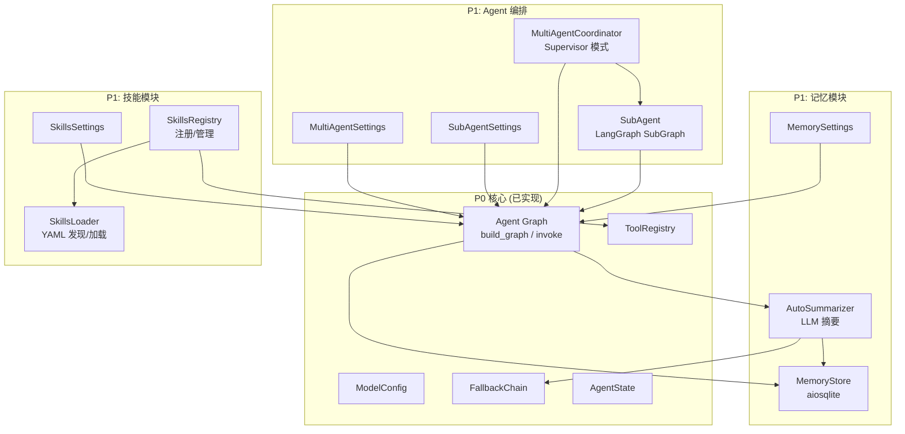
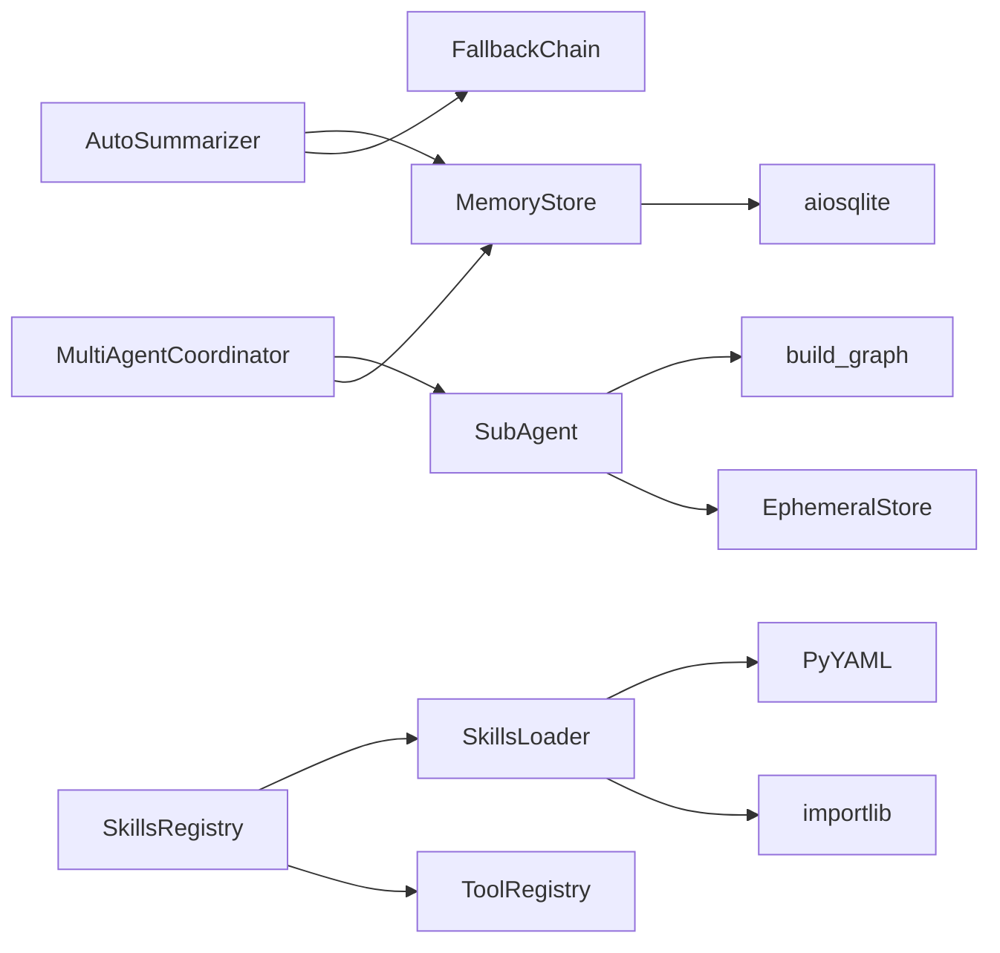
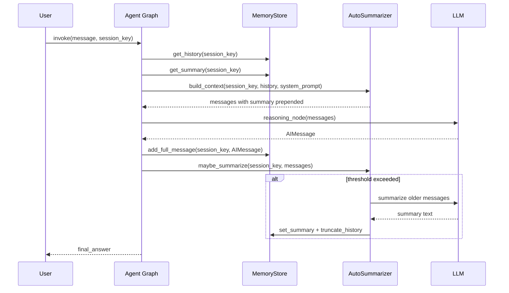
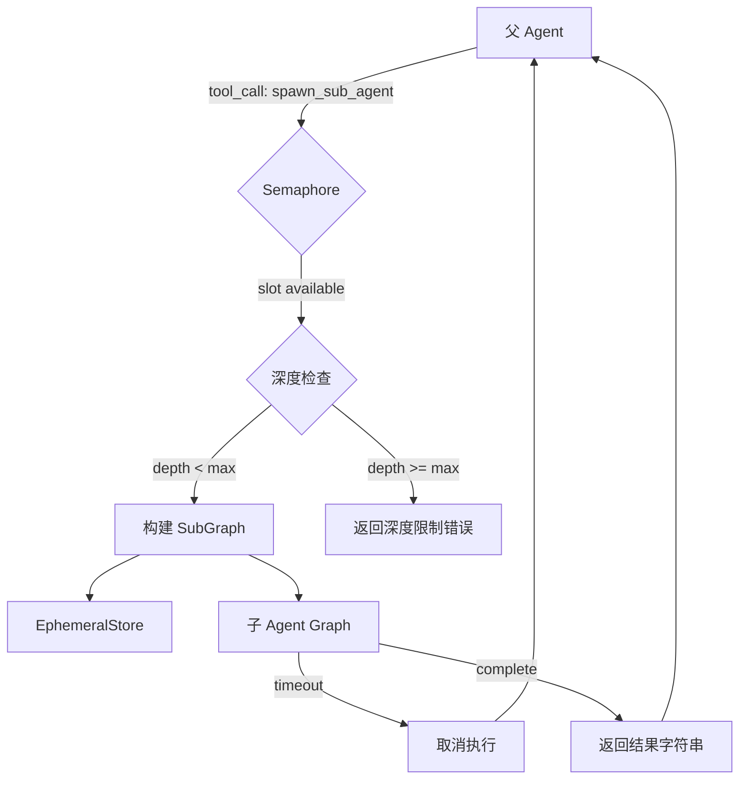
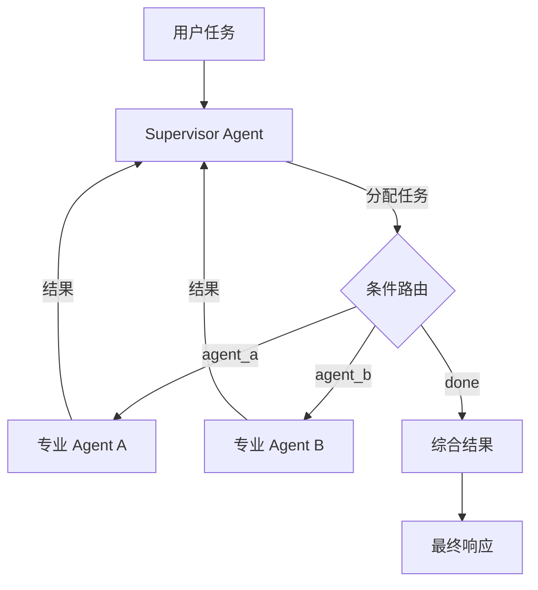

# 设计文档 — SmartClaw P1 增强能力

## 概述

本设计文档描述 SmartClaw P1 阶段 6 个增强模块的技术架构与实现方案。P1 在 P0 核心 MVP 基础上新增：记忆存储（Memory Store）、自动摘要（Auto Summary）、技能加载器（Skills Loader）、技能注册表（Skills Registry）、子 Agent（Sub-Agent）、多 Agent 协同（Multi-Agent Coordination）。

所有 P1 模块遵循以下设计原则：
- **向后兼容**：所有模块可通过配置开关独立禁用，禁用时系统行为与 P0 完全一致
- **异步优先**：所有 I/O 操作使用 `async/await`，与 LangGraph 异步执行模型一致
- **参考 PicoClaw**：借鉴 PicoClaw Go 实现的成熟模式，适配 Python/LangGraph 技术栈
- **最小侵入**：P1 模块通过扩展（而非修改）P0 接口集成，使用可选字段和 lazy import

技术栈：Python 3.12+、LangGraph >= 0.4、aiosqlite、PyYAML、asyncio、structlog、pytest + hypothesis。

## 架构

### 整体架构图



### 模块依赖关系



### 文件结构

```
smartclaw/smartclaw/
├── memory/
│   ├── __init__.py
│   ├── store.py          # MemoryStore (aiosqlite)
│   └── summarizer.py     # AutoSummarizer
├── skills/
│   ├── __init__.py
│   ├── loader.py          # SkillsLoader
│   ├── models.py          # SkillDefinition, SkillInfo
│   └── registry.py        # SkillsRegistry
├── agent/
│   ├── sub_agent.py       # SubAgent, EphemeralStore, spawn_sub_agent_tool
│   └── multi_agent.py     # MultiAgentCoordinator
├── config/
│   └── settings.py        # 扩展 SmartClawSettings (新增 P1 配置字段)
```


## 组件与接口

### 1. MemoryStore — 对话记忆持久化存储

基于 aiosqlite 的异步 SQLite 存储，参考 PicoClaw `pkg/memory/store.go` 接口设计。

```python
# smartclaw/memory/store.py
from __future__ import annotations
import json
from pathlib import Path
from typing import Any
import aiosqlite
import structlog
from langchain_core.messages import (
    AIMessage, BaseMessage, HumanMessage,
    SystemMessage, ToolMessage,
    messages_from_dict, message_to_dict,
)

logger = structlog.get_logger(component="memory.store")

class MemoryStore:
    """异步 SQLite 对话记忆存储。"""

    def __init__(self, db_path: str = "~/.smartclaw/memory.db") -> None: ...
    async def initialize(self) -> None:
        """创建数据库和表（如不存在）。"""
    async def add_message(
        self, session_key: str, role: str, content: str,
    ) -> None:
        """追加简单文本消息到会话历史。"""
    async def add_full_message(
        self, session_key: str, message: BaseMessage,
    ) -> None:
        """追加完整 LangChain BaseMessage（含 tool_calls 等）。"""
    async def get_history(
        self, session_key: str,
    ) -> list[BaseMessage]:
        """返回会话所有消息（按插入顺序），不存在返回空列表。"""
    async def get_summary(self, session_key: str) -> str:
        """返回会话摘要，不存在返回空字符串。"""
    async def set_summary(
        self, session_key: str, summary: str,
    ) -> None:
        """设置/更新会话摘要。"""
    async def truncate_history(
        self, session_key: str, keep_last: int,
    ) -> None:
        """保留最后 keep_last 条消息，删除其余。
        keep_last <= 0 时删除全部。"""
    async def set_history(
        self, session_key: str, messages: list[BaseMessage],
    ) -> None:
        """原子替换会话全部消息（用于紧急压缩）。"""
    async def close(self) -> None:
        """释放 SQLite 连接资源。"""
```

### 2. AutoSummarizer — 自动摘要

参考 PicoClaw `maybeSummarize` / `summarizeSession` / `forceCompression` 逻辑。

```python
# smartclaw/memory/summarizer.py
from __future__ import annotations
from langchain_core.messages import BaseMessage
from smartclaw.memory.store import MemoryStore
from smartclaw.providers.config import ModelConfig

class AutoSummarizer:
    """LLM 驱动的对话自动摘要压缩。"""

    def __init__(
        self,
        store: MemoryStore,
        model_config: ModelConfig,
        *,
        message_threshold: int = 20,
        token_percent_threshold: int = 70,
        context_window: int = 128_000,
        keep_recent: int = 5,
    ) -> None: ...

    async def maybe_summarize(
        self,
        session_key: str,
        messages: list[BaseMessage],
    ) -> list[BaseMessage]:
        """检查阈值，超过时触发摘要。返回处理后的消息列表。"""

    async def force_compression(
        self,
        session_key: str,
        messages: list[BaseMessage],
    ) -> list[BaseMessage]:
        """紧急压缩：丢弃最旧 ~50% 消息（对齐 turn 边界）。
        少于 4 条消息时跳过。无安全边界时保留最近 user 消息。"""

    async def build_context(
        self,
        session_key: str,
        messages: list[BaseMessage],
        system_prompt: str | None = None,
    ) -> list[BaseMessage]:
        """构建 LLM 上下文：在消息列表前插入摘要 SystemMessage。"""

    def estimate_tokens(self, messages: list[BaseMessage]) -> int:
        """启发式 token 估算（2.5 字符/token）。"""

    @staticmethod
    def find_safe_boundary(
        messages: list[BaseMessage], target_index: int,
    ) -> int:
        """找到最近的 turn 边界（user 消息起始位置）。"""
```

### 3. SkillsLoader — 技能加载器

参考 PicoClaw `pkg/skills/loader.go`，适配 Python YAML + importlib 模式。

```python
# smartclaw/skills/loader.py
from __future__ import annotations
from typing import Any, Callable
from smartclaw.skills.models import SkillDefinition, SkillInfo

class SkillsLoader:
    """YAML 技能定义文件的发现与动态加载。"""

    def __init__(
        self,
        workspace_dir: str | None = None,
        global_dir: str = "~/.smartclaw/skills",
        builtin_dir: str | None = None,
    ) -> None: ...

    def list_skills(self) -> list[SkillInfo]:
        """扫描所有技能目录，返回有效技能信息列表。
        优先级：workspace > global > builtin。"""

    def load_skill(
        self, name: str,
    ) -> tuple[Callable[..., Any], SkillDefinition]:
        """按名称加载技能：importlib 导入 entry_point，
        返回 (callable, definition)。"""

    def build_skills_summary(self) -> str:
        """生成技能摘要字符串，用于注入 system prompt。"""

    def load_skills_for_context(
        self, skill_names: list[str],
    ) -> str:
        """加载多个技能内容，用 --- 分隔拼接。"""

    @staticmethod
    def parse_skill_yaml(yaml_str: str) -> SkillDefinition:
        """解析 YAML 字符串为 SkillDefinition。"""

    @staticmethod
    def serialize_skill_yaml(
        definition: SkillDefinition,
    ) -> str:
        """序列化 SkillDefinition 为 YAML 字符串。"""
```

### 4. SkillsRegistry — 技能注册表

```python
# smartclaw/skills/registry.py
from __future__ import annotations
from langchain_core.tools import BaseTool
from smartclaw.skills.loader import SkillsLoader
from smartclaw.tools.registry import ToolRegistry

class SkillsRegistry:
    """技能注册、管理与 ToolRegistry 集成。"""

    def __init__(
        self,
        loader: SkillsLoader,
        tool_registry: ToolRegistry,
    ) -> None: ...

    def register(self, name: str, module: object) -> None:
        """注册技能模块，提取并注册其提供的工具。"""

    def unregister(self, name: str) -> None:
        """注销技能，移除其工具。"""

    def get(self, name: str) -> object | None:
        """按名称获取已注册技能，不存在返回 None。"""

    def list_skills(self) -> list[str]:
        """返回所有已注册技能名称（排序）。"""

    def load_and_register_all(self) -> None:
        """发现并加载所有技能，注册有效技能及其工具。
        单个技能失败不影响其余。"""
```

### 5. SubAgent — 子 Agent 任务委托

参考 PicoClaw `pkg/agent/subturn.go`，使用 LangGraph SubGraph + asyncio.Semaphore。

```python
# smartclaw/agent/sub_agent.py
from __future__ import annotations
import asyncio
from dataclasses import dataclass, field
from langchain_core.messages import BaseMessage
from langchain_core.tools import BaseTool

@dataclass
class SubAgentConfig:
    """子 Agent 配置。"""
    task: str
    model: str
    tools: list[BaseTool] = field(default_factory=list)
    system_prompt: str | None = None
    max_iterations: int = 25
    timeout_seconds: int = 300
    max_depth: int = 3

class EphemeralStore:
    """内存临时消息存储（子 Agent 专用）。"""
    def __init__(self, max_size: int = 50) -> None: ...
    def add_message(self, message: BaseMessage) -> None: ...
    def get_history(self) -> list[BaseMessage]: ...
    def truncate(self, keep_last: int) -> None: ...
    def set_history(
        self, messages: list[BaseMessage],
    ) -> None: ...

async def spawn_sub_agent(
    config: SubAgentConfig,
    *,
    parent_depth: int = 0,
    semaphore: asyncio.Semaphore | None = None,
    concurrency_timeout: float = 30.0,
) -> str:
    """派生子 Agent 执行任务，返回最终响应字符串。
    超时/深度限制/并发限制均抛出对应异常。"""

class SpawnSubAgentTool(BaseTool):
    """LangChain BaseTool：父 Agent 通过 tool call 委托子任务。
    接受 task (str) 和可选 model (str) 参数。"""
    name: str = "spawn_sub_agent"
    description: str = (
        "Delegate a subtask to a sub-agent. "
        "Provide a clear task description."
    )
```

### 6. MultiAgentCoordinator — 多 Agent 协同

```python
# smartclaw/agent/multi_agent.py
from __future__ import annotations
from dataclasses import dataclass, field
from langchain_core.tools import BaseTool
from langgraph.graph.state import CompiledStateGraph

@dataclass
class AgentRole:
    """Agent 角色定义。"""
    name: str
    description: str
    model: str
    tools: list[BaseTool] = field(default_factory=list)
    system_prompt: str | None = None
    max_iterations: int = 25

class MultiAgentCoordinator:
    """多 Agent 编排器 — Supervisor 模式。"""

    def __init__(
        self,
        roles: list[AgentRole],
        *,
        max_total_iterations: int = 100,
        memory_store: object | None = None,
    ) -> None: ...

    def create_multi_agent_graph(self) -> CompiledStateGraph:
        """构建 LangGraph 多 Agent StateGraph。
        Supervisor 节点负责任务分解与分配，
        各专业 Agent 节点执行子任务。"""

    async def invoke(
        self, user_message: str,
        *, session_key: str | None = None,
    ) -> str:
        """执行多 Agent 协同任务，返回最终结果。"""
```

### 7. 配置扩展 — SmartClawSettings

```python
# smartclaw/config/settings.py 扩展
from pydantic import Field
from pydantic_settings import BaseSettings

class MemorySettings(BaseSettings):
    """记忆模块配置。"""
    enabled: bool = True
    db_path: str = "~/.smartclaw/memory.db"
    summary_threshold: int = 20
    keep_recent: int = 5
    summarize_token_percent: int = 70
    context_window: int = 128_000

class SkillsSettings(BaseSettings):
    """技能模块配置。"""
    enabled: bool = True
    workspace_dir: str = "{workspace}/skills"
    global_dir: str = "~/.smartclaw/skills"

class SubAgentSettings(BaseSettings):
    """子 Agent 配置。"""
    enabled: bool = True
    max_depth: int = 3
    max_concurrent: int = 5
    default_timeout_seconds: int = 300
    concurrency_timeout_seconds: int = 30

class MultiAgentSettings(BaseSettings):
    """多 Agent 配置。"""
    enabled: bool = False
    max_total_iterations: int = 100
    roles: list[AgentRoleConfig] = []

class AgentRoleConfig(BaseSettings):
    """Agent 角色配置。"""
    name: str
    description: str
    model: str
    system_prompt: str | None = None
    tools: list[str] = []

# SmartClawSettings 新增字段
class SmartClawSettings(BaseSettings):
    # ... P0 existing fields ...
    memory: MemorySettings = Field(
        default_factory=MemorySettings)
    skills: SkillsSettings = Field(
        default_factory=SkillsSettings)
    sub_agent: SubAgentSettings = Field(
        default_factory=SubAgentSettings)
    multi_agent: MultiAgentSettings = Field(
        default_factory=MultiAgentSettings)
```

### 8. Agent Graph 集成流程



## 数据模型

### MemoryStore SQLite Schema

```sql
-- 消息表
CREATE TABLE IF NOT EXISTS messages (
    id INTEGER PRIMARY KEY AUTOINCREMENT,
    session_key TEXT NOT NULL,
    message_json TEXT NOT NULL,
    created_at TIMESTAMP DEFAULT CURRENT_TIMESTAMP
);
CREATE INDEX IF NOT EXISTS idx_messages_session
    ON messages(session_key, id);

-- 会话摘要表
CREATE TABLE IF NOT EXISTS summaries (
    session_key TEXT PRIMARY KEY,
    summary TEXT NOT NULL DEFAULT '',
    updated_at TIMESTAMP DEFAULT CURRENT_TIMESTAMP
);
```

消息序列化使用 LangChain `message_to_dict` / `messages_from_dict`，保留完整类型信息（HumanMessage、AIMessage with tool_calls、ToolMessage with tool_call_id）。

### SkillDefinition 数据模型

```python
# smartclaw/skills/models.py
from __future__ import annotations
import re
from dataclasses import dataclass, field

NAME_PATTERN = re.compile(r"^[a-zA-Z0-9]+(-[a-zA-Z0-9]+)*$")
MAX_NAME_LENGTH = 64
MAX_DESCRIPTION_LENGTH = 1024

@dataclass
class SkillDefinition:
    """YAML 技能定义。"""
    name: str          # kebab-case, max 64 chars
    description: str   # max 1024 chars
    entry_point: str   # e.g. "mypackage.mymodule:my_function"
    version: str | None = None
    author: str | None = None
    tools: list[ToolDef] = field(default_factory=list)
    parameters: dict[str, object] = field(
        default_factory=dict)

    def validate(self) -> list[str]:
        """返回验证错误列表，空列表表示有效。"""

@dataclass
class ToolDef:
    """技能内嵌工具定义。"""
    name: str
    description: str
    function: str  # Python dotted path

@dataclass
class SkillInfo:
    """技能发现信息。"""
    name: str
    path: str
    source: str  # "workspace" | "global" | "builtin"
    description: str
```

### skill.yaml 示例

```yaml
name: web-scraper
description: "Web page scraping and content extraction"
entry_point: "smartclaw_skills.web_scraper:create_tools"
version: "1.0.0"
author: "SmartClaw Team"
tools:
  - name: scrape_page
    description: "Scrape a web page and extract content"
    function: "smartclaw_skills.web_scraper:scrape_page"
parameters:
  max_depth: 3
  timeout: 30
```

### AgentState 扩展

```python
# smartclaw/agent/state.py 扩展（可选字段，默认 None）
class AgentState(TypedDict):
    messages: Annotated[list[BaseMessage], add_messages]
    iteration: int
    max_iterations: int
    final_answer: str | None
    error: str | None
    # P1 新增（可选，向后兼容）
    session_key: str | None       # 会话标识
    summary: str | None           # 当前摘要
    sub_agent_depth: int | None   # 子 Agent 嵌套深度
```

### SubAgent 数据流



### MultiAgent 状态模型

```python
class MultiAgentState(TypedDict):
    """多 Agent 编排状态。"""
    messages: Annotated[list[BaseMessage], add_messages]
    current_agent: str | None     # 当前执行的 Agent 名称
    task_plan: list[dict] | None  # Supervisor 分解的任务计划
    agent_results: dict[str, str] # 各 Agent 执行结果
    total_iterations: int         # 全局迭代计数
    max_total_iterations: int     # 全局迭代上限
    final_answer: str | None
    error: str | None
```

### MultiAgent Supervisor 路由



## 正确性属性 (Correctness Properties)

*属性（Property）是在系统所有有效执行中都应成立的特征或行为——本质上是关于系统应该做什么的形式化陈述。属性是人类可读规格说明与机器可验证正确性保证之间的桥梁。*

### Property 1: 消息存储往返 (Message Storage Round-Trip)

*For any* session key and any sequence of (role, content) pairs, adding each message via `add_message` then calling `get_history` should return messages in the same insertion order, with each message's role and content preserved.

**Validates: Requirements 1.1, 1.2**

### Property 2: 完整消息序列化往返 (Full Message Serialization Round-Trip)

*For any* session key and any valid LangChain BaseMessage (HumanMessage, AIMessage with tool_calls, ToolMessage with tool_call_id), adding it via `add_full_message` then retrieving via `get_history` should produce an equivalent message preserving type, content, tool_calls, tool_call_id, and metadata.

**Validates: Requirements 1.9, 1.15**

### Property 3: 摘要存取往返 (Summary Round-Trip)

*For any* session key and any non-empty summary string, calling `set_summary` then `get_summary` should return the exact same summary string.

**Validates: Requirements 1.4, 1.6**

### Property 4: 历史截断保留最近消息 (Truncate Preserves Recent Messages)

*For any* session with N messages (N > 0) and any keep_last value (1 <= keep_last < N), after calling `truncate_history(keep_last)`, `get_history` should return exactly the last `keep_last` messages from the original history in the same order.

**Validates: Requirements 1.7**

### Property 5: 历史替换往返 (Set History Round-Trip)

*For any* session key and any list of valid BaseMessage objects, calling `set_history` then `get_history` should return an equivalent list of messages.

**Validates: Requirements 1.10**

### Property 6: 摘要触发阈值 (Summarization Trigger Threshold)

*For any* message list and threshold configuration, `maybe_summarize` should trigger summarization if and only if the message count exceeds `message_threshold` OR the estimated token count exceeds `token_percent_threshold` percentage of `context_window`.

**Validates: Requirements 2.3, 2.8**

### Property 7: 摘要后保留最近消息数 (Keep Recent After Summarization)

*For any* message list that triggers summarization with `keep_recent = K`, after summarization completes the remaining history should contain exactly K messages (the most recent ones).

**Validates: Requirements 2.6**

### Property 8: 摘要上下文构建 (Summary Context Prepend)

*For any* session with a non-empty summary and any message list, `build_context` should return a message list where a SystemMessage containing the summary text appears before all non-system messages.

**Validates: Requirements 2.10**

### Property 9: 强制压缩对齐 Turn 边界 (Force Compression Turn Boundary Alignment)

*For any* message list with >= 4 messages containing at least 2 turn boundaries (user messages), `force_compression` should drop approximately 50% of messages, and the kept portion should start at a user message (turn boundary), never splitting a tool-call sequence.

**Validates: Requirements 2.11**

### Property 10: 技能目录优先级 (Skill Directory Priority)

*For any* skill name that exists in multiple source directories (workspace, global, builtin), `list_skills` should return only the highest-priority source (workspace > global > builtin), and lower-priority duplicates should be ignored.

**Validates: Requirements 5.2, 5.3**

### Property 11: 技能定义验证 (Skill Definition Validation)

*For any* SkillDefinition, validation should reject it if: the name does not match `^[a-zA-Z0-9]+(-[a-zA-Z0-9]+)*$`, the name exceeds 64 characters, the description exceeds 1024 characters, or any required field (name, description, entry_point) is missing.

**Validates: Requirements 5.4, 5.8**

### Property 12: 技能摘要包含所有技能信息 (Skills Summary Contains All Skills)

*For any* set of valid discovered skills, `build_skills_summary` should return a string that contains every skill's name and description.

**Validates: Requirements 5.13**

### Property 13: 技能定义 YAML 往返 (Skill Definition YAML Round-Trip)

*For any* valid SkillDefinition object, calling `serialize_skill_yaml` then `parse_skill_yaml` should produce an equivalent SkillDefinition with all fields (name, description, entry_point, version, author, tools, parameters) preserved.

**Validates: Requirements 6.3**

### Property 14: 技能注册/获取往返 (Skill Register/Get Round-Trip)

*For any* skill name and skill module, registering via `register` then calling `get` with the same name should return the registered module. Calling `get` with an unregistered name should return None.

**Validates: Requirements 7.1, 7.3**

### Property 15: 技能注销移除技能及工具 (Unregister Removes Skill and Tools)

*For any* registered skill with associated tools, calling `unregister` should make `get` return None for that skill name, and the skill's tools should no longer appear in the ToolRegistry.

**Validates: Requirements 7.2, 7.6**

### Property 16: 技能列表排序 (Skill List Sorted)

*For any* set of registered skills, `list_skills` should return skill names in ascending lexicographic order.

**Validates: Requirements 7.4**

### Property 17: 子 Agent 深度限制 (Sub-Agent Depth Limit)

*For any* spawn request where `parent_depth >= max_depth`, `spawn_sub_agent` should raise a depth limit error without spawning the sub-agent.

**Validates: Requirements 9.6, 9.7**

### Property 18: 临时存储自动截断 (Ephemeral Store Auto-Truncation)

*For any* sequence of messages added to an EphemeralStore with `max_size = M`, the store should never contain more than M messages, and when the limit is exceeded, only the most recent M messages should be retained.

**Validates: Requirements 9.13**

### Property 19: 子 Agent 并发限制 (Sub-Agent Concurrency Limit)

*For any* number of concurrent `spawn_sub_agent` calls exceeding `max_concurrent`, at most `max_concurrent` sub-agents should be executing simultaneously, with excess requests waiting for a slot.

**Validates: Requirements 10.1, 10.2**

### Property 20: 多 Agent 全局迭代上限 (Multi-Agent Total Iteration Limit)

*For any* multi-agent execution with `max_total_iterations = N`, the total number of iterations across all agents should never exceed N.

**Validates: Requirements 12.7**

## 错误处理

### MemoryStore 错误处理

| 场景 | 处理方式 |
|------|---------|
| SQLite 连接失败 | 抛出异常，由调用方决定是否降级为无状态模式 |
| 消息序列化失败 | 记录 structlog 错误，抛出 ValueError |
| 消息反序列化失败（损坏数据） | 记录警告，跳过损坏消息，返回可用消息 |
| 数据库文件权限不足 | 抛出 PermissionError |
| 并发写入冲突 | aiosqlite 内部序列化，无需额外处理 |

### AutoSummarizer 错误处理

| 场景 | 处理方式 |
|------|---------|
| LLM 摘要调用失败 | 记录 structlog 错误，跳过摘要，返回原始消息列表不变 |
| LLM 返回空摘要 | 使用回退摘要（截取每条消息前 10% 内容拼接） |
| Token 估算溢出 | 使用安全上限值，触发 force_compression |
| MemoryStore 写入失败 | 记录错误，摘要结果丢失但不影响当前对话 |

### SkillsLoader 错误处理

| 场景 | 处理方式 |
|------|---------|
| YAML 解析失败 | 记录 structlog 警告，跳过该技能 |
| 必填字段缺失/验证失败 | 记录警告，跳过该技能 |
| entry_point 模块导入失败 | 抛出 ImportError，附带模块路径和失败原因 |
| 技能目录不存在 | 静默跳过，不报错 |

### SkillsRegistry 错误处理

| 场景 | 处理方式 |
|------|---------|
| 技能注册失败（导入错误、验证错误） | 记录 structlog 错误，继续注册其余技能 |
| 重复注册同名技能 | 记录警告，覆盖旧注册 |
| 注销不存在的技能 | 静默忽略 |

### SubAgent 错误处理

| 场景 | 处理方式 |
|------|---------|
| 深度限制超出 | 返回 DepthLimitExceededError |
| 并发槽位超时 | 返回 ConcurrencyTimeoutError |
| 子 Agent 执行超时 | asyncio.timeout 取消，返回超时错误消息 |
| 子 Agent 内部异常 | 捕获异常，记录 structlog 错误，返回错误描述字符串 |
| SubAgentConfig 无效（缺少 task/model） | 抛出 ValueError |

### MultiAgentCoordinator 错误处理

| 场景 | 处理方式 |
|------|---------|
| 全局迭代上限达到 | 终止图执行，返回当前最佳部分结果 + 警告消息 |
| 专业 Agent 执行失败 | 向 Supervisor 报告失败，Supervisor 可重新分配或调整计划 |
| 无可用 Agent 角色 | 抛出 ValueError |
| Supervisor 路由到不存在的 Agent | 记录错误，返回路由失败消息给 Supervisor |

## 测试策略

### 双轨测试方法

本项目采用单元测试 + 属性测试（Property-Based Testing）双轨并行策略：

- **单元测试 (pytest)**：验证具体示例、边界条件、错误处理
- **属性测试 (hypothesis)**：验证跨所有输入的通用属性

两者互补：单元测试捕获具体 bug，属性测试验证通用正确性。

### 属性测试库

使用 **hypothesis** (已在 `pyproject.toml` dev 依赖中)，每个属性测试至少运行 100 次迭代。

每个属性测试必须用注释标注对应的设计属性：
```python
# Feature: smartclaw-p1-enhanced-capabilities,
# Property 1: Message Storage Round-Trip
@given(...)
@settings(max_examples=100)
def test_message_storage_round_trip(...):
    ...
```

### 属性测试覆盖矩阵

| Property | 模块 | 测试文件 |
|----------|------|---------|
| 1: 消息存储往返 | MemoryStore | tests/memory/test_store_props.py |
| 2: 完整消息序列化往返 | MemoryStore | tests/memory/test_store_props.py |
| 3: 摘要存取往返 | MemoryStore | tests/memory/test_store_props.py |
| 4: 历史截断保留最近消息 | MemoryStore | tests/memory/test_store_props.py |
| 5: 历史替换往返 | MemoryStore | tests/memory/test_store_props.py |
| 6: 摘要触发阈值 | AutoSummarizer | tests/memory/test_summarizer_props.py |
| 7: 摘要后保留最近消息数 | AutoSummarizer | tests/memory/test_summarizer_props.py |
| 8: 摘要上下文构建 | AutoSummarizer | tests/memory/test_summarizer_props.py |
| 9: 强制压缩对齐 Turn 边界 | AutoSummarizer | tests/memory/test_summarizer_props.py |
| 10: 技能目录优先级 | SkillsLoader | tests/skills/test_loader_props.py |
| 11: 技能定义验证 | SkillsLoader | tests/skills/test_loader_props.py |
| 12: 技能摘要包含所有技能信息 | SkillsLoader | tests/skills/test_loader_props.py |
| 13: 技能定义 YAML 往返 | SkillsLoader | tests/skills/test_loader_props.py |
| 14: 技能注册/获取往返 | SkillsRegistry | tests/skills/test_registry_props.py |
| 15: 技能注销移除技能及工具 | SkillsRegistry | tests/skills/test_registry_props.py |
| 16: 技能列表排序 | SkillsRegistry | tests/skills/test_registry_props.py |
| 17: 子 Agent 深度限制 | SubAgent | tests/agent/test_sub_agent_props.py |
| 18: 临时存储自动截断 | EphemeralStore | tests/agent/test_sub_agent_props.py |
| 19: 子 Agent 并发限制 | SubAgent | tests/agent/test_sub_agent_props.py |
| 20: 多 Agent 全局迭代上限 | MultiAgent | tests/agent/test_multi_agent_props.py |

### 单元测试覆盖

单元测试聚焦于具体示例、边界条件和错误处理：

| 模块 | 测试文件 | 覆盖内容 |
|------|---------|---------|
| MemoryStore | tests/memory/test_store.py | 空会话返回空列表、空摘要返回空字符串、keep_last<=0 清空、数据库自动创建 |
| AutoSummarizer | tests/memory/test_summarizer.py | LLM 失败跳过摘要、少于 4 条消息跳过压缩、无安全边界回退 |
| SkillsLoader | tests/skills/test_loader.py | 无效 YAML 跳过、必填字段缺失跳过、导入失败报错 |
| SkillsRegistry | tests/skills/test_registry.py | 注册失败继续、重复注册覆盖 |
| SubAgent | tests/agent/test_sub_agent.py | 超时取消、配置无效报错、并发超时报错 |
| MultiAgent | tests/agent/test_multi_agent.py | 迭代上限终止、Agent 失败报告 |
| Settings | tests/config/test_settings.py | 默认值验证、环境变量覆盖、禁用模块行为 |

### 测试执行

```bash
# 运行全部测试（单次执行，非 watch 模式）
pytest tests/ -v --tb=short

# 仅运行属性测试
pytest tests/ -v -k "props"

# 仅运行特定模块
pytest tests/memory/ -v
pytest tests/skills/ -v
pytest tests/agent/ -v
```
