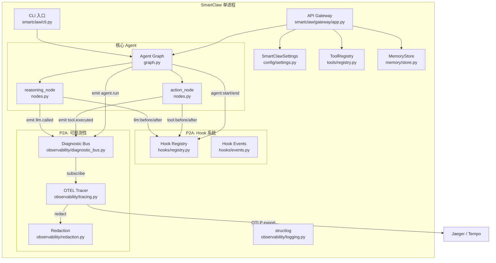
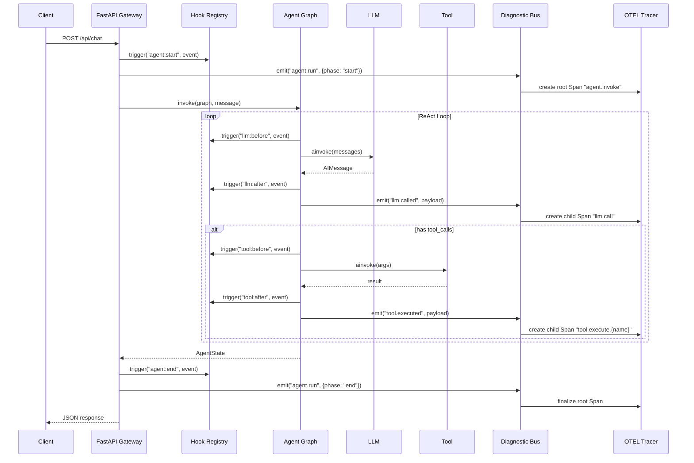

# Design Document: SmartClaw P2A 生产级服务

## Overview

SmartClaw P2A 在现有 P0/P1 代码基础上新增三个生产级服务模块：

1. **API 网关** — 单进程 FastAPI 应用，Agent 运行时与 HTTP API 共存，模块化 Router（chat、sessions、tools、health），SSE 流式响应，热重载 + 优雅关闭
2. **生命周期 Hook** — 事件驱动的 register/trigger 模式，8 个 Hook 点（tool:before/after、agent:start/end、llm:before/after、session:start/end），错误隔离，JSON 序列化往返
3. **可观测性** — 诊断事件总线（emit/on 解耦）+ OpenTelemetry Traces，通过诊断事件驱动 Span 创建，敏感数据脱敏

设计原则：
- **单进程架构**：参考 PicoClaw，避免 deer-flow 双进程部署复杂度
- **模块化 Router**：参考 deer-flow 的 FastAPI Router 拆分模式
- **事件驱动 Hook**：参考 OpenClaw 的 register/trigger，但大幅简化（OpenClaw 40+ 文件 → 我们 2 个文件）
- **诊断事件解耦**：参考 OpenClaw 的 emit/on 模式，业务代码只 emit 事件，OTEL 导出在订阅端处理
- **向后兼容**：所有新模块默认禁用，不影响现有 CLI 和 P1 功能

## Architecture

### 整体架构



### 数据流：HTTP 请求处理



### 新增文件列表

```
smartclaw/smartclaw/
├── gateway/                          # 新增：API 网关模块
│   ├── __init__.py
│   ├── app.py                        # FastAPI 应用 + lifespan + create_app()
│   ├── models.py                     # Pydantic 请求/响应模型
│   ├── hot_reload.py                 # 配置热重载（文件轮询）
│   └── routers/
│       ├── __init__.py
│       ├── chat.py                   # POST /api/chat, POST /api/chat/stream
│       ├── sessions.py               # GET/DELETE /api/sessions/{key}/*
│       ├── tools.py                  # GET /api/tools
│       └── health.py                 # GET /health, GET /ready
├── hooks/                            # 新增：生命周期 Hook 模块
│   ├── __init__.py
│   ├── registry.py                   # Hook 注册表（register/unregister/trigger/clear）
│   └── events.py                     # Hook 事件类型定义（dataclass）
├── observability/
│   ├── diagnostic_bus.py             # 新增：诊断事件总线（emit/on/off/clear）
│   ├── tracing.py                    # 修改：OTEL TracerProvider + Span 管理
│   └── redaction.py                  # 新增：敏感数据脱敏函数
├── config/
│   └── settings.py                   # 修改：新增 GatewaySettings, ObservabilitySettings
├── agent/
│   ├── graph.py                      # 修改：插入 hook trigger + diagnostic emit
│   └── nodes.py                      # 修改：插入 hook trigger + diagnostic emit
└── serve.py                          # 新增：uvicorn 启动入口
```

### 对现有文件的修改说明

| 文件 | 修改内容 |
|------|---------|
| `config/settings.py` | 新增 `GatewaySettings`、`ObservabilitySettings` 类；`SmartClawSettings` 新增 `gateway`、`observability` 字段 |
| `agent/graph.py` | `invoke()` 函数首尾插入 `hook.trigger("agent:start/end")` 和 `diagnostic_bus.emit("agent.run")`；`_llm_call_with_fallback()` 插入 `hook.trigger("llm:before/after")` 和 `diagnostic_bus.emit("llm.called")` |
| `agent/nodes.py` | `action_node()` 每个 tool call 前后插入 `hook.trigger("tool:before/after")` 和 `diagnostic_bus.emit("tool.executed")` |
| `observability/tracing.py` | 从空占位文件变为完整 OTEL Traces 实现 |

## Components and Interfaces

### 1. API 网关模块

#### 1.1 `gateway/app.py` — FastAPI 应用

```python
from contextlib import asynccontextmanager
from collections.abc import AsyncGenerator
from fastapi import FastAPI
from smartclaw.config.settings import SmartClawSettings

@asynccontextmanager
async def lifespan(app: FastAPI) -> AsyncGenerator[None, None]:
    """应用生命周期管理：启动时初始化资源，关闭时清理。"""
    # startup: load settings, init ToolRegistry, build graph, init MemoryStore
    # 启动热重载任务
    ...
    yield
    # shutdown: 停止热重载，关闭 MemoryStore，flush OTEL spans
    ...

def create_app(settings: SmartClawSettings | None = None) -> FastAPI:
    """创建并配置 FastAPI 应用实例。"""
    ...
```

#### 1.2 `gateway/models.py` — Pydantic 请求/响应模型

```python
from pydantic import BaseModel, Field

class ChatRequest(BaseModel):
    message: str = Field(..., min_length=1)
    session_key: str | None = None
    max_iterations: int | None = None

class ChatResponse(BaseModel):
    session_key: str
    response: str
    iterations: int
    error: str | None = None

class SSEEvent(BaseModel):
    event: str          # "tool_call" | "tool_result" | "thinking" | "done" | "error"
    data: dict

class ToolInfo(BaseModel):
    name: str
    description: str

class HealthResponse(BaseModel):
    status: str         # "ok"
    version: str
    tools_count: int

class SessionHistoryResponse(BaseModel):
    session_key: str
    messages: list[dict]

class SessionSummaryResponse(BaseModel):
    session_key: str
    summary: str
```

#### 1.3 `gateway/routers/chat.py` — Chat 路由

```python
from fastapi import APIRouter
from fastapi.responses import StreamingResponse

router = APIRouter(prefix="/api/chat", tags=["chat"])

@router.post("", response_model=ChatResponse)
async def chat(request: ChatRequest) -> ChatResponse:
    """同步 chat 端点：调用 Agent Graph 并返回完整结果。"""
    ...

@router.post("/stream")
async def chat_stream(request: ChatRequest) -> StreamingResponse:
    """SSE 流式端点：实时推送 tool_call/tool_result/thinking/done/error 事件。"""
    ...
```

#### 1.4 `gateway/routers/sessions.py` — Sessions 路由

```python
router = APIRouter(prefix="/api/sessions", tags=["sessions"])

@router.get("/{session_key}/history", response_model=SessionHistoryResponse)
async def get_history(session_key: str) -> SessionHistoryResponse: ...

@router.get("/{session_key}/summary", response_model=SessionSummaryResponse)
async def get_summary(session_key: str) -> SessionSummaryResponse: ...

@router.delete("/{session_key}")
async def delete_session(session_key: str) -> dict: ...
```

#### 1.5 `gateway/routers/tools.py` — Tools 路由

```python
router = APIRouter(prefix="/api/tools", tags=["tools"])

@router.get("", response_model=list[ToolInfo])
async def list_tools() -> list[ToolInfo]: ...
```

#### 1.6 `gateway/routers/health.py` — Health 路由

```python
router = APIRouter(tags=["health"])

@router.get("/health", response_model=HealthResponse)
async def health() -> HealthResponse: ...

@router.get("/ready")
async def ready() -> dict: ...
```

#### 1.7 `gateway/hot_reload.py` — 热重载

```python
import asyncio

class HotReloader:
    """配置文件热重载器：轮询文件修改时间，检测变化后重新加载。"""
    
    def __init__(self, config_path: str, interval: float = 5.0) -> None: ...
    
    async def start(self) -> None:
        """启动轮询任务（asyncio.Task）。"""
        ...
    
    async def stop(self) -> None:
        """停止轮询任务。"""
        ...
    
    async def _poll_loop(self) -> None:
        """轮询循环：检查 mtime，变化时调用 _reload。"""
        ...
    
    async def _reload(self) -> None:
        """重新加载配置：解析 YAML → Pydantic 校验 → 更新 app.state。
        校验失败时保留旧配置并记录错误日志。
        成功时 emit config.reloaded 诊断事件。"""
        ...
```

#### 1.8 `serve.py` — uvicorn 启动入口

```python
def main() -> None:
    """API Gateway 启动入口：加载配置 → 创建 app → 注册 signal handler → 启动 uvicorn。"""
    ...
```

### 2. 生命周期 Hook 模块

#### 2.1 `hooks/events.py` — Hook 事件类型

```python
from __future__ import annotations
from dataclasses import dataclass, field, asdict
from datetime import datetime, timezone

@dataclass(frozen=True)
class HookEvent:
    """Hook 事件基类。"""
    hook_point: str                    # e.g. "tool:before"
    timestamp: str = field(default_factory=lambda: datetime.now(timezone.utc).isoformat())
    
    def to_dict(self) -> dict:
        return asdict(self)
    
    @classmethod
    def from_dict(cls, data: dict) -> HookEvent:
        """从字典反序列化为对应的 HookEvent 子类。"""
        ...

@dataclass(frozen=True)
class ToolBeforeEvent(HookEvent):
    hook_point: str = "tool:before"
    tool_name: str = ""
    tool_args: dict = field(default_factory=dict)
    tool_call_id: str = ""

@dataclass(frozen=True)
class ToolAfterEvent(HookEvent):
    hook_point: str = "tool:after"
    tool_name: str = ""
    tool_args: dict = field(default_factory=dict)
    tool_call_id: str = ""
    result: str = ""
    duration_ms: float = 0.0
    error: str | None = None

@dataclass(frozen=True)
class AgentStartEvent(HookEvent):
    hook_point: str = "agent:start"
    session_key: str | None = None
    user_message: str = ""
    tools_count: int = 0

@dataclass(frozen=True)
class AgentEndEvent(HookEvent):
    hook_point: str = "agent:end"
    session_key: str | None = None
    final_answer: str | None = None
    iterations: int = 0
    error: str | None = None

@dataclass(frozen=True)
class LLMBeforeEvent(HookEvent):
    hook_point: str = "llm:before"
    model: str = ""
    message_count: int = 0
    has_tools: bool = False

@dataclass(frozen=True)
class LLMAfterEvent(HookEvent):
    hook_point: str = "llm:after"
    model: str = ""
    has_tool_calls: bool = False
    duration_ms: float = 0.0
    error: str | None = None

@dataclass(frozen=True)
class SessionStartEvent(HookEvent):
    hook_point: str = "session:start"
    session_key: str = ""

@dataclass(frozen=True)
class SessionEndEvent(HookEvent):
    hook_point: str = "session:end"
    session_key: str = ""
```

#### 2.2 `hooks/registry.py` — Hook 注册表

```python
from __future__ import annotations
from collections.abc import Callable, Awaitable
from smartclaw.hooks.events import HookEvent

# 类型别名
HookHandler = Callable[[HookEvent], Awaitable[None]]

# 合法 Hook 点
VALID_HOOK_POINTS: frozenset[str] = frozenset({
    "tool:before", "tool:after",
    "agent:start", "agent:end",
    "llm:before", "llm:after",
    "session:start", "session:end",
})

# 模块级单例
_registry: dict[str, list[HookHandler]] = {}

def register(hook_point: str, handler: HookHandler) -> None:
    """注册一个 handler 到指定 hook_point。"""
    ...

def unregister(hook_point: str, handler: HookHandler) -> None:
    """注销指定 hook_point 上的特定 handler。"""
    ...

async def trigger(hook_point: str, event: HookEvent) -> None:
    """触发指定 hook_point 的所有 handler，按注册顺序执行。
    单个 handler 异常不影响其他 handler（错误隔离）。"""
    ...

def clear() -> None:
    """清除所有已注册的 handler（测试用）。"""
    ...
```

### 3. 可观测性模块

#### 3.1 `observability/diagnostic_bus.py` — 诊断事件总线

```python
from __future__ import annotations
from collections.abc import Callable, Awaitable

# 类型别名
DiagnosticSubscriber = Callable[[str, dict], Awaitable[None]]

# 模块级单例
_subscribers: dict[str, list[DiagnosticSubscriber]] = {}

async def emit(event_type: str, payload: dict) -> None:
    """发布诊断事件到所有订阅者。单个订阅者异常不影响其他订阅者。"""
    ...

def on(event_type: str, subscriber: DiagnosticSubscriber) -> None:
    """注册订阅者到指定事件类型。"""
    ...

def off(event_type: str, subscriber: DiagnosticSubscriber) -> None:
    """注销指定事件类型上的特定订阅者。"""
    ...

def clear() -> None:
    """清除所有订阅者（测试用）。"""
    ...
```

#### 3.2 `observability/tracing.py` — OTEL Traces

```python
from __future__ import annotations
from opentelemetry import trace
from opentelemetry.sdk.trace import TracerProvider
from opentelemetry.sdk.trace.export import BatchSpanProcessor

class OTELTracingService:
    """OpenTelemetry 追踪服务：初始化 TracerProvider，订阅诊断事件创建 Span。"""
    
    def __init__(self, settings: ObservabilitySettings) -> None: ...
    
    def initialize(self) -> None:
        """初始化 TracerProvider + exporter + BatchSpanProcessor。
        tracing_enabled=False 时使用 NoOp TracerProvider。"""
        ...
    
    def subscribe_to_diagnostic_bus(self) -> None:
        """订阅 diagnostic_bus 的 tool.executed / llm.called / agent.run 事件。"""
        ...
    
    async def _on_agent_run(self, event_type: str, payload: dict) -> None:
        """处理 agent.run 事件：phase=start 创建 root span，phase=end 结束 span。"""
        ...
    
    async def _on_llm_called(self, event_type: str, payload: dict) -> None:
        """处理 llm.called 事件：创建 child span "llm.call"。"""
        ...
    
    async def _on_tool_executed(self, event_type: str, payload: dict) -> None:
        """处理 tool.executed 事件：创建 child span "tool.execute.{name}"。"""
        ...
    
    def shutdown(self) -> None:
        """Flush 并关闭 TracerProvider。"""
        ...


def setup_tracing(settings: ObservabilitySettings) -> OTELTracingService:
    """便捷函数：创建并初始化 OTELTracingService。"""
    ...
```

#### 3.3 `observability/redaction.py` — 敏感数据脱敏

```python
import re

# 敏感模式
_SENSITIVE_PATTERNS: list[re.Pattern] = [
    re.compile(r"^sk-"),           # OpenAI API key
    re.compile(r"^key-"),          # Generic API key
    re.compile(r"^token-"),        # Token prefix
    re.compile(r"[^@\s]+@[^@\s]+\.[^@\s]+"),  # Email-like
]

_SECRET_ENV_NAMES: frozenset[str] = frozenset({
    "API_KEY", "SECRET", "PASSWORD", "TOKEN", "PRIVATE_KEY",
})

REDACTED = "[REDACTED]"

def redact_value(value: str) -> str:
    """检测并脱敏单个字符串值。匹配敏感模式时返回 REDACTED。"""
    ...

def redact_attributes(attrs: dict[str, str], max_length: int = 1024) -> dict[str, str]:
    """对所有字符串属性执行脱敏 + 截断。"""
    ...

def truncate_string(value: str, max_length: int = 1024) -> str:
    """截断超长字符串。"""
    ...
```

## Data Models

### 配置模型扩展

```python
# 新增到 smartclaw/config/settings.py

class GatewaySettings(BaseSettings):
    """API Gateway 配置。"""
    enabled: bool = False
    host: str = "0.0.0.0"
    port: int = 8000
    cors_origins: list[str] = Field(default_factory=lambda: ["*"])
    shutdown_timeout: int = 30       # 秒
    reload_interval: int = 5         # 秒

class ObservabilitySettings(BaseSettings):
    """可观测性配置。"""
    tracing_enabled: bool = False
    otlp_endpoint: str = "http://localhost:4318"
    otlp_protocol: str = "http/protobuf"   # "http/protobuf" | "grpc"
    service_name: str = "smartclaw"
    sample_rate: float = 1.0               # 0.0 ~ 1.0
    redact_sensitive: bool = True

# SmartClawSettings 新增字段：
#   gateway: GatewaySettings = Field(default_factory=GatewaySettings)
#   observability: ObservabilitySettings = Field(default_factory=ObservabilitySettings)
```

### Hook 事件数据模型

所有 Hook 事件使用 `@dataclass(frozen=True)` 定义（见 Components 2.1 节），核心字段：

| 事件类型 | 关键字段 |
|---------|---------|
| `ToolBeforeEvent` | tool_name, tool_args, tool_call_id, timestamp |
| `ToolAfterEvent` | tool_name, tool_args, tool_call_id, result, duration_ms, error, timestamp |
| `AgentStartEvent` | session_key, user_message, tools_count, timestamp |
| `AgentEndEvent` | session_key, final_answer, iterations, error, timestamp |
| `LLMBeforeEvent` | model, message_count, has_tools, timestamp |
| `LLMAfterEvent` | model, has_tool_calls, duration_ms, error, timestamp |
| `SessionStartEvent` | session_key, timestamp |
| `SessionEndEvent` | session_key, timestamp |

### 诊断事件 Payload 模型

诊断事件使用普通 `dict` 传递（不使用 dataclass），保持与 OpenClaw emit/on 模式一致的轻量级设计：

| 事件类型 | Payload 字段 |
|---------|-------------|
| `tool.executed` | tool_name, duration_ms, success, error |
| `llm.called` | model, duration_ms, has_tool_calls, message_count, error |
| `agent.run` | phase ("start"/"end"), session_key, iterations, duration_ms, success, error |
| `session.started` | session_key |
| `session.ended` | session_key |
| `config.reloaded` | changed_fields, success |


## Correctness Properties

*A property is a characteristic or behavior that should hold true across all valid executions of a system — essentially, a formal statement about what the system should do. Properties serve as the bridge between human-readable specifications and machine-verifiable correctness guarantees.*

### Property 1: Pydantic 请求校验拒绝无效输入

*For any* JSON body that violates `ChatRequest` schema constraints（如 `message` 为空字符串、`max_iterations` 为负数、缺少 `message` 字段），提交到 `POST /api/chat` 时应返回 HTTP 422 且响应体包含 Pydantic 校验错误详情。

**Validates: Requirements 1.5**

### Property 2: Chat 响应完整性与自动 session_key

*For any* 有效的 `ChatRequest`（message 非空），`POST /api/chat` 的响应应包含所有必需字段（`session_key`、`response`、`iterations`、`error`）。当请求未提供 `session_key` 时，响应中的 `session_key` 应为有效的 UUID 格式字符串。

**Validates: Requirements 2.2, 2.4**

### Property 3: SSE 协议格式合规

*For any* `POST /api/chat/stream` 的 SSE 响应，Content-Type 应为 `text/event-stream`，且每个事件应遵循 SSE 协议格式（`event:` 类型行 + `data:` 数据行 + 双换行分隔符）。

**Validates: Requirements 3.7**

### Property 4: 不存在的 session 返回空结果

*For any* 随机生成的 session_key 字符串（不在 MemoryStore 中），`GET /api/sessions/{session_key}/history` 应返回空消息列表，`GET /api/sessions/{session_key}/summary` 应返回空摘要字符串，两者均不应返回错误状态码。

**Validates: Requirements 4.4**

### Property 5: Tools 端点返回所有已注册工具

*For any* ToolRegistry 中注册的工具集合，`GET /api/tools` 返回的工具列表应与 ToolRegistry 中的工具一一对应（名称和描述匹配），且数量相等。

**Validates: Requirements 5.1**

### Property 6: 有效配置变更触发热重载

*For any* 有效的 SmartClaw YAML 配置文件变更（通过修改文件内容并更新 mtime），HotReloader 应在下一个轮询周期内检测到变更并成功更新 SmartClawSettings，更新后的设置值应与新配置文件内容一致。

**Validates: Requirements 7.2**

### Property 7: 无效配置保留当前设置

*For any* 包含无效 YAML 语法或不通过 Pydantic 校验的配置文件内容，HotReloader 检测到变更后应保留当前配置不变，且通过 structlog 记录错误日志。

**Validates: Requirements 7.3**

### Property 8: P2A 设置环境变量覆盖

*For any* 以 `SMARTCLAW_GATEWAY__` 或 `SMARTCLAW_OBSERVABILITY__` 为前缀的环境变量，对应的 GatewaySettings 或 ObservabilitySettings 字段值应被环境变量值覆盖。

**Validates: Requirements 8.2, 18.2**

### Property 9: Hook register/unregister 往返

*For any* 合法的 hook_point 和 handler 函数，register 后该 handler 应能被 trigger 调用；unregister 后该 handler 不应再被 trigger 调用。即 register 然后 unregister 应恢复到注册前的状态。

**Validates: Requirements 9.1, 9.2**

### Property 10: Hook trigger 按注册顺序执行

*For any* 在同一 hook_point 上注册的 N 个 handler（N ≥ 2），trigger 时应按注册顺序依次调用每个 handler。

**Validates: Requirements 9.3**

### Property 11: Hook 错误隔离

*For any* 在同一 hook_point 上注册的 handler 集合，其中部分 handler 抛出异常时，所有未抛出异常的 handler 仍应被正常调用，且 trigger 本身不应抛出异常。

**Validates: Requirements 9.5, 11.7**

### Property 12: HookEvent 子类包含必需字段

*For any* HookEvent 子类实例（ToolBeforeEvent、ToolAfterEvent、AgentStartEvent、AgentEndEvent、LLMBeforeEvent、LLMAfterEvent、SessionStartEvent、SessionEndEvent），调用 `to_dict()` 后返回的字典应包含该事件类型规定的所有必需字段键，且 `timestamp` 字段应为有效的 ISO 8601 格式字符串。

**Validates: Requirements 10.2, 10.3, 10.4, 10.5, 10.6, 10.7, 10.8**

### Property 13: HookEvent 序列化往返

*For any* 有效的 HookEvent 子类实例，执行 `HookEvent.from_dict(event.to_dict())` 应产生与原始实例等价的 HookEvent 对象（所有字段值相等）。

**Validates: Requirements 12.1, 12.2, 12.3**

### Property 14: 诊断事件总线分发到所有订阅者

*For any* 事件类型和已注册的 N 个订阅者，调用 `emit(event_type, payload)` 后，所有 N 个订阅者都应收到该事件类型和 payload。

**Validates: Requirements 13.1**

### Property 15: 诊断事件总线 on/off 往返

*For any* 事件类型和订阅者函数，`on()` 注册后该订阅者应能收到 emit 的事件；`off()` 注销后该订阅者不应再收到事件。

**Validates: Requirements 13.2, 13.3**

### Property 16: 诊断事件总线错误隔离

*For any* 事件类型上注册的订阅者集合，其中部分订阅者抛出异常时，所有未抛出异常的订阅者仍应收到事件，且 `emit` 本身不应抛出异常。

**Validates: Requirements 13.5**

### Property 17: 敏感数据脱敏

*For any* 匹配敏感模式的字符串（以 "sk-"、"key-"、"token-" 开头，或包含 email 格式 "@"），`redact_value()` 应返回 `"[REDACTED]"`。*For any* 不匹配任何敏感模式的普通字符串，`redact_value()` 应返回原始字符串。

**Validates: Requirements 17.1, 17.2**

### Property 18: 字符串截断

*For any* 长度超过 `max_length` 的字符串，`truncate_string(value, max_length)` 返回的结果长度应 ≤ `max_length`。*For any* 长度 ≤ `max_length` 的字符串，`truncate_string()` 应返回原始字符串不变。

**Validates: Requirements 17.3**

### Property 19: 诊断事件总线独立于 OTEL

*For any* 诊断事件 emit 调用，即使没有 OTEL 订阅者注册（tracing_enabled=False），emit 应正常完成不抛出异常，且其他非 OTEL 订阅者仍应正常收到事件。

**Validates: Requirements 16.5, 19.5**

## Error Handling

### API 网关错误处理

| 场景 | 处理方式 |
|------|---------|
| 请求体校验失败 | FastAPI 自动返回 HTTP 422 + Pydantic 错误详情 |
| Agent Graph 调用异常 | 捕获异常，返回 HTTP 500 + `{"error": "描述"}` |
| SSE 流式中途异常 | 发送 `event: error` SSE 事件，关闭流 |
| MemoryStore 未初始化 | lifespan 启动失败时 FastAPI 拒绝启动 |
| 热重载配置无效 | 记录 structlog 错误日志，保留当前配置 |
| 优雅关闭超时 | 记录 structlog 警告，强制终止剩余请求 |

### Hook 系统错误处理

| 场景 | 处理方式 |
|------|---------|
| Handler 抛出异常 | structlog 记录错误，继续执行剩余 handler |
| 无效 hook_point | register 时抛出 ValueError |
| trigger 空 hook_point | 立即返回，无操作 |
| Hook 事件反序列化失败 | from_dict 抛出 ValueError，调用方处理 |

### 可观测性错误处理

| 场景 | 处理方式 |
|------|---------|
| 诊断事件订阅者异常 | structlog 记录错误，继续分发给其他订阅者 |
| OTEL exporter 连接失败 | BatchSpanProcessor 内部重试，不影响业务 |
| TracerProvider 初始化失败 | 回退到 NoOp TracerProvider，记录警告 |
| Span 属性脱敏异常 | 捕获异常，使用 "[REDACTION_ERROR]" 替代 |
| emit 无订阅者 | 立即返回，无操作 |

### 向后兼容错误处理

所有 P2A 模块的 import 和初始化都使用 try/except 包裹。当 P2A 依赖（如 `opentelemetry-sdk`、`fastapi`）未安装时，对应模块静默降级为 no-op，不影响 CLI 模式运行。

## Testing Strategy

### 测试框架

- **单元测试**：pytest
- **Property-Based Testing**：hypothesis（Python PBT 库）
- **HTTP 测试**：httpx + FastAPI TestClient
- **异步测试**：pytest-asyncio

### Property-Based Testing 配置

- 每个 property test 最少运行 **100 次迭代**（`@settings(max_examples=100)`）
- 每个 property test 必须用注释标注对应的设计文档 property
- 标注格式：`# Feature: smartclaw-p2a-production-services, Property {N}: {title}`

### 测试分层

#### 1. Property Tests（验证通用属性）

| Property | 测试文件 | 测试内容 |
|----------|---------|---------|
| P1 | `tests/gateway/test_models_props.py` | 生成随机无效 ChatRequest，验证 Pydantic 拒绝 |
| P2 | `tests/gateway/test_chat_props.py` | 生成随机有效消息，验证响应完整性和 UUID |
| P3 | `tests/gateway/test_sse_props.py` | 验证 SSE 响应格式合规 |
| P4 | `tests/gateway/test_sessions_props.py` | 生成随机 session_key，验证空结果 |
| P5 | `tests/gateway/test_tools_props.py` | 生成随机工具集，验证端点返回完整列表 |
| P6-P7 | `tests/gateway/test_hot_reload_props.py` | 生成随机有效/无效配置，验证热重载行为 |
| P8 | `tests/config/test_p2a_settings_props.py` | 生成随机环境变量，验证覆盖行为 |
| P9-P11 | `tests/hooks/test_registry_props.py` | 生成随机 handler 集合，验证注册/注销/顺序/错误隔离 |
| P12-P13 | `tests/hooks/test_events_props.py` | 生成随机 HookEvent 实例，验证字段完整性和序列化往返 |
| P14-P16, P19 | `tests/observability/test_diagnostic_bus_props.py` | 生成随机订阅者集合，验证分发/on-off/错误隔离/独立性 |
| P17-P18 | `tests/observability/test_redaction_props.py` | 生成随机字符串，验证脱敏和截断 |

#### 2. Unit Tests（验证具体示例和边界情况）

| 测试文件 | 测试内容 |
|---------|---------|
| `tests/gateway/test_app.py` | create_app 返回 FastAPI 实例、路由挂载、CORS 配置 |
| `tests/gateway/test_chat.py` | POST /api/chat 正常响应、500 错误、SSE 事件类型 |
| `tests/gateway/test_sessions.py` | history/summary/delete 端点、空 session 处理 |
| `tests/gateway/test_health.py` | /health 和 /ready 端点、503 未就绪状态 |
| `tests/gateway/test_hot_reload.py` | mtime 检测、reload 成功/失败、config.reloaded 事件 |
| `tests/hooks/test_registry.py` | register/unregister/trigger/clear、空 hook_point、无效 hook_point |
| `tests/hooks/test_events.py` | 各事件类型构造、to_dict/from_dict、timestamp 格式 |
| `tests/hooks/test_integration.py` | invoke/action_node/reasoning_node 触发 hook 验证 |
| `tests/observability/test_diagnostic_bus.py` | emit/on/off/clear、空订阅者、异常订阅者 |
| `tests/observability/test_tracing.py` | TracerProvider 初始化、NoOp 模式、Span 创建 |
| `tests/observability/test_redaction.py` | 各敏感模式匹配、截断边界、非敏感字符串 |
| `tests/observability/test_otel_integration.py` | 诊断事件 → OTEL Span 集成 |
| `tests/config/test_p2a_settings.py` | GatewaySettings/ObservabilitySettings 默认值、env 覆盖 |
| `tests/test_backward_compat.py` | P2A 禁用时系统行为与 P1 一致 |
