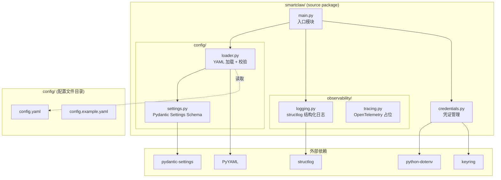
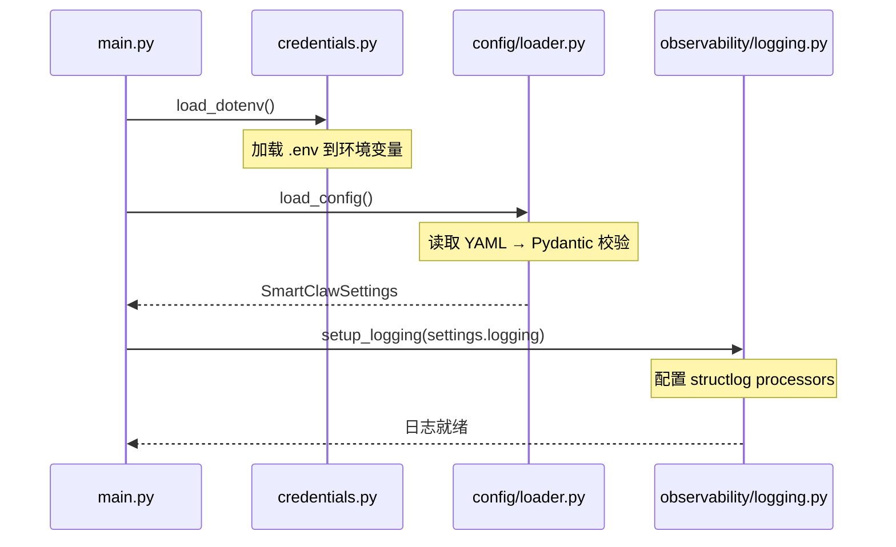
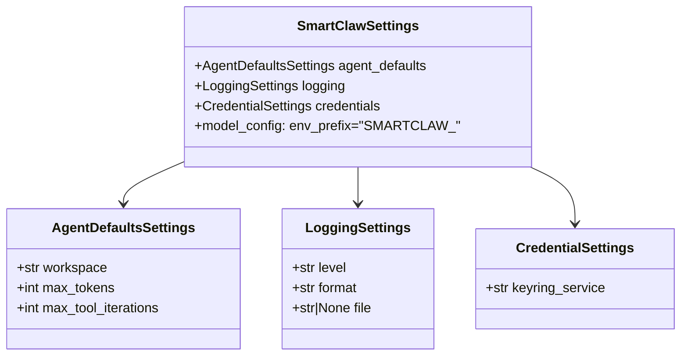

# Design Document: SmartClaw Project Skeleton

## Overview

SmartClaw Project Skeleton 是 SmartClaw 项目的基础工程骨架（Spec 1），为后续所有模块提供统一的工程基础设施。本设计涵盖以下核心子系统：

1. **项目初始化**：基于 uv 包管理器 + pyproject.toml 的现代 Python 构建环境
2. **目录结构**：遵循 Python 最佳实践的模块化目录布局
3. **结构化日志**：基于 structlog 的日志系统，支持 JSON/console 双格式输出
4. **配置管理**：YAML 配置文件 + Pydantic Settings 校验，支持环境变量覆盖
5. **凭证管理**：python-dotenv + keyring 的分层凭证解析
6. **代码质量**：mypy strict 类型检查 + ruff 代码检查/格式化

### 设计参考

| 参考来源 | 借鉴内容 |
|---------|---------|
| PicoClaw `pkg/config/` | 配置结构分层（defaults、envkeys、schema）、环境变量常量集中管理、DefaultConfig 模式 |
| PicoClaw `pkg/logger/` | 双输出（console + file）、组件绑定日志、日志级别动态切换、ParseLevel 模式 |
| PicoClaw `pkg/credential/` | 凭证解析优先级链（env → store）、SecureStore 内存安全存储 |

## Architecture

### 系统架构图



### 初始化顺序



### 设计决策

1. **凭证先于配置加载**：参考 PicoClaw 的做法，`.env` 文件在配置加载之前读取，确保 `SMARTCLAW_*` 环境变量可用于 Pydantic Settings 的环境变量覆盖。
2. **配置先于日志初始化**：日志格式和级别由配置驱动，因此配置加载在日志初始化之前完成。日志模块在配置加载前使用 Python 标准 `logging` 作为 fallback。
3. **Pydantic Settings 统一校验**：所有配置（YAML + 环境变量）通过 Pydantic BaseSettings 统一校验，提供类型安全和清晰的错误信息。

## Components and Interfaces

### 1. 配置管理模块 (`smartclaw/config/`)

#### `settings.py` — 配置 Schema 定义

```python
from pydantic import Field
from pydantic_settings import BaseSettings


class LoggingSettings(BaseSettings):
    level: str = Field(default="INFO", description="日志级别")
    format: str = Field(default="console", description="输出格式: console | json")
    file: str | None = Field(default=None, description="日志文件路径")


class AgentDefaultsSettings(BaseSettings):
    workspace: str = Field(default="~/.smartclaw/workspace", description="工作目录")
    max_tokens: int = Field(default=32768, description="最大 token 数")
    max_tool_iterations: int = Field(default=50, description="最大工具调用轮次")


class CredentialSettings(BaseSettings):
    keyring_service: str = Field(
        default="smartclaw", description="keyring 服务名"
    )


class SmartClawSettings(BaseSettings):
    """SmartClaw 根配置 Schema"""

    model_config = {"env_prefix": "SMARTCLAW_", "env_nested_delimiter": "__"}

    agent_defaults: AgentDefaultsSettings = Field(default_factory=AgentDefaultsSettings)
    logging: LoggingSettings = Field(default_factory=LoggingSettings)
    credentials: CredentialSettings = Field(default_factory=CredentialSettings)
```

#### `loader.py` — 配置加载器

```python
import yaml
from pathlib import Path
from .settings import SmartClawSettings

def load_config(config_path: Path | None = None) -> SmartClawSettings:
    """加载 YAML 配置并通过 Pydantic 校验"""
    ...

def dump_config(settings: SmartClawSettings) -> str:
    """将 Settings 对象序列化为 YAML 字符串"""
    ...
```

**关键接口**：
- `load_config(config_path?) → SmartClawSettings`：加载并校验配置，支持 `SMARTCLAW_CONFIG_PATH` 环境变量覆盖路径
- `dump_config(settings) → str`：将配置对象序列化回 YAML 格式（用于 round-trip 验证）

### 2. 结构化日志模块 (`smartclaw/observability/logging.py`)

参考 PicoClaw `pkg/logger/` 的设计模式：组件绑定、双输出、级别动态切换。

```python
import structlog

def setup_logging(settings: LoggingSettings) -> None:
    """根据配置初始化 structlog"""
    ...

def get_logger(component: str) -> structlog.BoundLogger:
    """获取绑定组件名的 logger 实例"""
    ...
```

**关键接口**：
- `setup_logging(settings)` — 配置 structlog processors（timestamp、log level、caller info）和 renderer（JSON / console）
- `get_logger(component) → BoundLogger` — 返回绑定 `component` 字段的 logger，参考 PicoClaw 的 `InfoC(component, message)` 模式

**structlog Processor 链**：
1. `structlog.stdlib.add_log_level` — 注入日志级别
2. `structlog.processors.TimeStamper(fmt="iso")` — ISO 格式时间戳
3. `structlog.processors.CallsiteParameterAdder` — 调用者信息（文件、行号、函数名）
4. `structlog.processors.StackInfoRenderer` — 堆栈信息
5. `structlog.processors.format_exc_info` — 异常格式化
6. Renderer: `structlog.dev.ConsoleRenderer` (dev) 或 `structlog.processors.JSONRenderer` (prod)

### 3. 凭证管理模块 (`smartclaw/credentials.py`)

参考 PicoClaw `pkg/credential/` 的 Resolver 模式：按优先级链解析凭证。

```python
def load_dotenv() -> None:
    """加载 .env 文件到环境变量"""
    ...

def get_credential(service: str, key: str) -> str:
    """按优先级解析凭证: 环境变量 → keyring"""
    ...

def set_credential(service: str, key: str, value: str) -> None:
    """存储凭证到系统 keyring"""
    ...

class CredentialNotFoundError(Exception):
    """凭证未找到异常"""
    ...
```

**凭证解析优先级**（参考 PicoClaw Resolver 模式）：
1. 环境变量：`{SERVICE}_{KEY}` 格式（大写，下划线分隔）
2. 系统 keyring：通过 `keyring.get_password(service, key)` 查询

### 4. 入口模块 (`smartclaw/main.py`)

```python
def main() -> None:
    """SmartClaw 入口函数，按顺序初始化各子系统"""
    ...
```

## Data Models

### 配置文件结构 (`config/config.yaml`)

```yaml
# SmartClaw Configuration
agent_defaults:
  workspace: "~/.smartclaw/workspace"
  max_tokens: 32768
  max_tool_iterations: 50

logging:
  level: "INFO"          # DEBUG | INFO | WARNING | ERROR | CRITICAL
  format: "console"      # console | json
  file: null             # 日志文件路径，null 表示不写文件

credentials:
  keyring_service: "smartclaw"
```

### 环境变量映射

参考 PicoClaw `envkeys.go` 的常量集中管理模式，所有环境变量使用 `SMARTCLAW_` 前缀：

| 环境变量 | 对应配置字段 | 默认值 | 说明 |
|---------|------------|--------|------|
| `SMARTCLAW_CONFIG_PATH` | — | `config/config.yaml` | 配置文件路径 |
| `SMARTCLAW_LOG_LEVEL` | `logging.level` | `INFO` | 日志级别 |
| `SMARTCLAW_LOG_FORMAT` | `logging.format` | `console` | 日志格式 |
| `SMARTCLAW_LOG_FILE` | `logging.file` | `None` | 日志文件路径 |
| `SMARTCLAW_AGENT_DEFAULTS__WORKSPACE` | `agent_defaults.workspace` | `~/.smartclaw/workspace` | 工作目录 |
| `SMARTCLAW_AGENT_DEFAULTS__MAX_TOKENS` | `agent_defaults.max_tokens` | `32768` | 最大 token |

### 目录结构

```
smartclaw/                          # 项目根目录（在 workspace 的 smartclaw/ 下）
├── smartclaw/                      # Python 源码包
│   ├── __init__.py                 # 包初始化，导出版本号
│   ├── main.py                     # 入口模块
│   ├── credentials.py              # 凭证管理
│   ├── config/                     # 配置子包
│   │   ├── __init__.py
│   │   ├── settings.py             # Pydantic Settings Schema
│   │   └── loader.py               # YAML 加载 + 校验
│   └── observability/              # 可观测性子包
│       ├── __init__.py
│       ├── logging.py              # structlog 结构化日志
│       └── tracing.py              # OpenTelemetry 占位
├── config/                         # 配置文件目录
│   ├── config.yaml                 # 默认配置（gitignore）
│   └── config.example.yaml         # 示例配置（带注释）
├── tests/                          # 测试目录
│   ├── __init__.py
│   ├── conftest.py                 # pytest fixtures
│   ├── test_config_loader.py       # 配置加载测试
│   ├── test_logging.py             # 日志测试
│   └── test_credentials.py         # 凭证管理测试
├── pyproject.toml                  # 项目配置 + 工具配置
├── Makefile                        # 开发任务
├── README.md                       # 项目文档
├── .gitignore                      # Git 忽略规则
├── .env.example                    # 环境变量示例
└── .env                            # 本地环境变量（gitignore）
```

### Pydantic Settings 类层次




## Correctness Properties

*A property is a characteristic or behavior that should hold true across all valid executions of a system — essentially, a formal statement about what the system should do. Properties serve as the bridge between human-readable specifications and machine-verifiable correctness guarantees.*

### Property 1: Configuration round-trip

*For any* valid `SmartClawSettings` object, serializing it to YAML via `dump_config` and then loading it back via `load_config` should produce an equivalent `SmartClawSettings` object.

**Validates: Requirements 4.1, 4.12, 4.13, 4.14**

### Property 2: Invalid configuration raises ValidationError

*For any* YAML configuration containing values that violate the Pydantic schema constraints (e.g., non-integer `max_tokens`, unknown log level type), loading it via `load_config` should raise a `ValidationError` that lists all invalid fields.

**Validates: Requirements 4.5**

### Property 3: Environment variable overrides configuration values

*For any* configuration field with a corresponding `SMARTCLAW_` prefixed environment variable set, the loaded `SmartClawSettings` should reflect the environment variable value rather than the YAML file value.

**Validates: Requirements 4.10**

### Property 4: Log output contains required structured fields

*For any* component name and log message, the structured log output should contain a timestamp, log level, caller information (file + line), and the bound component name.

**Validates: Requirements 3.4, 3.5**

### Property 5: Log format matches configuration

*For any* log message, when the format is configured as "json" the output should be valid JSON, and when configured as "console" the output should be human-readable non-JSON text.

**Validates: Requirements 3.2**

### Property 6: Log level filtering

*For any* configured log level L and any log message emitted at level M, the message should appear in the output if and only if M >= L (using the standard severity ordering DEBUG < INFO < WARNING < ERROR < CRITICAL).

**Validates: Requirements 3.6**

### Property 7: Dotenv loads all key-value pairs

*For any* set of key-value pairs written to a `.env` file, after calling `load_dotenv()`, each key should be present in `os.environ` with its corresponding value.

**Validates: Requirements 5.3**

### Property 8: Credential resolution priority

*For any* credential that exists in both the environment variable and the system keyring, `get_credential` should return the environment variable value (env takes priority over keyring).

**Validates: Requirements 5.6**

### Property 9: Credential keyring round-trip

*For any* service name, key, and value, calling `set_credential(service, key, value)` followed by `get_credential(service, key)` (with the environment variable unset) should return the original value.

**Validates: Requirements 5.8**

## Error Handling

### 配置加载错误

| 错误场景 | 异常类型 | 错误信息 |
|---------|---------|---------|
| YAML 文件不存在 | `FileNotFoundError` | 包含尝试的文件路径 |
| YAML 语法错误 | `yaml.YAMLError` | 包含行号和错误描述 |
| Pydantic 校验失败 | `pydantic.ValidationError` | 列出所有无效字段及约束 |

### 凭证管理错误

| 错误场景 | 异常类型 | 错误信息 |
|---------|---------|---------|
| 凭证未找到 | `CredentialNotFoundError` | 包含 service 和 key |
| keyring 后端不可用 | `keyring.errors.NoKeyringError` | 提示安装或配置 keyring 后端 |

### 日志错误

日志模块本身不应抛出异常。如果 structlog 初始化失败（如无效的日志级别字符串），应 fallback 到 Python 标准 `logging` 模块并输出警告。

### 错误处理原则

1. **Fail Fast**：配置和凭证错误在启动阶段立即暴露，不延迟到运行时
2. **描述性错误**：所有异常包含足够的上下文信息（路径、字段名、期望值）
3. **日志不中断**：日志系统故障不应导致主程序崩溃

## Testing Strategy

### 测试框架

- **单元测试**：pytest + pytest-asyncio
- **属性测试**：hypothesis（Python 生态最成熟的 property-based testing 库）
- **配置**：每个属性测试最少运行 100 次迭代

### 单元测试覆盖

| 测试文件 | 覆盖范围 |
|---------|---------|
| `tests/test_config_loader.py` | 配置加载、YAML 解析、默认值、环境变量覆盖、错误处理 |
| `tests/test_logging.py` | 日志初始化、级别过滤、格式输出、组件绑定、文件日志 |
| `tests/test_credentials.py` | dotenv 加载、keyring 读写、优先级解析、错误处理 |

### 属性测试覆盖

每个属性测试必须引用设计文档中的 Property 编号：

| 属性测试 | 对应 Property | 标签 |
|---------|-------------|------|
| `test_config_roundtrip` | Property 1 | Feature: smartclaw-project-skeleton, Property 1: Configuration round-trip |
| `test_invalid_config_validation` | Property 2 | Feature: smartclaw-project-skeleton, Property 2: Invalid configuration raises ValidationError |
| `test_env_override` | Property 3 | Feature: smartclaw-project-skeleton, Property 3: Environment variable overrides configuration values |
| `test_log_structured_fields` | Property 4 | Feature: smartclaw-project-skeleton, Property 4: Log output contains required structured fields |
| `test_log_format_matches_config` | Property 5 | Feature: smartclaw-project-skeleton, Property 5: Log format matches configuration |
| `test_log_level_filtering` | Property 6 | Feature: smartclaw-project-skeleton, Property 6: Log level filtering |
| `test_dotenv_loads_pairs` | Property 7 | Feature: smartclaw-project-skeleton, Property 7: Dotenv loads all key-value pairs |
| `test_credential_priority` | Property 8 | Feature: smartclaw-project-skeleton, Property 8: Credential resolution priority |
| `test_credential_roundtrip` | Property 9 | Feature: smartclaw-project-skeleton, Property 9: Credential keyring round-trip |

### 测试运行

```bash
# 运行所有测试
make test

# 仅运行属性测试
pytest tests/ -k "property" --run

# 类型检查
make typecheck

# 代码检查
make lint
```

### Hypothesis 配置

```python
from hypothesis import settings

# 全局配置：每个属性测试至少 100 次迭代
settings.register_profile("ci", max_examples=100)
settings.register_profile("dev", max_examples=50)
```
