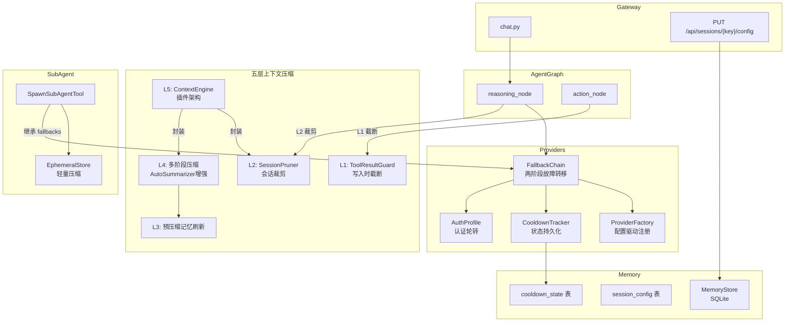
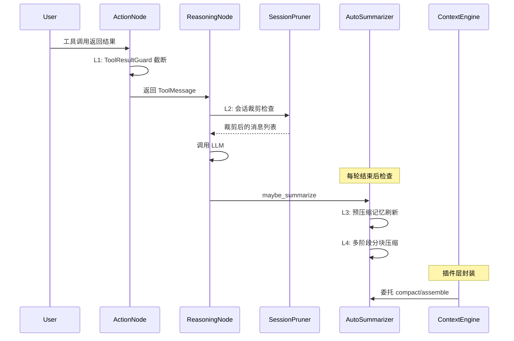

# 设计文档：Provider 配置化、上下文压缩与会话管理优化

## 概述

本设计覆盖 SmartClaw 的六大领域优化，将现有硬编码 Provider 注册改为配置驱动、引入 AuthProfile 认证轮转与两阶段 FallbackChain、构建五层上下文压缩体系（L1~L5）、增加会话级模型覆盖与 Token 统计、实现 Sub-Agent fallback 继承与 EphemeralStore 轻量压缩、以及 CooldownTracker 状态持久化。

核心设计原则：
- **向后兼容**：所有现有 API 签名保持不变，新功能通过配置开关控制
- **渐进增强**：五层压缩体系从写入时截断（L1）到插件架构（L5）逐层递进，每层独立可用
- **参考 OpenClaw**：L4 多阶段压缩参考 OpenClaw 的 `summarizeInStages`/`summarizeWithFallback`/`summarizeChunks` 实现，L1 截断参考 `capToolResultSize`/`truncateToolResultText` 的 head+tail 策略

## 架构

### 整体架构图



### 压缩层级触发流程



## 组件与接口

### 1. ProviderSpec 与配置驱动注册

**修改文件**: `smartclaw/providers/config.py`, `smartclaw/providers/factory.py`

```python
# config.py — 新增 ProviderSpec
class ProviderSpec(BaseSettings):
    """声明式提供商规格定义。"""
    name: str
    class_path: str  # e.g. "langchain_openai.ChatOpenAI"
    env_key: str  # e.g. "OPENAI_API_KEY"
    base_url: str | None = None
    model_field: str = "model"  # 模型参数字段名
    extra_params: dict[str, Any] | None = None

# config.py — ModelConfig 扩展
class AuthProfile(BaseSettings):
    """认证配置文件。"""
    profile_id: str
    provider: str
    env_key: str
    base_url: str | None = None

class ModelConfig(BaseSettings):
    primary: str = "kimi/kimi-k2.5"
    fallbacks: list[str] = [...]
    temperature: float = 0.0
    max_tokens: int = 32768
    # 新增字段
    auth_profiles: list[AuthProfile] = Field(default_factory=list)
    session_sticky: bool = False
    compaction_model: str | None = None
    identifier_policy: str = "strict"  # strict | custom | off
    identifier_patterns: list[str] = Field(default_factory=list)
```

```python
# factory.py — ProviderFactory 重构
class ProviderFactory:
    # 内置默认 ProviderSpec
    _BUILTIN_SPECS: dict[str, ProviderSpec] = {
        "openai": ProviderSpec(name="openai", class_path="langchain_openai.ChatOpenAI",
                               env_key="OPENAI_API_KEY"),
        "anthropic": ProviderSpec(name="anthropic", class_path="langchain_anthropic.ChatAnthropic",
                                  env_key="ANTHROPIC_API_KEY", model_field="model_name"),
        "kimi": ProviderSpec(name="kimi", class_path="langchain_openai.ChatOpenAI",
                             env_key="KIMI_API_KEY", base_url="https://api.moonshot.cn/v1"),
    }
    _custom_specs: ClassVar[dict[str, ProviderSpec]] = {}

    @classmethod
    def register_specs(cls, specs: list[ProviderSpec]) -> None:
        """从 config.yaml 注册自定义 ProviderSpec，覆盖同名内置。"""

    @classmethod
    def get_spec(cls, provider: str) -> ProviderSpec:
        """查找 ProviderSpec：custom > builtin，未找到抛 ValueError。"""

    @staticmethod
    def create(provider, model, *, api_key=None, api_base=None,
               temperature=0.0, max_tokens=32768, streaming=False) -> BaseChatModel:
        """签名不变，内部改为通过 ProviderSpec + importlib 动态创建。"""
```

### 2. 两阶段 FallbackChain 与 AuthProfile 轮转

**修改文件**: `smartclaw/providers/fallback.py`

```python
# FallbackCandidate 扩展
class FallbackCandidate(NamedTuple):
    provider: str
    model: str
    profile_id: str | None = None  # 新增：AuthProfile 标识

# CooldownTracker 变更
# - 冷却键从 provider 变为 profile_id（有 profile_id 时）或 provider（无 profile_id 时）
# - 新增 save_state / restore_state 方法

# FallbackChain.execute 两阶段逻辑
# 阶段1: 同一 provider 的不同 AuthProfile 轮转
# 阶段2: 不同 provider/model 切换
```

```python
class FallbackChain:
    async def execute(self, candidates: list[FallbackCandidate],
                      run: Callable) -> FallbackResult:
        """两阶段执行：
        1. 按 provider 分组，同一 provider 内先轮转 AuthProfile
        2. 所有 profile 耗尽后切换到下一个 provider/model
        """

    def _build_two_stage_candidates(
        self, candidates: list[FallbackCandidate],
        auth_profiles: list[AuthProfile],
    ) -> list[FallbackCandidate]:
        """构建两阶段候选列表：
        primary_profile_1, primary_profile_2, ..., fallback_1, fallback_2, ...
        """
```

### 3. L1 ToolResultGuard

**新文件**: `smartclaw/memory/tool_result_guard.py`

```python
@dataclass
class ToolResultGuardConfig:
    tool_result_max_chars: int = 30000
    head_chars: int = 12000
    tail_chars: int = 8000
    tool_overrides: dict[str, dict[str, int]] = field(default_factory=dict)
    # tool_overrides 示例: {"web_fetch": {"max_chars": 50000, "head_chars": 20000}}

class ToolResultGuard:
    def __init__(self, config: ToolResultGuardConfig | None = None): ...

    def cap_tool_result(self, content: str, tool_name: str = "") -> str:
        """对 ToolMessage content 执行 head+tail 截断。
        返回截断后的 content（如未超限则原样返回）。
        """

    def _get_limits(self, tool_name: str) -> tuple[int, int, int]:
        """获取工具的截断限制 (max_chars, head_chars, tail_chars)。"""
```

**修改**: `action_node` 在创建 ToolMessage 前调用 `ToolResultGuard.cap_tool_result`。

### 4. L2 SessionPruner

**新文件**: `smartclaw/memory/pruning.py`

```python
@dataclass
class SessionPrunerConfig:
    soft_trim_threshold: float = 0.5   # context_window 的百分比
    hard_clear_threshold: float = 0.7
    soft_trim_head: int = 500
    soft_trim_tail: int = 300
    keep_recent: int = 5
    keep_head: int = 2
    tool_allow_list: list[str] = field(default_factory=list)
    tool_deny_list: list[str] = field(default_factory=list)

class SessionPruner:
    def __init__(self, config: SessionPrunerConfig, context_window: int,
                 estimate_tokens_fn: Callable[[list[BaseMessage]], int]): ...

    def prune(self, messages: list[BaseMessage]) -> list[BaseMessage]:
        """对消息列表执行两级裁剪，返回裁剪后的消息列表（不修改原列表）。
        1. 估算 token 数
        2. 超过 soft_trim_threshold → 对中间 ToolMessage 软裁剪
        3. 超过 hard_clear_threshold → 对中间 ToolMessage 硬清除
        保留 keep_head 条头部消息和 keep_recent 条尾部消息不裁剪。
        """

    def _soft_trim(self, content: str) -> str:
        """保留前 soft_trim_head 字符 + 后 soft_trim_tail 字符。"""

    def _should_skip(self, msg: BaseMessage, tool_name: str) -> bool:
        """检查 allow_list/deny_list。"""
```

### 5. L3 预压缩记忆刷新 + L4 多阶段压缩

**修改文件**: `smartclaw/memory/summarizer.py`

```python
class AutoSummarizer:
    # 新增配置参数
    def __init__(self, ...,
                 compaction_model: str | None = None,
                 identifier_policy: str = "strict",
                 identifier_patterns: list[str] | None = None,
                 chunk_max_tokens: int = 4000,
                 part_max_tokens: int = 2000): ...

    # L3: 预压缩记忆刷新
    async def _memory_flush(self, session_key: str,
                            messages: list[BaseMessage]) -> None:
        """发送专用 prompt 提取关键标识符和决策要点，
        生成结构化摘要并追加到 MemoryStore。失败时仅记录警告。"""

    # L4: 多阶段压缩（替代原 maybe_summarize 中的简单摘要）
    async def _multi_stage_compact(self, session_key: str,
                                   messages: list[BaseMessage],
                                   existing_summary: str) -> str | None:
        """多阶段分块压缩：
        1. 按 chunk_max_tokens 在 turn boundary 分块
        2. 逐块顺序摘要（后续块包含前序摘要作为上下文）
        3. 单块摘要超 part_max_tokens 时拆分子块
        4. 合并部分摘要
        """

    async def _summarize_with_fallback(self, session_key: str,
                                       messages: list[BaseMessage],
                                       existing_summary: str) -> str | None:
        """渐进回退策略：
        1. 完整压缩
        2. 过滤超大 ToolMessage 后重试
        3. 硬编码回退文本
        """

    async def _overflow_recovery(self, session_key: str,
                                 messages: list[BaseMessage]) -> list[BaseMessage]:
        """溢出自动恢复：最多重试 3 次，指数退避，
        每次 chunk_max_tokens 减半。"""

    def _build_identifier_instructions(self) -> str:
        """根据 identifier_policy 构建标识符保留指令。"""

    def _get_compaction_model_config(self) -> ModelConfig:
        """返回压缩专用模型配置（如已配置），否则返回主模型配置。"""

    # 增强的 maybe_summarize
    async def maybe_summarize(self, session_key, messages) -> list[BaseMessage]:
        """集成 L3 + L4 逻辑：
        1. 检查阈值
        2. 执行 L3 预压缩记忆刷新
        3. 执行 L4 多阶段压缩
        4. 渐进回退
        """
```

### 6. L5 ContextEngine 插件架构

**新目录**: `smartclaw/context_engine/`

```python
# interface.py
class ContextEngine(ABC):
    """上下文引擎抽象接口，定义上下文生命周期。"""

    @abstractmethod
    async def bootstrap(self, session_key: str, system_prompt: str | None = None) -> None: ...

    @abstractmethod
    async def ingest(self, message: BaseMessage) -> None: ...

    @abstractmethod
    async def assemble(self, messages: list[BaseMessage],
                       system_prompt: str | None = None) -> list[BaseMessage]: ...

    @abstractmethod
    async def after_turn(self, session_key: str,
                         messages: list[BaseMessage]) -> list[BaseMessage]: ...

    @abstractmethod
    async def compact(self, session_key: str,
                      messages: list[BaseMessage],
                      force: bool = False) -> list[BaseMessage]: ...

    @abstractmethod
    async def maintain(self) -> None: ...

    @abstractmethod
    async def dispose(self) -> None: ...

    # Sub-Agent 生命周期钩子
    @abstractmethod
    async def prepare_subagent_spawn(self, task: str,
                                     parent_context: dict[str, Any]) -> dict[str, Any]: ...

    @abstractmethod
    async def on_subagent_ended(self, task: str, result: str) -> None: ...
```

```python
# legacy.py
class LegacyContextEngine(ContextEngine):
    """默认实现，封装现有 AutoSummarizer 逻辑。"""

    def __init__(self, summarizer: AutoSummarizer, store: MemoryStore,
                 pruner: SessionPruner | None = None): ...

    async def assemble(self, messages, system_prompt=None):
        return await self._summarizer.build_context(self._session_key, messages, system_prompt)

    async def after_turn(self, session_key, messages):
        return await self._summarizer.maybe_summarize(session_key, messages)

    async def compact(self, session_key, messages, force=False):
        if force:
            return await self._summarizer.force_compression(session_key, messages)
        return await self._summarizer.maybe_summarize(session_key, messages)
```

```python
# registry.py
class ContextEngineRegistry:
    """上下文引擎注册中心。"""
    _engines: ClassVar[dict[str, type[ContextEngine]]] = {}

    @classmethod
    def register(cls, name: str, engine_cls: type[ContextEngine]) -> None: ...

    @classmethod
    def get(cls, name: str) -> type[ContextEngine]: ...

    @classmethod
    def create(cls, name: str, **kwargs) -> ContextEngine: ...
```

### 7. 会话级模型覆盖与 Token 统计

**修改文件**: `smartclaw/agent/state.py`, `smartclaw/gateway/models.py`, `smartclaw/gateway/routers/chat.py`, `smartclaw/memory/store.py`

```python
# state.py — AgentState 扩展
class TokenStats(TypedDict):
    prompt_tokens: int
    completion_tokens: int
    total_tokens: int

class AgentState(TypedDict):
    # ... 现有字段 ...
    token_stats: TokenStats | None  # 新增
```

```python
# models.py — ChatResponse 扩展
class ChatResponse(BaseModel):
    # ... 现有字段 ...
    token_stats: dict[str, int] | None = None  # 新增

# models.py — 新增
class SessionConfigRequest(BaseModel):
    model: str | None = None
```

```python
# store.py — MemoryStore 新增表和方法
# session_config 表: session_key TEXT PK, model_override TEXT, config_json TEXT, updated_at TIMESTAMP
# cooldown_state 表: profile_id TEXT PK, error_count INT, cooldown_end_utc TEXT, ...

class MemoryStore:
    async def get_session_config(self, session_key: str) -> dict[str, Any] | None: ...
    async def set_session_config(self, session_key: str, model_override: str | None = None,
                                 config_json: str | None = None) -> None: ...
    async def get_cooldown_states(self) -> list[dict[str, Any]]: ...
    async def set_cooldown_state(self, profile_id: str, error_count: int,
                                 cooldown_end_utc: str, last_failure_utc: str,
                                 failure_counts_json: str) -> None: ...
    async def delete_cooldown_state(self, profile_id: str) -> None: ...
```

### 8. Sub-Agent Fallback 继承与 EphemeralStore 压缩

**修改文件**: `smartclaw/agent/sub_agent.py`

```python
# SpawnSubAgentTool 扩展
class SpawnSubAgentTool(BaseTool):
    parent_model_config: ModelConfig | None = None  # 新增：父 Agent 的 ModelConfig

    async def _arun(self, task, model="", **kwargs):
        # 构建 SubAgentConfig 时使用 parent_model_config.fallbacks
        ...

# SubAgentConfig 扩展
@dataclass
class SubAgentConfig:
    # ... 现有字段 ...
    fallbacks: list[str] = field(default_factory=list)  # 新增

# EphemeralStore 扩展
class EphemeralStore:
    def __init__(self, max_size=50, compact_threshold: float = 0.8): ...

    def _compact_if_needed(self) -> None:
        """当消息数 > max_size * compact_threshold 时，
        对中间 ToolMessage 执行 L2 风格软裁剪。"""
```

### 9. CooldownTracker 状态持久化

**修改文件**: `smartclaw/providers/fallback.py`

```python
class CooldownTracker:
    async def save_state(self, store: MemoryStore) -> None:
        """将所有冷却条目序列化写入 cooldown_state 表。"""

    async def restore_state(self, store: MemoryStore) -> None:
        """从 cooldown_state 表恢复冷却状态。
        - 跳过已过期记录
        - UTC 时间戳转换为 monotonic 偏移量
        """

    def mark_failure(self, provider: str, reason: FailoverReason,
                     store: MemoryStore | None = None) -> None:
        """记录失败后，fire-and-forget 调用 save_state。"""

    def mark_success(self, provider: str,
                     store: MemoryStore | None = None) -> None:
        """重置后，fire-and-forget 调用 save_state。"""
```

## 数据模型

### 新增数据库表

```sql
-- session_config 表（需求 8）
CREATE TABLE IF NOT EXISTS session_config (
    session_key TEXT PRIMARY KEY,
    model_override TEXT,
    config_json TEXT DEFAULT '{}',
    updated_at TIMESTAMP DEFAULT CURRENT_TIMESTAMP
);

-- cooldown_state 表（需求 10）
CREATE TABLE IF NOT EXISTS cooldown_state (
    profile_id TEXT PRIMARY KEY,
    error_count INTEGER NOT NULL DEFAULT 0,
    cooldown_end_utc TEXT NOT NULL,
    last_failure_utc TEXT NOT NULL,
    failure_counts_json TEXT DEFAULT '{}'
);
```

### 配置 Schema 扩展

```yaml
# config.yaml 扩展示例
providers:
  - name: deepseek
    class_path: "langchain_openai.ChatOpenAI"
    env_key: "DEEPSEEK_API_KEY"
    base_url: "https://api.deepseek.com/v1"
    model_field: "model"
    extra_params:
      timeout: 60

model:
  primary: "kimi/kimi-k2.5"
  fallbacks:
    - "openai/gpt-4o"
    - "anthropic/claude-sonnet-4-20250514"
  temperature: 0.0
  max_tokens: 32768
  auth_profiles:
    - profile_id: "kimi-key-1"
      provider: "kimi"
      env_key: "KIMI_API_KEY_1"
    - profile_id: "kimi-key-2"
      provider: "kimi"
      env_key: "KIMI_API_KEY_2"
  session_sticky: false
  compaction_model: "openai/gpt-4o-mini"
  identifier_policy: "strict"

memory:
  enabled: true
  db_path: "~/.smartclaw/memory.db"
  summary_threshold: 20
  keep_recent: 5
  summarize_token_percent: 70
  context_window: 128000
  # L1 配置
  tool_result_max_chars: 30000
  tool_result_head_chars: 12000
  tool_result_tail_chars: 8000
  tool_overrides:
    web_fetch:
      max_chars: 50000
      head_chars: 20000
      tail_chars: 10000
  # L2 配置
  soft_trim_threshold: 0.5
  hard_clear_threshold: 0.7
  pruner_keep_recent: 5
  pruner_keep_head: 2
  tool_allow_list: []
  tool_deny_list: []
  # L4 配置
  chunk_max_tokens: 4000
  part_max_tokens: 2000

context_engine: "legacy"  # 默认使用 LegacyContextEngine
```

### Settings 模型扩展

```python
# settings.py — MemorySettings 扩展
class MemorySettings(BaseSettings):
    # ... 现有字段 ...
    # L1
    tool_result_max_chars: int = 30000
    tool_result_head_chars: int = 12000
    tool_result_tail_chars: int = 8000
    tool_overrides: dict[str, dict[str, int]] = Field(default_factory=dict)
    # L2
    soft_trim_threshold: float = 0.5
    hard_clear_threshold: float = 0.7
    pruner_keep_recent: int = 5
    pruner_keep_head: int = 2
    tool_allow_list: list[str] = Field(default_factory=list)
    tool_deny_list: list[str] = Field(default_factory=list)
    # L4
    chunk_max_tokens: int = 4000
    part_max_tokens: int = 2000
```

## 正确性属性 (Correctness Properties)

*属性（Property）是在系统所有有效执行中都应成立的特征或行为——本质上是关于系统应该做什么的形式化陈述。属性是人类可读规格说明与机器可验证正确性保证之间的桥梁。*

### Property 1: ProviderSpec 注册与查找一致性

*For any* list of ProviderSpec objects registered via `ProviderFactory.register_specs`, calling `ProviderFactory.get_spec(name)` for each registered name should return a ProviderSpec whose `class_path`, `env_key`, `base_url`, `model_field`, and `extra_params` match the registered spec exactly.

**Validates: Requirements 1.1**

### Property 2: ProviderSpec 覆盖内置默认值

*For any* ProviderSpec whose `name` matches a built-in provider name (openai/anthropic/kimi), after registering it via `register_specs`, `get_spec(name)` should return the custom spec (not the built-in default), and the custom spec's `class_path` should equal the registered value.

**Validates: Requirements 1.3**

### Property 3: 无效 class_path 抛出 ValueError

*For any* provider name registered with a `class_path` pointing to a non-existent module or class, calling `ProviderFactory.create(provider, model)` should raise `ValueError` with a message containing the invalid module/class name.

**Validates: Requirements 1.5**

### Property 4: 缺失 API Key 抛出 ValueError

*For any* ProviderSpec whose `env_key` environment variable is not set, calling `ProviderFactory.create(provider, model)` without providing `api_key` should raise `ValueError` with a message mentioning the required environment variable.

**Validates: Requirements 1.6**

### Property 5: extra_params 透传

*For any* ProviderSpec with a non-empty `extra_params` dict, the parameters should be passed through to the LangChain class constructor during `ProviderFactory.create`.

**Validates: Requirements 1.7**

### Property 6: AuthProfile 配置序列化往返

*For any* ModelConfig containing a list of AuthProfile objects, serializing to dict and deserializing back should produce an equivalent ModelConfig with the same auth_profiles (profile_id, provider, env_key, base_url preserved).

**Validates: Requirements 2.1**

### Property 7: 两阶段 FallbackChain 执行顺序

*For any* set of FallbackCandidates where the primary provider has multiple AuthProfiles, when the first profile fails with RATE_LIMIT, the FallbackChain should attempt the next AuthProfile of the same provider before trying any candidate from a different provider. When all profiles of the primary provider are in cooldown, the chain should proceed to the next provider/model in the fallbacks list.

**Validates: Requirements 2.2, 2.4, 2.5**

### Property 8: CooldownTracker profile_id 独立性

*For any* two FallbackCandidates with the same provider but different profile_ids, marking failure on one profile_id should not affect the availability of the other profile_id.

**Validates: Requirements 2.3**

### Property 9: 空 AuthProfile 向后兼容

*For any* FallbackChain execution where auth_profiles is an empty list, the behavior should be identical to the current single-key fallback: candidates are tried in order by provider/model without any profile-level rotation.

**Validates: Requirements 2.7**

### Property 10: session_sticky 优先使用上次成功的 AuthProfile

*For any* session with `session_sticky=True`, after a successful call using a specific AuthProfile, subsequent calls within the same session should attempt that profile first (before other profiles of the same provider).

**Validates: Requirements 2.8**

### Property 11: L1 工具结果截断 — head+tail 保留

*For any* string content longer than `tool_result_max_chars`, after `ToolResultGuard.cap_tool_result`, the result should: (a) start with the first `head_chars` characters of the original, (b) end with the last `tail_chars` characters of the original, (c) contain a truncation suffix that includes the original content length, and (d) have total length ≤ `head_chars + tail_chars + len(suffix)`.

**Validates: Requirements 3.2, 3.3**

### Property 12: L1 截断不修改短内容

*For any* string content with length ≤ `tool_result_max_chars`, `ToolResultGuard.cap_tool_result` should return the original content unchanged.

**Validates: Requirements 3.1**

### Property 13: L1 工具专属截断阈值

*For any* tool name present in `tool_overrides`, `ToolResultGuard` should use that tool's specific `max_chars`/`head_chars`/`tail_chars` values instead of the global defaults. For tool names not in `tool_overrides`, the global defaults should be used.

**Validates: Requirements 3.4, 3.5**

### Property 14: L2 两级裁剪阈值行为

*For any* message list where estimated tokens exceed `soft_trim_threshold`, after `SessionPruner.prune`, ToolMessages in the prunable range should have their content shortened (soft-trimmed to head+tail). For any message list where estimated tokens exceed `hard_clear_threshold`, ToolMessages in the prunable range should have their content replaced with placeholder text `[tool result cleared - {tool_name}]`.

**Validates: Requirements 4.2, 4.3, 4.4**

### Property 15: L2 裁剪保留头尾消息

*For any* message list and any pruning operation, the first `keep_head` messages and the last `keep_recent` messages should remain unchanged (content identical to the original).

**Validates: Requirements 4.6**

### Property 16: L2 allow_list 消息不被裁剪

*For any* message list containing ToolMessages from tools in `tool_allow_list`, those ToolMessages should never be modified by the SessionPruner, regardless of token thresholds.

**Validates: Requirements 4.5**

### Property 17: L3 摘要追加合并

*For any* existing summary string and new L3 flush summary, after `_memory_flush`, the summary stored in MemoryStore should equal `existing_summary + "\n\n---\n\n" + new_flush_summary`.

**Validates: Requirements 5.3**

### Property 18: L3 失败不中断 L4

*For any* L3 memory flush that fails (LLM call raises exception), the L4 multi-stage compaction should still execute and produce a valid summary.

**Validates: Requirements 5.1, 5.4**

### Property 19: L4 分块在 turn boundary 切分

*For any* message list chunked by `_multi_stage_compact`, each chunk boundary should occur at a HumanMessage position, and no AIMessage with tool_calls should be separated from its corresponding ToolMessages within the same chunk.

**Validates: Requirements 6.1**

### Property 20: L4 渐进回退策略

*For any* compression attempt, if the initial full compression still exceeds the context window, the system should attempt: (1) filtering oversized ToolMessages and re-compressing, then (2) using hardcoded fallback text. The final result should always fit within the context window or use the hardcoded fallback.

**Validates: Requirements 6.4**

### Property 21: L4 identifier_policy 指令生成

*For any* `identifier_policy` value, `_build_identifier_instructions` should return: non-empty preservation instructions for "strict", user-specified patterns for "custom", and empty string for "off".

**Validates: Requirements 6.5**

### Property 22: L4 溢出自动恢复重试

*For any* post-compression state that still exceeds the context window, the overflow recovery should retry up to 3 times, with each retry using `chunk_max_tokens` halved from the previous attempt.

**Validates: Requirements 6.7**

### Property 23: 上下文溢出错误检测触发 force_compression

*For any* HTTP 400 error whose message contains keywords "context", "token", or "length", `reasoning_node` should trigger `force_compression` and retry the LLM call.

**Validates: Requirements 6.8**

### Property 24: ContextEngineRegistry 注册往返

*For any* ContextEngine subclass registered with a name via `ContextEngineRegistry.register`, calling `ContextEngineRegistry.get(name)` should return the same class.

**Validates: Requirements 7.4**

### Property 25: 会话模型覆盖解析

*For any* session with a stored `model_override` in session_config, when a chat request arrives without a `model` field, the system should use the stored `model_override` to build the graph.

**Validates: Requirements 8.3**

### Property 26: Token 统计累加

*For any* sequence of LLM calls where AIMessage contains `usage_metadata`, the final `token_stats` in AgentState should equal the sum of all individual `prompt_tokens`, `completion_tokens`, and `total_tokens`. When `usage_metadata` is absent, `estimate_tokens` should be used as fallback, and the result should still be a non-negative integer.

**Validates: Requirements 8.5, 8.7**

### Property 27: Sub-Agent fallback 继承

*For any* parent Agent with a non-empty `fallbacks` list in its ModelConfig, the Sub-Agent's ModelConfig should contain the same fallbacks list, unless the Sub-Agent explicitly specifies different fallbacks.

**Validates: Requirements 9.2**

### Property 28: EphemeralStore 轻量压缩触发

*For any* EphemeralStore where message count exceeds `max_size * compact_threshold`, adding a new message should trigger soft-trimming of middle ToolMessages, resulting in reduced total content size while preserving message count and the most recent messages' content.

**Validates: Requirements 9.3**

### Property 29: CooldownTracker 状态持久化往返

*For any* CooldownTracker with active cooldown entries, calling `save_state(store)` followed by creating a new CooldownTracker and calling `restore_state(store)` should produce equivalent cooldown state: the same profile_ids should be in cooldown, with approximately the same remaining cooldown duration (within 2 seconds tolerance for timing).

**Validates: Requirements 10.2, 10.3**

### Property 30: CooldownTracker mark_failure 触发持久化

*For any* `mark_failure` or `mark_success` call on a CooldownTracker with a MemoryStore, the cooldown_state table should be updated to reflect the new state (fire-and-forget, verified after awaiting).

**Validates: Requirements 10.4**

### Property 31: 过期冷却状态不恢复

*For any* cooldown_state record in the database where `cooldown_end_utc` is earlier than the current UTC time, after `restore_state`, that `profile_id` should not be in cooldown (`is_available` returns True).

**Validates: Requirements 10.6, 10.7**

## 错误处理

### Provider 层错误

| 错误场景 | 处理策略 |
|---------|---------|
| `class_path` 模块不存在 | `ProviderFactory.create` 抛出 `ValueError`，包含缺失模块名 |
| `env_key` 环境变量未设置 | `ProviderFactory.create` 抛出 `ValueError`，提示设置环境变量 |
| `importlib` 导入失败 | 捕获 `ImportError`/`AttributeError`，转换为 `ValueError` |
| AuthProfile 的 env_key 未设置 | 跳过该 profile，记录警告，尝试下一个 profile |

### FallbackChain 错误

| 错误场景 | 处理策略 |
|---------|---------|
| 单个 AuthProfile RATE_LIMIT | 标记 profile_id 冷却，轮转到同 provider 下一个 profile |
| 同 provider 所有 profile 冷却 | 进入第二阶段，尝试 fallbacks 中的下一个 provider/model |
| 所有候选耗尽 | 抛出 `FallbackExhaustedError`，包含所有尝试记录 |
| FORMAT 错误 | 立即中止，不重试（非瞬态错误） |

### 压缩层错误

| 错误场景 | 处理策略 |
|---------|---------|
| L3 记忆刷新 LLM 调用失败 | 记录 `warning` 日志，继续执行 L4 压缩 |
| L4 单块摘要 LLM 失败 | 重试 3 次（指数退避 500ms~5s），全部失败则跳过该块 |
| L4 压缩后仍超出上下文 | 溢出恢复：最多 3 次重试，chunk_max_tokens 每次减半 |
| L4 溢出恢复全部失败 | 使用硬编码回退文本替换全部历史 |
| reasoning_node 检测到上下文溢出 | 触发 `force_compression`，然后重试 LLM 调用 |
| SessionPruner 估算 token 失败 | 返回原始消息列表不做裁剪 |

### 持久化错误

| 错误场景 | 处理策略 |
|---------|---------|
| CooldownTracker save_state 失败 | fire-and-forget，记录 `warning`，不阻塞主流程 |
| CooldownTracker restore_state 失败 | 记录 `warning`，使用空状态启动 |
| session_config 表查询失败 | 回退到请求中的 model 或默认 model |
| MemoryStore 连接断开 | 各操作独立 try/except，记录错误，降级运行 |

## 测试策略

### 双轨测试方法

本功能采用单元测试 + 属性测试（Property-Based Testing）双轨策略：

- **单元测试**：验证具体示例、边界条件、错误处理路径
- **属性测试**：验证跨所有输入的通用属性，使用 `hypothesis` 库

### 属性测试配置

- **库**: Python `hypothesis`
- **最小迭代次数**: 每个属性测试 100 次（`@settings(max_examples=100)`）
- **标签格式**: 每个测试用注释标注对应的设计属性
  ```python
  # Feature: smartclaw-provider-context-optimization, Property 11: L1 工具结果截断 — head+tail 保留
  ```
- **每个正确性属性对应一个属性测试函数**

### 单元测试重点

| 测试领域 | 重点内容 |
|---------|---------|
| ProviderFactory | 内置 3 个默认 spec 存在（Req 1.2）、create 签名不变（Req 1.8） |
| FallbackCandidate | profile_id 字段存在（Req 2.6） |
| ContextEngine | 接口定义完整性（Req 7.1, 7.2）、LegacyContextEngine isinstance 检查（Req 7.3）、默认引擎为 Legacy（Req 7.6） |
| MemoryStore | session_config 表存在（Req 8.1）、cooldown_state 表存在（Req 10.1） |
| Gateway | PUT /api/sessions/{key}/config 端点存在（Req 8.2） |
| AgentState | token_stats 字段存在（Req 8.4）、ChatResponse 包含 token_stats（Req 8.6） |
| SpawnSubAgentTool | 接受 parent_model_config 参数（Req 9.1） |
| 启动流程 | restore_state 在 setup_agent_runtime 中被调用（Req 10.5） |
| L3 失败处理 | LLM 失败时 L4 仍执行（Req 5.4） |
| L4 compaction_model | 使用配置的压缩模型（Req 6.6） |
| L4 子块拆分 | 摘要超 part_max_tokens 时拆分（Req 6.3） |

### 属性测试重点

每个正确性属性（Property 1~31）对应一个 hypothesis 属性测试。关键生成器策略：

- **ProviderSpec 生成器**: 随机 name、class_path、env_key 组合
- **消息列表生成器**: 随机长度的 HumanMessage/AIMessage/ToolMessage 序列，确保 tool_call 配对
- **AuthProfile 生成器**: 随机 profile_id、provider、env_key
- **FallbackCandidate 生成器**: 随机 provider/model/profile_id 组合
- **CooldownEntry 生成器**: 随机 error_count、cooldown_end（过去/未来）、failure_counts

### 集成测试

- ProviderFactory 端到端：注册自定义 spec → create → 验证实例类型
- FallbackChain 两阶段：模拟多 AuthProfile 失败 → 验证轮转顺序
- L1→L2→L4 压缩链路：大工具结果 → 截断 → 裁剪 → 压缩 → 验证最终上下文大小
- CooldownTracker 持久化：save → 重启 → restore → 验证状态恢复
- 会话模型覆盖：PUT config → chat 请求 → 验证使用覆盖模型
