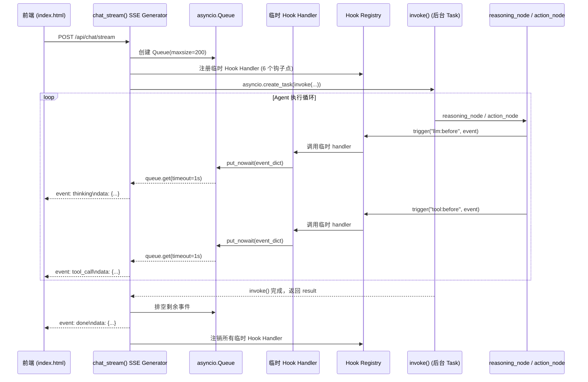
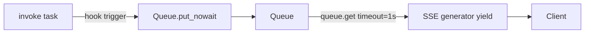

# 设计文档：SSE 实时流式展示 Agent 执行全过程

## 概述

本设计将 SmartClaw Gateway 的 `/api/chat/stream` SSE 端点从"阻塞等待 → 一次性返回"模式改造为"实时推送中间事件"模式。核心思路是：利用已有的 Hook Registry 系统，在每个 SSE 请求中注册临时 hook handler，通过 `asyncio.Queue` 将 Agent 执行过程中的 hook 事件桥接到 SSE generator，实现并发的 invoke 执行与事件消费。

改动范围：
- `gateway/routers/chat.py` — 重写 `chat_stream()` 的 `event_generator()`
- `gateway/static/index.html` — 前端 JS 处理新的 SSE 事件类型
- 同步 `/api/chat` 端点不变

## 架构

### 数据流



### 并发模型

SSE generator 内部使用 `asyncio.create_task` 将 `invoke()` 作为后台任务执行。generator 主循环以 1 秒超时从 Queue 读取事件，实现：
- invoke() 在后台执行，hook 触发时事件写入 Queue
- generator 主循环从 Queue 读取并 yield SSE 事件
- invoke() 完成后，generator 排空 Queue 并发送最终事件



## 组件与接口

### 1. 临时 Hook Handler 工厂

在 `chat_stream()` 内部定义，不需要新模块：

```python
def _make_queue_handler(queue: asyncio.Queue, hook_point: str):
    """为指定 hook_point 创建一个将事件写入 queue 的 handler。"""
    async def handler(event: HookEvent) -> None:
        try:
            queue.put_nowait({"hook_point": hook_point, **event.to_dict()})
        except asyncio.QueueFull:
            pass  # 丢弃，不阻塞
    return handler
```

### 2. Hook Handler 生命周期管理

```python
STREAM_HOOK_POINTS = ["tool:before", "tool:after", "llm:before", "llm:after", "agent:start", "agent:end"]

# 注册
handlers = {}
for hp in STREAM_HOOK_POINTS:
    h = _make_queue_handler(queue, hp)
    hook_registry.register(hp, h)
    handlers[hp] = h

# 注销 (在 finally 块中)
for hp, h in handlers.items():
    hook_registry.unregister(hp, h)
```

### 3. SSE Generator 核心逻辑

```python
async def event_generator():
    queue = asyncio.Queue(maxsize=200)
    handlers = _register_handlers(queue)
    try:
        # 启动 invoke 后台任务
        task = asyncio.create_task(invoke(...))
        
        # 主循环：从 queue 读取事件
        while not task.done():
            try:
                evt = await asyncio.wait_for(queue.get(), timeout=1.0)
                yield _format_sse(evt)
            except asyncio.TimeoutError:
                continue
        
        # 排空剩余事件
        while not queue.empty():
            evt = queue.get_nowait()
            yield _format_sse(evt)
        
        # 发送最终事件
        result = task.result()
        yield {"event": "done", "data": json.dumps({...}, ensure_ascii=False)}
    except Exception as exc:
        yield {"event": "error", "data": json.dumps({"error": str(exc)}, ensure_ascii=False)}
    finally:
        _unregister_handlers(handlers)
```

### 4. Hook 事件到 SSE 事件的映射

| Hook Point | SSE Event Type | Data 字段 |
|---|---|---|
| `llm:before` | `thinking` | `{"status": "reasoning", "iteration": N}` |
| `tool:before` | `tool_call` | `{"tool_name": "...", "args": {...}, "tool_call_id": "..."}` |
| `tool:after` | `tool_result` | `{"tool_name": "...", "result": "...(≤256)", "duration_ms": N, "success": bool}` |
| `agent:start` | `iteration` | `{"current": N, "max": M}` |
| `agent:end` | _(不单独推送，信息合并到 done)_ | — |
| `llm:after` | _(不单独推送，用于内部追踪)_ | — |

### 5. 前端事件处理 (index.html)

在现有 `handleEvent()` 函数中扩展对新事件类型的处理：

- `thinking` — 更新流式消息文本为 "⏳ 思考中...（第 N 轮）"
- `tool_call` — 插入工具调用消息（已有逻辑，增强显示参数）
- `tool_result` — 插入工具结果消息（已有逻辑，增强显示耗时和状态）
- `iteration` — 更新流式消息文本为 "🔄 迭代 N/M"
- `done` — 更新最终回答（已有逻辑）
- `error` — 显示错误（已有逻辑）

## 数据模型

### SSE 事件 Data 结构

```python
# thinking 事件
{"status": "reasoning", "iteration": 1}

# tool_call 事件
{"tool_name": "web_search", "args": {"query": "..."}, "tool_call_id": "call_abc123"}

# tool_result 事件
{"tool_name": "web_search", "result": "搜索结果摘要...", "duration_ms": 1234.5, "success": True}

# iteration 事件
{"current": 2, "max": 50}

# done 事件
{"session_key": "uuid-...", "response": "最终回答...", "iterations": 3}

# error 事件
{"error": "连接超时"}
```

### 内部 Queue 事件格式

Queue 中传递的是 dict，由 `_make_queue_handler` 生成：

```python
{
    "hook_point": "tool:before",  # 原始 hook point，用于映射 SSE 事件类型
    "tool_name": "web_search",
    "tool_args": {"query": "..."},
    "tool_call_id": "call_abc123",
    "timestamp": "2024-01-01T00:00:00+00:00"
}
```

`_format_sse()` 函数根据 `hook_point` 映射到对应的 SSE 事件类型和 data 结构。


## 正确性属性 (Correctness Properties)

*属性（Property）是在系统所有合法执行路径中都应成立的特征或行为——本质上是对系统应做什么的形式化陈述。属性是人类可读规格说明与机器可验证正确性保证之间的桥梁。*

### Property 1: Hook handler 事件写入 Queue 的完整性

*For any* HookEvent 实例和任意 hook_point，当临时 hook handler 被调用时，Queue 中应新增一个字典，该字典包含原始 HookEvent 的 `to_dict()` 所有字段以及 `hook_point` 字段。当 Queue 已满时，handler 不应阻塞，且 Queue 大小保持不变。

**Validates: Requirements 1.3, 1.4**

### Property 2: Hook 事件到 SSE 事件的映射正确性

*For any* hook 事件字典（包含 `hook_point` 字段），`_format_sse()` 映射函数应返回一个包含 `event` 和 `data` 键的字典，其中：
- `hook_point="llm:before"` → `event="thinking"`，data 包含 `status`（字符串）和 `iteration`（整数）
- `hook_point="tool:before"` → `event="tool_call"`，data 包含 `tool_name`（字符串）、`args`（对象）、`tool_call_id`（字符串）
- `hook_point="tool:after"` → `event="tool_result"`，data 包含 `tool_name`（字符串）、`result`（字符串，长度 ≤ 256）、`duration_ms`（数值）、`success`（布尔值）
- `hook_point="agent:start"` → `event="iteration"`，data 包含 `current`（整数）和 `max`（整数）

**Validates: Requirements 2.1, 2.2, 2.3, 2.4, 6.1, 6.2, 6.3, 6.4, 6.5**

### Property 3: 临时 Handler 注册与注销的完整性

*For any* SSE 请求的生命周期（无论正常完成、异常还是客户端断开），在 generator 启动后所有 6 个钩子点（`tool:before`、`tool:after`、`llm:before`、`llm:after`、`agent:start`、`agent:end`）都应有临时 handler 注册；在 generator 结束后，所有临时 handler 都应被注销，且 Hook Registry 中原有的其他 handler 不受影响。

**Validates: Requirements 1.2, 1.5, 1.6, 5.4**

### Property 4: 事件消费完整性与最终事件保证

*For any* invoke 执行过程中产生的 N 个 hook 事件，SSE generator 应 yield 恰好 N 个中间 SSE 事件，且最后一个 yield 的事件类型必须是 `done`（invoke 成功时）或 `error`（invoke 异常时）。done 事件的 data 必须包含 `session_key`、`response`、`iterations` 字段。

**Validates: Requirements 3.2, 3.3, 3.4, 2.5, 2.6, 5.3, 6.6, 6.7**

### Property 5: JSON 序列化保留非 ASCII 字符

*For any* SSE 事件的 data 字段中包含的非 ASCII 字符（如中文），JSON 序列化后的字符串应直接包含原始字符，而非 `\uXXXX` 转义序列。

**Validates: Requirements 2.7, 6.8**

### Property 6: 同步端点向后兼容

*For any* 有效的 ChatRequest，同步 `POST /api/chat` 端点的请求/响应格式应与改造前完全一致：接受 ChatRequest，返回 ChatResponse（包含 `session_key`、`response`、`iterations`、`error` 字段）。

**Validates: Requirements 5.1, 5.2**

## 错误处理

### 后端错误处理

| 场景 | 处理方式 |
|---|---|
| `invoke()` 抛出异常 | 捕获异常，推送 `event: error`，在 finally 中注销 handler |
| Queue 已满 | `put_nowait` 捕获 `QueueFull`，静默丢弃事件 |
| 客户端断开 | generator 被 GC/cancelled，finally 块注销 handler，cancel invoke task |
| hook handler 内部异常 | Hook Registry 已有错误隔离机制（log + continue） |
| `_format_sse()` 映射未知 hook_point | 跳过该事件，不推送 |
| Queue 机制整体异常 | 回退到原有行为（仅 thinking + done） |

### 前端错误处理

| 场景 | 处理方式 |
|---|---|
| SSE 连接中断 | 已有 fetch 错误处理，显示连接错误 |
| JSON 解析失败 | 已有 try/catch，静默跳过 |
| 未知事件类型 | 已有 else 分支处理 |

### 回退机制

如果 Queue 创建或 handler 注册过程中发生异常，`event_generator()` 应 catch 该异常并回退到原有的简单模式：发送一个 `thinking` 事件，await invoke()，发送 `done` 事件。这确保基本功能始终可用。

## 测试策略

### 测试框架

- 单元测试：`pytest` + `pytest-asyncio`
- 属性测试：`hypothesis`（项目已在使用）
- 每个属性测试至少运行 100 次迭代

### 属性测试 (Property-Based Tests)

每个正确性属性对应一个属性测试，使用 hypothesis 生成随机输入：

1. **Property 1 测试**：生成随机 HookEvent 实例，调用 handler，验证 Queue 内容。生成满 Queue 场景，验证不阻塞。
   - Tag: `Feature: smartclaw-realtime-stream, Property 1: Hook handler 事件写入 Queue 的完整性`

2. **Property 2 测试**：生成随机 hook 事件字典（覆盖所有 hook_point），调用 `_format_sse()`，验证返回的 event 类型和 data 字段。
   - Tag: `Feature: smartclaw-realtime-stream, Property 2: Hook 事件到 SSE 事件的映射正确性`

3. **Property 3 测试**：预注册若干 handler，执行注册/注销临时 handler 流程，验证原有 handler 不受影响且临时 handler 全部移除。
   - Tag: `Feature: smartclaw-realtime-stream, Property 3: 临时 Handler 注册与注销的完整性`

4. **Property 4 测试**：模拟 invoke 过程中产生 N 个事件，收集 generator yield 的所有事件，验证中间事件数量和最终事件类型。
   - Tag: `Feature: smartclaw-realtime-stream, Property 4: 事件消费完整性与最终事件保证`

5. **Property 5 测试**：生成包含随机中文/Unicode 字符的事件数据，验证 JSON 序列化结果不含 `\u` 转义。
   - Tag: `Feature: smartclaw-realtime-stream, Property 5: JSON 序列化保留非 ASCII 字符`

6. **Property 6 测试**：生成随机 ChatRequest，验证同步端点返回 ChatResponse 且字段完整。
   - Tag: `Feature: smartclaw-realtime-stream, Property 6: 同步端点向后兼容`

### 单元测试 (Unit Tests)

- `test_queue_handler_basic` — 验证 handler 基本写入行为
- `test_queue_handler_full` — 验证 Queue 满时不阻塞
- `test_format_sse_all_types` — 验证所有事件类型的映射
- `test_format_sse_unknown_hook` — 验证未知 hook_point 返回 None
- `test_event_generator_happy_path` — 模拟完整流程
- `test_event_generator_invoke_error` — 模拟 invoke 异常
- `test_event_generator_fallback` — 模拟 Queue 机制异常时的回退
- `test_handler_cleanup_on_error` — 验证异常时 handler 被清理
- `test_sync_endpoint_unchanged` — 验证同步端点行为不变
- `test_frontend_event_handling` — 验证前端 JS 事件处理逻辑（手动测试）

### 测试文件

- `smartclaw/tests/gateway/test_realtime_stream.py` — 单元测试
- `smartclaw/tests/gateway/test_realtime_stream_props.py` — 属性测试
