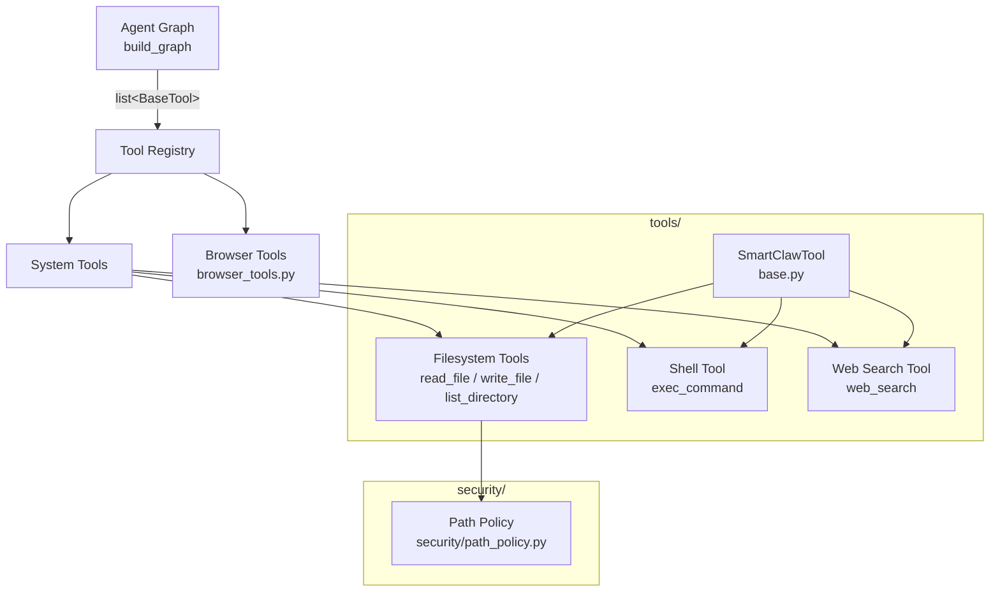

# Design Document: SmartClaw Tool System

## Overview

SmartClaw Tool System 为 Agent Graph 提供非浏览器工具基础设施，包括工具基类（统一错误处理）、工具注册中心（发现与合并）、文件系统工具（read/write/list）、Shell 工具（命令执行）、Web 搜索工具（Tavily）以及路径安全策略引擎。

设计参考 PicoClaw `pkg/tools/`（Go 实现），但适配 Python 3.12+ 和 LangChain `BaseTool` 体系。所有工具通过 `Tool_Registry` 统一注册，最终产出 `list[BaseTool]` 注入 `build_graph()`。

### Design Decisions

1. **继承 LangChain BaseTool 而非自研接口**：Agent Graph 已依赖 `BaseTool`，保持一致性。PicoClaw 自研 `Tool` 接口是因为 Go 没有 LangChain 生态。
2. **`_safe_run` 包装模式**：与 `browser_tools.py` 中 `_safe_tool_call` 保持一致，所有异常转为字符串返回给 LLM。
3. **Path_Policy 独立模块**：安全策略与工具实现解耦，便于后续扩展 tool_policy（P2 阶段）。
4. **asyncio.subprocess 而非 subprocess.run**：与 Agent Graph 的 async 架构一致，避免阻塞事件循环。
5. **Tavily 直接集成**：tavily-python 已在 roadmap 依赖列表中，无需自研搜索 API 封装。

## Architecture



### Module Layout

```
smartclaw/smartclaw/
├── tools/
│   ├── base.py           # SmartClawTool 抽象基类
│   ├── registry.py       # ToolRegistry 注册中心
│   ├── filesystem.py     # ReadFileTool, WriteFileTool, ListDirectoryTool
│   ├── shell.py          # ShellTool
│   ├── web_search.py     # WebSearchTool
│   └── browser_tools.py  # (已有，Spec 3)
├── security/
│   ├── __init__.py       # 导出 PathPolicy, PathDeniedError
│   └── path_policy.py    # PathPolicy 引擎
```

## Components and Interfaces

### 1. SmartClawTool (base.py)

抽象基类，继承 `langchain_core.tools.BaseTool`，为所有非浏览器工具提供统一的错误处理包装。

```python
from abc import abstractmethod
from langchain_core.tools import BaseTool
from pydantic import BaseModel

class SmartClawTool(BaseTool):
    """Abstract base for all non-browser SmartClaw tools."""
    
    name: str
    description: str
    args_schema: type[BaseModel]
    
    def _run(self, **kwargs) -> str:
        raise NotImplementedError("Use async")
    
    async def _safe_run(self, coro) -> str:
        """Catch all exceptions, log, return error string."""
        try:
            return await coro
        except Exception as e:
            logger.error("tool_error", tool=self.name, error=str(e))
            return f"Error: {e}"
    
    @abstractmethod
    async def _arun(self, **kwargs) -> str: ...
```

### 2. ToolRegistry (registry.py)

工具注册中心，管理所有工具实例的生命周期。

```python
class ToolRegistry:
    def register(self, tool: BaseTool) -> None: ...
    def register_many(self, tools: list[BaseTool]) -> None: ...
    def get(self, name: str) -> BaseTool | None: ...
    def list_tools(self) -> list[str]: ...
    def get_all(self) -> list[BaseTool]: ...
    def merge(self, other: "ToolRegistry") -> None: ...
    @property
    def count(self) -> int: ...
```

### 3. PathPolicy (security/path_policy.py)

路径安全策略引擎，基于白名单/黑名单规则控制文件系统访问。

```python
class PathDeniedError(Exception):
    """Raised when a path violates the security policy."""
    def __init__(self, path: str): ...

class PathPolicy:
    def __init__(
        self,
        allowed_patterns: list[str] | None = None,
        denied_patterns: list[str] | None = None,
    ): ...
    
    def is_allowed(self, path: str) -> bool: ...
    def check(self, path: str) -> None: ...  # raises PathDeniedError
```

### 4. Filesystem Tools (filesystem.py)

三个独立的 LangChain Tool：`read_file`、`write_file`、`list_directory`。

每个工具在执行前通过 `PathPolicy.check()` 验证路径合法性。

```python
class ReadFileTool(SmartClawTool):
    name: str = "read_file"
    # accepts: path (str), max_bytes (int, default 1_048_576)
    
class WriteFileTool(SmartClawTool):
    name: str = "write_file"
    # accepts: path (str), content (str)
    
class ListDirectoryTool(SmartClawTool):
    name: str = "list_directory"
    # accepts: path (str)
```

### 5. ShellTool (shell.py)

通过 `asyncio.create_subprocess_shell` 执行命令，支持超时、输出截断、危险命令拦截。

```python
class ShellTool(SmartClawTool):
    name: str = "exec_command"
    # accepts: command (str), timeout_seconds (int, default 60), working_dir (str | None)
```

### 6. WebSearchTool (web_search.py)

通过 tavily-python 执行 Web 搜索。

```python
class WebSearchTool(SmartClawTool):
    name: str = "web_search"
    # accepts: query (str), max_results (int, default 5)
```

### 7. Factory Function

```python
def create_system_tools(
    workspace: str,
    path_policy: PathPolicy | None = None,
) -> ToolRegistry:
    """Instantiate all system tools and return a populated ToolRegistry."""
```

## Data Models

### Input Schemas (Pydantic BaseModel)

```python
class ReadFileInput(BaseModel):
    path: str = Field(description="File path to read")
    max_bytes: int = Field(default=1_048_576, description="Max bytes to read")

class WriteFileInput(BaseModel):
    path: str = Field(description="File path to write")
    content: str = Field(description="Content to write")

class ListDirectoryInput(BaseModel):
    path: str = Field(description="Directory path to list")

class ShellInput(BaseModel):
    command: str = Field(description="Shell command to execute")
    timeout_seconds: int = Field(default=60, description="Timeout in seconds")
    working_dir: str | None = Field(default=None, description="Working directory")

class WebSearchInput(BaseModel):
    query: str = Field(description="Search query")
    max_results: int = Field(default=5, description="Maximum number of results")
```

### PathPolicy Configuration

```python
# Default denied paths (always blocked)
DEFAULT_DENIED_PATHS: list[str] = [
    "~/.ssh/**",
    "~/.gnupg/**",
    "~/.aws/**",
    "~/.config/gcloud/**",
    "/etc/shadow",
    "/etc/passwd",
]
```

### Shell Deny Patterns

```python
# Default dangerous command patterns (regex)
DEFAULT_DENY_PATTERNS: list[str] = [
    r"\brm\s+-[rf]{1,2}\b",
    r"\bsudo\b",
    r"\bshutdown\b",
    r"\breboot\b",
    r"\bpoweroff\b",
    r"\bdd\s+if=",
    r"\bmkfs\b",
    r"\bchmod\s+[0-7]{3,4}\b",
    r"\bchown\b",
    r"\bkill\b",
    r"\bpkill\b",
    r"\bkillall\b",
]
```


## Correctness Properties

*A property is a characteristic or behavior that should hold true across all valid executions of a system — essentially, a formal statement about what the system should do. Properties serve as the bridge between human-readable specifications and machine-verifiable correctness guarantees.*

### Property 1: _safe_run catches all exceptions and returns formatted error string

*For any* exception type and any error message string, when `_safe_run` wraps a coroutine that raises that exception, the return value should be a string matching the format `"Error: {error_message}"`.

**Validates: Requirements 1.2, 1.3**

### Property 2: Registry register/get round-trip

*For any* list of tools with unique names, after registering them (via `register` or `register_many`), calling `get(name)` for each tool's name should return the corresponding tool instance.

**Validates: Requirements 2.1, 2.2, 2.3**

### Property 3: Registry list_tools returns sorted names

*For any* set of registered tools, `list_tools()` should return a list of tool names that is sorted in ascending lexicographic order and contains exactly the names of all registered tools.

**Validates: Requirements 2.4**

### Property 4: Registry size invariant

*For any* set of tools with unique names registered in a ToolRegistry, `count` should equal `len(get_all())` and both should equal the number of unique tool names registered.

**Validates: Requirements 2.5, 2.8**

### Property 5: Registry duplicate replacement

*For any* two tools sharing the same name, registering the first then the second should result in `get(name)` returning the second tool, and `count` should remain 1.

**Validates: Requirements 2.6**

### Property 6: Registry merge is set union

*For any* two ToolRegistry instances with disjoint tool names, after merging the second into the first, the first registry's `get_all()` should contain all tools from both registries, and `count` should equal the sum of both original counts.

**Validates: Requirements 2.7**

### Property 7: Filesystem write/read round-trip

*For any* valid file path (within policy) and any string content, writing the content via `write_file` then reading it via `read_file` should return the original content.

**Validates: Requirements 3.1, 3.3**

### Property 8: Filesystem error contains path

*For any* non-existent file path, `read_file` should return a string that contains the path. Similarly, *for any* non-existent directory path, `list_directory` should return a string containing the path.

**Validates: Requirements 3.2, 3.6**

### Property 9: Filesystem policy enforcement

*For any* path that is denied by the PathPolicy, all filesystem tools (read_file, write_file, list_directory) should return the error string `"Error: Access denied — path '{path}' is not allowed by security policy"` without performing the I/O operation.

**Validates: Requirements 3.7**

### Property 10: Filesystem read truncation

*For any* file whose size exceeds a given `max_bytes` value, `read_file` should return content of at most `max_bytes` length with a suffix indicating truncation.

**Validates: Requirements 3.8, 3.9**

### Property 11: Shell deny pattern blocking

*For any* command string that matches at least one deny pattern, the ShellTool should return an error string without executing the command. *For any* command string that does not match any deny pattern, the ShellTool should proceed with execution.

**Validates: Requirements 4.9**

### Property 12: Shell output format with stderr prefix

*For any* command that produces both stdout and stderr output, the returned string should contain the stdout content and the stderr content prefixed by `"STDERR:\n"`.

**Validates: Requirements 4.6**

### Property 13: Shell exit code in output

*For any* command that exits with a non-zero exit code N, the returned string should contain the string representation of N.

**Validates: Requirements 4.7**

### Property 14: Shell output truncation

*For any* command whose combined output exceeds 10,000 characters, the returned string should be truncated to at most 10,000 characters plus a truncation indicator containing the number of omitted characters.

**Validates: Requirements 4.8**

### Property 15: Web search result formatting

*For any* list of search results where each result has a title, URL, and content snippet, the formatted output string should contain all three fields for every result.

**Validates: Requirements 5.6**

### Property 16: Web search API error passthrough

*For any* API error message returned by the Tavily client, the WebSearchTool should return a string containing that error message.

**Validates: Requirements 5.5**

### Property 17: PathPolicy blacklist-first evaluation

*For any* path that matches both a whitelist pattern and a blacklist pattern, `is_allowed` should return `False`. Additionally, *for any* path that does not match any whitelist pattern (when whitelist is non-empty), `is_allowed` should return `False`.

**Validates: Requirements 6.2, 6.3**

### Property 18: PathPolicy path normalization

*For any* relative path and its absolute equivalent (resolved via `pathlib.Path.resolve()`), the PathPolicy should produce the same `is_allowed` result for both.

**Validates: Requirements 6.5, 6.6**

### Property 19: PathPolicy check/is_allowed consistency

*For any* path string, `check(path)` should raise `PathDeniedError` if and only if `is_allowed(path)` returns `False`.

**Validates: Requirements 6.8**

### Property 20: PathPolicy glob pattern matching

*For any* glob pattern in the whitelist and any path that matches that glob (via `fnmatch` or `pathlib.PurePath.match`), `is_allowed` should return `True` (assuming no blacklist match). Conversely, *for any* glob pattern in the blacklist and any matching path, `is_allowed` should return `False`.

**Validates: Requirements 6.9**

## Error Handling

### Strategy: Errors as Strings

与 `browser_tools.py` 中 `_safe_tool_call` 模式一致，所有工具异常均转为人类可读字符串返回给 LLM，不抛出异常到 Agent Graph。

| Component | Error Type | Handling |
|-----------|-----------|----------|
| SmartClawTool._safe_run | Any Exception | Catch, log via structlog, return `"Error: {message}"` |
| PathPolicy.check | PathDeniedError | Raised to caller; filesystem tools catch and return error string |
| Filesystem read_file | FileNotFoundError | Return `"Error: File not found — {path}"` |
| Filesystem write_file | OSError | Return `"Error: Failed to write — {message}"` |
| Filesystem list_directory | FileNotFoundError | Return `"Error: Directory not found — {path}"` |
| Shell exec_command | TimeoutError | Kill process, return `"Error: Command timed out after {N}s"` + partial output |
| Shell exec_command | Deny pattern match | Return `"Error: Command blocked by security policy"` |
| Shell exec_command | Non-zero exit | Include exit code in output, not treated as tool error |
| Web search | Missing API key | Return `"Error: TAVILY_API_KEY environment variable is not set"` |
| Web search | API error | Return `"Error: Search failed — {api_error}"` |

### Custom Exceptions

```python
# security/path_policy.py
class PathDeniedError(Exception):
    """Raised when a filesystem path violates the security policy."""
    def __init__(self, path: str):
        self.path = path
        super().__init__(f"Access denied — path '{path}' is not allowed by security policy")
```

## Testing Strategy

### Dual Testing Approach

本项目采用单元测试 + 属性测试双轨策略：

- **单元测试 (pytest)**：验证具体示例、边界条件、集成点
- **属性测试 (hypothesis)**：验证跨所有输入的通用属性

两者互补：单元测试捕获具体 bug，属性测试验证通用正确性。

### Property-Based Testing Configuration

- **库**: [hypothesis](https://hypothesis.readthedocs.io/) (已在 `pyproject.toml` dev 依赖中)
- **每个属性测试最少 100 次迭代**: `@settings(max_examples=100)`
- **每个测试标注设计属性引用**: 注释格式 `# Feature: smartclaw-tool-system, Property {N}: {title}`
- **每个 Correctness Property 对应一个 property-based test**

### Test File Layout

```
smartclaw/tests/tools/
├── test_base.py              # SmartClawTool 基类测试
├── test_registry.py          # ToolRegistry 单元测试 + 属性测试
├── test_registry_props.py    # ToolRegistry 属性测试（Properties 2-6）
├── test_filesystem.py        # Filesystem 工具单元测试
├── test_filesystem_props.py  # Filesystem 属性测试（Properties 7-10）
├── test_shell.py             # Shell 工具单元测试
├── test_shell_props.py       # Shell 属性测试（Properties 11-14）
├── test_web_search.py        # Web Search 工具单元测试
├── test_web_search_props.py  # Web Search 属性测试（Properties 15-16）
├── test_path_policy.py       # PathPolicy 单元测试
└── test_path_policy_props.py # PathPolicy 属性测试（Properties 17-20）
```

### Unit Test Coverage

| Area | Focus |
|------|-------|
| SmartClawTool | `_run` raises NotImplementedError (Req 1.4), structlog component name (Req 1.5) |
| ToolRegistry | get returns None for missing (Req 2.3), duplicate warning logged (Req 2.6) |
| Filesystem | Parent dir creation (Req 3.4), list_directory format (Req 3.5) |
| Shell | Default timeout 60s (Req 4.2), timeout kill (Req 4.3), working_dir not found (Req 4.5) |
| Web Search | Default max_results=5 (Req 5.2), API key from env (Req 5.3), missing key error (Req 5.4) |
| PathPolicy | Default denied paths (Req 6.4), symlink bypass prevention (Req 6.5) |
| Integration | create_system_tools returns expected tools (Req 7.3, 7.4) |

### Property Test → Design Property Mapping

| Test | Property | Tag |
|------|----------|-----|
| test_safe_run_catches_all_exceptions | Property 1 | `Feature: smartclaw-tool-system, Property 1: _safe_run error format` |
| test_register_get_roundtrip | Property 2 | `Feature: smartclaw-tool-system, Property 2: Registry register/get round-trip` |
| test_list_tools_sorted | Property 3 | `Feature: smartclaw-tool-system, Property 3: Registry list_tools sorted` |
| test_registry_size_invariant | Property 4 | `Feature: smartclaw-tool-system, Property 4: Registry size invariant` |
| test_duplicate_replacement | Property 5 | `Feature: smartclaw-tool-system, Property 5: Registry duplicate replacement` |
| test_merge_union | Property 6 | `Feature: smartclaw-tool-system, Property 6: Registry merge union` |
| test_write_read_roundtrip | Property 7 | `Feature: smartclaw-tool-system, Property 7: Filesystem write/read round-trip` |
| test_error_contains_path | Property 8 | `Feature: smartclaw-tool-system, Property 8: Filesystem error contains path` |
| test_policy_enforcement | Property 9 | `Feature: smartclaw-tool-system, Property 9: Filesystem policy enforcement` |
| test_read_truncation | Property 10 | `Feature: smartclaw-tool-system, Property 10: Filesystem read truncation` |
| test_deny_pattern_blocking | Property 11 | `Feature: smartclaw-tool-system, Property 11: Shell deny pattern blocking` |
| test_stderr_prefix | Property 12 | `Feature: smartclaw-tool-system, Property 12: Shell output format with stderr prefix` |
| test_exit_code_in_output | Property 13 | `Feature: smartclaw-tool-system, Property 13: Shell exit code in output` |
| test_output_truncation | Property 14 | `Feature: smartclaw-tool-system, Property 14: Shell output truncation` |
| test_search_result_formatting | Property 15 | `Feature: smartclaw-tool-system, Property 15: Web search result formatting` |
| test_api_error_passthrough | Property 16 | `Feature: smartclaw-tool-system, Property 16: Web search API error passthrough` |
| test_blacklist_first | Property 17 | `Feature: smartclaw-tool-system, Property 17: PathPolicy blacklist-first evaluation` |
| test_path_normalization | Property 18 | `Feature: smartclaw-tool-system, Property 18: PathPolicy path normalization` |
| test_check_is_allowed_consistency | Property 19 | `Feature: smartclaw-tool-system, Property 19: PathPolicy check/is_allowed consistency` |
| test_glob_pattern_matching | Property 20 | `Feature: smartclaw-tool-system, Property 20: PathPolicy glob pattern matching` |
