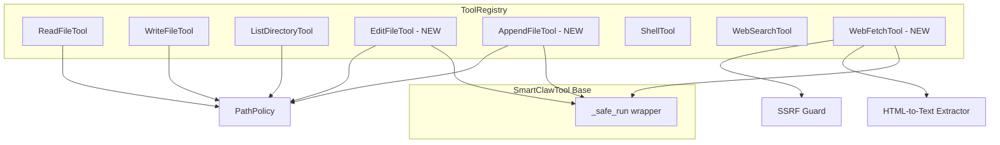

# Design Document: SmartClaw Tools Supplement

## Overview

本设计文档描述 SmartClaw 新增 3 个核心工具的技术方案：`EditFileTool`（文件精确替换编辑）、`AppendFileTool`（文件内容追加）和 `WebFetchTool`（URL 内容抓取）。这 3 个工具对齐 PicoClaw 的 Go 参考实现，遵循 SmartClaw 现有的工具体系架构（`SmartClawTool` 基类、`PathPolicy` 安全策略、`ToolRegistry` 注册机制）。

设计目标：
- 与现有 `ReadFileTool`、`WriteFileTool`、`ListDirectoryTool` 保持一致的代码风格和安全模型
- `EditFileTool` 和 `AppendFileTool` 复用 `PathPolicy` 进行路径安全检查
- `WebFetchTool` 实现 SSRF 防护（阻止私有/本地网络地址访问）
- 所有工具通过 `_safe_run` 包装异步操作，统一异常处理和日志记录

## Architecture



### 文件布局

新增工具放置在现有工具目录下：

- `smartclaw/smartclaw/tools/edit.py` — `EditFileTool` + `AppendFileTool`
- `smartclaw/smartclaw/tools/web_fetch.py` — `WebFetchTool`
- `smartclaw/tests/tools/test_edit.py` — 单元测试
- `smartclaw/tests/tools/test_edit_props.py` — 属性测试
- `smartclaw/tests/tools/test_web_fetch.py` — 单元测试
- `smartclaw/tests/tools/test_web_fetch_props.py` — 属性测试

`EditFileTool` 和 `AppendFileTool` 放在同一文件中，因为它们共享 `PathPolicy` 依赖且功能紧密相关（与 PicoClaw 的 `edit.go` 一致）。

## Components and Interfaces

### EditFileTool

继承 `SmartClawTool`，通过 `old_text → new_text` 精确替换方式编辑文件。

```python
class EditFileInput(BaseModel):
    path: str = Field(description="File path to edit")
    old_text: str = Field(description="Exact text to find and replace")
    new_text: str = Field(description="Replacement text")

class EditFileTool(SmartClawTool):
    name: str = "edit_file"
    description: str = "Edit a file by replacing old_text with new_text. The old_text must match exactly once."
    args_schema: type[BaseModel] = EditFileInput
    path_policy: PathPolicy

    async def _arun(self, path: str, old_text: str, new_text: str, **kwargs) -> str: ...
```

核心逻辑（纯函数，便于测试）：

```python
def replace_single_occurrence(content: str, old_text: str, new_text: str) -> str | None:
    """Replace exactly one occurrence of old_text with new_text.
    
    Returns the new content string on success.
    Raises ValueError with descriptive message on failure (not found / ambiguous).
    """
```

### AppendFileTool

继承 `SmartClawTool`，向文件末尾追加内容。文件不存在时自动创建（含父目录）。

```python
class AppendFileInput(BaseModel):
    path: str = Field(description="File path to append to")
    content: str = Field(description="Content to append")

class AppendFileTool(SmartClawTool):
    name: str = "append_file"
    description: str = "Append content to the end of a file. Creates the file if it does not exist."
    args_schema: type[BaseModel] = AppendFileInput
    path_policy: PathPolicy

    async def _arun(self, path: str, content: str, **kwargs) -> str: ...
```

### WebFetchTool

继承 `SmartClawTool`，使用 `httpx` 异步获取 URL 内容，支持 HTML-to-text 转换和 SSRF 防护。

```python
class WebFetchInput(BaseModel):
    url: str = Field(description="URL to fetch (HTTP or HTTPS only)")
    max_chars: int = Field(default=50_000, description="Maximum characters to return")

class WebFetchTool(SmartClawTool):
    name: str = "web_fetch"
    description: str = "Fetch a web page and return its content as readable text."
    args_schema: type[BaseModel] = WebFetchInput
    timeout_seconds: int = 60
    max_response_bytes: int = 10_485_760  # 10 MB

    async def _arun(self, url: str, max_chars: int = 50_000, **kwargs) -> str: ...
```

### SSRF Guard（内部模块）

放在 `web_fetch.py` 内部，不单独成文件。

```python
def is_private_ip(ip: ipaddress.IPv4Address | ipaddress.IPv6Address) -> bool:
    """Check if an IP address is private, loopback, link-local, or otherwise restricted."""

async def check_ssrf(url: str) -> str | None:
    """Validate URL against SSRF rules. Returns error message if blocked, None if safe.
    
    Checks:
    1. Scheme must be http or https
    2. Resolve hostname to IP addresses
    3. All resolved IPs must not be private/loopback/link-local
    """
```

### HTML-to-Text Extractor（内部函数）

```python
def html_to_text(html: str) -> str:
    """Strip script/style tags, remove HTML tags, normalize whitespace."""
```

### Registry Integration

更新 `create_system_tools()` 注册新工具：

```python
def create_system_tools(workspace: str, path_policy: PathPolicy | None = None) -> ToolRegistry:
    # ... existing tools ...
    registry.register_many([
        # existing
        ReadFileTool(path_policy=policy),
        WriteFileTool(path_policy=policy),
        ListDirectoryTool(path_policy=policy),
        ShellTool(),
        WebSearchTool(),
        # new
        EditFileTool(path_policy=policy),
        AppendFileTool(path_policy=policy),
        WebFetchTool(),
    ])
    return registry
```

## Data Models

### Input Schemas (Pydantic)

| Tool | Schema | Fields |
|------|--------|--------|
| EditFileTool | `EditFileInput` | `path: str`, `old_text: str`, `new_text: str` |
| AppendFileTool | `AppendFileInput` | `path: str`, `content: str` |
| WebFetchTool | `WebFetchInput` | `url: str`, `max_chars: int = 50_000` |

### 内部数据流

**EditFileTool:**
1. `PathPolicy.check(path)` → 安全检查
2. `pathlib.Path(path).read_text()` → 读取文件内容
3. `replace_single_occurrence(content, old_text, new_text)` → 纯函数替换
4. `pathlib.Path(path).write_text(new_content)` → 写回文件

**AppendFileTool:**
1. `PathPolicy.check(path)` → 安全检查
2. `pathlib.Path(path).parent.mkdir(parents=True, exist_ok=True)` → 确保父目录存在
3. 以 append 模式打开文件写入内容

**WebFetchTool:**
1. `check_ssrf(url)` → SSRF 检查（scheme + IP 解析）
2. `httpx.AsyncClient.get(url)` → 异步 HTTP 请求（带超时和大小限制）
3. 根据 Content-Type 选择处理方式：
   - `text/html` → `html_to_text(body)`
   - `application/json` → `json.dumps(json.loads(body), indent=2)`
   - 其他 → 原始文本
4. 截断到 `max_chars` 并附加截断指示器


## Correctness Properties

*A property is a characteristic or behavior that should hold true across all valid executions of a system — essentially, a formal statement about what the system should do. Properties serve as the bridge between human-readable specifications and machine-verifiable correctness guarantees.*

### Property 1: Edit file single-replacement round-trip

*For any* file content string containing exactly one occurrence of a substring `old_text`, calling `replace_single_occurrence(content, old_text, new_text)` should produce a result where: (a) `old_text` no longer appears (unless `new_text` contains `old_text`), (b) `new_text` appears at the position where `old_text` was, and (c) the content before and after the replacement site is unchanged.

**Validates: Requirements 1.1**

### Property 2: Edit file rejects non-unique matches

*For any* file content string and any substring `old_text` where the count of `old_text` in the content is not exactly 1 (i.e., 0 or >1), `replace_single_occurrence` should raise a `ValueError`. When count is 0, the error message should indicate "not found". When count is >1, the error message should contain the actual count.

**Validates: Requirements 1.2, 1.3**

### Property 3: PathPolicy enforcement for edit and append tools

*For any* path denied by `PathPolicy`, both `EditFileTool` and `AppendFileTool` should return an error string containing "Access denied" without performing any file I/O.

**Validates: Requirements 1.4, 2.3**

### Property 4: Append preserves existing content

*For any* existing file with content `original` and any append string `suffix`, after `AppendFileTool` runs, the file content should equal `original + suffix`. If the file did not exist, the file content should equal `suffix` and all parent directories should be created.

**Validates: Requirements 2.1, 2.2**

### Property 5: SSRF guard blocks non-HTTP schemes

*For any* URL whose scheme is not `http` or `https` (e.g., `ftp`, `file`, `data`, `gopher`), `check_ssrf` should return an error message indicating the scheme is not allowed.

**Validates: Requirements 3.2**

### Property 6: SSRF guard blocks private/local IPs

*For any* IP address that is loopback (127.0.0.0/8, ::1), RFC 1918 private (10.0.0.0/8, 172.16.0.0/12, 192.168.0.0/16), or link-local (169.254.0.0/16, fe80::/10), `is_private_ip` should return `True`.

**Validates: Requirements 3.3**

### Property 7: HTML-to-text strips all tags

*For any* HTML string, `html_to_text` should produce output that contains no `<script>...</script>` blocks, no `<style>...</style>` blocks, and no HTML tags (no `<...>` patterns). The output should only contain the text content.

**Validates: Requirements 3.4**

### Property 8: JSON formatting round-trip

*For any* valid JSON value, formatting it with `json.dumps(value, indent=2)` then parsing with `json.loads` should produce the original value.

**Validates: Requirements 3.5**

### Property 9: Text truncation respects max_chars

*For any* text string longer than a given `max_chars` limit, truncating to `max_chars` and appending the truncation indicator should produce a result whose content portion (before the indicator) has length exactly `max_chars`.

**Validates: Requirements 3.6**

### Property 10: _safe_run catches all exceptions

*For any* coroutine that raises an arbitrary `Exception`, `_safe_run` should return a string starting with "Error:" instead of propagating the exception.

**Validates: Requirements 1.7, 2.5, 3.11**

## Error Handling

### EditFileTool

| 场景 | 行为 |
|------|------|
| `PathPolicy` 拒绝路径 | 返回 `"Error: Access denied — path '...' is not allowed by security policy"` |
| 文件不存在 | 返回 `"Error: File not found — {path}"` |
| `old_text` 未找到 | 返回 `"Error: old_text not found in file. Make sure it matches exactly"` |
| `old_text` 出现多次 | 返回 `"Error: old_text appears {N} times. Please provide more context to make it unique"` |
| 其他异常 | 由 `_safe_run` 捕获，返回 `"Error: {exception}"` |

### AppendFileTool

| 场景 | 行为 |
|------|------|
| `PathPolicy` 拒绝路径 | 返回 `"Error: Access denied — path '...' is not allowed by security policy"` |
| 父目录创建失败（权限等） | 由 `_safe_run` 捕获，返回 `"Error: {exception}"` |
| 其他异常 | 由 `_safe_run` 捕获，返回 `"Error: {exception}"` |

### WebFetchTool

| 场景 | 行为 |
|------|------|
| 非 HTTP/HTTPS scheme | 返回 `"Error: Only HTTP and HTTPS URLs are allowed"` |
| SSRF 检测到私有 IP | 返回 `"Error: URL points to a private/local network address (SSRF blocked)"` |
| HTTP 请求超时 | 返回 `"Error: Request timed out after {N} seconds"` |
| HTTP 请求失败 | 返回 `"Error: Failed to fetch URL — {details}"` |
| 响应体超过字节限制 | 返回 `"Error: Response size exceeds {N} bytes limit"` |
| 其他异常 | 由 `_safe_run` 捕获，返回 `"Error: {exception}"` |

## Testing Strategy

### 测试框架

- **单元测试**: `pytest` + `pytest-asyncio`
- **属性测试**: `hypothesis` (已在 `pyproject.toml` 的 dev 依赖中)
- 每个属性测试配置 `@settings(max_examples=100)`

### 双重测试方法

**单元测试** (`test_edit.py`, `test_web_fetch.py`):
- 具体示例验证：正常编辑、追加、抓取的 happy path
- 边缘情况：空文件编辑、空内容追加、超大响应体
- 错误条件：文件不存在、路径被拒、SSRF 阻断、超时
- 集成点：`create_system_tools()` 注册验证（工具数量、PathPolicy 实例共享）

**属性测试** (`test_edit_props.py`, `test_web_fetch_props.py`):
- 每个 Correctness Property 对应一个属性测试函数
- 使用 hypothesis strategies 生成随机输入
- 标签格式：`Feature: smartclaw-tools-supplement, Property {N}: {title}`

### 属性测试与 Correctness Properties 映射

| Property | 测试文件 | 测试函数 |
|----------|---------|---------|
| Property 1: Edit file single-replacement round-trip | `test_edit_props.py` | `test_edit_single_replacement_roundtrip` |
| Property 2: Edit file rejects non-unique matches | `test_edit_props.py` | `test_edit_rejects_non_unique` |
| Property 3: PathPolicy enforcement for edit and append | `test_edit_props.py` | `test_edit_append_policy_enforcement` |
| Property 4: Append preserves existing content | `test_edit_props.py` | `test_append_preserves_content` |
| Property 5: SSRF guard blocks non-HTTP schemes | `test_web_fetch_props.py` | `test_ssrf_blocks_non_http_schemes` |
| Property 6: SSRF guard blocks private/local IPs | `test_web_fetch_props.py` | `test_ssrf_blocks_private_ips` |
| Property 7: HTML-to-text strips all tags | `test_web_fetch_props.py` | `test_html_to_text_strips_tags` |
| Property 8: JSON formatting round-trip | `test_web_fetch_props.py` | `test_json_formatting_roundtrip` |
| Property 9: Text truncation respects max_chars | `test_web_fetch_props.py` | `test_truncation_respects_max_chars` |
| Property 10: _safe_run catches all exceptions | `test_edit_props.py` | `test_safe_run_catches_exceptions` |

### Hypothesis Strategies

```python
# 文件名策略
_safe_name = st.from_regex(r"[a-zA-Z][a-zA-Z0-9_]{0,15}", fullmatch=True)

# 文本内容策略（可打印 ASCII）
_content = st.text(
    alphabet=st.characters(whitelist_categories=("L", "N", "P", "Z"), max_codepoint=127),
    min_size=0, max_size=500,
)

# 私有 IPv4 策略
_private_ipv4 = st.one_of(
    st.tuples(st.just(127), st.integers(0, 255), st.integers(0, 255), st.integers(0, 255)),  # loopback
    st.tuples(st.just(10), st.integers(0, 255), st.integers(0, 255), st.integers(0, 255)),   # 10.0.0.0/8
    st.tuples(st.just(172), st.integers(16, 31), st.integers(0, 255), st.integers(0, 255)),   # 172.16.0.0/12
    st.tuples(st.just(192), st.just(168), st.integers(0, 255), st.integers(0, 255)),           # 192.168.0.0/16
    st.tuples(st.just(169), st.just(254), st.integers(0, 255), st.integers(0, 255)),           # link-local
)

# 非 HTTP scheme 策略
_non_http_scheme = st.sampled_from(["ftp", "file", "data", "gopher", "ssh", "telnet", "ldap"])

# HTML 策略（用于 html_to_text 测试）
_simple_html = st.builds(
    lambda body: f"<html><head><style>css</style><script>js</script></head><body>{body}</body></html>",
    body=_content,
)
```
