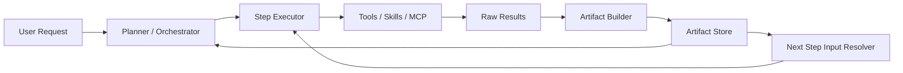
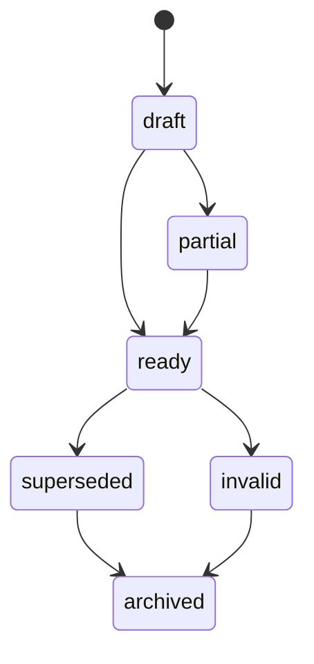
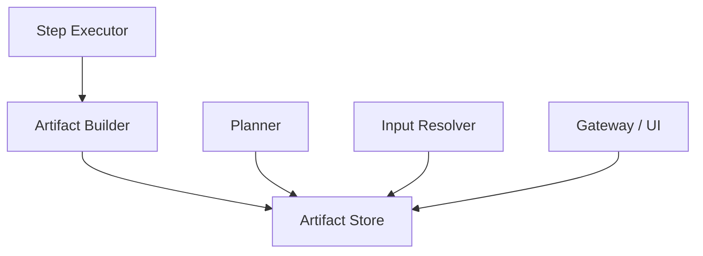
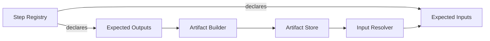
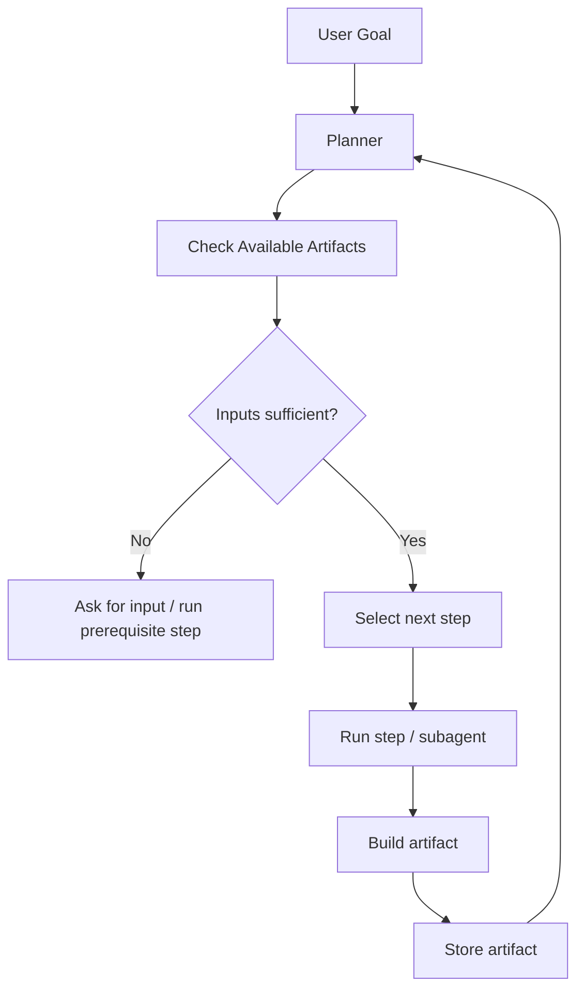
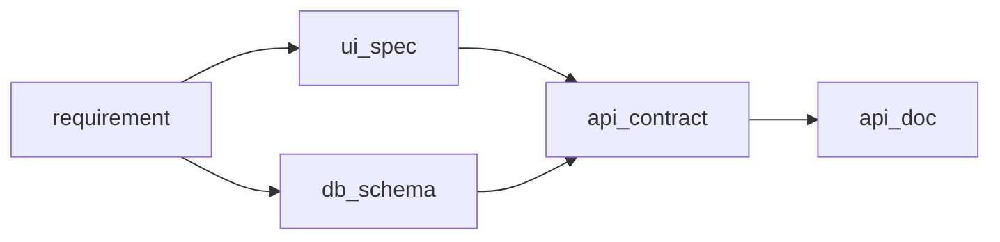
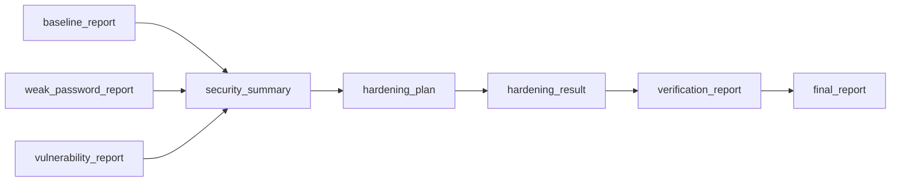

# SmartClaw Artifact 结构与映射规范

## 1. 目标

本文档定义 SmartClaw 通用动态编排框架中的 `artifact` 概念、结构、生命周期、映射规则与消费方式。

本文档的目的不是再引入一套固定 workflow，而是解决一个核心问题：

- 上一步执行结果如何从“聊天文本”升级为“可被后续步骤稳定消费的结构化产物”
- planner / orchestrator 如何在不写死流程的前提下，动态选择和复用这些产物
- 后续新增业务时，如何主要通过 `tools / skills / mcp / capability pack / step definitions` 扩展，而不是频繁修改核心代码

---

## 2. 核心结论

在 SmartClaw 中，`artifact` 是动态编排的统一产物总线。

它不是：

- 普通聊天消息
- 单次工具返回的原始字符串
- 某个固定场景专属的数据结构

它应该是：

- 可被 step 稳定引用的结构化产物
- 可以跨轮次、跨 subagent、跨场景复用的上下文单元
- planner 进行动态规划时的重要输入依据

一句话概括：

> `artifact = 可被动态规划和后续步骤稳定消费的标准化产物`

---

## 3. 与现有 SmartClaw 的关系

当前 SmartClaw 已具备：

- 动态规划与 subagent 调度能力
- capability pack 治理能力
- step registry 设计方向
- 文档/图片上传后的提取结果
- memory/context/session 状态管理

但如果缺少统一 artifact 规范，当前结果仍然容易停留在：

- 聊天文本里
- 工具输出里
- 临时 summary 里

这会导致：

- 上下游输入输出不稳定
- planner 难以复用前置结果
- 多轮编排难以审计和回放
- 后续业务扩展时需要额外写 glue code

因此，artifact 规范是通用动态编排框架的必要组成。

---

## 4. 总体架构位置



说明：

- `Raw Results` 是底层执行产物，可能杂乱、冗长、不稳定
- `Artifact Builder` 负责把原始结果变成标准化产物
- `Artifact Store` 负责存储、检索、版本、引用
- `Next Step Input Resolver` 负责把 artifact 转换为下一步可用输入

---

## 5. Artifact 设计原则

### 5.1 标准化

每个 artifact 都必须有统一外壳，而不是每个场景自由返回。

### 5.2 领域无关

artifact 结构应尽量通用，既能支持开发流程，也能支持安全治理、运维巡检等场景。

### 5.3 可追溯

必须知道：

- 它由哪个 step 产出
- 基于哪些输入生成
- 是哪个版本
- 是否被后续步骤引用

### 5.4 可复用

artifact 不应该只服务当前一步，而应能被后续步骤和 planner 复用。

### 5.5 可治理

artifact 应支持：

- schema 校验
- supersede/version
- 置信度
- 状态标记

---

## 6. Artifact 基础结构

建议所有 artifact 统一采用以下逻辑结构：

```yaml
artifact_id: "art_xxx"
type: "api_contract"
domain: "development"
producer_step: "api_design"
status: "ready"
summary: "已完成接口设计，共 5 个接口"
data: {}
schema_ref: "schemas/api_contract.v1"
version: 1
supersedes: null
source_inputs: []
source_artifacts: []
tags: []
confidence: 0.92
created_at: "2026-03-28T10:00:00Z"
updated_at: "2026-03-28T10:00:00Z"
metadata: {}
```

其中字段含义如下。

| 字段 | 含义 |
| --- | --- |
| `artifact_id` | 全局唯一 ID |
| `type` | 产物类型，例如 `db_schema`、`baseline_report` |
| `domain` | 业务域，例如 `development`、`security`、`ops` |
| `producer_step` | 产出该 artifact 的 step id |
| `status` | 当前状态 |
| `summary` | 面向 planner/UI 的短摘要 |
| `data` | 实际结构化内容 |
| `schema_ref` | 对应 schema 引用 |
| `version` | 当前版本号 |
| `supersedes` | 被当前版本替代的旧 artifact id |
| `source_inputs` | 原始输入引用 |
| `source_artifacts` | 依赖的前置 artifact |
| `tags` | 检索标签 |
| `confidence` | 置信度或稳定性估计 |
| `created_at` | 创建时间 |
| `updated_at` | 更新时间 |
| `metadata` | 扩展元数据 |

---

## 7. Artifact 状态机

建议统一支持以下状态：

- `draft`
- `ready`
- `partial`
- `superseded`
- `invalid`
- `archived`

说明：

- `draft`：初步产出，还未完成校验
- `ready`：可供下游稳定消费
- `partial`：部分可用，但不完整
- `superseded`：已被新版本替代
- `invalid`：经校验后不可用
- `archived`：历史归档



---

## 8. Artifact 分类建议

### 8.1 通用类型

- `requirement`
- `plan`
- `report`
- `summary`
- `decision`
- `evidence`
- `attachment_extract`

### 8.2 开发域

- `ui_spec`
- `db_schema`
- `api_contract`
- `backend_impl`
- `api_doc`
- `test_case`

### 8.3 安全治理域

- `baseline_report`
- `weak_password_report`
- `vulnerability_report`
- `hardening_plan`
- `hardening_result`
- `verification_report`

### 8.4 运维巡检域

- `host_inventory`
- `inspection_report`
- `incident_summary`
- `remediation_result`

---

## 9. Artifact Store 责任边界

Artifact Store 应负责：

- 保存 artifact
- 更新 artifact
- 维护版本链
- 按类型/标签/step/domain 检索
- 提供 latest / best / all 选择能力
- 提供引用关系查询

Artifact Store 不负责：

- 决定当前应该执行哪个 step
- 决定某个 artifact 是否一定要消费
- 直接执行业务逻辑



---

## 10. Artifact 与 Step Registry 的关系

Step Registry 定义：

- 需要什么输入
- 产出什么输出

Artifact 规范定义：

- 输入输出最终长什么样
- 如何被存储
- 如何被映射

可以理解为：

- `step` 负责描述“这个步骤期望什么”
- `artifact` 负责沉淀“这个步骤最终产出了什么”



---

## 11. 输入映射规则

为了支持“上一步输出可能成为下一步输入，也可能还有其他输入”，建议输入解析按以下优先级进行：

1. 用户显式输入
2. 请求级附件/上下文
3. 前置 artifact 显式绑定
4. 最新同类型 artifact
5. planner 选择的候选 artifact
6. 缺失则进入澄清或等待输入

### 11.1 输入绑定建议结构

```yaml
bindings:
  - input: "api_contract"
    source: "artifact"
    selector:
      type: "api_contract"
      strategy: "latest_ready"
  - input: "requirement_doc"
    source: "user_input"
  - input: "db_schema"
    source: "artifact"
    selector:
      type: "db_schema"
      producer_step: "table_design"
      strategy: "best_confidence"
```

### 11.2 选择策略

建议支持：

- `latest_ready`
- `latest_any`
- `best_confidence`
- `explicit_id`
- `all_matching`

---

## 12. Artifact Builder 规范

每个 step 执行完成后，不应直接把原始文本塞给下一步，而应先经过 `Artifact Builder`。

Builder 至少完成：

- 识别输出类型
- 组装统一 artifact 外壳
- 生成 `summary`
- 绑定 `producer_step`
- 记录 `source_artifacts`
- 校验 schema
- 设定 `status`

建议支持两种模式：

### 12.1 直接构建

适用于结构化输出已很稳定的 step。

例如：

- API 设计 skill 已直接输出 JSON
- 漏洞扫描 tool 已直接输出 findings 列表

### 12.2 后处理构建

适用于原始输出较自由的 step。

例如：

- 某 subagent 返回长文本报告
- 某 MCP 返回大量原始字段

此时由 builder 做一次标准化整理。

---

## 13. Planner 如何消费 Artifact

Planner 不应只看聊天文本，而应优先看 artifact。

Planner 主要关心：

- 当前已经有哪些 artifact
- 哪些 artifact 是 `ready`
- 哪些关键输入仍然缺失
- 哪些 artifact 冲突或已过时
- 是否已经满足某个 step 的前置条件



---

## 14. 开发场景示例

### 14.1 目标

“根据需求生成 API 设计和接口文档”

### 14.2 产物流转



这里并不是固定流程脚本，而是：

- 如果已有 `ui_spec`，可跳过对应 step
- 如果已有 `db_schema`，可直接进入 `api_design`
- 如果 `api_contract` 已存在且可复用，可直接生成 `api_doc`

---

## 15. 安全治理场景示例

### 15.1 目标

“执行基线、弱口令、漏洞检查，根据结果动态加固，再验证并输出报告”

### 15.2 产物流转



这里同样不要求固定死顺序：

- `baseline_check / weak_password_check / vulnerability_scan` 可以并行
- 若 `security_summary` 判断无需加固，可跳过 `hardening`
- 若 `verification_report` 不通过，可再次触发 `hardening`

artifact 让这种动态规划仍然可控。

---

## 16. UI 与可观测性建议

UI 不应只展示聊天消息，还应能展示：

- 当前已有 artifact 列表
- 每个 artifact 的类型、状态、摘要
- 产物由哪个 step 生成
- 哪个 artifact 被当前步骤消费

建议在后续 UI 中增加：

- `Artifacts` 面板
- 当前会话的 artifact 时间线
- artifact 版本对比

---

## 17. 与现有 State 的对应建议

当前 SmartClaw 后续实现时，建议在运行时状态中逐步加入：

- `artifacts`
- `artifact_index`
- `artifact_refs`
- `input_bindings`
- `latest_artifacts_by_type`

但本文档当前只定义规范，不要求本轮立刻实现所有字段。

---

## 18. 对后续扩展的意义

有了统一 artifact 规范后，后续新增业务通常只需要：

- 新增 tool / skill / mcp
- 新增 capability pack
- 新增 step definitions
- 声明这些步骤产出哪些 artifact、消费哪些 artifact

而不需要改核心调度代码。

这正是 SmartClaw 作为“通用动态编排框架”的关键能力。

---

## 19. 最终原则

### 19.1 不让结果只停留在聊天文本里

聊天文本适合人看，不适合稳定编排。

### 19.2 不把流程写死成脚本

动态规划仍然成立，但它必须建立在可被稳定消费的 artifact 之上。

### 19.3 让新增业务主要依赖配置与能力注册

这才符合 SmartClaw 的长期目标：

> 核心代码尽量一次成型，后续主要通过 tools / skills / mcp / 配置扩展

---

## 20. 下一步建议

在本文档之后，建议继续完成两项设计：

1. `Planner Input Resolution Spec`
   - 明确 planner 如何从 artifacts、用户输入、附件、memory 中组装当前规划上下文

2. `Capability Pack x Step Registry Binding Spec`
   - 明确 capability pack 如何声明允许哪些 steps、默认偏好哪些 steps、限制哪些 steps

