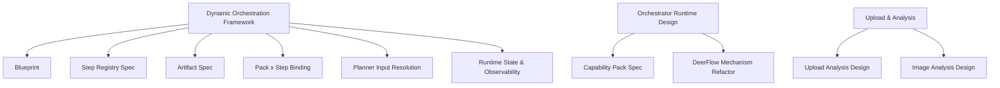

# SmartClaw 设计文档总入口

## 1. 文档目的

本文档作为 SmartClaw 当前设计文档的统一入口，用于：

- 快速查看当前已完成的设计范围
- 按主题查找对应文档
- 按推荐顺序阅读整套设计
- 作为后续实现与试点落地的导航页

---

## 2. 当前设计总览

当前文档主要覆盖四大方向：

1. `SmartClaw 运行时与 Orchestrator 改造`
2. `Capability Pack / Step Registry / Artifact 等配置驱动框架`
3. `上传、文档解析、图片 OCR / Vision 路线`
4. `通用动态编排框架`

---

## 3. 推荐阅读顺序

如果你希望从整体到细节理解当前设计，建议按以下顺序阅读：

1. [SMARTCLAW_DYNAMIC_ORCHESTRATION_FRAMEWORK.md](/Users/liubu/hx/hxWork/35.AI测试/claw/smartclaw/docs/SMARTCLAW_DYNAMIC_ORCHESTRATION_FRAMEWORK.md)
2. [SMARTCLAW_DYNAMIC_ORCHESTRATION_BLUEPRINT.md](/Users/liubu/hx/hxWork/35.AI测试/claw/smartclaw/docs/SMARTCLAW_DYNAMIC_ORCHESTRATION_BLUEPRINT.md)
3. [SMARTCLAW_STEP_REGISTRY_SPEC.md](/Users/liubu/hx/hxWork/35.AI测试/claw/smartclaw/docs/SMARTCLAW_STEP_REGISTRY_SPEC.md)
4. [SMARTCLAW_ARTIFACT_SPEC.md](/Users/liubu/hx/hxWork/35.AI测试/claw/smartclaw/docs/SMARTCLAW_ARTIFACT_SPEC.md)
5. [SMARTCLAW_PACK_STEP_BINDING_SPEC.md](/Users/liubu/hx/hxWork/35.AI测试/claw/smartclaw/docs/SMARTCLAW_PACK_STEP_BINDING_SPEC.md)
6. [SMARTCLAW_PLANNER_INPUT_RESOLUTION_SPEC.md](/Users/liubu/hx/hxWork/35.AI测试/claw/smartclaw/docs/SMARTCLAW_PLANNER_INPUT_RESOLUTION_SPEC.md)
7. [SMARTCLAW_RUNTIME_STATE_OBSERVABILITY_SPEC.md](/Users/liubu/hx/hxWork/35.AI测试/claw/smartclaw/docs/SMARTCLAW_RUNTIME_STATE_OBSERVABILITY_SPEC.md)

这 7 份构成了“通用动态编排框架”的主线设计。

---

## 4. 文档索引

### 4.1 通用动态编排框架

#### [SMARTCLAW_DYNAMIC_ORCHESTRATION_FRAMEWORK.md](/Users/liubu/hx/hxWork/35.AI测试/claw/smartclaw/docs/SMARTCLAW_DYNAMIC_ORCHESTRATION_FRAMEWORK.md)

定位：

- 通用动态编排框架总设计

重点内容：

- 为什么不走 fixed workflow
- 为什么不走完全无边界自由规划
- `capability pack + step registry + dynamic planner + artifact` 的总体思路

适合阅读时机：

- 想先理解整体方向时

---

#### [SMARTCLAW_DYNAMIC_ORCHESTRATION_BLUEPRINT.md](/Users/liubu/hx/hxWork/35.AI测试/claw/smartclaw/docs/SMARTCLAW_DYNAMIC_ORCHESTRATION_BLUEPRINT.md)

定位：

- 图示版蓝图文档

重点内容：

- 总体架构图
- 动态规划流程图
- 开发和安全治理场景共用框架的图示说明

适合阅读时机：

- 想先看架构图、流程图时

---

### 4.2 Step / Artifact / Planner 规范

#### [SMARTCLAW_STEP_REGISTRY_SPEC.md](/Users/liubu/hx/hxWork/35.AI测试/claw/smartclaw/docs/SMARTCLAW_STEP_REGISTRY_SPEC.md)

定位：

- Step Registry 配置规范

重点内容：

- 什么是 step
- 为什么 step 不是固定 workflow
- step definition 应有哪些字段
- planner 如何消费 step registry

适合阅读时机：

- 准备定义“可复用步骤模板”时

---

#### [SMARTCLAW_ARTIFACT_SPEC.md](/Users/liubu/hx/hxWork/35.AI测试/claw/smartclaw/docs/SMARTCLAW_ARTIFACT_SPEC.md)

定位：

- Artifact 结构与映射规范

重点内容：

- artifact 的统一结构
- artifact 生命周期
- 上一步输出如何稳定成为下一步输入
- 开发/安全场景的产物流转图

适合阅读时机：

- 准备设计上下游输入输出与产物总线时

---

#### [SMARTCLAW_PACK_STEP_BINDING_SPEC.md](/Users/liubu/hx/hxWork/35.AI测试/claw/smartclaw/docs/SMARTCLAW_PACK_STEP_BINDING_SPEC.md)

定位：

- Capability Pack 与 Step Registry 绑定规范

重点内容：

- pack 如何约束 steps
- 哪些 step 可用、优先、禁止
- planner 如何在 pack 边界内动态规划

适合阅读时机：

- 准备做“新增业务主要靠配置扩展”时

---

#### [SMARTCLAW_PLANNER_INPUT_RESOLUTION_SPEC.md](/Users/liubu/hx/hxWork/35.AI测试/claw/smartclaw/docs/SMARTCLAW_PLANNER_INPUT_RESOLUTION_SPEC.md)

定位：

- Planner 输入组装规范

重点内容：

- planner 每轮规划前看哪些输入
- 用户输入、artifact、附件、memory、pack 如何合并
- `planning_context` 建议结构

适合阅读时机：

- 准备实现 planner input builder 时

---

#### [SMARTCLAW_RUNTIME_STATE_OBSERVABILITY_SPEC.md](/Users/liubu/hx/hxWork/35.AI测试/claw/smartclaw/docs/SMARTCLAW_RUNTIME_STATE_OBSERVABILITY_SPEC.md)

定位：

- 运行时状态与观测规范

重点内容：

- 需要记录哪些运行态
- step / subagent / artifact / approval / retry 如何观测
- UI/调试面板应该展示什么

适合阅读时机：

- 准备实现 runtime state、调试面板、审计回放时

---

### 4.3 SmartClaw 运行时改造与治理设计

#### [SMARTCLAW_ORCHESTRATOR_DETAILED_DESIGN.md](/Users/liubu/hx/hxWork/35.AI测试/claw/smartclaw/docs/SMARTCLAW_ORCHESTRATOR_DETAILED_DESIGN.md)

定位：

- SmartClaw Orchestrator 详细设计

重点内容：

- classic / orchestrator / auto 运行模式
- GraphFactory / PromptComposer / runtime 收口
- 分阶段实施批次设计

适合阅读时机：

- 想了解 SmartClaw 当前 runtime 改造基础时

---

#### [SMARTCLAW_CAPABILITY_PACK_SPEC.md](/Users/liubu/hx/hxWork/35.AI测试/claw/smartclaw/docs/SMARTCLAW_CAPABILITY_PACK_SPEC.md)

定位：

- Capability Pack 规范

重点内容：

- manifest 结构
- pack 的治理能力
- schema / approval / retry / 并发策略

适合阅读时机：

- 准备定义具体业务 pack 时

---

#### [SMARTCLAW_DEERFLOW_MECHANISM_REFACTOR.md](/Users/liubu/hx/hxWork/35.AI测试/claw/smartclaw/docs/SMARTCLAW_DEERFLOW_MECHANISM_REFACTOR.md)

定位：

- 借鉴 DeerFlow 机制改造 SmartClaw 的分析文档

重点内容：

- 为什么借鉴 deer-flow
- 为什么不是直接接入 deer-flow
- SmartClaw 内部机制迁移方向

适合阅读时机：

- 回看设计来源和改造思路时

---

### 4.4 上传、文档与图片分析设计

#### [SMARTCLAW_UPLOAD_ANALYSIS_DESIGN.md](/Users/liubu/hx/hxWork/35.AI测试/claw/smartclaw/docs/SMARTCLAW_UPLOAD_ANALYSIS_DESIGN.md)

定位：

- 文档上传与分析设计

重点内容：

- 文档上传接口
- 上传资产模型
- 文档提取链路
- 文档分析接入 chat/orchestrator 的方式

适合阅读时机：

- 回看附件、文档上传能力设计时

---

#### [SMARTCLAW_IMAGE_ANALYSIS_DESIGN.md](/Users/liubu/hx/hxWork/35.AI测试/claw/smartclaw/docs/SMARTCLAW_IMAGE_ANALYSIS_DESIGN.md)

定位：

- 图片 OCR / Vision 分析设计

重点内容：

- 为什么要区分多模态模型与非多模态模型
- `ocr_only / vision_preferred / vision_only`
- Model Capability Registry 思路

适合阅读时机：

- 回看图片识别、OCR、vision 分流设计时

---

## 5. 当前设计图谱

---

## 6. 面向后续实现的建议

当前这批文档已经足够支撑下一阶段工作。

下一步不建议继续泛写设计，而建议进入：

1. 试点场景设计
2. 配置规范落地
3. 第一轮框架实现

建议优先顺序：

1. 安全治理试点设计
2. Step Registry / Artifact / Pack 的最小实现
3. Planner Input Builder 原型
4. Runtime State / UI 观测增强

---

## 7. 一句话导航

如果你只想记住一条主线，可以按下面这条走：

> Framework -> Blueprint -> Step -> Artifact -> Pack-Step -> Planner Input -> Runtime State

这就是 SmartClaw 通用动态编排框架的完整设计主线。

