# SmartClaw 通用动态编排蓝图

## 1. 文档目标

本文档以“图 + 关键说明”的方式，描述 `smartclaw` 面向多业务域的通用动态编排框架。

目标是回答 4 个问题：

1. `smartclaw` 未来的核心架构应该长什么样
2. 用户请求进入后，系统如何动态规划、拆分、调度、汇总
3. 为什么后面新增业务时，主要应靠配置扩展，而不是继续改核心代码
4. 如何把开发场景、安全治理场景都放进同一套框架中

---

## 2. 总体判断

`smartclaw` 的目标形态不是固定 workflow 引擎，而是：

**动态规划中枢 + 配置驱动约束 + 通用执行运行时**

一句话概括：

- planner 决定“做什么”
- orchestrator 决定“怎么分派和推进”
- tools / skills / mcp 决定“怎么执行”
- capability pack / step registry / artifact 决定“怎么稳定扩展”

---

## 3. 总体架构图

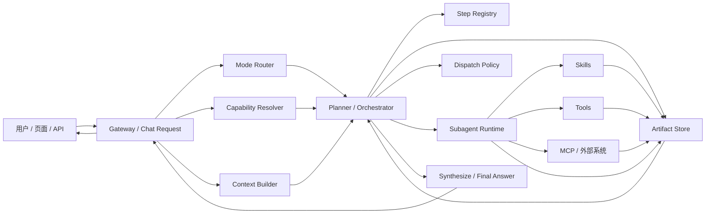

### 关键理解

- `Gateway` 只是入口，不是流程主脑
- `Mode Router` 决定走 `classic` 还是 `orchestrator`
- `Capability Resolver` 决定当前业务域边界
- `Planner / Orchestrator` 是核心
- `Step Registry` 提供“可被动态规划选中的步骤目录”
- `Artifact Store` 负责上下游输入输出传递
- `Subagent Runtime` 负责真正并行跑子任务

---

## 4. 分层关系图

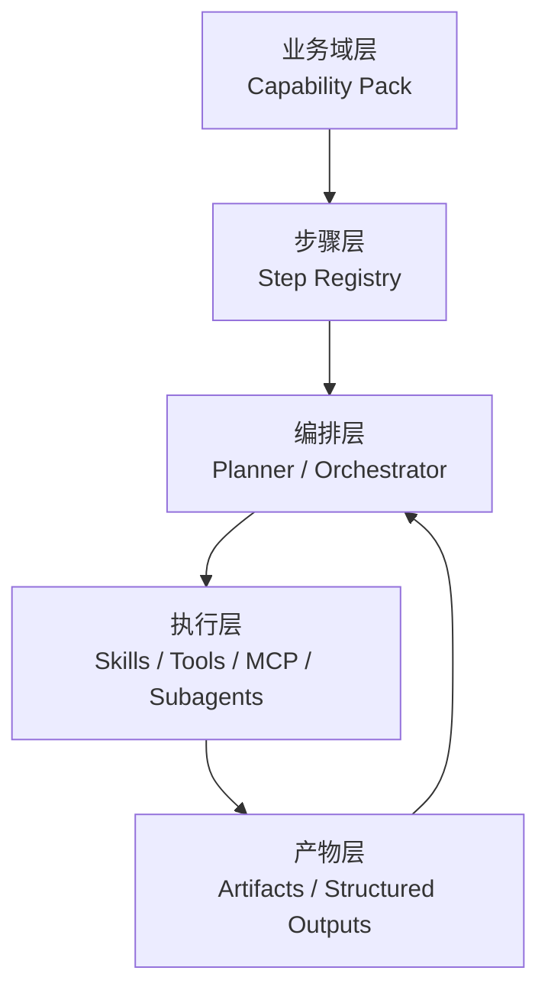

### 分层职责

#### Capability Pack

负责：

- 场景边界
- 允许的工具 / 技能 / 步骤
- 审批 / 重试 / schema / 并发等治理规则

#### Step Registry

负责：

- 注册一批“可选步骤模板”
- 每个步骤的输入输出合同
- 每个步骤的执行偏好

#### Planner / Orchestrator

负责：

- 动态选步骤
- 规划依赖
- 并行与分批调度
- 结果汇总与继续推进

#### Skills / Tools / MCP / Subagents

负责：

- 真正执行动作
- 连接外部系统
- 输出结构化结果

#### Artifacts

负责：

- 沉淀上一步结果
- 成为下一步输入
- 避免纯聊天文本传递导致漂移

---

## 5. 请求进入后的动态流程图

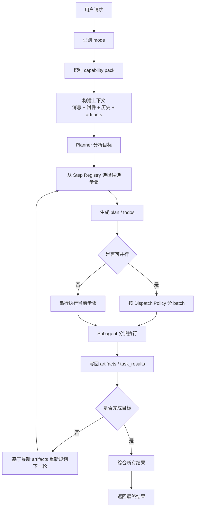

### 这张图表达的重点

- 不是固定顺序执行
- 每轮执行后都可以重新规划
- `artifacts` 是下一轮规划的重要输入
- planner 可以动态决定跳过、并行、回退、继续

---

## 6. 为什么不能只靠自由规划

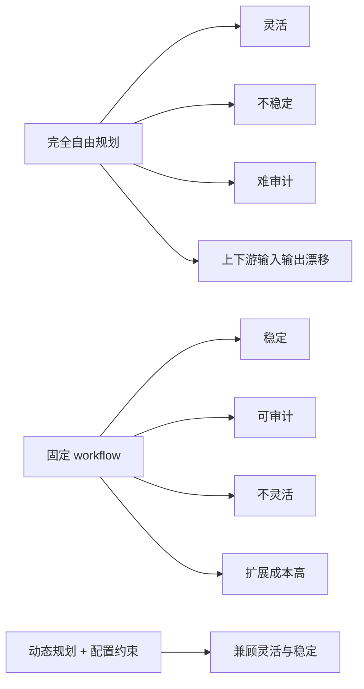

### 推荐路线

`smartclaw` 应走中间路线：

**动态规划 + 配置约束**

而不是：

- 完全自由
- 或完全写死

---

## 7. Capability Pack、Step、Tool、Skill 的关系图

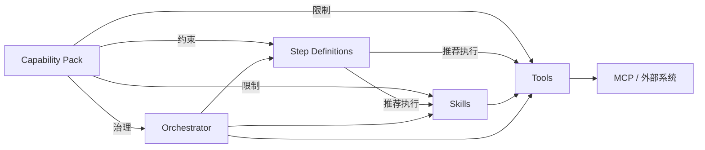

### 一句话区分

- `tool`：原子动作
- `skill`：能力封装
- `step`：步骤模板
- `capability pack`：业务域边界和治理规则
- `orchestrator`：动态调度引擎

---

## 8. Step Definition 的位置

你前面担心 `step` 会不会把流程写死。

答案是：

**不会，只要它被定义成“候选步骤目录”，而不是固定顺序节点”。**

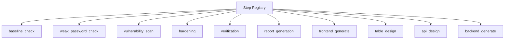

planner 在运行时做的是：

- 从这个目录里挑候选步骤
- 根据当前目标和输入动态组装执行图

而不是：

- 预先写死 `A -> B -> C`

---

## 9. Artifact 流转图

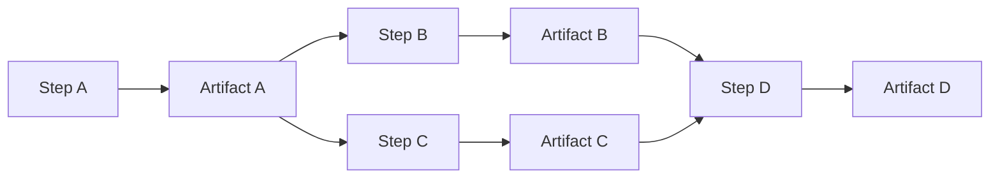

### 这层为什么重要

没有 `artifact`，步骤之间就只能靠聊天文本传递上下文。

后果是：

- 输入不稳定
- 下游难消费
- 结果难复用
- planner 很难做稳定判断

所以：

**通用动态编排框架的核心之一，是 artifact 总线。**

---

## 10. 当前 SmartClaw 对应关系图

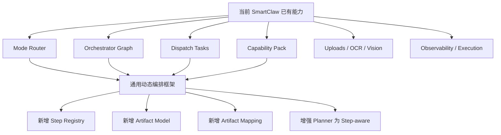

### 意味着什么

你现在不是从零开始。

你已经有：

- 动态模式分流
- orchestrator 运行骨架
- subagent 批量分派
- capability pack 治理
- 上传 / OCR / vision / 结构化输出

缺的是：

- `Step Registry`
- `Artifact` 模型
- step-aware planner

---

## 11. 开发场景的动态编排示意

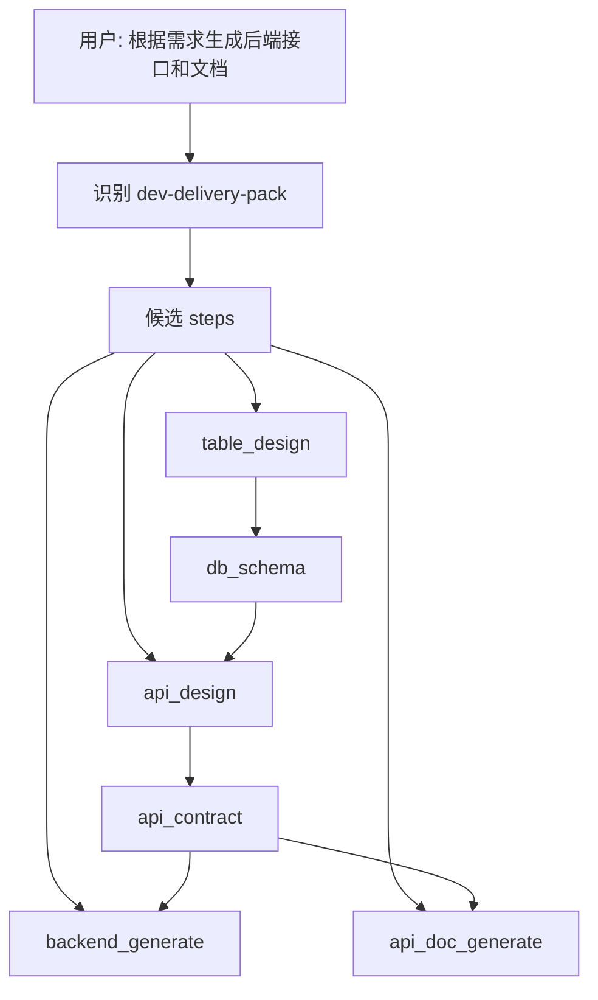

重点：

- 不是固定先后写死
- planner 可以根据输入完整度决定是否跳过 `table_design`
- `api_doc_generate` 是否执行也可以由目标决定

---

## 12. 安全治理场景的动态编排示意

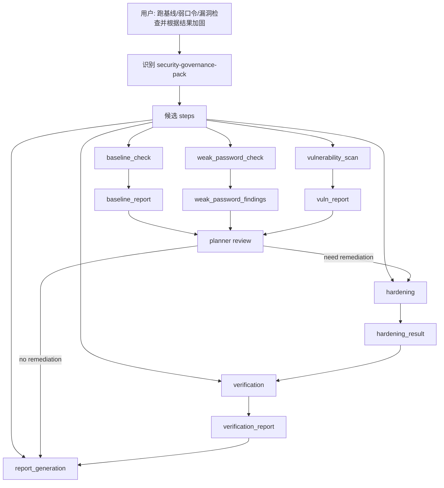

重点：

- 检查步骤可以并行
- 是否进入加固由结果决定
- 是否需要验证由风险状态决定
- 这就是动态编排，不是固定脚本

---

## 13. 后续扩展时哪些要改，哪些不该改

### 13.1 理想情况下，只改配置或能力注册

新增业务时，优先只做：

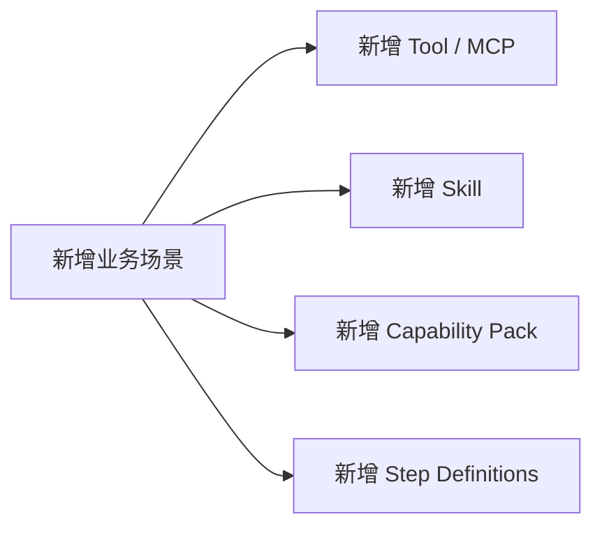

### 13.2 只有这些情况才改核心代码

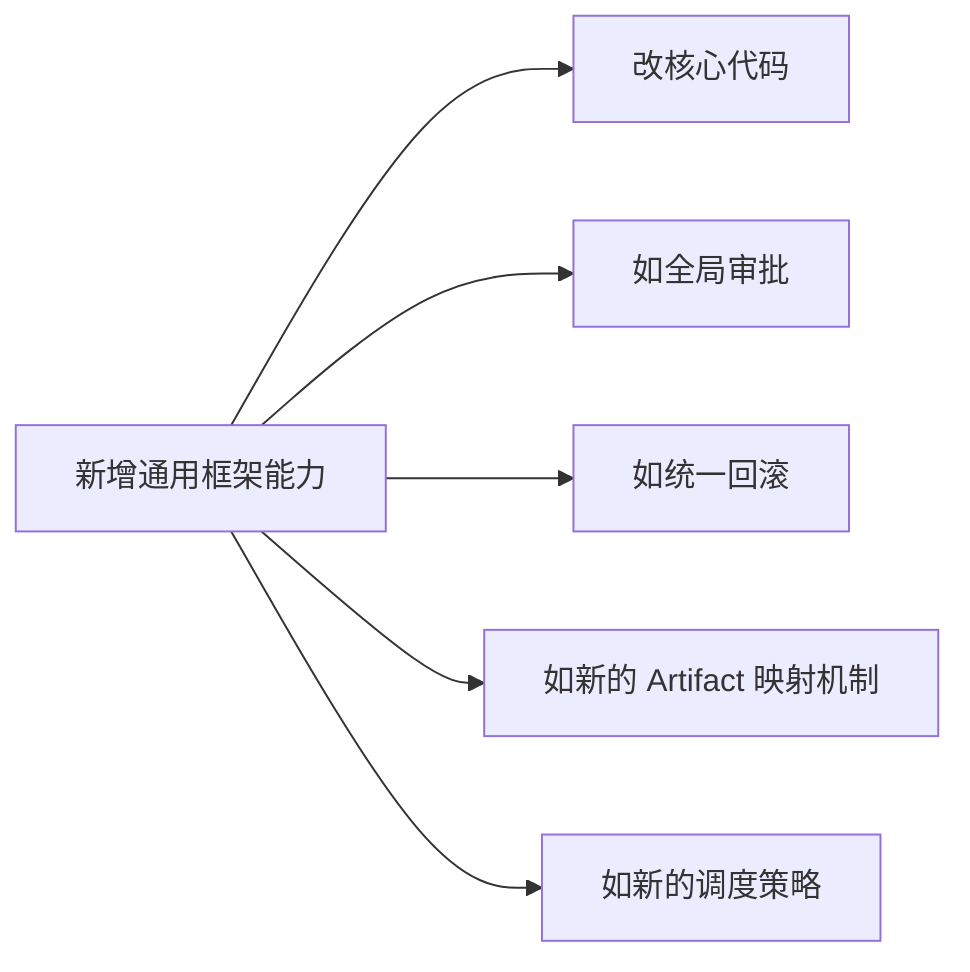

换句话说：

**新增业务本身，不应成为改核心代码的理由。**

---

## 14. 推荐实施路线图

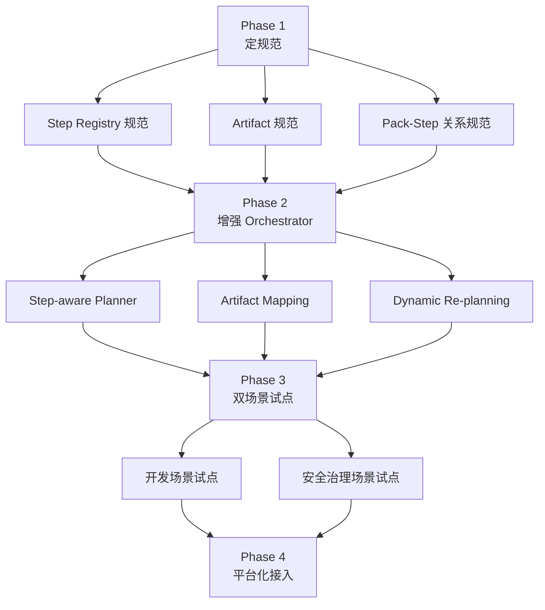

### 顺序解释

当前最合理的下一步仍然是：

1. 定规范
2. 再改 orchestrator
3. 再做试点场景

因为如果规范先不清楚，后面的运行时增强很容易返工。

---

## 15. 最终目标图

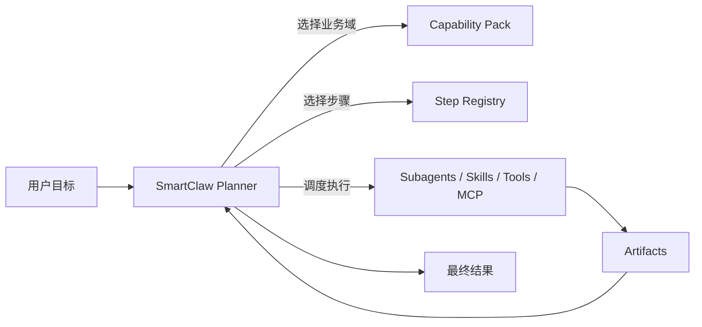

### 最终形态

你真正要的不是：

- 多个割裂的业务页面
- 多个固定流程脚本

而是：

**一个通用的动态编排中枢**

满足：

- 多业务域复用
- 动态规划
- 可并行分派
- 结构化产物流转
- 以后主要靠新增 `tools / skills / mcp / step / pack` 扩展

---

## 16. 结论

结合当前 `smartclaw` 的实现，以及你要的最终目标，推荐架构方向是：

### SmartClaw 通用动态编排框架

核心特点：

1. 动态规划，而不是固定 workflow
2. 配置驱动约束，而不是无边界自由规划
3. Step Registry 作为候选步骤目录
4. Artifact 作为上下游输入输出总线
5. Capability Pack 作为业务域边界和治理层
6. Orchestrator 作为统一调度中枢

这条路线最符合你的目标：

**后面尽量不改核心代码，主要靠新增 tools、skills、mcp 和配置来扩展。**
