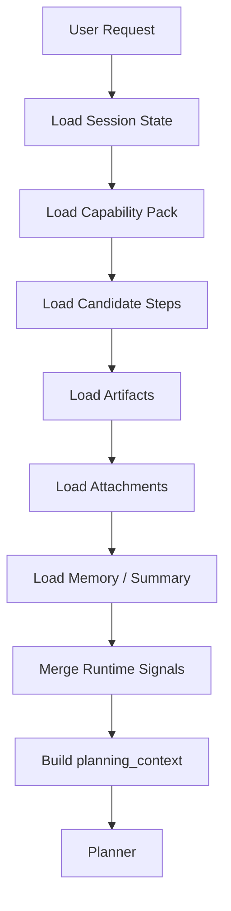
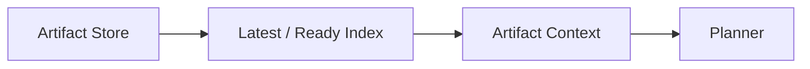
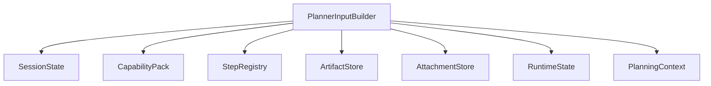

# SmartClaw Planner Input Resolution 规范

## 1. 目标

本文档定义 planner / orchestrator 在每轮动态规划前，如何组装“当前可用输入上下文”。

核心问题：

- planner 每次规划到底看什么
- 不同来源的输入如何合并
- 用户输入、artifacts、附件、memory、pack 规则如何共同作用

---

## 2. 核心结论

Planner 不能只看一条用户消息。  
它应该消费一个统一的 `planning_context`。

这个上下文由多个输入源组合而成：

- 当前用户目标
- 会话历史摘要
- 当前 capability pack
- 可选 step 集合
- 当前 artifacts
- 上传附件提取结果
- 运行时状态
- 失败 / 审批 / 重试信息

---

## 3. 总体流程图



---

## 4. 输入源分类

建议 planner 输入分为 8 类：

1. `user_goal`
2. `session_context`
3. `capability_context`
4. `step_catalog`
5. `artifact_context`
6. `attachment_context`
7. `runtime_signals`
8. `governance_context`

---

## 5. planning_context 建议结构

```yaml
request:
  user_message: "..."
  mode: "auto"
  scenario_type: "security"
  capability_pack: "security-governance-pack"

session:
  session_key: "..."
  summary: "..."
  recent_messages: []

capability:
  pack_id: "security-governance-pack"
  preferred_mode: "orchestrator"
  allowed_steps: []
  policy: {}

steps:
  candidate_steps: []

artifacts:
  latest_by_type: {}
  ready_artifacts: []

attachments:
  extracted_items: []

runtime:
  current_plan: null
  completed_steps: []
  failed_steps: []
  waiting_approval: false

governance:
  approval_required: false
  retry_limits: {}
  concurrency_limits: {}
```

---

## 6. 输入优先级

当多个来源提供相同语义输入时，建议按以下优先级消费：

1. 用户当前显式输入
2. 当前请求附件
3. 显式绑定 artifact
4. 最新 ready artifact
5. session summary / memory
6. 默认值 / pack 提示

这保证 planner 优先尊重当前意图，而不是被旧上下文绑死。

---

## 7. User Goal 解析

Planner 第一层输入仍然是用户当前目标。

需要抽取：

- 当前目标
- 是否多目标
- 是否包含条件执行
- 是否需要结构化结果
- 是否属于某个已知 domain

例如：

> 跑基线、弱口令、漏洞检查，并根据结果动态加固

可抽取为：

- goal: `security_governance`
- subgoals:
  - `baseline_check`
  - `weak_password_check`
  - `vulnerability_scan`
  - `hardening_if_needed`
- planning_hints:
  - parallel_checks = true
  - conditional_remediation = true

---

## 8. Session Context 解析

Session Context 应包含：

- 会话摘要
- 最近 N 条核心消息
- 最近一次 token 统计
- 当前会话已有附件和结果概览

注意：

- 不应把整段历史原样塞给 planner
- 应优先消费 summary 和结构化状态

---

## 9. Capability Context 解析

Capability Pack 对 planner 影响很大。

应至少向 planner 提供：

- `pack_id`
- `domain`
- `allowed_steps`
- `blocked_steps`
- `preferred_steps`
- `approval_required_steps`
- `concurrency_policy`
- `retry_policy`

Planner 应把它视为硬边界，而不是软建议。

---

## 10. Step Catalog 注入

Planner 不应看到全部 step 细节，而应看到：

- 经 pack 过滤后的候选步骤
- 每个 step 的摘要信息
- 输入输出要求
- 关键前置条件

建议注入的 step 摘要结构：

```yaml
- id: "vulnerability_scan"
  goal_tags: ["security", "scan"]
  inputs: ["target_scope"]
  outputs: ["vulnerability_report"]
  parallel: true
  risk_level: "low"
```

---

## 11. Artifact Context 注入

Planner 需要知道“已有产物”，但不需要消费所有 artifact 全量内容。

建议注入：

- 按类型聚合的 latest ready artifact
- 每个 artifact 的简短 summary
- 核心状态
- 是否可作为某 step 的输入



---

## 12. Attachment Context 注入

上传附件不应只存在聊天气泡里，应转成结构化附件上下文。

建议提供：

- `attachment_id`
- `type`
- `extract_status`
- `summary`
- `artifact_link`（若已转成 artifact）

例如：

- 需求文档
- 图片 OCR 结果
- 上传的 API 文档
- 巡检报告

---

## 13. Runtime Signals 注入

Planner 必须感知当前运行态，否则无法做稳定的动态调度。

建议注入：

- 当前是否已有 plan
- 已完成 steps
- 失败 steps
- 正在运行 steps
- 当前 phase / batch
- 最近失败原因
- 是否等待审批

这些信息直接影响是否：

- 重试
- 跳过
- 切换路径
- 终止

---

## 14. Governance Context 注入

治理信息主要来自 capability pack 和 runtime state。

建议注入：

- 审批要求
- 风险限制
- 最大并发
- 重试上限
- schema 强制要求

这样 planner 在动态规划时不会“想到什么就干什么”。

---

## 15. Planner Input Builder 建议职责

建议后续实现一个统一的 `PlannerInputBuilder`，负责：

- 拉取当前 session state
- 解析 pack
- 过滤 step registry
- 拉取 artifacts
- 拉取 attachments
- 拉取 runtime 状态
- 生成统一 `planning_context`



---

## 16. 开发场景示例

用户目标：

> 根据需求文档生成 API 和接口文档

Planner 输入中可能包括：

- 用户当前消息
- 已上传需求文档提取结果
- 已存在的 `api_contract` artifact（如果之前做过）
- `dev-delivery-pack`
- 候选 steps：
  - `requirement_analysis`
  - `api_design`
  - `api_doc_generate`

Planner 可动态决定：

- 如果需求文档已结构化，跳过 `requirement_analysis`
- 先做 `api_design`
- 再做 `api_doc_generate`

---

## 17. 安全治理场景示例

用户目标：

> 跑基线、弱口令、漏洞检查，并根据结果动态加固

Planner 输入中可能包括：

- 当前目标
- 目标主机/资产范围
- `security-governance-pack`
- 候选 steps：
  - `baseline_check`
  - `weak_password_check`
  - `vulnerability_scan`
  - `security_summary`
  - `hardening`
  - `verification`
- 历史 artifact：
  - 旧的 `baseline_report`
  - 旧的 `hardening_result`

Planner 可动态判断：

- 是否复用旧扫描结果
- 是否重新执行检查
- 是否进入加固

---

## 18. 最终原则

Planner 输入组装的目标是：

- 让 planner 感知足够上下文
- 但不被冗余历史淹没
- 优先消费结构化状态，而不是聊天文本

一句话概括：

> planner 应消费“结构化 planning_context”，而不是零散消息堆

---

## 19. 下一步建议

在本文档之后，建议继续完成：

1. `Runtime State & Observability Spec`

