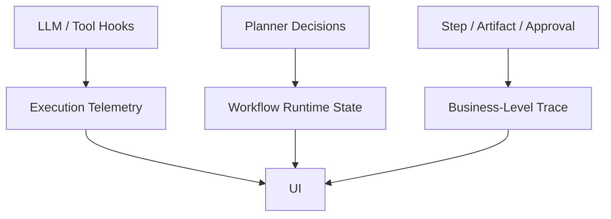
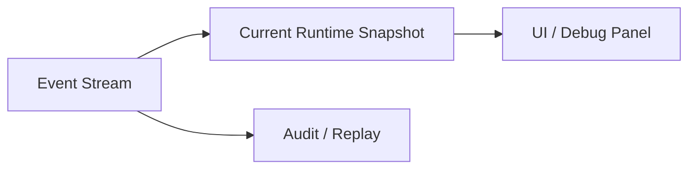

# SmartClaw Runtime State & Observability 规范

## 1. 目标

本文档定义 SmartClaw 通用动态编排框架的运行时状态与观测规范。

目标是回答：

- 动态规划过程中最少要记录哪些状态
- subagent、step、artifact、approval、retry 如何统一观测
- UI 与调试面板应该展示什么

---

## 2. 核心结论

SmartClaw 作为通用动态编排框架，不能只保留：

- 聊天消息
- llm/tool hooks

还必须保留一层更高语义的运行态：

- 当前计划
- 当前候选 steps
- step 执行状态
- artifact 依赖关系
- subagent 生命周期
- approval / retry / schema / failure 轨迹

否则：

- planner 难审计
- UI 难解释
- 场景难回放

---

## 3. 总体分层

建议把观测分成三层：

1. `Execution Telemetry`
2. `Workflow Runtime State`
3. `Business-Level Trace`



---

## 4. Runtime State 最小结构

建议运行时状态至少包含：

```yaml
session_key: "..."
active_pack: "security-governance-pack"
mode: "orchestrator"
current_goal: "..."
current_plan: {}
current_phase: "planning"
completed_steps: []
running_steps: []
failed_steps: []
waiting_approval: false
artifacts: []
artifact_index: {}
subagents: []
retries: []
last_error: null
```

---

## 5. Step Runtime State

每个 step 建议维护如下状态：

```yaml
step_id: "vulnerability_scan"
status: "completed"
attempt: 1
started_at: "..."
ended_at: "..."
producer_subagent: "sub_001"
input_refs: []
output_artifacts: []
error: null
```

建议统一状态值：

- `pending`
- `ready`
- `running`
- `waiting_input`
- `waiting_approval`
- `completed`
- `failed`
- `skipped`

---

## 6. Subagent Runtime State

每个 subagent 建议维护：

```yaml
subagent_id: "sub_001"
step_id: "baseline_check"
status: "completed"
batch_id: "batch_01"
attempt: 1
started_at: "..."
ended_at: "..."
error: null
summary: "..."
```

这层状态应主要服务：

- 并发调度
- 重试
- UI 展示
- 诊断

---

## 7. Artifact Runtime State

运行时应同时维护 artifact 索引：

- `all_artifacts`
- `latest_artifacts_by_type`
- `ready_artifacts_by_type`
- `artifact_refs_by_step`

这样 planner 才能高效判断：

- 哪些输入已满足
- 哪些结果已过时
- 哪些可复用

---

## 8. Approval / Retry / Failure State

这些是通用动态编排里不可缺的状态维度。

### Approval

```yaml
approval:
  required: true
  waiting: false
  approved_by: null
  approved_at: null
```

### Retry

```yaml
retry:
  step_id: "hardening"
  attempts: 1
  max_retries: 2
  last_reason: "verification_failed"
```

### Failure

```yaml
failure:
  scope: "step"
  target_id: "hardening"
  category: "tool_error"
  message: "..."
```

---

## 9. 观测事件分类

建议统一事件分类：

### 9.1 Planner Events

- `planner.started`
- `planner.context_built`
- `planner.steps_selected`
- `planner.replanned`
- `planner.completed`

### 9.2 Step Events

- `step.ready`
- `step.started`
- `step.completed`
- `step.failed`
- `step.skipped`

### 9.3 Subagent Events

- `subagent.spawned`
- `subagent.started`
- `subagent.completed`
- `subagent.failed`
- `subagent.retry_scheduled`

### 9.4 Artifact Events

- `artifact.created`
- `artifact.updated`
- `artifact.superseded`
- `artifact.invalidated`

### 9.5 Governance Events

- `approval.required`
- `approval.approved`
- `approval.rejected`
- `schema.validated`
- `retry.applied`

---

## 10. UI 展示建议

UI 不应只展示 chat 消息，建议至少支持：

### 10.1 Overview

- 当前 pack
- 当前 mode
- 当前 phase
- 当前 plan 简述

### 10.2 Steps

- 已完成 steps
- 当前运行 steps
- 失败/等待中的 steps

### 10.3 Artifacts

- 当前已产出的 artifacts
- 类型、摘要、状态、版本

### 10.4 Subagents

- 并发 worker 列表
- 状态、批次、重试次数

### 10.5 Governance

- 是否等待审批
- schema 校验状态
- 最近失败原因

---

## 11. 调试面板建议

对于 SmartClaw 当前已有的调试面板，建议保留三层视图：

1. `Execution`
2. `Planner / Steps`
3. `Raw Events`

也就是：

- 普通用户看 `Execution`
- 业务调试看 `Planner / Steps`
- 开发排障看 `Raw Events`

---

## 12. 日志与状态的区别

需要明确：

- `event log` 是时间序列
- `runtime state` 是当前快照

两者都需要。



---

## 13. 审计与回放

动态编排框架后续若要进入业务平台，必须支持回放：

- 当时识别了哪个 pack
- 当时有哪些 candidate steps
- planner 为什么选了这些 steps
- 哪个 subagent 跑了哪一步
- 哪个 artifact 被生成和消费

这意味着：

- 不能只保留最终答案
- 必须保留规划轨迹和结构化状态

---

## 14. 与当前 SmartClaw 的复用建议

当前 SmartClaw 已有：

- hooks
- execution 面板
- session 统计
- subagent 事件
- orchestrator 事件骨架

后续建议是在现有基础上增强：

- 更高语义的 step / artifact / planner 状态
- 更清晰的 runtime snapshot
- 更稳定的 UI 映射

而不是重写整套观测体系。

---

## 15. 开发场景示例

在开发场景中，UI 应能看到：

- 当前任务：根据需求生成 API 和文档
- 已完成 step：`requirement_analysis`
- 运行中 step：`api_design`
- 已产出 artifact：`api_contract`
- 待执行 step：`api_doc_generate`

---

## 16. 安全治理场景示例

在安全治理场景中，UI 应能看到：

- 当前任务：检查并加固
- 已运行 step：
  - `baseline_check`
  - `weak_password_check`
  - `vulnerability_scan`
- 汇总 artifact：`security_summary`
- `hardening` 正等待审批
- 最近失败：无

---

## 17. 最终原则

运行时状态与观测的目标不是增加复杂度，而是让动态规划变得：

- 可解释
- 可回放
- 可调试
- 可审计

一句话概括：

> 动态编排不是黑盒聊天，它必须有可观测的结构化运行态

---

## 18. 下一步建议

三份补充规范到这里基本收口。  
下一步可以进入第一轮实现设计或试点设计，例如：

1. 安全治理试点
2. 开发工具链试点

