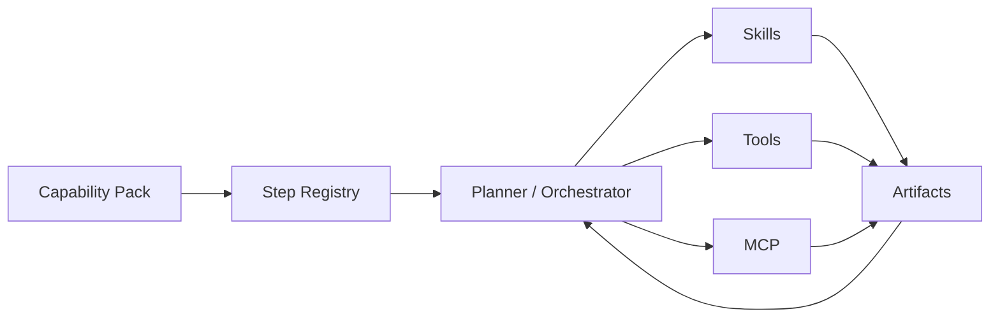
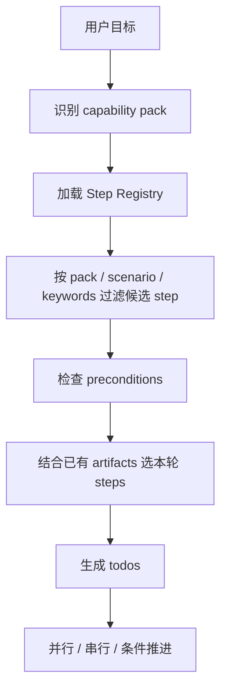
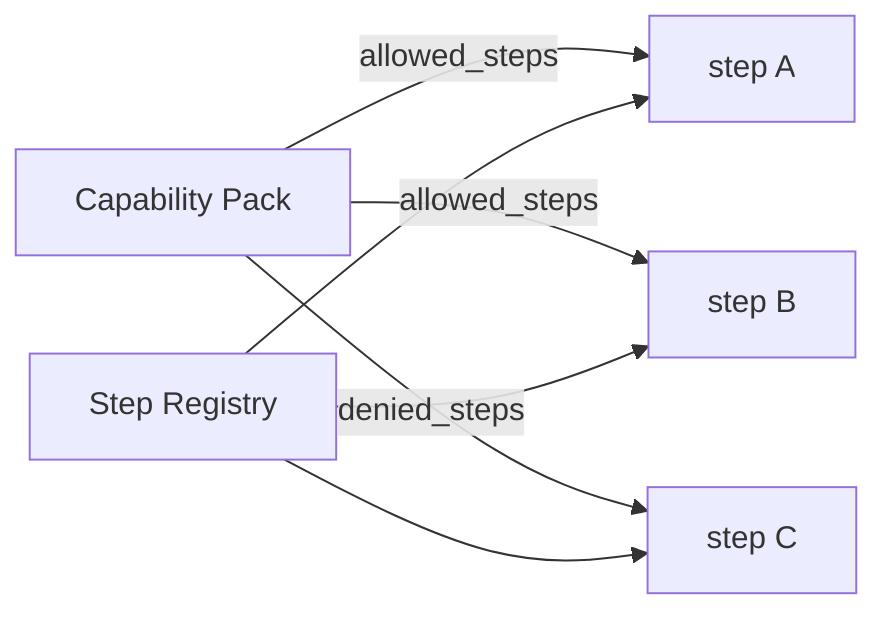
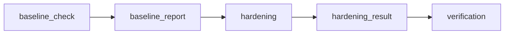
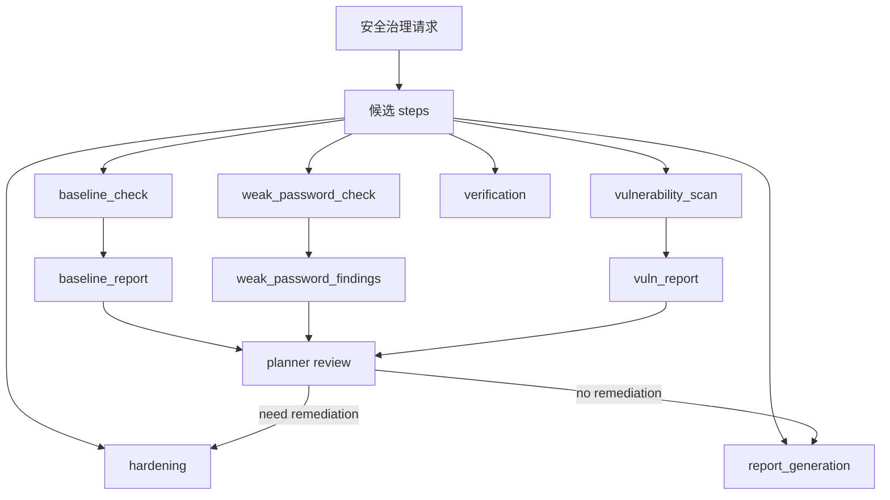
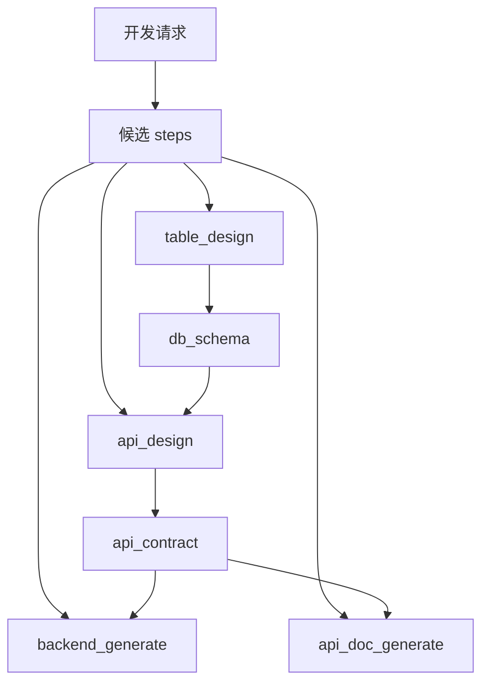

# SmartClaw Step Registry 规范

## 1. 目的

`Step Registry` 用于定义 `smartclaw` 在动态编排时可选用的“步骤目录”。

它的目标不是写死流程，而是给 planner 一个稳定的候选空间，使系统能在多业务域下做到：

- 动态规划
- 受控拆分
- 稳定输入输出
- 后续主要靠配置扩展

一句话：

**Step Registry 解决“有哪些步骤可选、每步吃什么、吐什么、什么时候适合被选中”。**

---

## 2. Step Registry 的定位

### 2.1 不是固定 Workflow

`step` 不是固定顺序节点，不表示：

- 永远先执行 A
- 再执行 B
- 再执行 C

它表示的是：

- 一个可被动态规划选中的步骤模板

### 2.2 与其他概念的关系



### 2.3 职责边界

- `tool`
  - 原子动作
- `skill`
  - 能力封装
- `step`
  - 业务步骤模板
- `capability pack`
  - 业务域边界和治理规则
- `orchestrator`
  - 动态选 step 并推进执行

---

## 3. 设计原则

### 3.1 Step 必须配置化

新增步骤不应优先改 orchestrator 核心代码。  
后续扩展的理想路径是新增 `step definition` 文件。

### 3.2 Step 必须结构化

每个 step 都要明确：

- 适用场景
- 输入
- 输出
- 可用能力
- 约束条件

### 3.3 Step 不应携带固定流程顺序

允许 step 提供：

- `recommended_next_steps`
- `preconditions`

但不应表达成：

- “只能固定执行下一步”

### 3.4 Step 应与 Artifact 协同

每个 step 最终都应：

- 消费已有 artifact
- 生产新 artifact

否则很难支撑稳定的动态编排。

---

## 4. 目录约定

推荐目录：

```text
step_registry/
  security/
    baseline_check.yaml
    weak_password_check.yaml
    vulnerability_scan.yaml
    hardening.yaml
    verification.yaml
    report_generation.yaml
  dev/
    requirement_analysis.yaml
    table_design.yaml
    api_design.yaml
    backend_generate.yaml
    api_doc_generate.yaml
```

推荐支持两级搜索：

- workspace: `{workspace}/step_registry`
- global: `~/.smartclaw/step_registry`

优先级：

- workspace 覆盖 global

---

## 5. Step Definition 结构

## 5.1 最小示例

```yaml
id: baseline_check
name: 基线检查
domain: security
description: 对目标资产执行基线检查并输出结构化发现

applicable_when:
  scenario_types:
    - inspection
    - hardening
  keywords:
    - 基线
    - 巡检
    - 合规

inputs:
  required:
    - asset_scope
  optional:
    - baseline_profile
    - previous_findings

outputs:
  - baseline_report
  - baseline_findings

artifacts_produced:
  baseline_report:
    schema: baseline_report_v1
  baseline_findings:
    schema: findings_v1

execution:
  preferred_skill: baseline-check-skill
  allowed_tools:
    - check_baseline
  can_run_parallel: true
  risk_level: low

preconditions:
  required_artifacts: []
  required_user_inputs:
    - asset_scope

next_step_hints:
  on_success:
    - weak_password_check
    - vulnerability_scan
  on_findings:
    - hardening

metadata:
  owner: security
  tags:
    - inspection
    - governance
```

---

## 6. 字段规范

## 6.1 基础字段

- `id`
  - 唯一标识
  - 建议 `snake_case`
- `name`
  - 用户可读名称
- `domain`
  - 所属业务域，如 `security`、`dev`、`ops`
- `description`
  - 简短说明该 step 的职责

## 6.2 适用条件

`applicable_when` 用于帮助 planner 判断这个 step 是否可被选中。

推荐字段：

```yaml
applicable_when:
  scenario_types: []
  keywords: []
  task_profiles: []
  packs: []
```

说明：

- `scenario_types`
  - 对应请求中的 `scenario_type`
- `keywords`
  - 用户请求中的高频关键词
- `task_profiles`
  - 对应复杂度或执行画像
- `packs`
  - 限定只在某些 capability pack 下候选

## 6.3 输入定义

```yaml
inputs:
  required: []
  optional: []
```

输入名建议统一来自以下来源之一：

- 用户输入字段
- 上游 artifacts
- 附件提取结果
- 系统上下文字段

### 输入来源建议继续细化

推荐增强为：

```yaml
inputs:
  required:
    - name: asset_scope
      source: user_input
    - name: baseline_profile
      source: artifact
      from: baseline_profile
```

第一阶段可以先从简，用字符串列表即可。

## 6.4 输出定义

```yaml
outputs:
  - baseline_report
  - baseline_findings
```

输出必须对应 artifact 名称，不建议只写自由文本结果。

## 6.5 产物定义

```yaml
artifacts_produced:
  baseline_report:
    schema: baseline_report_v1
  baseline_findings:
    schema: findings_v1
```

建议为每个 artifact 指定 schema 名称，便于后续做校验和映射。

## 6.6 执行定义

```yaml
execution:
  preferred_skill: baseline-check-skill
  allowed_tools:
    - check_baseline
  can_run_parallel: true
  risk_level: low
  preferred_subagent_type: general-purpose
```

字段说明：

- `preferred_skill`
  - 优先使用哪个 skill
- `allowed_tools`
  - 当前 step 允许的 tool 子集
- `can_run_parallel`
  - 是否适合与其他 step 并行
- `risk_level`
  - `low / medium / high`
- `preferred_subagent_type`
  - 当前 step 默认走哪类 subagent

## 6.7 前置条件

```yaml
preconditions:
  required_artifacts:
    - api_contract
  required_user_inputs:
    - requirement_doc
```

前置条件不是固定顺序，而是：

**planner 选中该 step 前必须满足的条件。**

## 6.8 下一步提示

```yaml
next_step_hints:
  on_success:
    - api_doc_generate
  on_findings:
    - hardening
```

这只是提示，不是强制顺序。

planner 可以参考，但不能被硬绑死。

---

## 7. Planner 如何消费 Step Registry



### 7.1 建议的筛选顺序

1. 先按 `capability pack` 过滤
2. 再按 `scenario_type / task_profile / keywords` 过滤
3. 再按 `preconditions` 判断当前是否可执行
4. 再按 `can_run_parallel / risk_level / governance` 决定调度方式

### 7.2 推荐 planner 输出

planner 在生成 todos 时，不应只有自然语言描述，建议输出：

```json
{
  "todo_id": "todo_001",
  "step_id": "baseline_check",
  "title": "执行基线检查",
  "kind": "inspection",
  "parallel": true,
  "input_bindings": {
    "asset_scope": "request.asset_scope"
  }
}
```

这样 dispatch 和 artifact mapping 都更稳定。

---

## 8. 与 Capability Pack 的关系

## 8.1 Pack 决定边界，Step 决定候选步骤



### 8.2 推荐在 pack 中新增

建议 capability pack 增加：

```yaml
allowed_steps:
  - baseline_check
  - weak_password_check
  - vulnerability_scan
  - hardening
  - verification
  - report_generation

denied_steps: []
preferred_step_groups:
  - inspection
  - remediation
```

这样：

- pack 负责限定业务域边界
- step registry 提供全局步骤目录

---

## 9. Step 之间如何依赖

### 9.1 不写死依赖链

不要在 step 内写死：

```yaml
next: hardening
```

应改为：

- `preconditions`
- `next_step_hints`
- `artifact requirements`

让 planner 动态决定。

### 9.2 依赖通过 artifact 传递



重点：

- 依赖不是“写死顺序”
- 依赖是“需要哪个产物”

---

## 10. 安全治理场景示例



说明：

- 前三步是 step registry 中的候选步骤
- planner 根据目标和前置条件动态选择并行执行
- `hardening` 是否进入由 review 阶段决定

---

## 11. 开发场景示例



说明：

- `api_design` 依赖 `db_schema`
- `backend_generate` 和 `api_doc_generate` 依赖 `api_contract`
- 但 planner 仍可根据输入完整度决定是否跳过某些 step

---

## 12. Step Registry Loader 的预期职责

后续实现时，建议 loader 负责：

1. 发现 step definition 文件
2. 解析并校验结构
3. 建立按 `id / domain / scenario / pack` 的索引
4. 暴露查询接口给 planner

推荐接口示意：

```python
registry.list_steps()
registry.get_step(step_id)
registry.find_candidates(
    pack="security-governance",
    scenario_type="inspection",
    task_profile="multi_stage",
    message="跑基线和漏洞检查后再加固"
)
```

---

## 13. 校验规则

每个 step definition 至少校验：

1. `id` 必填且唯一
2. `name` 必填
3. `description` 必填
4. `outputs` 不能为空
5. `artifacts_produced` 与 `outputs` 要一致
6. `risk_level` 必须在允许值内
7. `allowed_tools` 与 `preferred_skill` 不得冲突

---

## 14. 推荐实施顺序

### Phase 1

先实现最小 step schema：

- 基础字段
- inputs / outputs
- execution
- preconditions
- next_step_hints

### Phase 2

再实现：

- allowed_steps / denied_steps 与 capability pack 联动
- planner 的 step-aware todo 生成

### Phase 3

再做：

- artifact binding
- dynamic re-planning
- step group / risk policy

---

## 15. 最终结论

`Step Registry` 的本质不是 workflow 引擎，而是：

**给 SmartClaw 的动态 planner 提供一个稳定、可配置、可扩展的步骤目录。**

后续如果这层定清楚了，你就能做到：

- 新增业务时尽量不改 orchestrator 核心
- 主要靠新增 `tools / skills / mcp / capability packs / step definitions`
- 同一套框架覆盖开发、安全、运维等多类场景

这正是你要的“通用动态编排框架”的关键基础设施。
