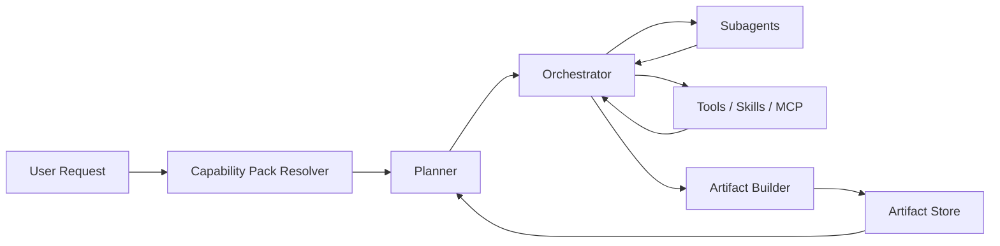
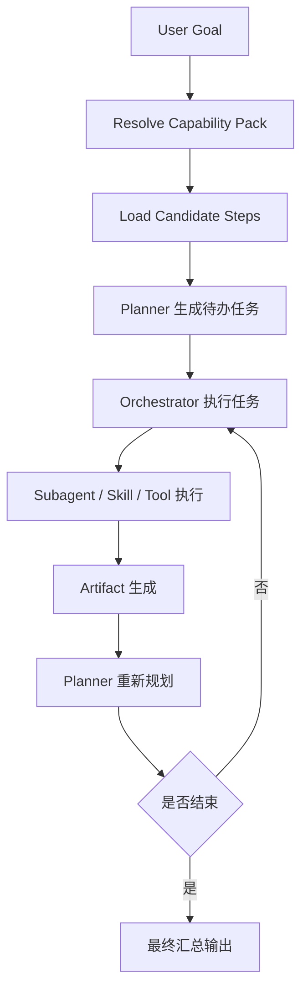

# SmartClaw 通用动态编排框架统一设计

## 1. 文档定位

这是一份单文档版总设计，用来替代前面分散的多份框架文档，作为 SmartClaw 后续动态编排框架的主入口与主设计。

本文档目标只有一个：

> 把 SmartClaw 做成一个通用超级智能体框架，后续新增业务时尽量不改核心代码，主要通过 `tools / skills / mcp / capability pack / 少量配置` 扩展。

本文档不追求一次性设计到最复杂形态，而是采用 **MVP 优先、渐进增强** 的路线。

---

## 2. 设计目标

SmartClaw 后续需要同时支持多类场景，例如：

- 开发场景：需求分析、表结构设计、API 设计、后端生成、文档生成
- 安全治理场景：基线检查、弱口令检查、漏洞检查、汇总、加固、验证、报告
- 运维场景：巡检、诊断、修复、复核

因此框架必须满足：

1. 支持动态规划，不写死流程
2. 支持 subagent 并行执行
3. 支持上一步输出稳定成为下一步输入
4. 支持 capability pack 对业务域做边界约束
5. 后续扩展主要靠配置与能力注册，不靠频繁改核心代码

---

## 3. 不采用的两种极端路线

### 3.1 不采用固定 Workflow 引擎

原因：

- 会把流程写死
- 场景一多就僵化
- 又回到“每个业务一条专用流程”的老路

### 3.2 不采用完全自由规划

原因：

- 不稳定
- 难审计
- 上下游输入输出容易漂
- 很难沉淀成通用业务框架

---

## 4. 最终方案

SmartClaw 采用：

## 动态规划 + 配置驱动约束

核心思想是：

- planner 动态决定“做什么”
- orchestrator 负责“怎么执行”
- capability pack 负责“在哪些边界内做”
- artifact 负责“如何把结果稳定传给后续步骤”

---

## 5. Phase 1 最小框架

Phase 1 只保留 5 个核心层，避免过度设计。

### 5.1 能力层：Tools / Skills / MCP

这是最底层的原子能力层。

例如：

- 安全类：基线检查、弱口令检查、漏洞扫描、加固
- 开发类：API 设计、代码生成、文档生成
- 运维类：巡检、日志分析、故障诊断

这一层后续会持续扩展，这是正常的。

### 5.2 Capability Pack

这是业务域边界层。

它只负责：

- 限定当前场景允许用哪些能力
- 定义默认模式和治理规则
- 指定审批、重试、并发边界

它不负责写死流程顺序。

例如：

- `security-pack`
- `development-pack`
- `ops-pack`

### 5.3 Planner

这是动态规划层。

它负责：

- 理解用户目标
- 判断需要哪些步骤
- 判断哪些步骤能并行
- 判断是否要补前置步骤
- 判断是否回退、重试、终止

Planner 只负责“决定做什么”，不直接执行。

### 5.4 Orchestrator

这是执行调度层。

它负责：

- 接收 planner 生成的任务列表
- 分派给 subagent / skill / tool
- 收集结果
- 将结果回传给 planner 进入下一轮规划

Orchestrator 只负责“怎么跑”，不负责业务目标理解。

### 5.5 Artifact

这是结果总线。

它负责：

- 把上一步结果沉淀下来
- 让下一步能稳定获取输入
- 避免结果只存在聊天文本里

Phase 1 采用轻量方案：

- State 中只存 `ArtifactEnvelope`
- 实际正文存 `payload file`

而不是一开始做很重的 artifact 平台。

---

## 6. 总体架构图



---

## 7. 核心职责边界

### 7.1 Planner

职责：

- 识别目标
- 决定下一轮执行哪些步骤
- 决定依赖关系和并行关系
- 决定是否继续、回退、结束

不负责：

- 真正执行 tool/skill
- 管理线程或 subagent 生命周期细节

### 7.2 Orchestrator

职责：

- 执行 planner 产出的待办任务
- 调度 subagent
- 控制并发和重试
- 收集原始结果
- 触发 artifact 生成

不负责：

- 主动推导业务目标
- 长篇推理下一步业务意图

### 7.3 Capability Pack

职责：

- 定义业务域边界
- 限定可用 steps / skills / tools
- 指定审批、重试、并发策略

不负责：

- 写死全流程

### 7.4 Artifact

职责：

- 沉淀结构化结果
- 供后续步骤消费
- 支撑 planner 稳定复用上下文

---

## 8. 简化版 Step Registry

Step Registry 在 Phase 1 不做复杂配置，只保留最小字段。

建议结构：

```yaml
id: baseline_check
domain: security
description: 对目标资产执行基线检查
required_inputs: [asset_scope]
consumes_artifact_types: []
outputs: [baseline_report]
preferred_skill: baseline-check-skill
can_parallel: true
risk_level: low
completion_signal: baseline_report_ready
side_effect_level: read_only
```

说明：

- 不引入复杂的 `applicable_when`
- 不引入复杂的 `next_step_hints`
- 不把 step 做成 mini workflow engine
- 但必须保留最小“可执行契约”，否则 planner 无法稳定判断何时可选、何时缺输入

这里建议 Phase 1 至少补 4 个最小字段：

- `required_inputs`
  - 表示执行该 step 前必须具备哪些输入键
- `consumes_artifact_types`
  - 表示它可直接消费哪些 artifact 类型
- `completion_signal`
  - 表示 orchestrator 如何判断这个 step 已产出可用结果
- `side_effect_level`
  - 表示只读、可写、高风险等副作用等级，供治理和审批使用

step 只是 planner 的“可选步骤目录”。

---

## 9. Step Registry 的作用

Step Registry 的唯一目的，是告诉 planner：

- 有哪些步骤可选
- 每个步骤大概做什么
- 每个步骤要求什么输入
- 每个步骤可消费什么 artifact
- 每个步骤产出什么输出
- 推荐调用哪个 skill
- 这个步骤的完成信号和副作用级别是什么

Planner 仍然动态决定：

- 是否要选它
- 何时选它
- 是否并行
- 是否跳过

也就是说：

- Step Registry 负责提供“稳定约束”
- Planner 负责做“动态选择”

Step Registry 仍然不是 workflow，也不负责替 planner 推导完整流程。

---

## 10. Capability Pack 的最小职责

Pack 在 Phase 1 只做四类约束：

1. **允许什么**
   - 允许哪些 tools / skills / steps

2. **禁止什么**
   - 禁止哪些高风险步骤或能力

3. **治理什么**
   - 哪些步骤要审批
   - 最大并发多少
   - 最多重试几次

4. **偏好什么**
   - 默认偏向 orchestrator
   - 默认优先选择哪些步骤类型

Pack 不写死流程图。

### 10.1 规则优先级

为了避免 Step、Pack、治理逻辑三处重复定义规则，Phase 1 建议明确：

- `Step Registry`
  - 定义 step 的天然属性
  - 例如：输入输出、默认风险等级、是否天然可并行、副作用级别

- `Capability Pack`
  - 定义业务域内“允许什么、偏好什么、限制什么”
  - 例如：哪些 step 可用、哪些高风险 step 必须审批、默认最大并发

- `governance_middleware`
  - 负责运行时强制执行
  - 例如：真正拦截未审批执行、真正限制并发、真正判断是否还能重试

冲突覆盖顺序建议固定为：

`governance runtime decision > capability pack policy > step default property`

例如：

- step 默认 `can_parallel: true`
- 但当前 pack 规定 `max_concurrency: 1`
- 则本次运行必须串行

Planner 可以看到这些限制并提前规避，但最终强制权在 governance middleware。

---

## 11. Artifact 的轻量实现

Phase 1 不做重量级 artifact 模型，只做两层。

### 11.1 State 中的轻量引用

```yaml
artifact_id: art_001
artifact_type: baseline_report
schema_version: v1
producer_step: baseline_check
status: ready
summary: 主机基线检查完成，发现 3 项不符合
validation:
  is_valid: true
  errors: []
payload_path: /artifacts/art_001.json
```

### 11.2 文件中的实际内容

```json
{
  "summary": "主机基线检查完成，发现 3 项不符合",
  "data": {
    "findings": [...]
  },
  "metadata": {
    "asset_scope": "..."
  }
}
```

这样做的好处：

- State 保持轻量
- planner 能快速引用
- 复杂内容不挤进内存状态
- 后续再升级也容易

这里建议 Phase 1 统一采用两层模型：

- `ArtifactEnvelope`
  - 进入运行时 state
  - 供 planner / orchestrator / middleware 快速消费
- `payload file`
  - 保存较大正文
  - 供下游 step 或最终输出按需读取

`ArtifactEnvelope` 最小建议字段：

- `artifact_id`
- `artifact_type`
- `schema_version`
- `producer_step`
- `status`
- `summary`
- `validation`
- `payload_path`

这样仍然是轻量实现，但不再是“只有路径，没有统一外壳”。

### 11.3 与 Session 的关系

Phase 1 建议 artifact 按 session 隔离存储。

建议路径形式：

```text
sessions/{session_id}/artifacts/{artifact_id}.json
```

这样做的目的：

- 不同会话之间天然隔离
- 便于回放、归档、清理
- 后续如果要做项目级聚合，也更容易在 session 之上再做抽象

建议策略：

- 会话运行期间：artifact 保留在当前 session 目录中
- 会话结束后：可按策略选择归档或清理
- 需要长期保留的关键产物：后续再提升到项目级或知识库级存储

---

## 12. Middleware 机制

Phase 1 建议增加 3 个 Middleware，不做更多。

### 12.1 artifact_middleware

负责：

- 把执行结果标准化为 artifact
- 存储 artifact 引用

### 12.2 governance_middleware

负责：

- 审批检查
- 并发限制
- 重试限制
- 风险边界检查

### 12.3 step_tracking_middleware

负责：

- 记录 step 状态
- 记录 subagent 执行状态
- 记录失败和重试轨迹

这样横切逻辑不会堆进 orchestrator 主循环。

---

## 13. Skill 渐进式加载

Phase 1 必须支持按需加载 skill，而不是全量注入 prompt。

原因：

- 后续业务场景多，skill 很多
- 如果全部注入，上下文窗口会爆
- planner 和 step 只需要当前步骤相关能力

建议逻辑：

- planner 选出 step
- step 指向 `preferred_skill`
- skill loader 只加载当前步骤需要的 skill 内容

这样更接近 deer-flow 的轻量运行方式。

---

## 14. 典型运行流程



---

## 15. 安全治理场景示例

用户输入：

> 跑基线、弱口令、漏洞检查，并根据结果动态加固

系统执行方式：

1. 识别为 `security-pack`
2. 只开放安全相关步骤
3. planner 判断：
   - `baseline_check`
   - `weak_password_check`
   - `vulnerability_scan`
   可以并行
4. orchestrator 分派三个 subagent
5. 三个检查结果沉淀为 artifact
6. planner 判断是否需要 `hardening`
7. 如需要，执行加固，再执行 `verification`
8. 生成最终报告

关键点：

- 没有写死流程脚本
- 但也不是完全自由乱跑
- 动态规划建立在 pack 边界和 artifact 结果之上

---

## 16. 开发场景示例

用户输入：

> 根据需求生成 API 设计和接口文档

系统执行方式：

1. 识别为 `development-pack`
2. 开放开发相关步骤
3. planner 判断：
   - 如果没有结构化需求，先做 `requirement_analysis`
   - 然后做 `api_design`
   - 最后做 `api_doc_generate`
4. artifact 依次沉淀：
   - `requirement_summary`
   - `api_contract`
   - `api_doc`

这里依然不是固定 workflow。

---

## 17. Phase 1 不做的东西

为了避免过度设计，以下内容明确延期到后续：

- 很复杂的 artifact schema 体系
- 很复杂的 planner scoring 体系
- 很复杂的 step 条件配置
- 很复杂的 workflow 模板系统
- 很复杂的 sandbox 设计
- 很复杂的运行时状态树

这些不是现在第一阶段的必须项。

---

## 18. 后续扩展方式

当框架搭起来之后，后续新增业务应该主要通过下面方式扩展。

### 18.1 新增原子能力

新增：

- tool
- skill
- mcp

### 18.2 新增业务边界

新增：

- capability pack

### 18.3 新增可复用步骤

新增：

- step definition

理想情况下，不需要改：

- planner 主体
- orchestrator 主体
- gateway 主体

只有新增“通用调度机制”时，才应该修改核心代码。

---

## 19. Phase 1 最小实现清单

建议第一阶段只做：

1. 最小 `Capability Pack` 运行机制
2. 最小 `Step Registry`
3. 先冻结 4 个最小 schema：
   - `StepDefinition`
   - `TodoPlan`
   - `ArtifactEnvelope`
   - `StepRunRecord`
4. `Planner` 与 `Orchestrator` 职责切分
5. 轻量 `ArtifactEnvelope + payload file` 存储
6. 三个 middleware：
   - `artifact_middleware`
   - `governance_middleware`
   - `step_tracking_middleware`
7. Skill 按需加载
8. 一个试点场景打通

---

## 20. 现有代码映射与过渡方案

为了避免该设计停留在目标架构层，下面明确当前 SmartClaw 代码与目标框架之间的映射关系。

### 20.1 当前代码与目标层的对应关系

| 目标层 | 当前代码 | 结论 |
| --- | --- | --- |
| Planner | [plan_manager.py](/Users/liubu/hx/hxWork/35.AI测试/claw/smartclaw/smartclaw/agent/plan_manager.py) | 当前是关键词匹配型粗规划器，需要升级 |
| Orchestrator | [orchestrator_graph.py](/Users/liubu/hx/hxWork/35.AI测试/claw/smartclaw/smartclaw/agent/orchestrator_graph.py)、`dispatch_tasks.py`、`dispatch_policy.py` | 大体可复用 |
| Capability Pack | `smartclaw/capabilities/` | 已有基础，需要补 `allowed_steps / preferred_steps` |
| Artifact | 无正式层 | 需要新增轻量 `ArtifactEnvelope + payload file` |
| Middleware | 治理逻辑散在 [governance.py](/Users/liubu/hx/hxWork/35.AI测试/claw/smartclaw/smartclaw/capabilities/governance.py) 与 graph 节点里 | 需要抽成统一机制 |
| Runtime State | `AgentState`、`task_results`、`todos` | 已有部分骨架，可逐步增强 |

### 20.2 最关键的现实问题

当前 [plan_manager.py](/Users/liubu/hx/hxWork/35.AI测试/claw/smartclaw/smartclaw/agent/plan_manager.py) 中的 `_infer_todos()` 仍然是基于关键词的硬编码逻辑。

这意味着：

- 现在的 planner 不是通用动态规划器
- 它更像一个规则型粗分类器
- 因此 Phase 1 需要明确过渡路径，而不是直接假设系统已经具备 LLM 级别动态规划能力

### 20.3 过渡路径

建议分三步走：

#### Phase 1A：保留 Rule Planner 作为 fallback

- 继续保留当前 `PlanManager` 的关键词规划能力
- 作为保底路径存在

#### Phase 1B：新增 LLM Planner

- 新增一个真正的 `LLMPlanner`
- 它基于：
  - capability pack
  - 最小 step registry
  - 当前 artifacts
  - 用户目标
  生成结构化 `TodoPlan`

#### Phase 1C：Rule Planner 退为兜底

- 主路径改为 `LLMPlanner`
- `RulePlanner` 只在以下情况触发：
  - 模型不可用
  - planner 输出不合法
  - pack 禁止当前自由规划

这里“输出不合法”应明确为：

- LLM 输出无法解析为 JSON
- JSON schema 校验失败
- 缺少必填字段，例如：
  - `todos`
  - `todo.todo_id`
  - `todo.step_id`
  - `todo.depends_on`

满足上述任一条件时，应自动降级到 `RulePlanner`，而不是直接让 orchestrator 消费不稳定结果。

---

## 21. Planner 设计与 Prompt 结构

Step Registry 简化后，更多智能必须进入 planner prompt。

### 21.1 Planner 输入

Planner 至少应看到：

- 当前用户目标
- active capability pack
- 候选 step 列表
- 当前 ready artifacts 摘要
- 当前已完成 / 失败 / 等待审批的步骤状态

### 21.2 Step 注入格式

不应把 step 全量配置塞给模型，而应以简化摘要形式注入：

```yaml
- id: "baseline_check"
  description: "对目标资产执行基线检查"
  required_inputs: ["asset_scope"]
  consumes_artifact_types: []
  outputs: ["baseline_report"]
  can_parallel: true
  risk_level: "low"
  side_effect_level: "read_only"
```

### 21.3 Planner 输出格式

建议 planner 输出最小结构化结果：

```json
{
  "plan_version": "v1",
  "objective": "执行安全治理闭环",
  "todos": [
    {
      "todo_id": "todo_001",
      "step_id": "baseline_check",
      "title": "执行基线检查",
      "resolved_inputs": {
        "asset_scope": "target_hosts"
      },
      "consumes_artifacts": [],
      "depends_on": [],
      "parallelizable": true,
      "execution_mode": "subagent",
      "approval_required": false
    }
  ],
  "missing_inputs": [],
  "reasoning_summary": "先并行执行三个检查，再根据结果决定是否加固"
}
```

这份结构建议视为 Phase 1 的 `TodoPlan`。

其中最关键的是：

- `step_id`
  - 标识选择的是哪个 step definition
- `resolved_inputs`
  - 标识 planner 已经把哪些输入绑定清楚
- `consumes_artifacts`
  - 标识本轮依赖哪些现有 artifact
- `execution_mode`
  - 标识倾向由 subagent、skill、tool 还是 orchestrator 内部能力执行
- `approval_required`
  - 标识治理判定后的执行前置条件
- `missing_inputs`
  - 标识继续执行前仍然缺什么，而不是让 orchestrator 自行猜测

### 21.4 Planner -> Orchestrator 交接语义

Phase 1 建议明确：

- planner 输出的是 `TodoPlan`
- orchestrator 消费的是“已解析的可执行计划”
- orchestrator 不再自行推导业务目标，只根据 `TodoPlan` 执行、跟踪、回传结果

因此 orchestrator 不应再负责：

- 猜测某个 step 真正要吃什么输入
- 猜测某个结果是否应被当成 artifact
- 猜测某个 todo 是否需要审批

这些应尽量在 `TodoPlan + governance decision + artifact normalization` 三层内明确下来。

### 21.5 Planner 成功标准

Planner 不要求一次推理出全流程，只要求每轮稳定产出：

- 当前最合理的一组 todos
- 每个 todo 的依赖关系
- 是否还缺关键输入
- 当前 todo 已解析到什么程度

---

## 22. Middleware 机制与挂载位置

这里不直接照搬 DeerFlow 的 `before_model / after_model` 挂载方式。

原因是：

- DeerFlow 更偏 agent harness
- SmartClaw 当前主线是 `graph node + runtime + gateway`

因此，SmartClaw Phase 1 的 middleware 更合理的形态是：

## graph-stage middleware

即挂在 orchestrator graph 的阶段节点之间，而不是模型调用前后。

### 22.1 Phase 1 统一运行时阶段

为了避免架构图、middleware、日志、追踪各讲一套 stage 名字，Phase 1 建议先统一为：

1. `plan`
2. `dispatch`
3. `execute`
4. `normalize`
5. `review`
6. `synthesize`
7. `finish`

语义建议如下：

- `plan`
  - planner 基于目标、pack、steps、artifacts 生成 `TodoPlan`
- `dispatch`
  - orchestrator 根据 `TodoPlan` 分配执行单元
- `execute`
  - subagent / skill / tool 真正执行
- `normalize`
  - 原始结果被标准化为 artifact / step result record
- `review`
  - 统一判断 ready、blocked、failed、needs_replan
- `synthesize`
  - 汇总当前轮或最终输出
- `finish`
  - 会话完成、终止或进入等待用户输入

后续 middleware 挂载、状态跟踪、日志埋点、回放语义都应引用这套统一阶段名。

### 22.2 建议挂载点

- `plan before / after`
- `dispatch before / after`
- `normalize before / after`
- `synthesize before / after`

### 22.3 Phase 1 三个 Middleware 的落点

#### artifact_middleware

挂在：

- `execute -> review`
- `synthesize -> finish`

作用：

- 将原始结果标准化为 artifact
- 建立 artifact 引用

#### governance_middleware

挂在：

- `dispatch before`
- `execute after`

作用：

- 审批检查
- 并发限制
- 重试限制
- 风险控制

#### step_tracking_middleware

挂在：

- `planner after`
- `dispatch after`
- `execute after`
- `review after`

作用：

- 记录 step / subagent 状态
- 记录失败和重试轨迹

---

## 23. 错误处理、回退与 Replanning 语义

动态编排框架必须明确失败和回退语义。

### 23.1 Step 执行失败

当某 step 执行失败时：

1. orchestrator 先按 pack 的重试策略决定是否重试
2. 若重试后仍失败，则把该 step 标记为 `failed`
3. planner 在下一轮看到失败状态后决定：
   - 改走其他步骤
   - 请求用户补输入
   - 终止流程

### 23.2 Artifact 不符合预期

当某 step 产出的结果无法形成有效 artifact 时：

1. 标记 artifact 为 `invalid` 或不生成
2. 记录失败原因
3. 触发 replanning

### 23.3 Replanning 触发条件

以下情况应触发 replanning：

- 缺少关键输入
- step 执行失败
- 关键 artifact 无效
- verification 不通过
- approval 被拒绝
- planner 判断当前路径已不适合继续

### 23.4 Replanning 止损边界

动态规划不是无限重试。Phase 1 建议至少加 4 个 guardrail：

1. `max_replanning_rounds`
   - 单 session 最多允许多少轮 replanning

2. `max_failures_per_step`
   - 同一个 step 最多失败多少次

3. `repeated_error_guard`
   - 连续出现同类错误时，直接升级为人工确认或终止

4. `budget_exceeded_fallback`
   - 超出预算时，返回“当前可交付结果 + 阻塞原因 + 建议下一步”

这样可以避免系统在“失败 -> 重试 -> replanning -> 再失败”的循环里空转。

### 23.5 当前代码复用点

当前 [orchestrator_graph.py](/Users/liubu/hx/hxWork/35.AI测试/claw/smartclaw/smartclaw/agent/orchestrator_graph.py) 中已经具备部分 review 语义：

- `completed`
- `ready`
- `blocked`

Phase 1 不应推翻它，而应在这套 review 机制上补充：

- artifact 状态
- retry 结果
- replanning 触发原因

---

## 24. 推荐试点场景

优先推荐：

### 24.1 安全治理场景

因为它最能验证：

- 动态规划
- 并行执行
- 条件分支
- 审批
- artifact 串联

试点链路：

- 基线检查
- 弱口令检查
- 漏洞检查
- 汇总
- 条件加固
- 验证
- 报告

### 24.2 开发场景

作为第二个试点：

- 需求分析
- API 设计
- 文档生成

---

## 25. 当前开发进度

截至 `2026-03-28`，这份设计对应的 Phase 1 主骨架已经基本落地完成。

可以把当前状态理解为：

- 动态规划框架主链路已完成
- 文档中的 Phase 1 最小实现清单已基本兑现
- 剩余工作已主要转为增强项，而不是主骨架缺口

### 25.1 已完成

当前已经完成的核心能力包括：

- `Capability Pack` 运行机制
  - 已接入 runtime
  - 已支持 `allowed_steps / preferred_steps / approval_required / max_replanning_rounds`

- `Step Registry`
  - 已支持最小 step 契约
  - 已支持 `required_inputs / consumes_artifact_types / outputs / preferred_skill / side_effect_level`

- 4 个最小 schema
  - `StepDefinition`
  - `TodoPlan`
  - `ArtifactEnvelope`
  - `StepRunRecord`

- `Planner -> Orchestrator` 统一交接
  - 已有 `RulePlanner fallback`
  - 已有 `LLMPlanner`
  - 已有 review 后 `replan`

- 统一运行时阶段
  - `plan`
  - `dispatch`
  - `execute`
  - `normalize`
  - `review`
  - `synthesize`
  - `finish`

- 轻量 artifact 两层模型
  - State 中的 `ArtifactEnvelope`
  - 文件中的 `payload file`

- 审批 gate
  - `approval_required` 已真正接入 dispatch 前拦截
  - 未批准 todo 会进入 `pending_approval`

- graph-stage middleware 基础版
  - 已有 `GovernanceStageMiddleware`
  - 已有 `ArtifactStageMiddleware`
  - 已有 `StepTrackingStageMiddleware`

- skill 按需加载基础版
  - runtime 不再在 setup 阶段全量激活 skills
  - orchestrator 请求会按 step 的 `preferred_skill` 延迟加载

- replanning guardrail 基础版
  - `max_replanning_rounds`
  - `repeated_error_guard`
  - `budget_exceeded_fallback`

### 25.2 当前测试状态

当前主链路相关回归已通过：

- capability packs
- skills registry
- planner / orchestrator
- runtime
- gateway integration

最近一次主回归结果为：

- `67 passed`

这说明当前实现已经不只是“设计草图”，而是处于可持续扩业务的运行状态。

### 25.3 已完成但仍属于基础版的部分

以下能力已经有，但仍属于 Phase 1 的基础实现，不算最终形态：

- `middleware runner`
  - 目前已抽成统一执行层
  - 但还不是完全开放式插件注册机制

- `skill 按需加载`
  - 当前是按请求与 step `preferred_skill` 做延迟加载
  - 还没有做到更细粒度的执行时动态卸载或跨请求最优缓存策略

- `budget guardrail`
  - 当前已能止损并返回明确 fallback
  - 但预算维度还主要是 `phase / replanning`
  - 还没有扩展到 token / time / monetary cost

### 25.4 当前剩余工作定位

从本设计文档角度看，剩余工作已经主要是增强项：

- middleware 挂载改成可配置注册机制
- 更细的 budget / timeout / cost guardrail
- 更丰富的试点业务 pack 与 step 扩展
- 更强的 artifact schema 校验与复用能力

换句话说：

- **Phase 1 主骨架：已基本完成**
- **后续工作重点：稳定性增强、工程化扩展、业务域扩展**

---

## 26. Phase 2 / 增强项规划

Phase 2 的目标不是再补“能不能跑”，而是补“能不能稳、能不能扩、能不能产品化”。

如果说 Phase 1 的目标是把 SmartClaw 做成一个真正可运行的动态规划框架，那么 Phase 2 的目标就是把它推进成一个可长期演进的超级智能体平台。

### 26.1 总体目标

Phase 2 主要解决 4 类问题：

- 让动态规划在失败场景下更稳定、更可解释
- 让治理、artifact、middleware 从“已接入”变成“可扩展平台能力”
- 让 step / skill / pack 的业务扩展成本继续下降
- 让运行过程具备更强的可观测性、可回放性、可产品化交付能力

### 26.2 建议范围

建议把 Phase 2 的增强项划分为 6 个方向。

#### A. 运行时治理增强

目标：

- 把当前已有的 guardrail 从基础版推进到可上线版

建议内容：

- 增加更细的 budget 维度
  - `timeout`
  - `token budget`
  - `monetary cost budget`

- 强化失败分类
  - 环境错误
  - 权限错误
  - 输入缺失
  - 模型输出结构错误
  - 外部系统错误

- 细化 guardrail 触发策略
  - 区分 step 级 repeated error
  - 区分 session 级 repeated error
  - 区分 retry 失败与 replan 失败

- 统一 fallback contract
  - 停止原因
  - 已完成步骤
  - 未完成步骤
  - 建议下一步

价值：

- 降低空转
- 降低成本
- 提升失败时可解释性
- 让“止损”也成为稳定产品行为

#### B. Middleware 可配置化

目标：

- 把当前 graph 内建 middleware 机制升级成真正可插拔的扩展框架

建议内容：

- 增加 middleware registry
- 支持 runtime / capability pack 声明启用哪些 middleware
- 支持按 stage 配置 before / after hook
- 支持业务域追加自定义 governance / audit / tracing middleware

价值：

- 降低核心 orchestrator 的膨胀速度
- 让业务扩展不必频繁修改核心 graph
- 为多业务域并行演进提供隔离能力

#### C. Artifact 体系增强

目标：

- 让 artifact 从“轻量中间结果”升级成稳定的数据总线

建议内容：

- 为主要 artifact type 定义 schema
- 增加 validation / invalid_reason / lineage
- 支持 artifact 复用与回放
- 支持从 session 级进一步扩展到 project 级或 knowledge 级沉淀

价值：

- 提升 planner 消费 artifact 的稳定性
- 降低松散文本依赖
- 让跨 step、跨阶段、跨业务复用成为可能

#### D. Skill / Step 扩展体系增强

目标：

- 让 SmartClaw 真正具备持续扩业务域的结构化能力

建议内容：

- step versioning
- step pack 管理
- 更细粒度的 skill capability metadata
- step 与 skill / tool / MCP 的绑定策略规范化
- 建立业务域 step library

价值：

- 提升新业务接入效率
- 降低 step 演进带来的兼容性风险
- 让“超级智能体框架”具备持续沉淀能力

#### E. Planner 智能增强

目标：

- 提升计划质量，而不只是保证协议打通

建议内容：

- 强化 candidate ranking
- 优化并行决策
- 提升 clarification / missing inputs 判断
- 增加 verification-driven replanning
- 提升多业务域场景下的 plan 稳定性

价值：

- 减少低质量计划
- 减少不必要 replan
- 提高复杂任务场景下的完成率

#### F. 产品化与可观测性

目标：

- 让运行过程可被前端、运营、平台工程消费

建议内容：

- session replay
- plan / todo / artifact / step run 可视化
- 审批流状态展示
- replan 原因追踪
- 成本、耗时、失败热点统计

价值：

- 提高调试效率
- 提高平台可运营性
- 为后续产品化提供基础

### 26.3 推荐优先级

建议优先级如下：

1. 运行时治理增强
2. Artifact 体系增强
3. Middleware 可配置化
4. Planner 智能增强
5. Skill / Step 扩展体系增强
6. 产品化与可观测性

这个顺序的核心考虑是：

- 先补稳定性与失败控制
- 再补结构化数据与平台扩展点
- 最后再补更完整的运营与产品化能力

### 26.4 推荐实施顺序

如果按工程推进顺序，我建议分 3 个小阶段做。

#### Phase 2A: 稳定性收口

先做：

- 细粒度 budget / timeout / cost guardrail
- 更完整的 repeated error 分类
- 统一 fallback contract
- artifact schema validation

这是最优先的，因为它直接影响生产可用性。

#### Phase 2B: 扩展机制收口

再做：

- middleware registry
- step versioning
- pack 级扩展能力
- artifact lineage 与复用

这是把框架从“可运行”推进到“可长期扩展”。

#### Phase 2C: 质量与产品化增强

最后做：

- planner 质量提升
- replay / tracing / 可视化
- 审批流与运行过程前端消费能力
- 成本与效果统计

这是把系统从工程框架推进到平台产品。

### 26.5 当前建议的不做项

Phase 2 不建议一开始就做以下内容：

- 重型 workflow designer
- 复杂 BPMN 建模
- 过早引入多层平台配置中心
- 过早追求完全自动化自治 agent

原因很简单：

- 这些东西实现成本高
- 会显著拖慢核心框架演进
- 当前阶段的主要矛盾仍然是稳定性、扩展性、可观测性

### 26.6 一句话总结

Phase 2 不是改方向，而是在当前设计方向不变的前提下，把 SmartClaw 从：

- 一个已经跑通的动态规划框架

推进成：

- 一个可治理、可扩展、可观测、可产品化的超级智能体平台

---

## 27. 最终结论

SmartClaw 后续要做的，不是固定 workflow 平台，也不是完全自由的 agent。

而是：

## 一个“动态规划 + 配置驱动约束”的通用超级智能体框架

它的最小核心只有：

- Tools / Skills / MCP
- Capability Pack
- Planner
- Orchestrator
- 轻量 Artifact

在这个基础上，后续主要通过新增能力和配置扩展业务，而不是持续改核心框架代码。
